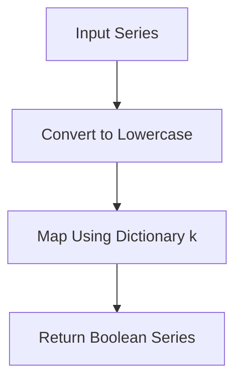

# `typeset_relations.py`

## `src.ydata_profiling.model.typeset_relations.is_nullable` · *function*

## Summary:
Determines whether a pandas Series contains nullable data by checking if it has any non-null values.

## Description:
This function evaluates whether a given pandas Series can contain null values by examining if the series has any non-null entries. It's used in the type detection system to determine if a column can be considered nullable. The function is called during the profiling process when analyzing data types and their properties.

The function specifically checks if the count of non-null values in the series is greater than zero. This indicates that the series contains at least one valid (non-null) value, which means it can potentially be nullable.

## Args:
    series (pandas.Series): A pandas Series object to evaluate for nullability
    state (dict): A dictionary containing processing state information (currently unused in implementation)

## Returns:
    bool: True if the series contains at least one non-null value, False otherwise

## Raises:
    None explicitly raised

## Constraints:
    Preconditions:
        - The series parameter must be a valid pandas Series object
        - The state parameter must be a dictionary (though currently unused)
    
    Postconditions:
        - Returns a boolean value indicating whether the series has any non-null values
        - The function does not modify the input series or state

## Side Effects:
    None

## Control Flow:
```mermaid
flowchart TD
    A[Start is_nullable] --> B{series.count() > 0?}
    B -- Yes --> C[Return True]
    B -- No --> D[Return False]
```

## Examples:
```python
import pandas as pd

# Example 1: Series with values
series1 = pd.Series([1, 2, 3])
result1 = is_nullable(series1, {})
print(result1)  # Output: True

# Example 2: Series with only nulls
series2 = pd.Series([None, None, None])
result2 = is_nullable(series2, {})
print(result2)  # Output: False

# Example 3: Empty series
series3 = pd.Series([], dtype='float64')
result3 = is_nullable(series3, {})
print(result3)  # Output: False

# Example 4: Series with mixed values including nulls
series4 = pd.Series([1, None, 3])
result4 = is_nullable(series4, {})
print(result4)  # Output: True
```

## `src.ydata_profiling.model.typeset_relations.try_func` · *function*

## Summary:
Decorator that wraps a function to catch all exceptions and return False instead of propagating errors.

## Description:
The `try_func` function is a decorator that takes a callable function and returns a wrapped version that executes the original function within a try-except block. When the wrapped function raises any exception, it gracefully returns False instead of allowing the exception to propagate. This is particularly useful for type checking functions that may fail on certain data patterns while maintaining consistent return types.

This logic is extracted into its own function to provide a reusable error-handling pattern for type checking operations, ensuring that type validation functions don't crash the entire profiling process when encountering unexpected data formats.

## Args:
    fn (Callable): The function to wrap with exception handling

## Returns:
    Callable: A decorated function that accepts a pandas Series and any additional arguments, returning a boolean value

## Raises:
    None: Exceptions from the wrapped function are caught and converted to False return values

## Constraints:
    Preconditions:
    - The input function `fn` must accept at least a pandas Series as its first argument
    - The input function `fn` should ideally return a boolean value
    - The function should be designed to handle pandas Series objects appropriately
    
    Postconditions:
    - The returned wrapper function will always return a boolean value (True or False)
    - No exceptions will be raised from the wrapper function itself

## Side Effects:
    None: This function has no side effects beyond executing the wrapped function and potentially catching exceptions

## Control Flow:
```mermaid
flowchart TD
    A[try_func called with fn] --> B[Returns inner wrapper function]
    B --> C[inner called with series, args, kwargs]
    C --> D{Execute fn(series, args, kwargs)}
    D -->|Success| E[Return fn result]
    D -->|Exception| F[Return False]
```

## Examples:
```python
# Basic usage as decorator
@try_func
def is_integer_type(series):
    return series.dtype == 'int64'

# Usage with a series that might cause issues
result = is_integer_type(some_series)  # Returns True/False safely

# Direct usage
wrapped_func = try_func(my_type_check_function)
result = wrapped_func(series)
```

## `src.ydata_profiling.model.typeset_relations.string_is_bool` · *function*

## Summary:
Determines if a pandas Series contains boolean-like string values by checking if all non-null values are in a provided mapping of boolean representations.

## Description:
This function evaluates whether a pandas Series contains only string values that represent boolean states (true/false, yes/no, etc.) by checking if all non-null values exist in a provided dictionary of boolean representations. It uses decorators to handle null values gracefully and provides robust error handling for type checking operations.

The logic is extracted into its own function to encapsulate the specific boolean string detection algorithm, separating concerns from the broader type inference system and providing a reusable component for identifying boolean-like string data patterns.

## Args:
    series (pd.Series): The pandas Series to analyze for boolean string representation
    state (dict): A dictionary containing metadata about the series, including null value tracking
    k (Dict[str, bool]): A dictionary mapping string representations to their boolean equivalents

## Returns:
    bool: True if all non-null values in the series are present in the boolean representation dictionary, False otherwise

## Raises:
    None: Exceptions are handled gracefully by the decorator wrappers

## Constraints:
    Preconditions:
    - The input series must be a valid pandas Series object
    - The state dictionary must be mutable (passed by reference)
    - The k parameter must be a dictionary with string keys and boolean values
    - The series should not be of categorical dtype (handled specially)
    
    Postconditions:
    - Returns False immediately if the series is categorical dtype
    - Returns False if all values are null after null handling
    - Returns True only if all non-null values match keys in the k dictionary after lowercasing

## Side Effects:
    None: This function has no side effects beyond processing the input series

## Control Flow:
```mermaid
flowchart TD
    A[string_is_bool called] --> B{is_categorical_dtype(series)?}
    B -- Yes --> C[Return False]
    B -- No --> D[tester(series, state)]
    D --> E{tester result?}
    E -- True --> F[Return True]
    E -- False --> F[Return False]
```

## Examples:
```python
# Example usage with common boolean representations
bool_map = {"true": True, "false": False, "yes": True, "no": False}
series = pd.Series(["true", "false", "yes"])
result = string_is_bool(series, {}, bool_map)  # Returns True

# Example with mixed case strings
bool_map = {"true": True, "false": False}
series = pd.Series(["TRUE", "FALSE", "True"])
result = string_is_bool(series, {}, bool_map)  # Returns True due to .str.lower() conversion

# Example with invalid values
bool_map = {"true": True, "false": False}
series = pd.Series(["true", "maybe", "false"])
result = string_is_bool(series, {}, bool_map)  # Returns False

# Example with categorical data (returns False immediately)
series = pd.Series(["true", "false"], dtype="category")
result = string_is_bool(series, {}, bool_map)  # Returns False
```

## `src.ydata_profiling.model.typeset_relations.string_to_bool` · *function*

## Summary:
Converts a pandas Series of strings to boolean values based on a mapping dictionary.

## Description:
This function transforms a pandas Series containing string values into a Series of boolean values by converting each string to lowercase and mapping it to a corresponding boolean value using the provided dictionary. It is designed to handle string-to-boolean conversion in a standardized way within the profiling framework.

## Args:
    series (pd.Series): A pandas Series containing string values to be converted to booleans.
    state (dict): A dictionary containing state information (currently unused in the implementation).
    k (Dict[str, bool]): A mapping dictionary where keys are strings and values are boolean values.

## Returns:
    pd.Series: A pandas Series of boolean values corresponding to the input strings mapped through the dictionary k.

## Raises:
    None explicitly raised by this function.

## Constraints:
    Preconditions:
        - The input series must be a valid pandas Series.
        - The mapping dictionary k must contain string keys that correspond to values in the series.
        - The state parameter is currently unused but should be a dictionary type.
    
    Postconditions:
        - The returned Series will have the same length as the input series.
        - Each element in the returned Series will be either True or False.
        - Elements not found in the mapping dictionary will result in NaN values.

## Side Effects:
    None.

## Control Flow:


## Examples:
```python
import pandas as pd

# Example usage
series = pd.Series(['True', 'False', 'TRUE', 'FALSE'])
mapping = {'true': True, 'false': False}
result = string_to_bool(series, {}, mapping)
# Result: [True, False, True, False]
```

## `src.ydata_profiling.model.typeset_relations.numeric_is_category` · *function*

## Summary:
Determines whether a numeric series should be treated as a categorical variable based on the number of unique values.

## Description:
This function evaluates if a numeric pandas Series should be classified as categorical by checking if the number of unique values falls within a specified threshold range. It's used in the type inference process to decide when numeric data with few unique values should be treated as discrete categories rather than continuous numeric data. This logic helps in identifying when numeric data represents categories or labels rather than measurements.

## Args:
    series (pandas.Series): The numeric pandas Series to evaluate
    state (dict): A dictionary containing processing state information (unused in current implementation)
    k (Settings): Configuration settings object containing the low_categorical_threshold parameter

## Returns:
    bool: True if the series has between 1 and the configured threshold number of unique values (inclusive), False otherwise

## Raises:
    None explicitly raised

## Constraints:
    Preconditions:
        - The series parameter must be a valid pandas Series
        - The k parameter must be a Settings object with vars.num.low_categorical_threshold attribute
    Postconditions:
        - Returns a boolean value indicating whether the numeric series should be treated as categorical

## Side Effects:
    None

## Control Flow:
```mermaid
flowchart TD
    A[Start numeric_is_category] --> B[Calculate n_unique = series.nunique()]
    B --> C[Get threshold = k.vars.num.low_categorical_threshold]
    C --> D{1 <= n_unique <= threshold?}
    D -->|Yes| E[Return True]
    D -->|No| F[Return False]
```

## Examples:
    # Basic usage
    import pandas as pd
    from ydata_profiling.config import Settings
    
    series = pd.Series([1, 2, 2, 3, 3, 3])
    config = Settings()
    config.vars.num.low_categorical_threshold = 5
    
    result = numeric_is_category(series, {}, config)  # Returns True
    
    # Edge case - single unique value
    single_value_series = pd.Series([5, 5, 5, 5])
    result = numeric_is_category(single_value_series, {}, config)  # Returns True
    
    # Edge case - exceeds threshold
    many_unique_series = pd.Series([1, 2, 3, 4, 5, 6])
    result = numeric_is_category(many_unique_series, {}, config)  # Returns False

## `src.ydata_profiling.model.typeset_relations.to_category` · *function*

## Summary:
Converts a pandas Series to a string dtype while preserving NaN values as actual NaN rather than string representations.

## Description:
This function converts a pandas Series to string dtype, specifically handling NaN values by converting string representations like "nan" and "<NA>" back to actual pandas NaN values. This ensures proper null value semantics in data profiling operations where maintaining the distinction between actual NaN values and string "nan" is crucial.

## Args:
    series (pd.Series): Input pandas Series to be converted to string dtype
    state (dict): State dictionary containing processing context (currently unused in implementation)

## Returns:
    pd.Series: A new pandas Series with string dtype, where NaN values are preserved as actual NaN values instead of string representations

## Raises:
    None explicitly raised

## Constraints:
    Preconditions:
        - Input series must be a valid pandas Series object
        - The series should not be None
    Postconditions:
        - Output series will have string dtype
        - NaN values in the original series will remain as NaN in the result
        - Non-null values will be converted to their string representation

## Side Effects:
    None

## Control Flow:
```mermaid
flowchart TD
    A[Start to_category] --> B{hasnans}
    B -- True --> C[val.replace("nan", np.nan)]
    C --> D[Cascade replace("<NA>", np.nan)]
    D --> E[val.astype("string")]
    B -- False --> F[val.astype("string")]
    E --> G[Return result]
    F --> G
```

## Examples:
    # Basic usage with NaN values
    import pandas as pd
    import numpy as np
    series = pd.Series([1, 2, np.nan, 4])
    result = to_category(series, {})
    # Result: Series with values ['1', '2', nan, '4'] and string dtype
    
    # With <NA> values
    series = pd.Series(['a', 'b', pd.NA, 'd'])
    result = to_category(series, {})
    # Result: Series with values ['a', 'b', <NA>, 'd'] and string dtype
    
    # Without NaN values
    series = pd.Series([1, 2, 3])
    result = to_category(series, {})
    # Result: Series with values ['1', '2', '3'] and string dtype

## `src.ydata_profiling.model.typeset_relations.series_is_string` · *function*

## Summary:
Determines whether a pandas Series contains string data by validating both the type of initial values and the ability to convert the entire series to string type.

## Description:
This function serves as a type checking utility to validate if a pandas Series should be treated as containing string data. It performs two validation checks: first, it examines the type of the initial five elements to ensure they are all strings; second, it attempts to convert the entire series to string type and compares the result with the original values. This dual approach helps handle edge cases where the series might contain mixed types or non-string convertible values.

The function is designed to be used in type inference systems where determining the appropriate data type for a series is crucial for downstream processing and analysis. It's particularly useful in data profiling scenarios where type detection needs to be robust against various data formats.

## Args:
    series (pd.Series): The pandas Series to check for string type compatibility
    state (dict): A dictionary containing processing state information (currently unused in the implementation)

## Returns:
    bool: True if the series contains string data or can be safely converted to string type, False otherwise

## Raises:
    None explicitly raised - handles TypeError and ValueError internally by returning False

## Constraints:
    Preconditions:
    - The series parameter must be a valid pandas Series object
    - The state parameter should be a dictionary (though currently unused in implementation)
    
    Postconditions:
    - Returns a boolean value indicating string compatibility
    - Does not modify the input series or state

## Side Effects:
    None

## Control Flow:
```mermaid
flowchart TD
    A[Start series_is_string] --> B{First 5 values all str?}
    B -- No --> C[Return False]
    B -- Yes --> D[Attempt series.astype(str)]
    D --> E{Conversion successful?}
    E -- No --> F[Return False]
    E -- Yes --> G[Compare converted vs original]
    G --> H[Return comparison result]
```

## Examples:
```python
# Valid string series
series1 = pd.Series(['a', 'b', 'c'])
result1 = series_is_string(series1, {})  # Returns True

# Mixed type series (first 5 are not all strings)
series2 = pd.Series([1, 2, 3, 4, 5])
result2 = series_is_string(series2, {})  # Returns False

# Series that can't be converted to string
series3 = pd.Series([None, [1, 2], {'key': 'value'}])
result3 = series_is_string(series3, {})  # Returns False

# Series with numeric values that can be converted to strings
series4 = pd.Series([1, 2, 3, 4, 5])
result4 = series_is_string(series4, {})  # Returns True (if conversion succeeds)
```

## `src.ydata_profiling.model.typeset_relations.string_is_category` · *function*

## Summary:
Determines if a pandas Series should be treated as a categorical variable based on unique value count and threshold conditions.

## Description:
This function evaluates whether a pandas Series qualifies as a categorical variable by examining the number of unique values relative to configured thresholds. It ensures that the series isn't already categorized and doesn't represent boolean-like data before making the determination. This logic is extracted into its own function to encapsulate the specific categorical detection algorithm, separating concerns from the broader type inference system and providing a reusable component for identifying categorical data patterns.

## Args:
    series (pd.Series): The pandas Series to analyze for categorical characteristics
    state (dict): A dictionary containing metadata about the series, including null value tracking
    k (Settings): Configuration settings object containing categorical and boolean thresholds

## Returns:
    bool: True if the series meets all criteria for being classified as categorical, False otherwise

## Raises:
    None: This function does not explicitly raise exceptions

## Constraints:
    Preconditions:
    - The input series must be a valid pandas Series object
    - The state dictionary must be mutable (passed by reference)
    - The k parameter must be a Settings object with properly configured vars.cat and vars.bool attributes
    
    Postconditions:
    - Returns False if the series has zero unique values
    - Returns False if the number of unique values exceeds the cardinality threshold
    - Returns False if the percentage of unique values exceeds the percentage threshold
    - Returns False if the series would be identified as boolean-like by string_is_bool function

## Side Effects:
    None: This function has no side effects beyond processing the input series

## Control Flow:
```mermaid
flowchart TD
    A[string_is_category called] --> B[n_unique = series.nunique()]
    B --> C[threshold = k.vars.cat.cardinality_threshold]
    C --> D[unique_threshold = k.vars.cat.percentage_cat_threshold]
    D --> E{1 <= n_unique <= threshold?}
    E -- No --> F[Return False]
    E -- Yes --> G{n_unique / series.size < unique_threshold?}
    G -- No --> H{unique_threshold > 1?}
    H -- Yes --> I[Return False]
    H -- No --> J[Return False]
    G -- Yes --> K{string_is_bool(series, state, k.vars.bool.mappings)?}
    K -- Yes --> L[Return False]
    K -- No --> M[Return True]
```

## Examples:
```python
# Example usage with a series having appropriate unique values
settings = Settings()
settings.vars.cat.cardinality_threshold = 10
settings.vars.cat.percentage_cat_threshold = 0.5
series = pd.Series(["A", "B", "C", "A", "B"])  # 3 unique values out of 5 total
result = string_is_category(series, {}, settings)  # Returns True

# Example with too many unique values
settings = Settings()
settings.vars.cat.cardinality_threshold = 5
settings.vars.cat.percentage_cat_threshold = 0.5
series = pd.Series(["A", "B", "C", "D", "E", "F"])  # 6 unique values out of 6 total
result = string_is_category(series, {}, settings)  # Returns False

# Example with too high percentage of unique values
settings = Settings()
settings.vars.cat.cardinality_threshold = 10
settings.vars.cat.percentage_cat_threshold = 0.2
series = pd.Series(["A", "B", "C", "D", "E"])  # 5 unique values out of 5 total (100%)
result = string_is_category(series, {}, settings)  # Returns False

# Example with boolean-like data (returns False due to string_is_bool check)
settings = Settings()
settings.vars.cat.cardinality_threshold = 10
settings.vars.cat.percentage_cat_threshold = 0.5
settings.vars.bool.mappings = {"true": True, "false": False}
series = pd.Series(["true", "false", "true"])  # Would be detected as boolean
result = string_is_category(series, {}, settings)  # Returns False
```

## `src.ydata_profiling.model.typeset_relations.string_is_datetime` · *function*

## Summary:
Determines whether a pandas Series of strings can be converted to datetime values.

## Description:
Checks if a pandas Series containing string values can be successfully parsed into datetime objects. This function serves as a validation utility to identify string columns that likely represent date/time data, enabling type inference and profiling decisions in the ydata-profiling library.

## Args:
    series (pd.Series): A pandas Series containing string values to test for datetime conversion
    state (dict): A dictionary containing processing state information (unused in current implementation)

## Returns:
    bool: True if at least one value in the series can be converted to a datetime, False otherwise

## Raises:
    None explicitly raised - uses a broad exception handler that catches all exceptions

## Constraints:
    Preconditions:
        - The input series must be a valid pandas Series object
        - The series should contain string representations that could potentially be dates
    Postconditions:
        - Returns a boolean value indicating datetime convertibility
        - Does not modify the input series

## Side Effects:
    None

## Control Flow:
```mermaid
flowchart TD
    A[Start string_is_datetime] --> B[Try string_to_datetime conversion]
    B --> C{Conversion successful?}
    C -- Yes --> D[Check if all values are NA]
    D --> E{All values NA?}
    E -- Yes --> F[Return False]
    E -- No --> G[Return True]
    C -- No --> H[Return False (exception caught)]
```

## Examples:
```python
import pandas as pd

# Test with valid datetime strings
series = pd.Series(['2023-01-01', '2023-01-02', '2023-01-03'])
result = string_is_datetime(series, {})
# Returns: True

# Test with invalid datetime strings
series = pd.Series(['not_a_date', 'also_not_valid', 'neither_this'])
result = string_is_datetime(series, {})
# Returns: False

# Test with mixed valid/invalid strings
series = pd.Series(['2023-01-01', 'not_a_date', '2023-01-03'])
result = string_is_datetime(series, {})
# Returns: True (because some values are valid)
```

## `src.ydata_profiling.model.typeset_relations.string_is_numeric` · *function*

## Summary:
Determines whether a pandas Series containing string data should be treated as numeric based on its content and characteristics.

## Description:
This function evaluates if a pandas Series that contains string data should be classified as numeric. It performs several checks to ensure the series doesn't represent boolean values or should not be treated as categorical. This function is part of the type inference system used in data profiling to accurately categorize data types.

The function is called during type inference processes when evaluating whether string data should be interpreted as numeric values. It prevents misclassification of boolean-like strings or numeric data that should be treated as categories.

## Args:
    series (pd.Series): A pandas Series containing string data to evaluate
    state (dict): State dictionary containing processing context (used by helper functions)
    k (Settings): Configuration settings object containing numeric categorization thresholds

## Returns:
    bool: True if the series should be treated as numeric, False otherwise

## Raises:
    None explicitly raised

## Constraints:
    Preconditions:
        - The series parameter must be a valid pandas Series object
        - The state parameter must be a dictionary
        - The k parameter must be a Settings object
        
    Postconditions:
        - Returns a boolean value indicating whether the series should be treated as numeric

## Side Effects:
    None

## Control Flow:
```mermaid
flowchart TD
    A[Start string_is_numeric] --> B{is_bool_dtype(series)? OR object_is_bool(series,state)?}
    B -- Yes --> C[Return False]
    B -- No --> D[try: series.astype(float)]
    D --> E{Exception raised?}
    E -- Yes --> F[Return False]
    E -- No --> G[r = pd.to_numeric(series, errors="coerce")]
    G --> H{r.hasnans AND r.count() == 0?}
    H -- Yes --> I[Return False]
    H -- No --> J[return not numeric_is_category(series, state, k)]
```

## Examples:
    >>> import pandas as pd
    >>> from ydata_profiling.config import Settings
    
    >>> # Valid numeric strings
    >>> s1 = pd.Series(['1', '2', '3'], dtype=object)
    >>> config = Settings()
    >>> string_is_numeric(s1, {}, config)
    True
    
    >>> # Boolean-like strings
    >>> s2 = pd.Series(['True', 'False', 'True'], dtype=object)
    >>> string_is_numeric(s2, {}, config)
    False
    
    >>> # Non-numeric strings
    >>> s3 = pd.Series(['hello', 'world'], dtype=object)
    >>> string_is_numeric(s3, {}, config)
    False
    
    >>> # Empty series with NaNs
    >>> s4 = pd.Series([None, None], dtype=object)
    >>> string_is_numeric(s4, {}, config)
    False
```

## `src.ydata_profiling.model.typeset_relations.string_to_datetime` · *function*

## Summary:
Converts a pandas Series of string values into datetime objects, with compatibility handling for different pandas versions.

## Description:
This function transforms a pandas Series containing string representations of dates into proper datetime objects. It handles version-specific differences in pandas' `to_datetime` function by checking if the pandas version is 1.x and applying appropriate parameters.

## Args:
    series (pandas.Series): A pandas Series containing string values that represent dates or times
    state (dict): A dictionary containing processing state information (currently unused in the implementation)

## Returns:
    pandas.Series: A pandas Series with the same index as input but containing datetime objects instead of strings

## Raises:
    TypeError: If the input series contains invalid date strings that cannot be parsed
    ValueError: If the input series contains unsupported date formats

## Constraints:
    Preconditions:
        - The input series must be a valid pandas Series object
        - The series should contain string representations of dates/times
    Postconditions:
        - The returned series will have the same length and index as the input series
        - All elements in the returned series will be datetime objects or NaT (Not a Time)

## Side Effects:
    None

## Control Flow:
```mermaid
flowchart TD
    A[Start string_to_datetime] --> B{is_pandas_1()}
    B -- True --> C[pd.to_datetime(series)]
    B -- False --> D[pd.to_datetime(series, format="mixed")]
    C --> E[Return result]
    D --> E
```

## Examples:
```python
import pandas as pd

# Basic usage with valid date strings
series = pd.Series(['2023-01-01', '2023-01-02', '2023-01-03'])
result = string_to_datetime(series, {})
# Returns: DatetimeIndex(['2023-01-01', '2023-01-02', '2023-01-03'])

# Usage with mixed date formats
series = pd.Series(['2023-01-01', '01/02/2023', '2023.01.03'])
result = string_to_datetime(series, {})
# Returns: DatetimeIndex with properly parsed dates

# Handling invalid dates
series = pd.Series(['2023-01-01', 'invalid_date', '2023-01-03'])
result = string_to_datetime(series, {})
# Returns: DatetimeIndex with NaT for invalid_date
```

## `src.ydata_profiling.model.typeset_relations.string_to_numeric` · *function*

## Summary:
Converts a pandas Series containing string representations of numbers into numeric data types, safely handling invalid entries by coercing them to NaN.

## Description:
This function serves as a utility for converting string data to numeric format within the ydata-profiling library. It leverages pandas' built-in `to_numeric` function with error coercion to transform string values that represent numbers into appropriate numeric types while preserving non-numeric values as NaN. This function is typically invoked during data type inference and transformation processes within the profiling pipeline.

## Args:
    series (pd.Series): A pandas Series containing string data that may represent numeric values.
    state (dict): A dictionary containing processing state information, though this parameter is not utilized in the current implementation.

## Returns:
    pd.Series: A pandas Series with converted numeric data types where possible, and NaN for invalid entries.

## Raises:
    None explicitly raised by this function.

## Constraints:
    Preconditions:
        - The input series should be a valid pandas Series object.
        - The series should contain elements that can be interpreted as numeric strings or be inherently numeric.
    Postconditions:
        - The returned Series will have a numeric dtype where conversion was successful.
        - Invalid entries will be represented as NaN values in the resulting Series.

## Side Effects:
    None.

## Control Flow:
```mermaid
flowchart TD
    A[Start string_to_numeric] --> B{Input Series Valid?}
    B -- Yes --> C[Call pd.to_numeric(series, errors="coerce")]
    C --> D[Return converted Series]
    B -- No --> E[Exception Handling]
    E --> F[Return Original Series or Raise Error]
```

## Examples:
```python
import pandas as pd
from src.ydata_profiling.model.typeset_relations import string_to_numeric

# Example 1: Valid numeric strings
series1 = pd.Series(['1', '2', '3'])
result1 = string_to_numeric(series1, {})
print(result1)  # Output: [1, 2, 3] with numeric dtype

# Example 2: Mixed valid/invalid strings
series2 = pd.Series(['1', '2.5', 'abc'])
result2 = string_to_numeric(series2, {})
print(result2)  # Output: [1.0, 2.5, nan] with float dtype

# Example 3: All invalid strings
series3 = pd.Series(['abc', 'def'])
result3 = string_to_numeric(series3, {})
print(result3)  # Output: [nan, nan] with float dtype
```

## `src.ydata_profiling.model.typeset_relations.to_bool` · *function*

## Summary:
Converts a pandas Series to a boolean dtype, handling missing values appropriately.

## Description:
This function converts a pandas Series to a boolean dtype, selecting the appropriate underlying dtype based on whether the series contains missing values. When missing values are present, it uses a specialized boolean dtype that can accommodate them, otherwise it uses the standard Python bool type. This function is part of the type set relations module and is likely used in type inference or conversion pipelines.

## Args:
    series (pd.Series): The input pandas Series to convert to boolean type.

## Returns:
    pd.Series: A pandas Series with boolean dtype, using either the standard bool type or a specialized nullable boolean type depending on the presence of missing values.

## Raises:
    None explicitly raised by this function. Any exceptions would stem from pandas' astype method when converting incompatible data types.

## Constraints:
    Preconditions:
        - Input series must be a valid pandas Series object
        - The series should contain data that can be converted to boolean values
        
    Postconditions:
        - Output series will have boolean dtype
        - If input series contains missing values, output will use nullable boolean dtype
        - If input series contains no missing values, output will use standard bool dtype

## Side Effects:
    None - No I/O operations or external state mutations occur.

## Control Flow:
```mermaid
flowchart TD
    A[to_bool called] --> B{series.hasnans?}
    B -- Yes --> C[dtype = hasnan_bool_name]
    B -- No --> D[dtype = bool]
    C --> E[series.astype(dtype)]
    D --> E
    E --> F[Return converted series]
```

## Examples:
```python
import pandas as pd

# Example with no missing values
series_clean = pd.Series([True, False, True])
result = to_bool(series_clean)
# Result will be a Series with bool dtype

# Example with missing values
series_with_nan = pd.Series([True, False, None, True])
result = to_bool(series_with_nan)
# Result will be a Series with nullable boolean dtype to handle the None value
```

## `src.ydata_profiling.model.typeset_relations.object_is_bool` · *function*

## Summary:
Determines whether an object-type pandas Series contains only boolean values.

## Description:
Checks if a pandas Series with object dtype consists exclusively of boolean values (True or False). This function is used in type inference systems to identify when an object Series should be treated as a boolean type. It serves as a validation function for type detection logic.

## Args:
    series (pd.Series): A pandas Series to evaluate
    state (dict): State dictionary containing processing context (currently unused in implementation)

## Returns:
    bool: True if the series contains only boolean values (True or False), False otherwise

## Raises:
    None explicitly raised

## Constraints:
    Preconditions:
        - The series parameter must be a valid pandas Series object
        - The series must have object dtype (validated via pdt.is_object_dtype)
    
    Postconditions:
        - Returns a boolean value indicating whether all elements are boolean values

## Side Effects:
    None

## Control Flow:
```mermaid
flowchart TD
    A[Start object_is_bool] --> B{is_object_dtype(series)?}
    B -- Yes --> C[Create bool_set = {True, False}]
    C --> D[Try all(item in bool_set for item in series)]
    D --> E{Exception raised?}
    E -- Yes --> F[ret = False]
    E -- No --> G[ret = result of all()]
    F --> H[Return ret]
    G --> H
    B -- No --> I[Return False]
```

## Examples:
    >>> import pandas as pd
    >>> import pandas.api.types as pdt
    >>> s1 = pd.Series([True, False, True], dtype=object)
    >>> object_is_bool(s1, {})
    True
    
    >>> s2 = pd.Series([True, False, "maybe"], dtype=object)
    >>> object_is_bool(s2, {})
    False
    
    >>> s3 = pd.Series([1, 0, 1], dtype=object)
    >>> object_is_bool(s3, {})
    False
    
    >>> s4 = pd.Series(["yes", "no"], dtype=object)
    >>> object_is_bool(s4, {})
    False
```

