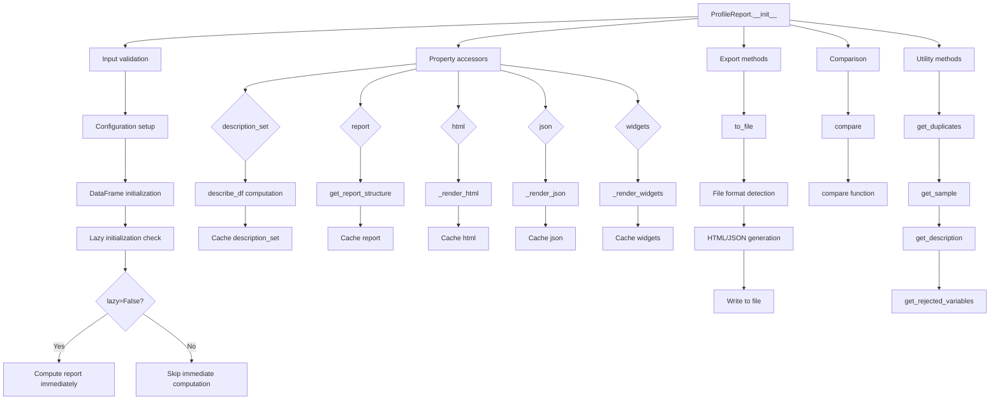

# `profile_report.py`

## `src.ydata_profiling.profile_report.ProfileReport` · *class*

## Summary:
ProfileReport is a comprehensive data profiling and analysis class that generates detailed statistical summaries, visualizations, and quality assessments for pandas and Spark DataFrames.

## Description:
The ProfileReport class serves as the primary interface for data profiling operations in the ydata-profiling library. It provides a unified framework for analyzing datasets by generating statistical summaries, detecting data quality issues, identifying patterns, and producing interactive reports in multiple formats (HTML, JSON, widgets). The class supports both lazy and eager initialization modes, caching mechanisms for performance optimization, and extensive customization through configuration options.

The class integrates with various subsystems including type inference (Visions), statistical summarization (PandasProfilingSummarizer), data validation (ExpectationsReport), and report generation (HTML/Widget presentations). It's designed to be used in both interactive environments (Jupyter notebooks) and batch processing workflows.

## State:
- df: Optional[Union[pandas.DataFrame, pyspark.sql.DataFrame]] - The input dataset being profiled, or None for lazy initialization
- config: Settings - Configuration object controlling profiling behavior, visualization options, and analysis parameters
- _df_hash: Optional[str] - Cached SHA256 hash of the DataFrame for change detection
- _sample: Optional[dict] - Custom sample data to use instead of generating a random sample
- _type_schema: Optional[dict] - Schema specification for type inference
- _typeset: Optional[VisionsTypeset] - Type detection system for variable classification
- _summarizer: Optional[BaseSummarizer] - Statistical summarization component for variable analysis
- _description_set: Optional[BaseDescription] - Cached comprehensive statistical description of the dataset
- _report: Optional[Root] - Cached report structure for HTML/JSON/widget generation
- _html: Optional[str] - Cached HTML representation of the report
- _widgets: Optional[Any] - Cached widget representation of the report
- _json: Optional[str] - Cached JSON representation of the report

## Lifecycle:
- Creation: Instantiate with a DataFrame and/or configuration parameters. Supports lazy initialization when df=None and lazy=True.
- Usage: Access properties like html, json, widgets, or call methods like to_file(), compare(), get_duplicates(), etc. Properties use lazy loading for performance.
- Destruction: Standard Python garbage collection handles cleanup of resources.

## Method Map:


## Raises:
- ValueError: During initialization when df is None and lazy=False, or when DataFrame is empty, or when config_file and minimal are both specified
- NotImplementedError: When tsmode is True with Spark DataFrames
- RuntimeError: When accessing widgets interface for comparing reports
- TypeError: From underlying components during type checking or serialization

## Example:
```python
import pandas as pd
from ydata_profiling import ProfileReport

# Basic usage
df = pd.DataFrame({"A": [1, 2, 3], "B": [4, 5, 6]})
profile = ProfileReport(df, title="My Dataset Profile")

# Access different report formats
html_report = profile.to_html()  # Get HTML as string
json_report = profile.to_json()  # Get JSON as string

# Export to file
profile.to_file("report.html")  # Save as HTML
profile.to_file("report.json")  # Save as JSON

# Compare two datasets
profile2 = ProfileReport(df2)
comparison = profile.compare(profile2)

# Access specific analysis results
duplicates = profile.get_duplicates()
sample = profile.get_sample()
rejected_vars = profile.get_rejected_variables()
```

### `src.ydata_profiling.profile_report.ProfileReport.__init__` · *method*

## Summary:
Initializes a ProfileReport object by validating inputs, configuring profiling settings, and preparing the underlying DataFrame for analysis, setting up internal state for subsequent profiling operations.

## Description:
The ProfileReport constructor serves as the entry point for creating profiling reports. It validates initialization parameters, resolves configuration from multiple sources (config_file, minimal flag, direct config, kwargs), processes DataFrame initialization for time series modes, and sets up internal state for subsequent profiling operations. This method orchestrates the initial setup phase of the profiling pipeline, ensuring proper configuration and data preparation before analysis begins.

## Args:
    df (Optional[Union[pandas.DataFrame, pyspark.sql.DataFrame]]): Input DataFrame to profile, or None for lazy initialization
    minimal (bool): Flag indicating minimal profiling mode (default: False)
    tsmode (bool): Flag indicating time-series mode (default: False)
    sortby (Optional[str]): Column name to sort time series data by (default: None)
    sensitive (bool): Flag enabling sensitive data handling (default: False)
    explorative (bool): Flag enabling explorative analysis mode (default: False)
    dark_mode (bool): Flag enabling dark theme (default: False)
    orange_mode (bool): Flag enabling orange theme (default: False)
    sample (Optional[dict]): Sample configuration dictionary (default: None)
    config_file (Optional[Union[Path, str]]): Path to configuration file, or None (default: None)
    lazy (bool): Flag indicating lazy initialization mode (default: True)
    typeset (Optional[VisionsTypeset]): Custom typeset for type inference (default: None)
    summarizer (Optional[BaseSummarizer]): Custom summarizer for data summarization (default: None)
    config (Optional[Settings]): Direct configuration object (default: None)
    type_schema (Optional[dict]): Schema definition for type inference (default: None)
    **kwargs: Additional configuration parameters that override defaults

## Returns:
    None: This method initializes instance attributes but does not return a value

## Raises:
    ValueError: Raised when:
        - df is None and lazy is False (required DataFrame missing)
        - DataFrame is empty (both pandas and Spark DataFrames)
        - config_file and minimal are both specified (mutually exclusive)
    NotImplementedError: Raised when tsmode is True with Spark DataFrames

## State Changes:
    Attributes READ: None
    Attributes WRITTEN: 
        - self.df: Set to processed DataFrame
        - self.config: Set to merged configuration object resolved from multiple sources
        - self._df_hash: Set to None (initial state)
        - self._sample: Set to provided sample configuration
        - self._type_schema: Set to provided type schema
        - self._typeset: Set to provided typeset
        - self._summarizer: Set to provided summarizer

## Constraints:
    Preconditions:
        - When lazy=False, df must not be None
        - config_file and minimal cannot both be specified
        - DataFrames (pandas or Spark) must not be empty
        - If tsmode is True, sortby parameter may be provided for sorting
    Postconditions:
        - All validation checks pass before initialization proceeds
        - Instance attributes are properly initialized with validated values
        - Time series configuration is applied when applicable
        - Lazy initialization is deferred until report property is accessed

## Side Effects:
    None: This method performs only internal object initialization and does not cause external I/O or service calls

### `src.ydata_profiling.profile_report.ProfileReport.__validate_inputs` · *method*

## Summary:
Validates initialization parameters for ProfileReport to ensure data availability, configuration consistency, and non-empty DataFrames.

## Description:
This private validation method performs essential checks on ProfileReport constructor arguments to prevent invalid object initialization. It enforces that a DataFrame is provided when not in lazy mode, ensures mutually exclusive parameters aren't used together, and verifies that DataFrames contain data. These validations occur before any profiling computation begins, preventing runtime errors and ensuring consistent behavior.

## Args:
    df (Optional[Union[pd.DataFrame, sDataFrame]]): Input DataFrame to profile, or None for lazy initialization
    minimal (bool): Flag indicating minimal profiling mode (default: False)
    tsmode (bool): Flag indicating time-series mode (default: False)
    config_file (Optional[Union[Path, str]]): Path to configuration file, or None (default: None)
    lazy (bool): Flag indicating lazy initialization mode (default: False)

## Returns:
    None: This method does not return any value

## Raises:
    ValueError: Raised when:
        - df is None and lazy is False (required DataFrame missing)
        - DataFrame is empty (both pandas and Spark DataFrames)
        - config_file and minimal are both specified (mutually exclusive)
    NotImplementedError: Raised when tsmode is True with Spark DataFrames

## State Changes:
    Attributes READ: None
    Attributes WRITTEN: None

## Constraints:
    Preconditions:
        - When lazy=False, df must not be None
        - config_file and minimal cannot both be specified
        - DataFrames (pandas or Spark) must not be empty
    Postconditions:
        - All validation checks pass before ProfileReport initialization proceeds

## Side Effects:
    None: This method performs only validation checks and does not modify any external state or object attributes

### `src.ydata_profiling.profile_report.ProfileReport.__initialize_dataframe` · *method*

## Summary:
Initializes and processes a DataFrame for time series analysis by sorting and setting index based on configuration settings.

## Description:
This private method prepares a DataFrame for profiling when time series analysis is enabled in the report configuration. It handles sorting the DataFrame by a specified column or by index, and sets the appropriate index structure. This logic is separated into its own method to encapsulate time series preprocessing concerns and maintain clean separation of concerns in the profiling pipeline.

## Args:
    df (Optional[Union[pandas.DataFrame, DataFrame]]): Input DataFrame to initialize, or None
    report_config (Settings): Configuration settings that determine processing behavior

## Returns:
    Optional[Union[pandas.DataFrame, DataFrame]]: The potentially modified DataFrame, or None if input was None

## Raises:
    None explicitly raised

## State Changes:
    Attributes READ: report_config.vars.timeseries.active, report_config.vars.timeseries.sortby
    Attributes WRITTEN: None

## Constraints:
    Preconditions: 
    - df must be either None, a pandas DataFrame, or a Spark DataFrame
    - report_config must be a valid Settings object
    - When timeseries.active is True, the DataFrame must support sorting operations
    
    Postconditions:
    - If df is None, returns None unchanged
    - If timeseries processing occurs, DataFrame is sorted and indexed appropriately
    - DataFrame maintains its original data integrity

## Side Effects:
    None

### `src.ydata_profiling.profile_report.ProfileReport.invalidate_cache` · *method*

## Summary:
Invalidates cached representations of the profile report, clearing stored HTML, JSON, widgets, and report data to force regeneration on next access.

## Description:
This method clears cached versions of various report representations to ensure fresh data is generated when accessed. It's designed to be called when underlying data or configuration changes, ensuring subsequent report generation reflects the current state. The method supports selective invalidation of cache subsets or full cache clearing.

## Args:
    subset (Optional[str]): Specifies which cache subset to invalidate. Valid values are None (clears all caches), "rendering" (clears HTML, JSON, widgets), or "report" (clears report-specific cache). Defaults to None.

## Returns:
    None: This method does not return any value.

## Raises:
    ValueError: Raised when the subset parameter is provided but not one of the allowed values: None, "rendering", or "report".

## State Changes:
    Attributes READ: None
    Attributes WRITTEN: 
    - self._widgets: Set to None when subset is None or "rendering"
    - self._json: Set to None when subset is None or "rendering"  
    - self._html: Set to None when subset is None or "rendering"
    - self._report: Set to None when subset is None or "report"
    - self._description_set: Set to None when subset is None

## Constraints:
    Preconditions: The method assumes the ProfileReport instance has the cache attributes (_widgets, _json, _html, _report, _description_set) initialized.
    Postconditions: All specified cache attributes are set to None, forcing regeneration on next access.

## Side Effects:
    None: This method performs only in-memory operations and has no external side effects.

### `src.ydata_profiling.profile_report.ProfileReport.typeset` · *method*

## Summary:
Returns the profiling typeset for the report, initializing it if necessary.

## Description:
This property method provides access to the profiling typeset used by the report for type inference and analysis. It implements a lazy initialization pattern, creating the typeset only when first accessed and storing it for subsequent accesses. The typeset is constructed using the report's configuration and type schema, enabling proper type resolution for data profiling operations.

The typeset is used throughout the profiling process to determine appropriate data types for columns, which affects how data is analyzed and presented in the final report. This property ensures that the typeset is only created once and reused, improving performance.

## Args:
    None

## Returns:
    Optional[VisionsTypeset]: The profiling typeset instance, or None if not applicable.

## Raises:
    None explicitly raised

## State Changes:
    Attributes READ: self._typeset, self.config, self._type_schema
    Attributes WRITTEN: self._typeset (only when initialized during first access)

## Constraints:
    Preconditions: The ProfileReport instance must be properly initialized with valid config and type_schema attributes
    Postconditions: After first access, self._typeset will contain a valid ProfilingTypeSet instance

## Side Effects:
    None

### `src.ydata_profiling.profile_report.ProfileReport.summarizer` · *method*

## Summary:
Returns the summarizer instance for the profile report, creating it if it doesn't exist.

## Description:
This method provides lazy initialization of the summarizer object used for generating profile summaries. It ensures that a PandasProfilingSummarizer is created only when first accessed and stored for subsequent use. This approach avoids unnecessary instantiation of the summarizer when it might not be needed throughout the lifetime of the ProfileReport instance.

The method is called during the profiling process when summary statistics and metadata need to be generated for the dataset. It's part of the data processing pipeline that prepares information for report generation, specifically when the description_set property needs to be computed.

## Args:
    None

## Returns:
    BaseSummarizer: An instance of PandasProfilingSummarizer configured with the report's typeset.

## Raises:
    None explicitly raised

## State Changes:
    Attributes READ: self._summarizer, self.typeset
    Attributes WRITTEN: self._summarizer (only when initialized)

## Constraints:
    Preconditions: The ProfileReport instance must have a valid typeset attribute (which is ensured by the typeset property)
    Postconditions: The returned summarizer instance is always a PandasProfilingSummarizer configured with self.typeset

## Side Effects:
    None

### `src.ydata_profiling.profile_report.ProfileReport.description_set` · *method*

## Summary:
Returns the computed statistical description of the DataFrame, calculating it only once and caching the result for subsequent accesses.

## Description:
The `description_set` property computes and caches the comprehensive statistical description of the DataFrame. It serves as a lazy evaluation mechanism that ensures the expensive profiling computation is performed only when first requested, and then reused for all subsequent accesses. This property coordinates with the underlying `describe_df` function to generate a complete analysis of the dataset's structure, content, and quality characteristics.

This logic is encapsulated in its own property rather than being inlined because it implements a critical caching pattern that prevents redundant computations while maintaining clean separation between the data access interface and the actual analysis implementation. The caching behavior significantly improves performance for repeated access patterns common in interactive data exploration workflows.

## Args:
    None

## Returns:
    BaseDescription: A structured object containing all analysis results including table statistics, variable descriptions, correlations, missing value patterns, alerts, and sample data. The returned object is cached after first computation and reused for subsequent calls.

## Raises:
    None explicitly raised, but the underlying `describe_df` function may raise ValueError if the DataFrame is None.

## State Changes:
    Attributes READ: 
    - self._description_set
    - self.config
    - self.df
    - self.summarizer
    - self.typeset
    - self._sample
    
    Attributes WRITTEN:
    - self._description_set (only written to on first access)

## Constraints:
    Preconditions:
    - All required attributes (config, df, summarizer, typeset, _sample) must be properly initialized on the ProfileReport instance
    - The underlying describe_df function must be callable with the provided arguments
    - The ProfileReport instance must be in a valid state for profiling operations
    
    Postconditions:
    - On first access, self._description_set is populated with a complete BaseDescription object
    - Subsequent accesses return the cached BaseDescription object without recomputation
    - The returned BaseDescription object contains all analysis components as defined by the describe function

## Side Effects:
    - Performs a potentially expensive computation during first access (describing the DataFrame)
    - May create progress bars or visual indicators during the computation process
    - Modifies internal state by caching the computed BaseDescription object
    - Accesses external libraries for data analysis and statistical computations

### `src.ydata_profiling.profile_report.ProfileReport.df_hash` · *method*

## Summary:
Computes and caches a SHA256 hash of the DataFrame for tracking data changes.

## Description:
This property computes a cryptographic hash of the underlying DataFrame to uniquely identify its content. It uses memoization to avoid recomputing the hash on subsequent accesses. The hash is computed only when first accessed and the DataFrame is not None.

## Args:
    None

## Returns:
    Optional[str]: A hexadecimal SHA256 hash string prefixed with a constant, or None if the DataFrame is None.

## Raises:
    None

## State Changes:
    Attributes READ: self._df_hash, self.df
    Attributes WRITTEN: self._df_hash

## Constraints:
    Preconditions: The object must be initialized with a DataFrame or None
    Postconditions: Once computed, the hash is stored in self._df_hash and returned on subsequent calls

## Side Effects:
    None

### `src.ydata_profiling.profile_report.ProfileReport.report` · *method*

## Summary:
Returns the report structure for this profiling session, generating it if necessary.

## Description:
This property method provides access to the structured report representation that contains all the analysis results. It implements a lazy initialization pattern where the report structure is computed only once and cached for subsequent accesses. The method serves as the entry point for accessing the complete report structure used for rendering HTML, JSON, or widget outputs.

The report structure is built using the `get_report_structure` function which takes the configuration and description set as inputs. This property ensures that the report structure is only computed once per instance and then reused on subsequent calls.

## Args:
    None

## Returns:
    Root: The root container object representing the complete report structure containing all sections, tabs, and elements.

## Raises:
    None explicitly raised

## State Changes:
    Attributes READ: self._report, self.config, self.description_set
    Attributes WRITTEN: self._report (only initialized once)

## Constraints:
    Preconditions: 
    - self.config must be properly initialized (Settings object)
    - self.description_set must be properly initialized (BaseDescription object)
    - The method assumes that the underlying description_set has been computed
    
    Postconditions:
    - The returned Root object represents the complete report structure
    - The self._report attribute is initialized and will be reused on subsequent calls

## Side Effects:
    None

### `src.ydata_profiling.profile_report.ProfileReport.html` · *method*

## Summary:
Returns the HTML representation of the profiling report, caching the result for subsequent accesses.

## Description:
This property provides access to the HTML-formatted profiling report. When first accessed, it generates the HTML content by calling the internal `_render_html()` method and caches the result in `self._html`. Subsequent accesses return the cached version without re-rendering. This approach optimizes performance by avoiding redundant HTML generation.

Known callers:
- ProfileReport.to_file method (during HTML export)
- ProfileReport.to_html method (direct HTML export)

This logic is separated into its own property to enable caching of rendered HTML output and to provide a clean interface for HTML generation that can be reused across different export mechanisms.

## Returns:
    str: A formatted HTML string containing the complete profiling report with configured styling and layout options.

## State Changes:
    Attributes READ: 
    - self._html
    
    Attributes WRITTEN:
    - self._html (on first access, when None)

## Constraints:
    Preconditions:
    - self._html must be initialized (can be None or a string)
    - self._render_html() must be callable and return a valid HTML string
    
    Postconditions:
    - Returns a valid HTML string that represents the complete profiling report
    - The first call initializes self._html with the rendered HTML content

## Side Effects:
    - Calls self._render_html() which may perform HTML generation with potential side effects
    - May modify self._html attribute on first access

### `src.ydata_profiling.profile_report.ProfileReport.json` · *method*

## Summary:
Returns a cached JSON representation of the profiling report, generating it on first access if needed.

## Description:
This method provides lazy evaluation of the JSON report representation. When called for the first time, it generates the JSON string by calling `_render_json()` and caches the result in `self._json`. Subsequent calls return the cached value without reprocessing. This approach optimizes performance by avoiding redundant JSON serialization.

## Args:
    None

## Returns:
    str: A JSON-formatted string representation of the profiling report. The string is cached after first generation.

## Raises:
    None explicitly raised.

## State Changes:
    Attributes READ: 
        - self._json
    Attributes WRITTEN: 
        - self._json (only on first call when None)

## Constraints:
    Preconditions:
        - The object must have been initialized with a valid profiling description set
        - The `_render_json()` method must be available and functional
    
    Postconditions:
        - On first call, `self._json` is populated with a valid JSON string
        - Subsequent calls return the same cached JSON string
        - The returned string represents the complete profiling report in JSON format

## Side Effects:
    - May perform JSON serialization and caching operations
    - Calls `_render_json()` method on first access

### `src.ydata_profiling.profile_report.ProfileReport.widgets` · *method*

## Summary:
Returns the widget representation of the profiling report, rendering it if necessary.

## Description:
This method provides access to the interactive widget interface for the profiling report. It serves as a lazy loader for widget rendering, only generating the widget representation when first requested. The method ensures that widget rendering is not supported for comparing reports by checking if the description_set contains multiple datasets (indicated by table["n"] being a list with more than one element).

## Args:
    None

## Returns:
    Any: The widget representation of the profiling report, typically a Jupyter widget object that displays the profiling results interactively.

## Raises:
    RuntimeError: When attempting to access widgets interface for comparing reports (when description_set.table['n'] is a list with more than one element).

## State Changes:
    Attributes READ: self.description_set, self._widgets
    Attributes WRITTEN: self._widgets (only when initially rendered via _render_widgets call)

## Constraints:
    Preconditions: The ProfileReport instance must be properly initialized with a description_set containing a valid table structure.
    Postconditions: If called multiple times, subsequent calls will return the cached widget representation stored in self._widgets.

## Side Effects:
    None

### `src.ydata_profiling.profile_report.ProfileReport.get_duplicates` · *method*

## Summary:
Returns the duplicate rows detected in the dataset during profiling.

## Description:
This method provides access to the duplicate rows identified during the profiling process. It serves as a getter for the duplicates attribute stored in the description set. The method is typically called during report generation or analysis phases when users want to examine duplicate data patterns. The duplicates are determined by comparing all rows in the dataset for exact matches.

## Args:
    None

## Returns:
    Optional[pd.DataFrame]: A pandas DataFrame containing duplicate rows if duplicates were found, or None if no duplicates exist in the dataset. When duplicates exist, the DataFrame will contain only the rows that appear more than once in the original dataset.

## Raises:
    None

## State Changes:
    Attributes READ: self.description_set.duplicates
    Attributes WRITTEN: None

## Constraints:
    Preconditions: The ProfileReport object must have been initialized with a dataset and the profiling process must have been completed to populate the description_set.duplicates attribute. This typically occurs when the description_set property is accessed or when the profiling process completes.
    Postconditions: The returned DataFrame (if not None) contains only rows that appear more than once in the original dataset, with all duplicate instances preserved.

## Side Effects:
    None

### `src.ydata_profiling.profile_report.ProfileReport.get_sample` · *method*

## Summary:
Returns the sample data associated with the profile report's description set.

## Description:
This method provides access to the sample data that was collected during the profiling process. It serves as a getter for the sample attribute stored within the description set of the profile report. The method is typically called during report generation or when retrieving sample data for display or analysis purposes.

The sample data represents a subset of the original dataset that was used for profiling and is stored as part of the description set. This allows users to access representative samples of their data for verification or further analysis.

## Args:
    None

## Returns:
    dict: A dictionary containing the sample data from the description set. The exact structure depends on how the sample data was originally processed and stored during the profiling workflow.

## Raises:
    None explicitly raised

## State Changes:
    Attributes READ: self.description_set.sample
    Attributes WRITTEN: None

## Constraints:
    Preconditions: The ProfileReport instance must have been initialized with a description_set that contains a sample attribute. This typically occurs after the profiling process has been completed.
    Postconditions: The returned dictionary is a direct reference to the sample data stored in self.description_set.sample.

## Side Effects:
    None

### `src.ydata_profiling.profile_report.ProfileReport.get_description` · *method*

## Summary:
Returns the descriptive statistics set associated with this profile report.

## Description:
This method provides access to the computed descriptive statistics that were generated during the profiling process. It serves as a getter for the internal `description_set` attribute, allowing external code to retrieve the statistical summary without directly accessing the private attribute.

The method is typically called after the profiling process has been completed to obtain the results for further analysis or reporting. It's part of the standard workflow where the ProfileReport object accumulates various statistical information during its initialization and processing phases.

## Args:
    None

## Returns:
    BaseDescription: The descriptive statistics set containing computed metrics and summaries for the dataset.

## Raises:
    None

## State Changes:
    Attributes READ: self.description_set
    Attributes WRITTEN: None

## Constraints:
    Preconditions: The ProfileReport object must have been initialized and processed to populate the description_set attribute.
    Postconditions: The returned BaseDescription object is immutable and represents the state of the profiling at the time of the method call.

## Side Effects:
    None

### `src.ydata_profiling.profile_report.ProfileReport.get_rejected_variables` · *method*

## Summary:
Returns a set of column names that were rejected during profiling based on alert conditions.

## Description:
This method extracts all column names from the profiling alerts where the alert type is specifically marked as REJECTED. It provides a convenient way to identify which variables were excluded from analysis due to failing certain validation criteria.

The method is called during report generation and post-processing phases when analyzing the results of variable profiling to determine which columns did not meet acceptance thresholds. It leverages the cached description_set property which contains all profiling alerts.

## Args:
    None

## Returns:
    set: A set containing the names of columns that triggered REJECTED alerts during profiling.

## Raises:
    None

## State Changes:
    Attributes READ: self.description_set.alerts
    Attributes WRITTEN: None

## Constraints:
    Preconditions: The self.description_set attribute must be initialized and contain an alerts collection.
    Postconditions: The returned set contains only unique column names from rejected alerts.

## Side Effects:
    None

### `src.ydata_profiling.profile_report.ProfileReport.to_file` · *method*

## Summary:
Writes the profile report to a file in either HTML or JSON format, with optional automatic download in Jupyter environments.

## Description:
This method serializes the profile report to a file, supporting both HTML and JSON formats. It handles the conversion of the report data to the appropriate format based on the file extension, manages asset creation for HTML reports, and provides optional automatic download functionality in Google Colab or web browsers. The method is typically used in the final step of report generation to persist results to disk.

## Args:
    output_file (Union[str, Path]): Path to the output file. Extension determines the format (.html or .json). If a non-supported extension is provided, it will be converted to .html with a warning.
    silent (bool): If False, automatically attempts to download the file in Jupyter environments (Google Colab or standard browser). Defaults to True.

## Returns:
    None: This method does not return any value.

## Raises:
    None explicitly raised, but may raise exceptions from file I/O operations or underlying serialization methods.

## State Changes:
    Attributes READ: self.config, self.json, self.html
    Attributes WRITTEN: self.config.html.assets_path, self.config.html.assets_prefix (only when creating HTML assets)

## Constraints:
    Preconditions: The ProfileReport instance must be properly initialized with data and configuration.
    Postconditions: The output file will exist at the specified path with the appropriate content and format. If the file extension is not .html or .json, it will be corrected to .html.

## Side Effects:
    I/O: Writes data to the filesystem at the specified output_file path.
    External service calls: Attempts to download file in Google Colab environment or opens browser tab in standard environments.

### `src.ydata_profiling.profile_report.ProfileReport._render_html` · *method*

## Summary:
Generates and returns an HTML string representation of the profiling report with optional minification and styling configuration.

## Description:
This method renders the internal report structure into an HTML string using the HTMLReport presentation flavour. It handles progress tracking, applies configuration-based styling options, and optionally minifies the resulting HTML for reduced size. The method is designed to encapsulate the entire HTML rendering process for the profile report.

Known callers:
- ProfileReport.html property (when _html is None)
- ProfileReport.to_file method (during HTML export)
- ProfileReport.to_html method (direct HTML export)

This logic is separated into its own method to enable caching of rendered HTML output and to provide a clean interface for HTML generation that can be reused across different export mechanisms.

## Args:
    None

## Returns:
    str: A formatted HTML string containing the complete profiling report with configured styling and layout options.

## Raises:
    None explicitly raised

## State Changes:
    Attributes READ: 
    - self.report
    - self.config.html.navbar_show
    - self.config.html.use_local_assets
    - self.config.html.inline
    - self.config.html.assets_prefix
    - self.config.html.style.primary_colors
    - self.config.html.style.logo
    - self.config.html.style.theme
    - self.description_set.analysis.title
    - self.description_set.analysis.date_start
    - self.description_set.package
    - self.config.html.minify_html
    - self.config.progress_bar

## Constraints:
    Preconditions:
    - self.report must be a valid report structure object
    - self.config must contain properly initialized HTML configuration settings
    - self.description_set must contain analysis metadata including title, date_start, and package information
    - self.config.html.style must contain primary_colors, logo, and theme configurations
    
    Postconditions:
    - Returns a valid HTML string that represents the complete profiling report
    - The returned HTML respects all configured styling and layout options

## Side Effects:
    - Creates a progress bar display if progress_bar is enabled
    - May perform HTML minification if minify_html is enabled (modifies the returned string)
    - Uses external libraries (tqdm, htmlmin) for progress tracking and HTML optimization

### `src.ydata_profiling.profile_report.ProfileReport._render_widgets` · *method*

## Summary:
Converts a profiling report structure into interactive Jupyter widgets for display.

## Description:
This method transforms the internal report structure into widget-based UI components suitable for Jupyter notebook environments. It uses the WidgetReport class to apply a mapping from standard renderable components to their widget equivalents, enabling interactive exploration of profiling results. This method is typically called during report generation when widget output is requested, particularly in Jupyter environments.

## Args:
    None

## Returns:
    Any: Interactive widget objects (typically ipywidgets) representing the profiling report visualization

## Raises:
    None explicitly raised

## State Changes:
    Attributes READ: self.report, self.config.progress_bar
    Attributes WRITTEN: None

## Constraints:
    Preconditions: 
    - self.report must be a valid report structure containing profiling data
    - self.config.progress_bar must be a boolean indicating progress bar visibility
    Postconditions: 
    - Returns widget objects ready for Jupyter display
    - Progress bar is updated once during execution

## Side Effects:
    - Creates a progress bar display during execution using tqdm
    - Deep copies the report structure for widget rendering to avoid modifying the original
    - Uses tqdm for progress tracking

### `src.ydata_profiling.profile_report.ProfileReport._render_json` · *method*

## Summary:
Converts the profiling description set into a JSON-formatted string representation with proper data encoding and redaction.

## Description:
This method serializes the profiling results stored in `self.description_set` into a JSON string. It processes the data through a custom encoder to handle complex data types like pandas DataFrames, numpy arrays, and dataclass objects, then applies redaction based on configuration settings before returning the final JSON string. The method uses a progress bar to indicate processing status.

## Args:
    None

## Returns:
    str: A JSON-formatted string representing the profiling report with encoded data types and applied redactions. The JSON is indented with 4 spaces for readability.

## Raises:
    None explicitly raised.

## State Changes:
    Attributes READ: 
        - self.description_set
        - self.config.progress_bar
    Attributes WRITTEN: 
        - None

## Constraints:
    Preconditions:
        - `self.description_set` must be a valid description object that can be processed by `format_summary`
        - `self.config` must be a valid configuration object with proper progress_bar setting
        - The data in `self.description_set` must be compatible with the encoding logic in `encode_it`
    
    Postconditions:
        - The returned string is valid JSON with proper indentation (4 spaces)
        - All complex data types are properly encoded to JSON-compatible formats
        - Sensitive data is redacted according to configuration settings

## Side Effects:
    - Writes to progress bar display during execution
    - May perform I/O operations through the tqdm progress bar

### `src.ydata_profiling.profile_report.ProfileReport.to_html` · *method*

## Summary:
Returns the HTML representation of the profile report as a string.

## Description:
This method provides access to the pre-computed HTML content of the profiling report. It serves as a simple getter that exposes the internally stored HTML representation, allowing users to retrieve the complete report in HTML format for further processing, saving, or display.

## Args:
    None

## Returns:
    str: The complete HTML content of the profile report as a string.

## Raises:
    None

## State Changes:
    Attributes READ: self.html
    Attributes WRITTEN: None

## Constraints:
    Preconditions: The ProfileReport object must have been initialized and the HTML content must have been generated (typically during the profiling process or via a call to generate() or similar methods).
    Postconditions: The returned string contains the complete HTML representation of the report.

## Side Effects:
    None

### `src.ydata_profiling.profile_report.ProfileReport.to_json` · *method*

## Summary:
Returns the JSON representation of the profile report as a string.

## Description:
This method provides access to the pre-computed JSON serialization of the profiling report. It serves as a getter for the cached JSON output that was generated during the report creation process. The method is typically called when users want to export or serialize the profiling results in JSON format for further processing or storage.

## Args:
    None

## Returns:
    str: A JSON-formatted string containing the complete profiling report data structure.

## Raises:
    None

## State Changes:
    Attributes READ: self.json
    Attributes WRITTEN: None

## Constraints:
    Preconditions: The ProfileReport object must have been initialized and the JSON representation must have been computed (typically during report generation).
    Postconditions: The returned string contains valid JSON data representing the complete profiling report.

## Side Effects:
    None

### `src.ydata_profiling.profile_report.ProfileReport.to_notebook_iframe` · *method*

## Summary:
Displays an interactive HTML report iframe within a Jupyter notebook environment using the configured iframe attribute.

## Description:
This method renders a profiling report as an interactive iframe directly in a Jupyter notebook cell. It delegates to the `get_notebook_iframe` utility function which generates either an iframe pointing to a temporary HTML file (`src` attribute) or an iframe with embedded HTML content (`srcdoc` attribute), depending on the configuration setting `config.notebook.iframe.attribute`. The method is specifically designed for Jupyter notebook environments and provides a convenient way to visualize profiling results without leaving the notebook interface.

## Args:
    None

## Returns:
    None

## Raises:
    ValueError: If `config.notebook.iframe.attribute` is not set to "src" or "srcdoc"

## State Changes:
    Attributes READ: 
    - self.config (specifically `config.notebook.iframe.attribute`)
    - self (the ProfileReport instance)

## Constraints:
    Preconditions:
    - Must be executed in a Jupyter notebook environment
    - The `IPython` library must be available
    - The `config.notebook.iframe.attribute` must be set to either "src" or "srcdoc"
    - The ProfileReport instance must have been initialized with a DataFrame
    
    Postconditions:
    - The report is displayed in the notebook cell output
    - No modifications are made to the ProfileReport instance itself

## Side Effects:
    - Displays output in the Jupyter notebook cell
    - May create temporary files when using the "src" iframe attribute (when `config.notebook.iframe.attribute` equals "src")
    - Suppresses warnings during execution via `warnings.catch_warnings()`

### `src.ydata_profiling.profile_report.ProfileReport.to_widgets` · *method*

## Summary:
Displays the interactive widget-based profiling report in a Jupyter notebook environment.

## Description:
This method renders and displays the interactive widgets representation of the profiling report. It provides a convenient way to visualize the profiling results in an interactive format within Jupyter notebooks. The method automatically detects Google Colab environments and issues a warning about limited ipywidgets support, while falling back to standard display behavior in regular Jupyter environments. This method is typically called after report generation to visualize the results.

## Args:
    self: ProfileReport instance - The profiling report object containing the widgets to display

## Returns:
    None: This method performs side-effect display operations and does not return a value

## Raises:
    None explicitly raised: The method handles ModuleNotFoundError internally when checking for Google Colab support

## State Changes:
    Attributes READ: self.widgets - The widget object containing the interactive report elements
    Attributes WRITTEN: None

## Constraints:
    Preconditions: 
    - The ProfileReport object must have been initialized with a dataset
    - The widgets attribute must be properly populated (typically during report generation via WidgetReport)
    - Must be run in a Jupyter notebook environment for proper widget rendering
    - The widgets must be compatible with the current notebook environment
    
    Postconditions:
    - Interactive widgets are displayed in the notebook output area
    - No modifications are made to the ProfileReport object's state

## Side Effects:
    - Displays interactive widget content to the notebook output area via IPython.display
    - Issues a warning message when running in Google Colab environment due to limited ipywidgets support
    - May trigger network requests for widget assets (depending on implementation)

### `src.ydata_profiling.profile_report.ProfileReport._repr_html_` · *method*

## Summary:
Renders the profile report as an interactive HTML iframe for display in Jupyter notebooks.

## Description:
This special method implements the Jupyter notebook display protocol (`_repr_html_`) to automatically render the profiling report when a ProfileReport instance is evaluated in a notebook cell. It serves as a bridge between the profiling report and Jupyter's display system, enabling seamless visualization of data profiles within notebook environments. The method delegates the actual rendering to the `to_notebook_iframe` method which generates an interactive widget-based HTML representation.

## Args:
    None

## Returns:
    None

## Raises:
    None

## State Changes:
    Attributes READ: 
    - self.config: Configuration settings used to customize the report appearance and behavior
    - self: The ProfileReport instance containing the processed data and analysis results

## Constraints:
    Preconditions:
    - Must execute within a Jupyter notebook environment where IPython display is available
    - The underlying `get_notebook_iframe` function must be properly implemented
    - Report data and configuration must be valid for widget generation

    Postconditions:
    - The report is displayed as an interactive HTML iframe in the notebook output area
    - The ProfileReport instance remains unmodified

## Side Effects:
    - Invokes IPython's display function to render HTML content in the notebook
    - Suppresses potential warnings during iframe generation using warning context manager
    - Generates and outputs interactive HTML widget for notebook visualization

### `src.ydata_profiling.profile_report.ProfileReport.__repr__` · *method*

## Summary:
Returns an empty string representation for the ProfileReport object.

## Description:
This method provides a string representation of the ProfileReport instance. It is part of Python's special methods for object representation and is typically used when the object is printed or converted to a string. In this implementation, it simply returns an empty string, which means that when the object is displayed, no meaningful information will be shown.

## Args:
    None

## Returns:
    str: An empty string.

## Raises:
    None

## State Changes:
    Attributes READ: None
    Attributes WRITTEN: None

## Constraints:
    Preconditions: None
    Postconditions: The returned value is always an empty string.

## Side Effects:
    None

### `src.ydata_profiling.profile_report.ProfileReport.compare` · *method*

## Summary:
Creates a comparative analysis report between this ProfileReport and another ProfileReport object.

## Description:
This method enables users to compare two dataset profiling reports by combining their analyses into a single consolidated report. It serves as a convenient wrapper around the core comparison functionality in `ydata_profiling.compare_reports.compare`. The method takes this ProfileReport instance and another ProfileReport instance, then generates a unified comparison report that highlights differences and similarities between the datasets. This method is typically used in the data analysis workflow when comparing datasets for changes, consistency, or validation purposes.

## Args:
    other (ProfileReport): Another ProfileReport instance to compare against this one.
    config (Optional[Settings], optional): Configuration settings to apply to the comparison. If not provided, uses the configuration from this ProfileReport instance. Defaults to None.

## Returns:
    ProfileReport: A new ProfileReport instance containing the merged comparison results with aligned data structures and shared configurations.

## Raises:
    ValueError: Raised by the underlying compare function when no reports are provided or when ProfileReport objects are not initialized with DataFrames.
    TypeError: Raised by the underlying compare function when mixing ProfileReport and BaseDescription objects or when report types are inconsistent.

## State Changes:
    - Attributes READ: self.config
    - Attributes WRITTEN: None (returns a new ProfileReport object)

## Constraints:
    Preconditions:
        - This ProfileReport instance must be properly initialized with a DataFrame
        - The `other` ProfileReport instance must also be properly initialized with a DataFrame
        - Both ProfileReport instances must be of the same type (both ProfileReports)
        - Configurations must be compatible with the report types being compared
    
    Postconditions:
        - Returns a valid ProfileReport object with merged comparison data
        - Both input ProfileReport objects remain unchanged
        - Configuration settings are properly applied to the output report

## Side Effects:
    - Invokes the external `ydata_profiling.compare_reports.compare` function
    - May modify input ProfileReport objects in-place when config is provided (updates titles, configurations)
    - May clear cached data from input reports when compute=True (in the underlying compare function)

