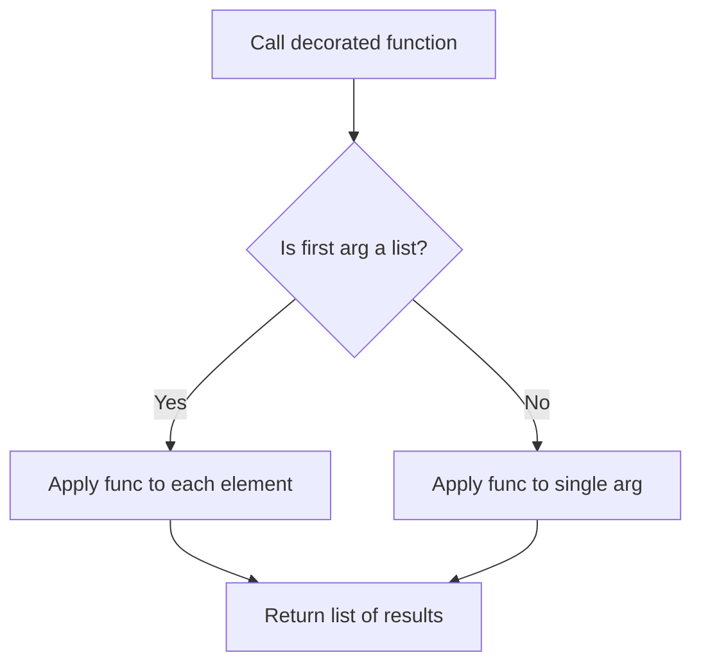
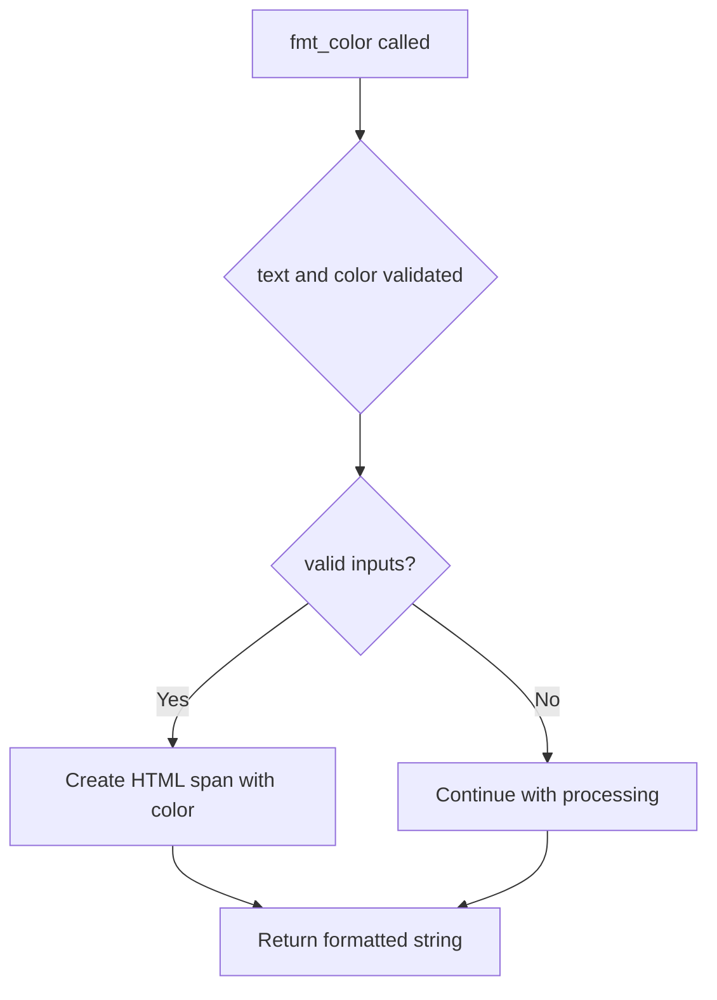
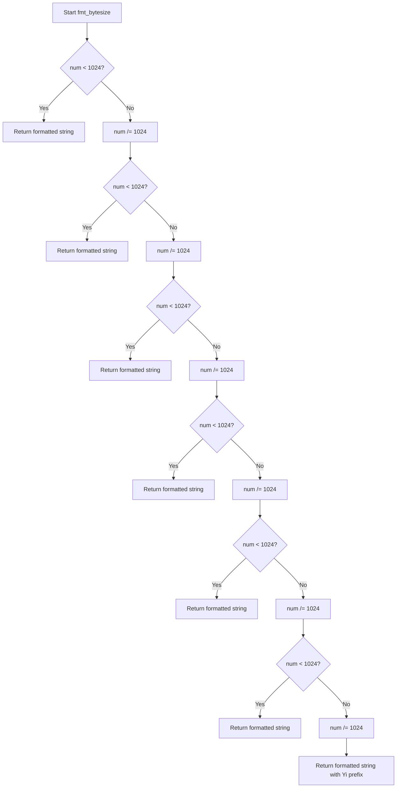
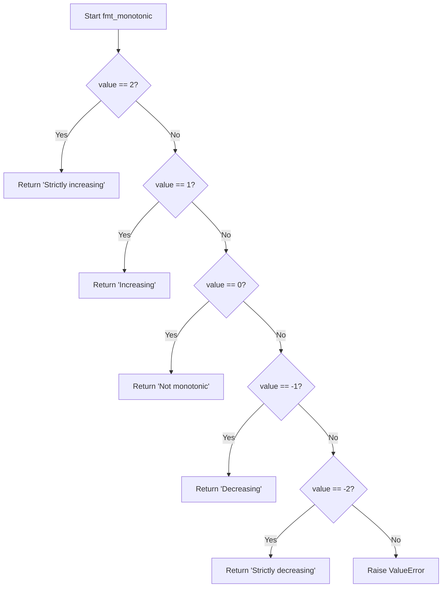

# `formatters.py`

## `src.ydata_profiling.report.formatters.list_args` · *function*

## Summary:
Decorator that enables a function to handle both single arguments and lists of arguments by applying the function to each element in the list.

## Description:
This decorator transforms a function that processes individual arguments into one that can also process lists of arguments. When the first argument is a list, it applies the decorated function to each element in the list; otherwise, it applies the function to the single argument as usual. This pattern is commonly used in formatting functions where the same transformation logic needs to be applied to either individual values or collections of values.

## Args:
    func (Callable): The function to be decorated. This function should accept a single argument followed by optional positional and keyword arguments.

## Returns:
    Callable: A new function that wraps the original function with list-handling capabilities.

## Raises:
    None explicitly raised by this decorator. Any exceptions will be propagated from the wrapped function.

## Constraints:
    - Preconditions: The decorated function must be callable and able to accept the types of arguments it will receive.
    - Postconditions: The returned function behaves identically to the original function when given non-list arguments, and applies the original function to each element when given a list.

## Side Effects:
    - None. This decorator does not perform any I/O operations or mutate external state.

## Control Flow:


## Examples:
    # Basic usage with a simple function
    @list_args
    def square(x):
        return x * x
    
    # Works with single values
    result = square(5)  # Returns 25
    
    # Works with lists
    result = square([1, 2, 3])  # Returns [1, 4, 9]
    
    # Works with keyword arguments
    @list_args
    def add_offset(x, offset=0):
        return x + offset
    
    result = add_offset([1, 2, 3], offset=10)  # Returns [11, 12, 13]

## `src.ydata_profiling.report.formatters.fmt_color` · *function*

## Summary:
Formats text with HTML color styling by wrapping it in a span element with a specified color attribute.

## Description:
This function takes a text string and a color specification, then returns an HTML-formatted string that applies the specified color to the text using inline CSS styling. It is designed to be used in report generation where colored text is needed for visual emphasis or categorization.

## Args:
    text (str): The text content to be formatted with color styling.
    color (str): The color specification to apply to the text. This should be a valid CSS color value.

## Returns:
    str: An HTML string containing the original text wrapped in a span element with the specified color applied via inline CSS.

## Raises:
    None

## Constraints:
    Preconditions:
        - The `text` argument must be a string.
        - The `color` argument must be a string representing a valid CSS color.
    Postconditions:
        - The returned string will always be an HTML span element with the specified color styling.
        - The original text content remains unchanged.

## Side Effects:
    None

## Control Flow:


## Examples:
    Example 1: Basic usage
        Input: fmt_color("Hello World", "red")
        Output: '<span style="color:red">Hello World</span>'

    Example 2: Using different color formats
        Input: fmt_color("Important Notice", "#FF5733")
        Output: '<span style="color:#FF5733">Important Notice</span>'

## `src.ydata_profiling.report.formatters.fmt_class` · *function*

## Summary:
Wraps text content with an HTML span element using a specified CSS class attribute.

## Description:
Formats input text by embedding it within an HTML span tag that applies the provided CSS class. This utility function serves as a standardized way to add styling or semantic classification to text elements in HTML reports.

## Args:
    text (str): The textual content to be wrapped in HTML markup.
    cls (str): The CSS class name to apply to the span element.

## Returns:
    str: An HTML string containing the input text wrapped in a span element with the specified class.

## Raises:
    None

## Constraints:
    Preconditions:
        - Both `text` and `cls` must be strings.
        - The `cls` parameter should not contain invalid characters for HTML attribute values.
    Postconditions:
        - The returned string is always a valid HTML span element with the specified class.
        - The original text content remains unchanged.

## Side Effects:
    None

## Control Flow:
The function performs a straightforward string formatting operation with no conditional logic or loops.

## Examples:
    >>> fmt_class("Hello World", "highlight")
    '<span class="highlight">Hello World</span>'
    
    >>> fmt_class("Error message", "error")
    '<span class="error">Error message</span>'

## `src.ydata_profiling.report.formatters.fmt_bytesize` · *function*

## Summary:
Formats a byte size value into a human-readable string with appropriate binary prefixes.

## Description:
Converts a numeric byte size value into a formatted string that uses binary prefixes (Ki, Mi, Gi, etc.) to represent large numbers in a more readable format. This function is commonly used in data profiling reports to display file sizes, memory usage, or dataset dimensions in an intuitive way.

The function processes the input number through successive divisions by 1024, selecting the most appropriate binary prefix based on the magnitude of the number. It handles both small and very large byte values by cycling through increasingly larger units.

## Args:
    num (float): The numeric byte size value to format. Must be a non-negative number for meaningful results.
    suffix (str): Optional suffix to append to the unit (default is "B" for bytes). This allows for flexibility in representing different data units.

## Returns:
    str: A formatted string representing the byte size with appropriate binary prefix and suffix. Examples include "1.0 KiB", "2.5 MiB", or "1.2 YiB".

## Raises:
    None: This function does not raise any exceptions under normal operation.

## Constraints:
    Preconditions:
        - The input `num` should be a numeric value (int or float)
        - The `suffix` parameter should be a string
    Postconditions:
        - The returned string will always contain exactly one space between the numeric value and the unit
        - The numeric part will be formatted to one decimal place
        - The function will always return a string with a valid binary prefix (from "", "Ki", "Mi", ..., "Yi")

## Side Effects:
    None: This function has no side effects and is purely a formatting utility.

## Control Flow:


## Examples:
    >>> fmt_bytesize(1024)
    '1.0 KiB'
    >>> fmt_bytesize(1048576)
    '1.0 MiB'
    >>> fmt_bytesize(1073741824)
    '1.0 GiB'
    >>> fmt_bytesize(1099511627776)
    '1.0 TiB'
    >>> fmt_bytesize(1024, suffix="KB")
    '1.0 KB'

## `src.ydata_profiling.report.formatters.fmt_percent` · *function*

## Summary:
Formats a floating-point value as a percentage string with special handling for edge cases near 0% and 100%.

## Description:
Converts a decimal value (typically between 0 and 1) into a human-readable percentage string. This function implements special formatting rules for values very close to 0% or 100% to improve readability by showing approximate ranges rather than exact decimal representations.

## Args:
    value (float): The numeric value to format as a percentage. Expected to be between 0 and 1, though values outside this range may be handled.
    edge_cases (bool): Flag controlling whether to apply special formatting for values near 0% and 100%. Defaults to True.

## Returns:
    str: A formatted percentage string. Returns "< 0.1%" for values that round to 0 but are greater than 0, "> 99.9%" for values that round to 1 but are less than 1, and standard formatted percentages otherwise.

## Raises:
    None explicitly raised.

## Constraints:
    Preconditions:
        - Input value should be a valid numeric type (float)
        - When edge_cases=True, the function applies special rounding logic using round(value, 3)
    Postconditions:
        - Always returns a string representation of the percentage
        - Special edge case handling only applies when edge_cases=True

## Side Effects:
    None.

## Control Flow:
```mermaid
flowchart TD
    A[Start fmt_percent] --> B{edge_cases is True?}
    B -- Yes --> C{round(value,3) == 0 AND value > 0?}
    C -- Yes --> D[Return "< 0.1%"]
    C -- No --> E{round(value,3) == 1 AND value < 1?}
    E -- Yes --> F[Return "> 99.9%"]
    E -- No --> G[Return "{value*100:2.1f}%"]
    B -- No --> G
```

## Examples:
    >>> fmt_percent(0.0005)
    '< 0.1%'
    >>> fmt_percent(0.9995)
    '> 99.9%'
    >>> fmt_percent(0.5)
    '50.0%'
    >>> fmt_percent(0.0005, edge_cases=False)
    '0.1%'
```

## `src.ydata_profiling.report.formatters.fmt_timespan` · *function*

## Summary:
Formats a time duration in seconds into a human-readable string representation with appropriate units.

## Description:
Converts a numeric time duration into a readable format using standard time units (nanoseconds to years). The function automatically selects the most appropriate units based on the magnitude of the input and applies proper pluralization and formatting rules. It is designed to provide concise representations for short durations while offering detailed breakdowns when needed.

This logic is extracted into its own function to encapsulate the complexity of time unit conversion, pluralization, and formatting, making the calling code cleaner and more maintainable.

## Args:
    num_seconds (Any): Time duration in seconds, can be a timedelta, int, or float.
    detailed (bool): If True, includes all applicable time units; if False, uses only the most significant ones. Defaults to False.
    max_units (int): Maximum number of time units to display when detailed=False. Defaults to 3.

## Returns:
    str: Human-readable time duration string with appropriate units and formatting.

## Raises:
    None explicitly raised.

## Constraints:
    Preconditions:
        - Input must be convertible to a numeric value representing seconds.
        - When detailed=True, all available time units will be considered.
        - When detailed=False, only the most significant units up to max_units will be shown.
    
    Postconditions:
        - Output string is properly formatted with correct pluralization.
        - Output string contains only relevant time units (non-zero values).
        - Output string uses appropriate abbreviations where available.

## Side Effects:
    None.

## Control Flow:
```mermaid
flowchart TD
    A[Start fmt_timespan] --> B{num_seconds < 60 AND not detailed?}
    B -- Yes --> C[round_number(num_seconds)]
    C --> D[pluralize(count, "second")]
    B -- No --> E[num_seconds = coerce_seconds(num_seconds)]
    E --> F[num_seconds = decimal.Decimal(str(num_seconds))]
    F --> G[relevant_units = reversed(time_units[0:detailed else 3:])]
    G --> H[result = []]
    H --> I[for unit in relevant_units]
    I --> J[divider = decimal.Decimal(str(unit["divider"]))]
    J --> K[count = num_seconds / divider]
    K --> L[num_seconds %= divider]
    L --> M{unit != last_unit?}
    M -- Yes --> N[count = int(count)]
    M -- No --> O[count = round_number(count)]
    N --> P{count not in (0, "0")?}
    O --> P
    P -- Yes --> Q[result.append(pluralize(count, unit["singular"], unit["plural"]))] 
    P -- No --> R[Continue loop]
    Q --> R
    R --> S[I.next()]
    S --> T{End of loop?}
    T -- Yes --> U[len(result) == 1?]
    U -- Yes --> V[return result[0]]
    U -- No --> W[if not detailed: result = result[:max_units]]
    W --> X[concatenate(result)]
    X --> Y[return concatenated string]
```

## Examples:
    >>> fmt_timespan(30)
    '30 seconds'
    
    >>> fmt_timespan(125)
    '2 minutes and 5 seconds'
    
    >>> fmt_timespan(3661, detailed=True)
    '1 hour, 1 minute and 1 second'
    
    >>> fmt_timespan(3661, detailed=False, max_units=2)
    '1 hour and 1 minute'
    
    >>> fmt_timespan(timedelta(hours=2, minutes=30))
    '2 hours and 30 minutes'

## `src.ydata_profiling.report.formatters.fmt_timespan_timedelta` · *function*

## Summary:
Formats a time duration represented as a timedelta or numeric value into a human-readable string with appropriate units.

## Description:
Processes time duration values by converting them to seconds when they are timedelta objects, then formats them using specialized time formatting functions. For non-timedelta inputs, it applies numeric formatting with configurable precision. This extraction allows consistent handling of various time duration representations while maintaining clean separation between time-specific formatting logic and general numeric formatting.

## Args:
    delta (Any): Time duration value that can be either a pandas Timedelta object or a numeric type (int/float).
    detailed (bool): If True, includes all applicable time units; if False, uses only the most significant ones. Defaults to False.
    max_units (int): Maximum number of time units to display when detailed=False. Defaults to 3.
    precision (int): Number of significant digits to include when formatting non-timedelta values. Defaults to 10.

## Returns:
    str: Human-readable time duration string for timedelta inputs, or formatted numeric string for other inputs.

## Raises:
    None explicitly raised.

## Constraints:
    Preconditions:
        - Input delta must be either a pandas Timedelta object or a numeric type convertible to float.
        - When delta is a Timedelta, microsecond and nanosecond components are properly accounted for in the total seconds calculation.
        - When delta is not a Timedelta, it must be a valid numeric value for fmt_numeric to process.
    
    Postconditions:
        - For Timedelta inputs: Returns a properly formatted time duration string with appropriate units.
        - For non-Timedelta inputs: Returns a formatted numeric string with specified precision.

## Side Effects:
    None.

## Control Flow:
```mermaid
flowchart TD
    A[Start fmt_timespan_timedelta] --> B{isinstance(delta, pd.Timedelta)?}
    B -- Yes --> C[num_seconds = delta.total_seconds()]
    C --> D{delta.microseconds > 0?}
    D -- Yes --> E[num_seconds += delta.microseconds * 1e-6]
    E --> F{delta.nanoseconds > 0?}
    F -- Yes --> G[num_seconds += delta.nanoseconds * 1e-9]
    G --> H[fmt_timespan(num_seconds, detailed, max_units)]
    B -- No --> I[fmt_numeric(delta, precision)]
    H --> J[Return formatted time string]
    I --> J
```

## Examples:
    >>> fmt_timespan_timedelta(timedelta(hours=2, minutes=30))
    '2 hours and 30 minutes'
    
    >>> fmt_timespan_timedelta(3661.5)
    '3661.5'
    
    >>> fmt_timespan_timedelta(timedelta(seconds=125), detailed=True)
    '2 minutes and 5 seconds'
    
    >>> fmt_timespan_timedelta(12345.6789, precision=3)
    '1.23e+04'

## `src.ydata_profiling.report.formatters.fmt_numeric` · *function*

## Summary:
Formats a numeric value into a string representation with configurable precision, converting scientific notation to HTML superscript format.

## Description:
Converts a floating-point number into a formatted string using Python's 'g' format specifier with configurable precision. When the formatted result contains scientific notation (e.g., 1.23e+04), this function converts it to HTML superscript format (e.g., 1.23 × 10<sup>4</sup>) for better readability in web contexts. This function ensures consistent numeric formatting for reporting purposes.

## Args:
    value (float): The numeric value to format. Must be a valid floating-point number.
    precision (int): Number of significant digits to include in the formatted output. Defaults to 10.

## Returns:
    str: A formatted string representation of the numeric value. Scientific notation is converted to HTML superscript format when present.

## Raises:
    None explicitly raised. However, underlying formatting operations may raise ValueError for invalid inputs.

## Constraints:
    Preconditions:
        - The `value` argument must be a valid numeric type (float or convertible to float).
        - The `precision` argument must be a non-negative integer.
    Postconditions:
        - The returned string is always a valid representation of the input value according to the specified precision.
        - Scientific notation is converted to HTML superscript format when present.

## Side Effects:
    None. This function performs no I/O operations or external state mutations.

## Control Flow:
```mermaid
flowchart TD
    A[Start fmt_numeric] --> B[Format value with {:.{precision}g} format]
    B --> C[Loop through ['e+', 'e-']]
    C --> D{Pattern found in formatted string?}
    D -- Yes --> E[Replace pattern with × 10<sup>]
    E --> F[Clean up <sup>0 to <sup>]
    F --> G[Add sign to <sup> tag]
    G --> H[Continue loop or return]
    D -- No --> I[Continue loop or return]
    H --> J[End]
    I --> J
```

## Examples:
    >>> fmt_numeric(12345.6789)
    '12345.6789'
    
    >>> fmt_numeric(12345.6789, precision=3)
    '1.23e+04'
    
    >>> fmt_numeric(0.000123456)
    '1.23456e-04'
    
    >>> fmt_numeric(12345.6789, precision=2)
    '1.2e+04'
    
    >>> fmt_numeric(12345.6789, precision=5)
    '12346'

## `src.ydata_profiling.report.formatters.fmt_number` · *function*

## Summary:
Formats an integer value using locale-aware number formatting.

## Description:
Converts an integer into a string representation with locale-specific grouping separators and decimal formatting. This function serves as a standardized formatter for numeric values throughout the reporting system, ensuring consistent display of numbers regardless of the user's locale settings.

## Args:
    value (int): The integer value to format. Must be a valid integer type.

## Returns:
    str: A formatted string representation of the integer with appropriate locale-aware grouping separators.

## Raises:
    None

## Constraints:
    Preconditions:
        - Input must be an integer type
        - Input must be a valid integer value (no NaN, infinity, or non-numeric values)
    
    Postconditions:
        - Output is always a string
        - String representation maintains the numeric value's magnitude
        - Formatting follows locale-specific conventions for thousands separators

## Side Effects:
    None

## Control Flow:
```mermaid
flowchart TD
    A[Start fmt_number] --> B{Input is int?}
    B -- Yes --> C[Format with f\"{value:n}\"]
    B -- No --> D[Raise TypeError]
    C --> E[Return formatted string]
    D --> E
```

## Examples:
    >>> fmt_number(1000)
    '1,000'
    
    >>> fmt_number(1234567)
    '1,234,567'
    
    >>> fmt_number(-42)
    '-42'
```

## `src.ydata_profiling.report.formatters.fmt_array` · *function*

## Summary:
Formats a NumPy array for display by applying controlled truncation using NumPy's print options.

## Description:
This function formats a NumPy array into a string representation with controlled element truncation. It leverages NumPy's `printoptions` context manager to limit the number of elements displayed, making it suitable for reporting and visualization of large arrays. The function ensures that only a representative sample of array elements is shown, preventing overwhelming output while maintaining readability.

## Args:
    value (np.ndarray): The NumPy array to format for display
    threshold (Any, optional): Controls how many array elements are shown at the edges. When set to np.nan (default), NumPy uses its default behavior. When set to an integer, it specifies the number of elements to show at each end of the array.

## Returns:
    str: A string representation of the array with controlled truncation, showing at most 3 elements in the middle and edge items as determined by the threshold parameter

## Raises:
    None explicitly raised

## Constraints:
    Preconditions:
        - The input value must be a valid NumPy array
        - The threshold parameter should be compatible with NumPy's printoptions (integer or np.nan)
    
    Postconditions:
        - The returned string will represent the array with appropriate truncation according to NumPy's formatting rules
        - The original array is not modified

## Side Effects:
    None

## Control Flow:
```mermaid
flowchart TD
    A[Start fmt_array] --> B{Input validation}
    B --> C[Apply np.printoptions with threshold=3, edgeitems=threshold]
    C --> D[Convert array to string using str()]
    D --> E[Return formatted string]
```

## Examples:
    # Basic usage with default threshold (np.nan)
    arr = np.array([1, 2, 3, 4, 5])
    result = fmt_array(arr)
    # Returns: '[1 2 3 ... 4 5]' (shows 3 elements total with truncation)
    
    # Usage with custom threshold
    arr = np.array([1, 2, 3, 4, 5, 6, 7, 8, 9, 10])
    result = fmt_array(arr, threshold=2)
    # Returns: '[1 2 ... 9 10]' (shows 2 edge items)
```

## `src.ydata_profiling.report.formatters.fmt` · *function*

## Summary:
Formats a value into a string representation, applying specialized numeric formatting for numbers and HTML escaping for other types.

## Description:
This function serves as a unified formatter that routes values to appropriate formatting functions based on their type. For numeric values (float or int), it delegates to `fmt_numeric` for proper numeric formatting including scientific notation conversion to HTML superscript format. For all other types, it applies HTML escaping via `markupsafe.escape` before converting to string. This separation allows consistent presentation of data in reports while maintaining security against XSS attacks for non-numeric content.

## Args:
    value (Any): The value to format, which can be of any type.

## Returns:
    str: A formatted string representation of the input value. Numeric values are formatted with specialized numeric formatting, while other values are HTML-escaped and converted to strings.

## Raises:
    None explicitly raised by this function. However, underlying calls to `fmt_numeric` or `escape` may raise exceptions for invalid inputs.

## Constraints:
    Preconditions:
        - The input `value` can be of any type.
    Postconditions:
        - The returned value is always a string.
        - Numeric values are formatted with appropriate precision and scientific notation handling.
        - Non-numeric values are safely escaped to prevent XSS vulnerabilities.

## Side Effects:
    - Calls `fmt_numeric` for numeric values, which may involve string manipulation and potential regex operations.
    - Calls `markupsafe.escape` for non-numeric values, which processes the input for HTML safety.

## Control Flow:
```mermaid
flowchart TD
    A[Start fmt] --> B{Is value numeric?}
    B -- Yes --> C[Call fmt_numeric(value)]
    B -- No --> D[Call escape(value) then str()]
    C --> E[Return formatted numeric string]
    D --> E
```

## Examples:
    >>> fmt(42)
    '42'
    
    >>> fmt(3.14159)
    '3.14159'
    
    >>> fmt("hello")
    'hello'
    
    >>> fmt("<script>alert('xss')</script>")
    '&lt;script&gt;alert(&#x27;xss&#x27;)&lt;/script&gt;'
```

## `src.ydata_profiling.report.formatters.fmt_monotonic` · *function*

## Summary:
Converts a monotonicity indicator integer into a human-readable descriptive string.

## Description:
Formats an integer representing monotonicity status into a descriptive label. This function serves as a presentation layer utility that translates numerical monotonicity indicators into user-friendly text labels for reporting purposes.

The function is called by the profiling report generation system when displaying column monotonicity analysis results. It's extracted into its own function to separate formatting logic from business logic, improving code maintainability and testability.

## Args:
    value (int): Monotonicity indicator ranging from -2 to 2 inclusive
        - -2: Strictly decreasing
        - -1: Decreasing  
        - 0: Not monotonic
        - 1: Increasing
        - 2: Strictly increasing

## Returns:
    str: Human-readable description of the monotonicity status
        - "Strictly increasing" for value = 2
        - "Increasing" for value = 1
        - "Not monotonic" for value = 0
        - "Decreasing" for value = -1
        - "Strictly decreasing" for value = -2

## Raises:
    ValueError: When value is outside the valid range of -2 to 2 inclusive

## Constraints:
    Preconditions:
        - Input value must be an integer
        - Input value must be within range [-2, 2] inclusive
    
    Postconditions:
        - Return value is always one of the predefined string constants
        - Function raises ValueError for invalid inputs

## Side Effects:
    None

## Control Flow:


## Examples:
```python
# Valid usage
fmt_monotonic(2)   # Returns "Strictly increasing"
fmt_monotonic(1)   # Returns "Increasing"
fmt_monotonic(0)   # Returns "Not monotonic"
fmt_monotonic(-1)  # Returns "Decreasing"
fmt_monotonic(-2)  # Returns "Strictly decreasing"

# Error case
fmt_monotonic(5)   # Raises ValueError: Value should be integer ranging from -2 to 2.
```

## `src.ydata_profiling.report.formatters.help` · *function*

## Summary:
Generates HTML markup for a help badge that displays a tooltip with descriptive text, optionally linking to an external resource.

## Description:
This function creates an HTML element designed to display a help icon (a question mark inside a blue badge) that shows a tooltip when hovered over. The tooltip contains the provided title text. If a URL is specified, the badge becomes a clickable link to that resource. This utility function centralizes the creation of help badges across the application, ensuring consistent styling and behavior.

## Args:
    title (str): The text to display in the tooltip when hovering over the help badge.
    url (Optional[str]): An optional URL to which the help badge links. If None, the badge is not a hyperlink.

## Returns:
    str: A string containing the HTML markup for the help badge. When url is provided, it returns an anchor tag wrapping the badge span; otherwise, it returns just the badge span.

## Raises:
    None: This function does not raise any exceptions.

## Constraints:
    Preconditions:
        - The title argument must be a string.
        - The url argument, if provided, must be a valid string representing a URL.
    Postconditions:
        - The returned string is valid HTML that can be embedded in web pages.
        - The returned HTML always includes a badge with a question mark and a tooltip title attribute.

## Side Effects:
    None: This function has no side effects; it only generates and returns HTML strings.

## Control Flow:
```mermaid
flowchart TD
    A[Start help()] --> B{url is not None?}
    B -- Yes --> C[Return anchor tag with badge]
    B -- No --> D[Return badge span only]
    C --> E[End]
    D --> E
```

## Examples:
    help("Click here for more information", "https://example.com/help")
    # Returns: '<a title="Click here for more information" href="https://example.com/help"><span class="badge pull-right" style="color:#fff;background-color:#337ab7;" title="Click here for more information">?</span></a>'

    help("Data source details")
    # Returns: '<span class="badge pull-right" style="color:#fff;background-color:#337ab7;" title="Data source details">?</span>'

## `src.ydata_profiling.report.formatters.fmt_badge` · *function*

## Summary:
Formats numeric values enclosed in parentheses as HTML badge elements.

## Description:
Converts parenthetical numeric values in a string into HTML span elements with a "badge" CSS class. This function is used to enhance the visual presentation of statistical counts and metrics in report generation.

## Args:
    value (str): Input string potentially containing parenthetical numeric values to be formatted as badges.

## Returns:
    str: Modified string where all parenthetical numeric patterns like "(123)" are replaced with "<span class="badge">123</span>".

## Raises:
    None explicitly raised.

## Constraints:
    - Preconditions: Input must be a string containing parenthetical numeric values to format.
    - Postconditions: All matching patterns are replaced with HTML badge markup.

## Side Effects:
    None.

## Control Flow:
```mermaid
flowchart TD
    A[Input String] --> B{Contains "(\\d+)"?}
    B -- Yes --> C[Replace with <span class="badge">\\1</span>]
    B -- No --> D[Return unchanged]
    C --> E[Output]
    D --> E
```

## Examples:
    Input: "Processed (42) records"
    Output: "Processed <span class=\"badge\">42</span> records"
    
    Input: "Error count (15) and warning count (8)"
    Output: "Error count <span class=\"badge\">15</span> and warning count <span class=\"badge\">8</span>"

