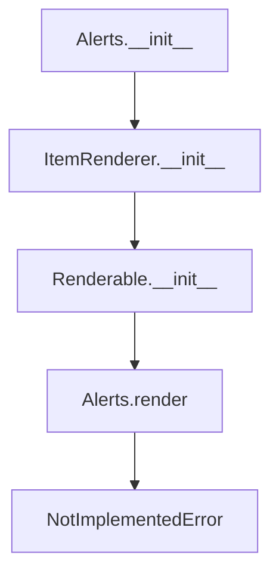

# `alerts.py`

## `src.ydata_profiling.report.presentation.core.alerts.Alerts` · *class*

## Summary:
A presentation layer component that renders alert data for inclusion in profiling reports.

## Description:
The Alerts class serves as a specialized renderer for displaying data quality alerts within profiling reports. It inherits from ItemRenderer and is designed to encapsulate alert information for presentation purposes. This class acts as a container for alert data and provides the framework for rendering alerts in various report formats, though the actual rendering logic is left to subclasses.

## State:
- alerts: Union[List[Alert], Dict[str, List[Alert]]] - Collection of alert objects to be rendered, either as a flat list or grouped by category
- style: Style - Styling configuration for alert presentation
- item_type: str - Fixed value "alerts" identifying this component type
- content: dict - Dictionary containing the alerts and style data, inherited from Renderable

## Lifecycle:
- Creation: Instantiate with alerts collection and style configuration
- Usage: Typically called during report generation when alerts need to be rendered
- Destruction: Managed by garbage collector; no explicit cleanup required

## Method Map:


## Raises:
- NotImplementedError: Raised by the render method as it's intended to be overridden by subclasses

## Example:
```python
# Create alerts instance
alerts_data = [alert1, alert2]
style_config = Style()
alerts_renderer = Alerts(alerts_data, style_config)

# The render method would be called during report generation
# result = alerts_renderer.render()  # Raises NotImplementedError
```

### `src.ydata_profiling.report.presentation.core.alerts.Alerts.__init__` · *method*

## Summary:
Initializes an Alerts object with a collection of alerts and styling configuration.

## Description:
This method sets up the Alerts component by initializing its parent ItemRenderer class with the appropriate type identifier and content dictionary containing the alerts and style information. It serves as the constructor for the Alerts class, establishing the foundational structure for displaying alert information in reports.

## Args:
    alerts (Union[List[Alert], Dict[str, List[Alert]]]): Collection of alerts to be displayed, either as a flat list or grouped by category/dictionary.
    style (Style): Styling configuration object that defines visual presentation properties for the alerts.
    **kwargs: Additional keyword arguments passed to the parent constructor for extended functionality.

## Returns:
    None: This method does not return any value.

## Raises:
    None: This method does not explicitly raise exceptions.

## State Changes:
    Attributes READ: None
    Attributes WRITTEN: 
    - self.item_type: Set to "alerts" string
    - Inherits initialization behavior from parent ItemRenderer class

## Constraints:
    Preconditions:
    - The alerts parameter must be either a list of Alert objects or a dictionary mapping keys to lists of Alert objects
    - The style parameter must be an instance of the Style class
    - All parameters must be properly initialized before calling this method
    
    Postconditions:
    - The object is properly initialized as an ItemRenderer with item_type set to "alerts"
    - The content dictionary contains the provided alerts and style information
    - The parent ItemRenderer class is properly initialized with the content and metadata

## Side Effects:
    None: This method performs no I/O operations or external service calls.

### `src.ydata_profiling.report.presentation.core.alerts.Alerts.__repr__` · *method*

## Summary:
Returns a string representation of the Alerts object, identifying it as an Alerts instance.

## Description:
This method provides a human-readable identifier for Alerts instances, primarily used for debugging and logging purposes. It is part of the standard Python object protocol and is called when the built-in repr() function is applied to an Alerts object.

## Args:
    None

## Returns:
    str: The string "Alerts" that identifies this object type.

## Raises:
    None

## State Changes:
    Attributes READ: None
    Attributes WRITTEN: None

## Constraints:
    Preconditions: None
    Postconditions: None

## Side Effects:
    None

### `src.ydata_profiling.report.presentation.core.alerts.Alerts.render` · *method*

## Summary:
Renders alert data into a presentation-ready format for report generation.

## Description:
The render method is responsible for converting alert data into a format suitable for presentation in profiling reports. As an abstract method inherited from the Renderable base class, this method must be implemented by subclasses to define how alerts should be displayed. The method is called during the report generation pipeline when alerts need to be rendered into HTML or other presentation formats.

## Args:
    None

## Returns:
    Any: The rendered representation of alerts, typically HTML content or similar presentation format

## Raises:
    NotImplementedError: This method raises NotImplementedError as it is intended to be overridden by subclasses

## State Changes:
    Attributes READ: 
    - self.content (accessed via parent class Renderable)
    - self.item_type (inherited from ItemRenderer)
    - self.content['alerts'] (from constructor)
    - self.content['style'] (from constructor)

    Attributes WRITTEN: None

## Constraints:
    Preconditions:
    - The Alerts class must be properly initialized with valid alerts and style parameters
    - The method should only be called on instances that have been properly constructed
    
    Postconditions:
    - The method raises NotImplementedError as it is abstract

## Side Effects:
    None

