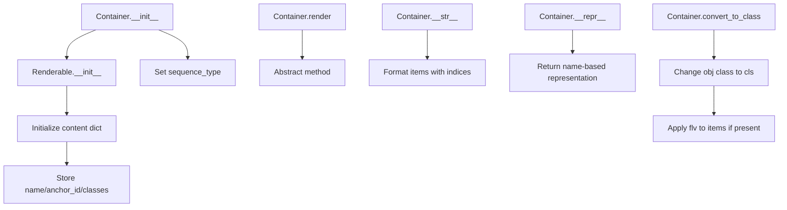

# `container.py`

## `src.ydata_profiling.report.presentation.core.container.Container` · *class*

## Summary:
Container is an abstract base class for organizing sequences of renderable items in a structured presentation hierarchy.

## Description:
Container serves as a foundational abstraction for grouping multiple Renderable objects into logical sequences, enabling hierarchical presentation structures in report generation. It extends the Renderable base class to provide container-specific functionality for managing ordered collections of presentation elements. The class is designed to be subclassed with concrete implementations that define specific rendering behaviors for different presentation formats.

Container instances are typically created by factory methods or constructors that build hierarchical presentation trees from data analysis results. The sequence_type attribute defines the semantic meaning of the contained items (e.g., "list", "grid", "section"), while the items sequence holds the actual renderable components.

## State:
- items: Sequence[Renderable] - A sequence of Renderable objects that make up the container's content. Must be non-empty for meaningful containers.
- sequence_type: str - Defines the semantic type of the container's sequence (e.g., "list", "grid", "section"). Required parameter during initialization.
- nested: bool - Flag indicating whether the container contains nested structures. Defaults to False.
- name: Optional[str] - Human-readable identifier for the container. Stored in content dictionary under "name" key.
- anchor_id: Optional[str] - Unique identifier for HTML anchors. Stored in content dictionary under "anchor_id" key.
- classes: Optional[str] - CSS classes for styling. Stored in content dictionary under "classes" key.
- content: dict - Dictionary containing all configuration parameters and metadata, inherited from Renderable parent class.

## Lifecycle:
- Creation: Instantiate with a sequence of Renderable items, required sequence_type parameter, and optional metadata. The constructor accepts additional keyword arguments that get merged into the content dictionary.
- Usage: Typically used as part of a presentation hierarchy where containers group related renderable elements. Subclasses must implement the render() method to define presentation-specific output formats.
- Destruction: No explicit cleanup required; relies on Python's garbage collection for resource management.

## Method Map:


## Raises:
- TypeError: If items parameter is not a sequence or sequence_type is not a string
- AttributeError: If content dictionary operations fail due to invalid state
- NotImplementedError: When render() method is called on base Container class (must be overridden by subclasses)

## Example:
```python
# Create a container with multiple renderable items
items = [Text("Header"), Image("chart.png")]
container = Container(items, sequence_type="list", name="main_section")

# Convert to a specific container type
container.convert_to_class(MyCustomContainer, lambda x: x)  # Transform items

# Print container representation
print(container)  # Shows formatted list of items
print(repr(container))  # Shows name-based representation
```

### `src.ydata_profiling.report.presentation.core.container.Container.__init__` · *method*

## Summary:
Initializes a Container instance with a sequence of renderable items and configuration metadata.

## Description:
The Container.__init__ method sets up the foundational structure for a container object by preparing the content dictionary with items and configuration parameters, then delegating to the parent Renderable.__init__ method for metadata handling. This method establishes the container's identity through sequence_type while preserving all provided configuration options.

This logic is encapsulated in its own method to separate the container-specific initialization concerns from the general Renderable setup, ensuring clean inheritance and proper state management. The method handles both required parameters (items, sequence_type) and optional metadata (name, anchor_id, classes) while supporting extensibility through **kwargs.

## Args:
- items (Sequence[Renderable]): A sequence of Renderable objects that form the container's content
- sequence_type (str): Semantic type identifier for the container's sequence (e.g., "list", "grid")
- nested (bool): Flag indicating if container contains nested structures, defaults to False
- name (Optional[str]): Human-readable identifier for the container, defaults to None
- anchor_id (Optional[str]): Unique HTML anchor identifier, defaults to None
- classes (Optional[str]): CSS classes for styling, defaults to None
- **kwargs: Additional configuration parameters that extend the content dictionary

## Returns:
None

## Raises:
- TypeError: If items is not a sequence or sequence_type is not a string
- AttributeError: If content dictionary operations fail during initialization

## State Changes:
- Attributes READ: None
- Attributes WRITTEN: 
  - self.sequence_type: Set to the provided sequence_type parameter
  - self.content: Updated with items, nested flag, and all kwargs parameters through the parent class initialization

## Constraints:
- Preconditions: 
  - items must be a sequence-like object containing Renderable instances
  - sequence_type must be a string value defining the semantic type
- Postconditions:
  - self.sequence_type is set to the provided value
  - self.content contains all provided parameters in a dictionary structure
  - Parent Renderable.__init__ is properly called with merged configuration

## Side Effects:
None

### `src.ydata_profiling.report.presentation.core.container.Container.__str__` · *method*

## Summary:
Returns a formatted string representation of the Container's items with indexed listing.

## Description:
This method implements the standard `__str__` protocol to provide a readable string representation of the Container instance. It displays the container type followed by its items in a numbered list format, with proper indentation for multi-line item representations. This method is automatically invoked during string conversion operations such as `print()` or `str()`.

## Args:
    None

## Returns:
    str: A multi-line string starting with "Container\n" followed by each item in the container's "items" list, prefixed with zero-based indices and properly indented for multi-line content.

## Raises:
    None

## State Changes:
    Attributes READ: self.content
    Attributes WRITTEN: None

## Constraints:
    Preconditions: The Container instance must have a content attribute that is a dictionary-like object containing an "items" key.
    Postconditions: The returned string is always a valid UTF-8 encoded string representing the container's structure with proper formatting.

## Side Effects:
    None

### `src.ydata_profiling.report.presentation.core.container.Container.__repr__` · *method*

## Summary:
Returns a string representation of the Container object that includes its name when available.

## Description:
This method provides a human-readable representation of the Container instance, primarily used for debugging and logging purposes. It checks if a "name" key exists in the container's content dictionary and formats the output accordingly. The method is part of the standard Python object protocol for representing objects as strings.

Known callers:
- Python's built-in repr() function when called on Container instances
- Debugging tools and logging frameworks that rely on __repr__ for object display
- Interactive Python shells and IDE debuggers

This logic is implemented as its own method because it follows Python's standard object protocol for string representation, allowing Container instances to be displayed meaningfully in various contexts without requiring custom formatting logic elsewhere in the codebase.

## Args:
    None

## Returns:
    str: A string representation of the Container. When the container has a name, returns "Container(name=<name>)", otherwise returns "Container".

## Raises:
    None

## State Changes:
    Attributes READ: self.content
    Attributes WRITTEN: None

## Constraints:
    Preconditions: The self.content attribute must be a dictionary-like object that supports the "in" operator and key access.
    Postconditions: The returned string will always be either "Container" or "Container(name=<value>)" where <value> is the content of self.content["name"].

## Side Effects:
    None

### `src.ydata_profiling.report.presentation.core.container.Container.render` · *method*

## Summary:
Abstract rendering interface for container objects that must be implemented by subclasses.

## Description:
This abstract method defines the contract for rendering Container objects into presentation-ready formats. As a required method from the Renderable base class, it establishes the interface that all Container subclasses must implement to provide concrete rendering behavior. During the presentation pipeline, this method transforms container content (which holds a sequence of renderable items) into appropriate output formats such as HTML, JSON, or other presentation representations.

## Args:
    None

## Returns:
    Any: Abstract return type indicating that concrete implementations may return various presentation formats (HTML fragments, JSON structures, etc.). The specific return type is determined by the implementing subclass.

## Raises:
    NotImplementedError: Raised by the base Container class implementation, requiring all subclasses to override with concrete rendering logic.

## State Changes:
    Attributes READ: 
    - self.content: Accesses the container's content dictionary containing items and configuration parameters
    - self.sequence_type: Accesses the sequence type attribute that defines the structural organization of contained items
    Attributes WRITTEN: None

## Constraints:
    Preconditions: 
    - Container must be properly initialized with valid content and items
    - Subclasses must provide concrete implementation
    Postconditions: 
    - When implemented, returns a valid presentation-ready representation of the container's content

## Side Effects:
    None

### `src.ydata_profiling.report.presentation.core.container.Container.convert_to_class` · *method*

## Summary:
Converts a Renderable object to a different class type while processing its content items.

## Description:
This method changes the class type of a Renderable object to the specified class and processes any items contained within the object's content. It is typically used during report presentation rendering to dynamically change object types while maintaining content integrity. The flv (filter/transform function) parameter allows applying transformations to each item in the content's items collection.

## Args:
    cls: The target class to convert the object to
    obj (Renderable): The renderable object to be converted
    flv (Callable): A function to apply to each item in the object's content

## Returns:
    None: This method modifies the object in-place and does not return a value

## Raises:
    AttributeError: When obj doesn't have a content attribute or __class__ attribute
    KeyError: When accessing obj.content["items"] if the "items" key doesn't exist

## State Changes:
    Attributes READ: obj.content
    Attributes WRITTEN: obj.__class__

## Constraints:
    Preconditions: 
    - obj must be a Renderable instance with a content attribute
    - obj.content must be a dictionary-like object
    - flv must be callable
    Postconditions:
    - obj.__class__ will be set to cls
    - Items in obj.content["items"] will have flv applied to them if the "items" key exists

## Side Effects:
    Mutates the class type of the input object in-place
    Calls the provided flv function on each item in obj.content["items"] if the key exists

