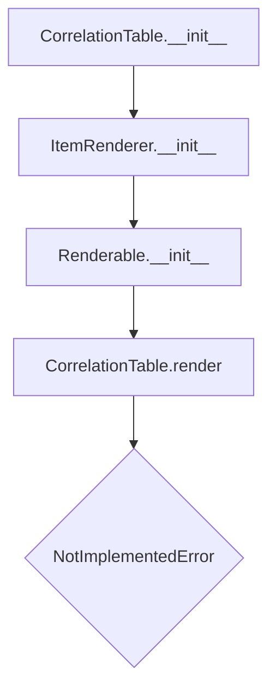

# `correlation_table.py`

## `src.ydata_profiling.report.presentation.core.correlation_table.CorrelationTable` · *class*

## Summary:
A presentation layer component for rendering correlation matrices in report outputs.

## Description:
The CorrelationTable class serves as an abstract base for creating correlation matrix visualizations within report presentations. It extends ItemRenderer to provide a standardized interface for correlation data presentation, ensuring consistent handling of correlation matrices across different output formats. This class enforces a contract for rendering correlation data while leaving the actual presentation logic to be implemented by subclasses.

## State:
- item_type: str, set to "correlation_table" during initialization, identifies the type of presentation item
- content: dict, stores the correlation_matrix under the key "correlation_matrix" and optionally name, anchor_id, and classes
- name: str, optional identifier for the correlation table (stored in content)
- anchor_id: str, optional HTML anchor identifier (stored in content)
- classes: str, optional CSS classes for styling (stored in content)

## Lifecycle:
- Creation: Instantiate with a name (str) and correlation_matrix (pd.DataFrame); optional anchor_id and classes parameters
- Usage: Call render() method (must be overridden by subclasses) to generate presentation output
- Destruction: No explicit cleanup required; relies on Python's garbage collection

## Method Map:


## Raises:
- NotImplementedError: Raised by render() method to indicate that subclasses must implement this method

## Example:
```python
# Create a correlation table with sample data
import pandas as pd
from src.ydata_profiling.report.presentation.core.correlation_table import CorrelationTable

# Sample correlation matrix
corr_matrix = pd.DataFrame({
    'A': [1.0, 0.5, -0.3],
    'B': [0.5, 1.0, 0.2],
    'C': [-0.3, 0.2, 1.0]
})

# This would fail because render() is not implemented
table = CorrelationTable("Correlation Matrix", corr_matrix)
# table.render()  # Would raise NotImplementedError
```

### `src.ydata_profiling.report.presentation.core.correlation_table.CorrelationTable.__init__` · *method*

## Summary:
Initializes a CorrelationTable object with a correlation matrix and associated metadata for report rendering.

## Description:
This method constructs a correlation table presentation component by initializing its parent ItemRenderer class with the appropriate configuration. It sets up the internal representation of a correlation matrix visualization that can be rendered in reports. The correlation table is designed to display pairwise correlations between variables in a dataset, making it suitable for exploratory data analysis visualizations.

## Args:
    name (str): Unique identifier for this correlation table component
    correlation_matrix (pd.DataFrame): The correlation matrix data to be displayed
    **kwargs: Additional keyword arguments passed to the parent constructor

## Returns:
    None: This method initializes the object state but does not return a value

## Raises:
    None: This method does not explicitly raise exceptions

## State Changes:
    Attributes READ: None
    Attributes WRITTEN: 
    - self.item_type: Set to "correlation_table"
    - self.content: Set to dictionary containing "correlation_matrix" key
    - self.name: Set to the provided name parameter (inherited via parent class)
    - Other attributes inherited from parent classes (content, anchor_id, classes)

## Constraints:
    Preconditions:
    - correlation_matrix must be a valid pandas DataFrame
    - name must be a string
    - All kwargs must be valid arguments for the parent class constructor
    
    Postconditions:
    - The object is properly initialized as a correlation table renderable
    - The correlation_matrix is stored in the content dictionary under the "correlation_matrix" key
    - The object inherits proper rendering capabilities from ItemRenderer and Renderable base classes

## Side Effects:
    None: This method performs no I/O operations or external service calls

### `src.ydata_profiling.report.presentation.core.correlation_table.CorrelationTable.__repr__` · *method*

## Summary:
Returns a string representation identifying the CorrelationTable class.

## Description:
This method provides a human-readable identifier for CorrelationTable instances, primarily used for debugging and logging purposes. It is called automatically when the built-in repr() function is applied to a CorrelationTable object.

## Args:
    None

## Returns:
    str: The string "CorrelationTable" that uniquely identifies this class type.

## Raises:
    None

## State Changes:
    Attributes READ: None
    Attributes WRITTEN: None

## Constraints:
    Preconditions: None
    Postconditions: None

## Side Effects:
    None

### `src.ydata_profiling.report.presentation.core.correlation_table.CorrelationTable.render` · *method*

## Summary:
Abstract method that must be implemented to render a correlation matrix table in a presentation format.

## Description:
This method serves as the abstract interface for rendering correlation matrix data into a presentation-ready format. As part of the Renderable abstract base class hierarchy, it defines the contract for how correlation tables should be displayed in reports. The CorrelationTable class inherits this method and raises NotImplementedError, indicating that concrete implementations must override this method in derived classes to provide actual rendering functionality.

This method exists to standardize the rendering process across different presentation formats while allowing flexibility in how the correlation data is ultimately displayed.

## Args:
    None

## Returns:
    Any: The rendered representation of the correlation matrix, typically HTML, JSON, or other presentation formats.

## Raises:
    NotImplementedError: Raised by CorrelationTable.render() to indicate that subclasses must implement this method.

## State Changes:
    Attributes READ: self.content, self.item_type
    Attributes WRITTEN: None

## Constraints:
    Preconditions: The CorrelationTable instance must be properly initialized with a valid correlation_matrix in its content dictionary.
    Postconditions: Subclasses implementing this method must return a valid presentation-ready representation of the correlation data.

## Side Effects:
    None

