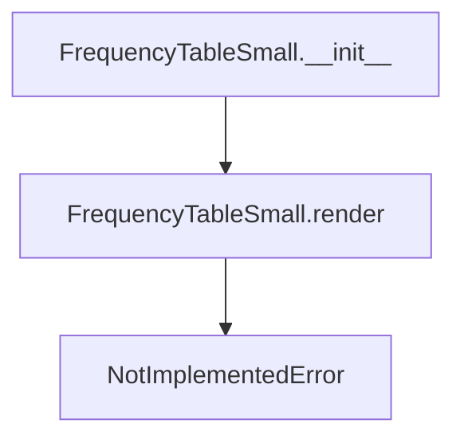

# `frequency_table_small.py`

## `src.ydata_profiling.report.presentation.core.frequency_table_small.FrequencyTableSmall` · *class*

## Summary:
A lightweight frequency table renderer for displaying categorical data distributions in profiling reports.

## Description:
The FrequencyTableSmall class represents a compact presentation format for frequency tables containing limited rows of categorical data. It extends ItemRenderer to provide a standardized interface for rendering frequency distributions in profiling reports. This class serves as an abstract base that defines the structure and parameters for small frequency tables while leaving the actual rendering implementation to subclasses.

## State:
- item_type: str, set to "frequency_table_small" during initialization, identifying this specific renderer type
- content: dict, contains the configuration data including:
  - rows: List[Any], the categorical data rows to display
  - redact: bool, flag indicating whether sensitive data should be masked
- name: Optional[str], optional identifier for the table (inherited from Renderable)
- anchor_id: Optional[str], optional HTML anchor identifier (inherited from Renderable)
- classes: Optional[str], optional CSS classes for styling (inherited from Renderable)

## Lifecycle:
- Creation: Instantiate with rows (List[Any]) and redact (bool) parameters, optionally providing name, anchor_id, and classes via keyword arguments
- Usage: Call render() method to generate the presentation format (must be implemented by subclasses)
- Destruction: No explicit cleanup required; relies on Python's garbage collection

## Method Map:


## Raises:
- TypeError: If required parameters rows or redact are not provided during initialization
- NotImplementedError: When render() method is called (abstract method requiring subclass implementation)

## Example:
```python
# Create a frequency table with sample data
rows = [("Category A", 10), ("Category B", 5), ("Category C", 3)]
table = FrequencyTableSmall(rows=rows, redact=False)

# The render method would be implemented by subclasses:
# table.render()  # Raises NotImplementedError
```

### `src.ydata_profiling.report.presentation.core.frequency_table_small.FrequencyTableSmall.__init__` · *method*

## Summary:
Initializes a FrequencyTableSmall object with rows and redaction settings for rendering small frequency tables in reports.

## Description:
Configures a FrequencyTableSmall instance by calling the parent ItemRenderer constructor with the appropriate item type and content dictionary. This method sets up the foundational structure for displaying small frequency tables in profiling reports, with support for data redaction. The method is typically invoked during report generation when constructing presentation components for categorical data frequency displays.

Known callers include the report generation pipeline components that require small frequency table rendering. This logic is separated into its own method to maintain clean inheritance and proper initialization of the ItemRenderer base class, ensuring consistent behavior with other presentation components.

## Args:
    rows (List[Any]): A list of row data to be displayed in the frequency table, typically containing categorical value counts
    redact (bool): Boolean flag indicating whether sensitive data should be redacted from display
    **kwargs: Additional keyword arguments passed to the parent ItemRenderer constructor for optional configuration

## Returns:
    None: This method initializes the object's internal state and does not return a value

## Raises:
    None: This method does not explicitly raise exceptions, though parent class initialization may raise exceptions for invalid arguments

## State Changes:
    Attributes READ: None
    Attributes WRITTEN:
    - self.item_type: Set to "frequency_table_small" string identifier
    - self.content: Set to dictionary containing "rows" and "redact" keys with provided values
    - Other attributes inherited from Renderable parent class (content, name, anchor_id, classes)

## Constraints:
    Preconditions:
    - rows parameter must be a valid list-like object containing frequency data
    - redact parameter must be a boolean value (True or False)
    - All kwargs must be valid arguments accepted by the parent ItemRenderer class
    
    Postconditions:
    - The object is properly initialized as a frequency table item renderer
    - The item_type attribute is set to "frequency_table_small"
    - The content dictionary contains the provided rows and redact settings
    - The object is ready for rendering in report generation pipelines

## Side Effects:
    None: This method performs no I/O operations, external service calls, or mutations to objects outside self

### `src.ydata_profiling.report.presentation.core.frequency_table_small.FrequencyTableSmall.__repr__` · *method*

## Summary:
Returns a string representation of the FrequencyTableSmall object that identifies its type.

## Description:
This method provides a standardized string representation for FrequencyTableSmall instances, enabling easy identification of the object type during debugging or logging operations. It is called implicitly by Python's built-in repr() function and when objects are displayed in interactive environments.

## Args:
    None

## Returns:
    str: Always returns the literal string "FrequencyTableSmall" regardless of the object's internal state.

## Raises:
    None

## State Changes:
    Attributes READ: None
    Attributes WRITTEN: None

## Constraints:
    Preconditions: None
    Postconditions: The returned string is always exactly "FrequencyTableSmall"

## Side Effects:
    None

### `src.ydata_profiling.report.presentation.core.frequency_table_small.FrequencyTableSmall.render` · *method*

## Summary:
Renders a frequency table with limited rows for presentation in profiling reports.

## Description:
This method is responsible for generating the visual representation of a small frequency table, which displays categorical data frequencies in a compact format. It is part of the abstract base class Renderable and must be implemented by subclasses to provide specific rendering logic for different presentation formats. The FrequencyTableSmall class uses this abstract method to define the interface for rendering frequency data with limited rows.

## Args:
    None

## Returns:
    Any: The rendered representation of the frequency table, typically HTML or similar markup for web-based reporting.

## Raises:
    NotImplementedError: This method is abstract and must be overridden by subclasses implementing concrete rendering logic.

## State Changes:
    Attributes READ: 
        - self.content: Contains the configuration data including rows and redact flag
        - self.item_type: Identifies the type of item being rendered
    
    Attributes WRITTEN: None

## Constraints:
    Preconditions:
        - The FrequencyTableSmall instance must be properly initialized with rows and redact parameters
        - The render method should only be called on fully constructed instances
        
    Postconditions:
        - The method raises NotImplementedError indicating that concrete implementations are required

## Side Effects:
    None

