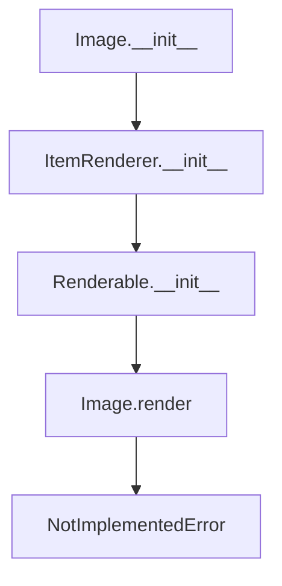

# `image.py`

## `src.ydata_profiling.report.presentation.core.image.Image` · *class*

## Summary:
Represents an image component in the reporting framework, serving as a container for image data and metadata with deferred rendering logic.

## Description:
The Image class is a specialized component within the ydata-profiling reporting system designed to encapsulate image data and associated metadata for presentation purposes. It inherits from ItemRenderer, which itself extends Renderable, establishing a clear hierarchy for presentation components. This class acts as an abstract base for image handling, storing essential image properties such as the image path, format, alternative text, and optional caption in its content dictionary.

The class enforces strict validation during initialization, ensuring that the image path is not null and that required metadata like alternative text is provided. This prevents malformed image components from being created, maintaining data integrity within the reporting pipeline. The actual rendering of images is intentionally left to subclasses through the NotImplementedError in the render method, allowing for flexible implementation strategies based on the target output format (HTML, Markdown, etc.).

## State:
- image: str, path or identifier of the image resource, cannot be None
- image_format: ImageType, enumeration specifying the image format (either "svg" or "png")
- alt: str, alternative text describing the image for accessibility purposes
- caption: Optional[str], optional descriptive text for the image
- item_type: str, set to "image" by the constructor, identifies the component type
- content: dict, inherited from Renderable, stores all image metadata including image, image_format, alt, and caption

## Lifecycle:
- Creation: Instantiate with image path, format, and alternative text; optional caption can be provided
- Usage: Typically used within report generation workflows where image components are added to reports and later rendered
- Destruction: No explicit cleanup required; relies on Python's garbage collection

## Method Map:


## Raises:
- ValueError: Raised during initialization when image parameter is None
- NotImplementedError: Raised by render() method indicating subclasses must implement rendering

## Example:
```python
# Create an image component
image_component = Image(
    image="path/to/chart.png",
    image_format=ImageType.PNG,
    alt="Distribution chart of age variable"
)

# The component can be added to a report structure
# and later rendered when the report is generated
```

### `src.ydata_profiling.report.presentation.core.image.Image.__init__` · *method*

## Summary:
Initializes an Image object with image data, format, and accessibility attributes.

## Description:
This method constructs an Image instance by validating the image parameter and delegating the initialization to its parent class ItemRenderer. It ensures that image data is provided and sets up the internal representation with the specified image properties. This method serves as the primary constructor for Image objects within the report presentation layer.

## Args:
    image (str): The image data or path to be displayed.
    image_format (ImageType): The format of the image (e.g., PNG, JPEG).
    alt (str): Alternative text for accessibility purposes.
    caption (Optional[str]): Optional caption for the image. Defaults to None.
    **kwargs: Additional keyword arguments passed to the parent constructor.

## Returns:
    None: This method initializes the object and does not return a value.

## Raises:
    ValueError: When the image parameter is None, indicating invalid image data.

## State Changes:
    Attributes READ: None
    Attributes WRITTEN: 
        - self.item_type (set to "image")
        - Other attributes inherited from Renderable parent class (content, name, anchor_id, classes)

## Constraints:
    Preconditions:
        - The image parameter must not be None
        - image_format must be a valid ImageType enum value
        - alt must be a non-empty string
    Postconditions:
        - The object is properly initialized with item_type set to "image"
        - All provided parameters are stored in the content dictionary
        - The object inherits proper rendering capabilities from ItemRenderer

## Side Effects:
    None: This method performs no I/O operations or external service calls.

### `src.ydata_profiling.report.presentation.core.image.Image.__repr__` · *method*

## Summary:
Returns a string representation of the Image object, consistently identifying it as "Image".

## Description:
This method provides a standardized string representation for Image instances, enabling predictable identification and debugging of image objects within the reporting framework. It is invoked during object inspection, logging, or display operations where a human-readable identifier is needed.

## Args:
    None

## Returns:
    str: Always returns the literal string "Image" regardless of the object's internal state.

## Raises:
    None

## State Changes:
    Attributes READ: None
    Attributes WRITTEN: None

## Constraints:
    Preconditions: None
    Postconditions: The returned string is always "Image"

## Side Effects:
    None

### `src.ydata_profiling.report.presentation.core.image.Image.render` · *method*

## Summary:
Renders an image component by raising a NotImplementedError, indicating that the rendering logic must be implemented by subclasses.

## Description:
The render method in the Image class serves as an abstract interface that must be implemented by concrete subclasses to provide specific rendering behavior for image components. As a subclass of ItemRenderer, which in turn inherits from Renderable, the Image class follows a standard pattern where the render method is expected to return rendered content (typically HTML or similar markup) representing the image.

This method is part of the presentation layer in the ydata-profiling system, responsible for converting internal image representations into displayable formats. The NotImplementedError indicates that concrete implementations must override this method to provide actual rendering functionality.

The Image class stores image-related metadata in its content dictionary, including the image path, format, alternative text, and optional caption. These attributes are inherited from the Renderable base class and populated during initialization via the ItemRenderer constructor.

## Args:
    self: The Image instance being rendered

## Returns:
    Any: This method raises NotImplementedError and never actually returns a value

## Raises:
    NotImplementedError: Always raised by this implementation, indicating that subclasses must implement this method

## State Changes:
    Attributes READ: 
    - self.content (inherited from Renderable parent class, contains image data)
    - self.item_type (set in ItemRenderer.__init__, always "image")
    
    Attributes WRITTEN: None

## Constraints:
    Preconditions:
    - The Image instance must be properly initialized with valid parameters
    - The image attribute must not be None (enforced in __init__)
    - The image_format must be a valid ImageType enum value
    - The alt attribute must be provided (enforced in __init__)
    
    Postconditions:
    - The method never completes execution successfully due to NotImplementedError

## Side Effects:
    None: This method does not perform any I/O operations or mutate external state

