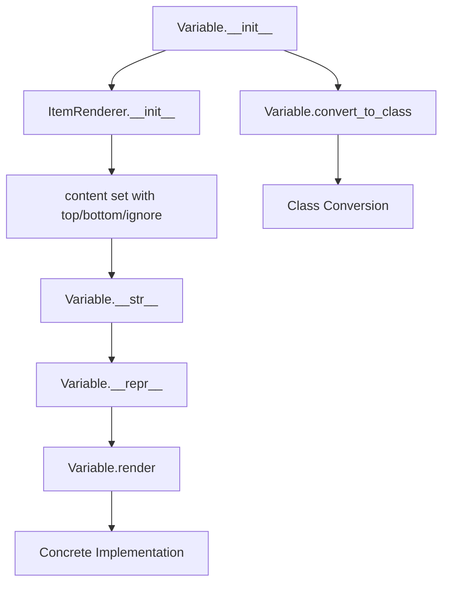

# `variable.py`

## `src.ydata_profiling.report.presentation.core.variable.Variable` · *class*

## Summary:
Represents a variable component in a profiling report with top and bottom content sections.

## Description:
The Variable class is a specialized renderable component designed to encapsulate variable-specific content in a profiling report. It inherits from ItemRenderer and provides a structured way to organize variable information with distinct top and bottom sections. This class serves as a container for variable data that can be rendered into various display formats while maintaining consistent metadata handling through its inheritance from ItemRenderer.

The Variable class is typically instantiated by report generation logic when creating structured representations of variables in profiling reports. It's part of a family of similar components (Collapse, Container, Dropdown, Root) that share the same pattern of content organization and class conversion capabilities.

## State:
- item_type: str - Set to "variable" by constructor, identifies this component type
- content: dict - Dictionary containing:
  - "top": Renderable - Required field representing the primary content section
  - "bottom": Optional[Renderable] - Optional field representing secondary content section, defaults to None
  - "ignore": bool - Flag indicating whether this variable should be ignored during processing, defaults to False
- name: Optional[str] - Human-readable identifier for the variable (inherited from Renderable)
- anchor_id: Optional[str] - Unique identifier for HTML anchors (inherited from Renderable)
- classes: Optional[str] - CSS classes for styling (inherited from Renderable)

## Lifecycle:
- Creation: Instantiate with required `top` parameter and optional `bottom` and `ignore` parameters
- Usage: Call `render()` method on concrete implementations to generate display representation
- Destruction: No explicit cleanup required; relies on Python's garbage collection

## Method Map:


## Raises:
- TypeError: If `top` parameter is not a Renderable instance
- KeyError: If content dictionary keys are missing during property access (inherited from Renderable)

## Example:
```python
# Create a variable with top content
top_content = Text("Variable Name: age")
bottom_content = Table([["Mean", "25.5"], ["Std Dev", "5.2"]])

# Create variable instance
variable = Variable(top=top_content, bottom=bottom_content, ignore=False)

# String representation
print(str(variable))  # Shows formatted variable content

# Convert to different class type (for rendering flexibility)
Variable.convert_to_class(variable, lambda x: x)  # Converts to Variable class
```

### `src.ydata_profiling.report.presentation.core.variable.Variable.__init__` · *method*

## Summary:
Initializes a Variable component with top and bottom renderable content sections.

## Description:
The Variable.__init__ method constructs a Variable instance by setting up its content structure with required top content and optional bottom content and ignore flag. This method leverages the parent ItemRenderer.__init__ to establish the component's type identifier and content dictionary, ensuring proper integration within the report presentation hierarchy.

This logic is encapsulated in its own method to maintain clean separation of concerns, allowing the Variable class to inherit standardized initialization behavior from ItemRenderer while providing specific configuration for variable-type content. The method ensures that all Variable instances have consistent structure and metadata handling through the inheritance chain.

## Args:
    top (Renderable): Required renderable component for the primary content section
    bottom (Optional[Renderable]): Optional renderable component for secondary content section, defaults to None
    ignore (bool): Flag indicating whether this variable should be ignored during processing, defaults to False
    **kwargs: Additional keyword arguments passed to parent initializer

## Returns:
    None: This method initializes the object's state and returns nothing

## Raises:
    TypeError: If top parameter is not a Renderable instance
    KeyError: If content dictionary keys are missing during property access (inherited from Renderable)

## State Changes:
    Attributes READ: None
    Attributes WRITTEN: 
    - self.item_type: str - Set to "variable" to identify component type
    - self.content: dict - Populated with "top", "bottom", and "ignore" keys

## Constraints:
    Preconditions:
    - top parameter must be a Renderable instance
    - All required parameters must be provided according to method signature
    - Content dictionary keys must be properly handled by parent classes
    
    Postconditions:
    - self.item_type is set to "variable"
    - self.content contains the required keys: "top", "bottom", "ignore"
    - Object is properly initialized for rendering operations

## Side Effects:
    None: This method performs no I/O operations or external service calls

### `src.ydata_profiling.report.presentation.core.variable.Variable.__str__` · *method*

## Summary:
Returns a formatted string representation of a Variable object showing its top and bottom content with proper indentation.

## Description:
This method provides a string representation of a Variable instance by formatting its content fields. It's typically invoked during debugging, logging, or display operations when a Variable object needs to be converted to a string. The method formats the content with proper indentation for multi-line strings.

## Args:
    None

## Returns:
    str: A formatted string containing "Variable\n" followed by formatted top and bottom content with newlines replaced by "\n\t".

## Raises:
    KeyError: If self.content does not contain 'top' or 'bottom' keys.
    TypeError: If self.content['top'] or self.content['bottom'] cannot be converted to string.

## State Changes:
    Attributes READ: self.content
    Attributes WRITTEN: None

## Constraints:
    Preconditions: 
    - self.content must be a dictionary-like object with 'top' and 'bottom' keys
    - self.content['top'] and self.content['bottom'] must be convertible to strings
    
    Postconditions:
    - Returns a string with fixed format starting with "Variable\n"
    - Newlines in content are replaced with "\n\t" for proper indentation

## Side Effects:
    None

### `src.ydata_profiling.report.presentation.core.variable.Variable.__repr__` · *method*

## Summary:
Returns a string representation of the Variable object, consistently identifying it as "Variable".

## Description:
This method provides a standardized string representation for Variable instances, enabling clear identification in debugging contexts and logging. It is invoked during object inspection or when converting the object to a string representation.

## Args:
    None

## Returns:
    str: Always returns the literal string "Variable".

## Raises:
    None

## State Changes:
    Attributes READ: None
    Attributes WRITTEN: None

## Constraints:
    Preconditions: None
    Postconditions: None

## Side Effects:
    None

### `src.ydata_profiling.report.presentation.core.variable.Variable.render` · *method*

## Summary:
Abstract method that must be implemented by subclasses to render variable components into displayable formats.

## Description:
The render method serves as an abstract interface that defines the contract for rendering variable components in the ydata-profiling report system. As an abstract method in the Variable class (which inherits from ItemRenderer), it establishes the expected behavior for converting variable data into a displayable representation. This method is part of the rendering pipeline that transforms structured data into visual or textual output for reports.

This method exists as a separate abstract method rather than being implemented inline because:
1. It enforces a consistent interface across all variable types in the system
2. It allows for different rendering strategies for different variable subtypes
3. It follows the Template Method pattern where concrete implementations define specific rendering behavior
4. It maintains compatibility with the broader Renderable interface that requires all renderable components to implement render()

The Variable class specifically stores its content in a dictionary with keys "top", "bottom", and "ignore", which are expected to be handled by concrete implementations of this method.

## Args:
    None

## Returns:
    Any: The return type is intentionally unspecified as this is an abstract method that must be implemented by subclasses. The actual return type depends on the concrete implementation and typically represents a rendered representation suitable for report generation.

## Raises:
    NotImplementedError: Always raised by this base implementation, indicating that subclasses must override this method with their specific rendering logic.

## State Changes:
    Attributes READ: 
    - self.content: The content dictionary containing the variable's data and metadata ("top", "bottom", "ignore")
    - self.item_type: The type identifier for this variable item (always "variable")
    
    Attributes WRITTEN: 
    - None

## Constraints:
    Preconditions:
    - This method should only be called on concrete subclasses that have implemented the render method
    - The Variable instance must be properly initialized with valid content
    - The content dictionary must contain the expected keys ("top", "bottom", "ignore")
    
    Postconditions:
    - Calling this method raises NotImplementedError in the base class
    - Concrete implementations must return a valid renderable representation

## Side Effects:
    None

### `src.ydata_profiling.report.presentation.core.variable.Variable.convert_to_class` · *method*

## Summary:
Dynamically changes the class type of a Renderable object and processes top/bottom content through a transformation function.

## Description:
This function performs a runtime type conversion on Renderable objects by changing their class type using `obj.__class__ = cls`. It is used in the presentation layer to adapt objects to different rendering contexts or requirements. Additionally, it processes the "top" and "bottom" content sections of the object if they exist and are not None, applying the provided transformation function `flv` to each. This enables flexible presentation formatting by allowing objects to be reclassified while preserving their structural content and applying contextual transformations.

The function is part of a family of similar conversion methods across the presentation layer (e.g., in Collapse, Container, Dropdown, Root classes) that share the same pattern of class conversion and content processing, demonstrating a consistent approach to dynamic object adaptation in the reporting system.

## Args:
    cls (type): The target class to convert the object to. Must be a valid class type.
    obj (Renderable): The Renderable instance whose class will be changed. Must be an instance of Renderable or its subclasses.
    flv (Callable): A callable function that will be applied to top and bottom content if present. Must be callable.

## Returns:
    None: This function modifies the object in-place and does not return a value.

## Raises:
    None: This function does not explicitly raise any exceptions.

## State Changes:
    Attributes READ: obj.content
    Attributes WRITTEN: obj.__class__

## Constraints:
    Preconditions: 
    - The obj parameter must be an instance of Renderable or a subclass thereof.
    - The cls parameter must be a valid class type that can be assigned to obj.__class__.
    - The flv parameter must be callable.
    
    Postconditions:
    - The obj's class will be replaced with cls.
    - The object will retain all its existing attributes and methods, but will now behave according to the new class's implementation.
    - If "top" key exists in obj.content and its value is not None, flv will be called with obj.content["top"] as argument.
    - If "bottom" key exists in obj.content and its value is not None, flv will be called with obj.content["bottom"] as argument.

## Side Effects:
    None: This function only modifies the object's class attribute and does not perform any I/O operations or external service calls. However, the flv function may have side effects.

