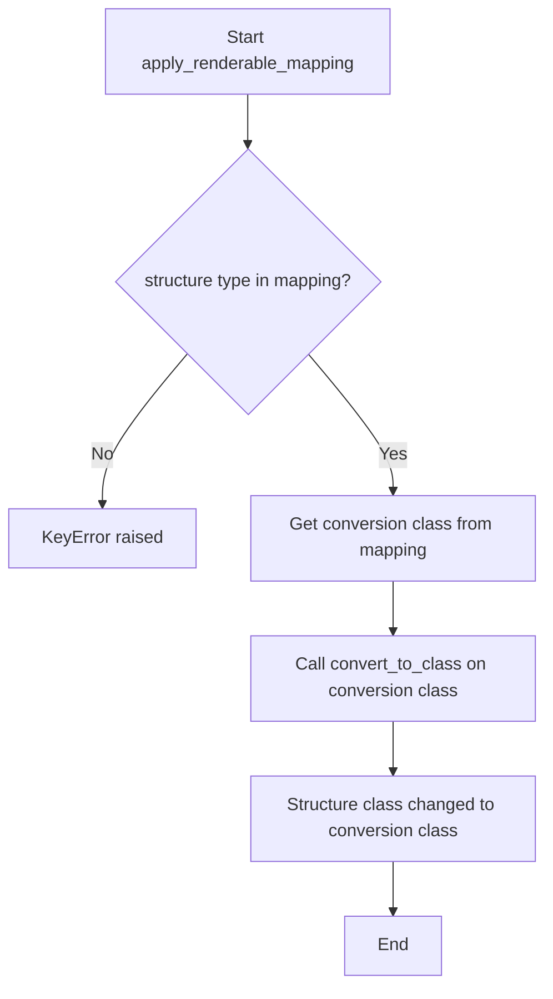
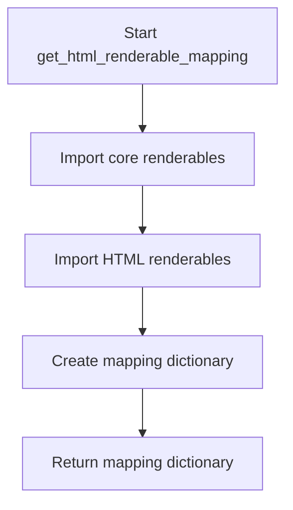
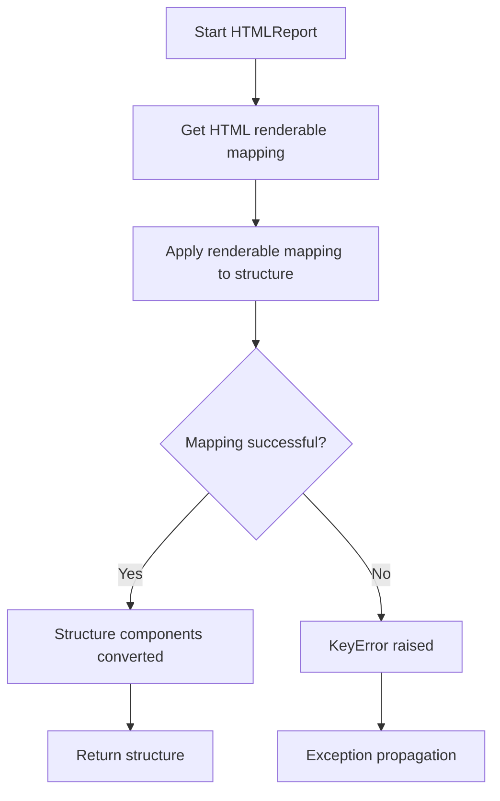
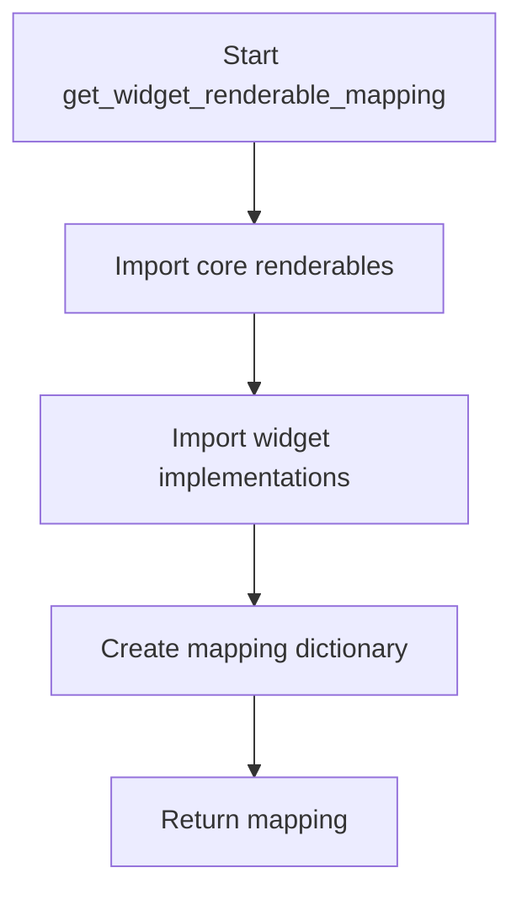
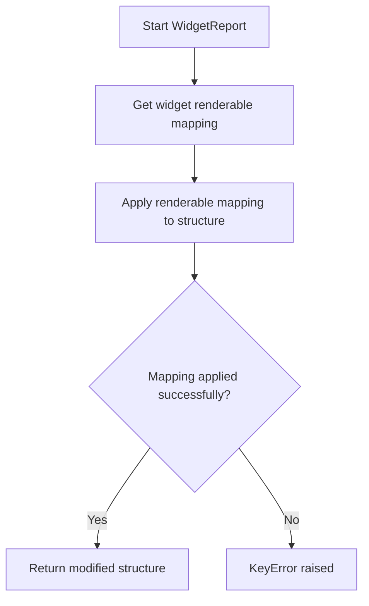

# `flavours.py`

## `src.ydata_profiling.report.presentation.flavours.flavours.apply_renderable_mapping` · *function*

## Summary:
Applies a renderable type mapping to convert a structure into a specific flavor class.

## Description:
This function serves as a dispatcher that uses a type mapping dictionary to find the appropriate conversion class for a given renderable structure and applies the conversion to a specified flavor. It enables polymorphic conversion of renderable objects across different presentation flavors (e.g., HTML, Widget). The function leverages the `convert_to_class` method of the mapped conversion class to perform the actual type conversion, effectively changing the runtime type of the structure object.

## Args:
    mapping (Dict[Type[Renderable], Type[Renderable]]): A dictionary mapping renderable types to their corresponding conversion classes. Each key is a Renderable subclass type (like Variable, Table, etc.), and each value is the corresponding conversion class (like HTMLVariable, HTMLTable, etc.) that implements the `convert_to_class` method. The mapping must contain an entry for the type of the structure parameter.
    structure (Renderable): The renderable object to be converted. This object's type determines which conversion class from the mapping will be used. The structure must be an instance of Renderable or one of its subclasses.
    flavour (Callable): A callable that specifies the target flavor for conversion. This is passed as the `flv` parameter to the `convert_to_class` method of the selected conversion class. The flavour parameter is typically a function that handles presentation-specific transformations or processing.

## Returns:
    None: This function modifies the structure in-place and does not return a value. The structure object's class is changed to the corresponding conversion class from the mapping.

## Raises:
    KeyError: If the type of the structure is not found in the mapping dictionary. This occurs when the structure's class is not a key in the mapping dictionary, indicating that no conversion class is defined for that particular renderable type.

## Constraints:
    Preconditions:
        - The mapping dictionary must contain an entry for the type of the structure.
        - The structure must be an instance of Renderable or a subclass thereof.
        - The flavour must be a callable that accepts the structure and flavour arguments.
    Postconditions:
        - The structure is modified in-place according to the conversion logic of the mapped class.
        - The structure's class type will be changed to the corresponding conversion class from the mapping.
        - The structure retains all its content and attributes but behaves according to the new class's implementation.

## Side Effects:
    - Modifies the structure object in-place by changing its class type through the `convert_to_class` method.
    - No external I/O operations or state mutations beyond the structure modification.
    - The `flv` callable parameter may have side effects if it performs operations beyond simple transformations.

## Control Flow:


## Examples:
    # Example usage with a hypothetical mapping
    mapping = {Variable: HTMLVariable, Table: HTMLTable}
    structure = Variable(content={"name": "test_var"})
    def html_flavour(obj):
        # Flavor-specific processing
        return obj
        
    apply_renderable_mapping(mapping, structure, html_flavour)
    # structure is now an HTMLVariable instance with the same content
    
    # Example with actual ydata-profiling classes
    from ydata_profiling.report.presentation.flavours.html import HTMLVariable, HTMLTable
    from ydata_profiling.report.presentation.core import Variable, Table
    
    mapping = {
        Variable: HTMLVariable,
        Table: HTMLTable
    }
    structure = Variable(content={"name": "test_var", "anchor_id": "var_1"})
    def html_flavour(obj):
        # Apply HTML-specific transformations
        return obj
        
    apply_renderable_mapping(mapping, structure, html_flavour)
    # structure is now an HTMLVariable instance with HTML-specific behavior
```

## `src.ydata_profiling.report.presentation.flavours.flavours.get_html_renderable_mapping` · *function*

## Summary:
Creates a mapping between core renderable types and their HTML presentation counterparts.

## Description:
This function establishes a type mapping that associates abstract renderable classes from the core presentation layer with their concrete HTML implementations. It serves as a central registry for HTML rendering transformations, enabling the presentation layer to dynamically select appropriate HTML components based on the type of renderable object being processed.

The function is extracted into its own component to enforce a clear separation between the definition of renderable types and their HTML presentation implementations, promoting modularity and maintainability of the presentation layer architecture.

## Args:
    None

## Returns:
    Dict[Type[Renderable], Type[Renderable]]: A dictionary mapping core renderable types to their corresponding HTML renderable types. Each key-value pair represents a type relationship where the key is a core renderable class and the value is its HTML presentation equivalent.

## Raises:
    None

## Constraints:
    Preconditions:
    - All referenced renderable types must be properly imported and defined in the respective modules
    - The mapping must be exhaustive for all supported renderable types in the HTML flavour
    
    Postconditions:
    - The returned dictionary contains exactly one entry for each supported renderable type
    - All mapped types must be valid subclasses of Renderable

## Side Effects:
    None

## Control Flow:


## Examples:
```python
# Typical usage in HTML presentation pipeline
mapping = get_html_renderable_mapping()
html_container_class = mapping[Container]  # Returns HTMLContainer
```

## `src.ydata_profiling.report.presentation.flavours.flavours.HTMLReport` · *function*

## Summary:
Converts a report structure into HTML-renderable components by applying a type mapping to transform core renderable objects into their HTML equivalents.

## Description:
The HTMLReport function serves as the primary entry point for converting a report structure into HTML presentation format. It orchestrates the transformation process by retrieving the HTML renderable mapping and applying it to the provided structure. This function enables the ydata-profiling system to dynamically convert abstract report components into their HTML-specific implementations, facilitating the generation of web-based profiling reports.

The function is extracted into its own component to encapsulate the HTML conversion logic and enforce a clear separation between the report structure definition and its presentation layer. This design promotes modularity and allows for easy extension to support additional presentation flavours in the future.

## Args:
    structure (Root): The root renderable object representing the complete report structure that needs to be converted to HTML format. This object contains all report components and their hierarchical relationships.

## Returns:
    Root: The same structure object, but with its internal renderable components converted to their HTML-specific implementations. The structure itself remains unchanged, but its constituent parts are transformed to HTML renderable types.

## Raises:
    KeyError: If any component within the structure is not found in the HTML renderable mapping dictionary. This occurs when a renderable type in the structure does not have a corresponding HTML implementation defined in the mapping.

## Constraints:
    Preconditions:
        - The structure parameter must be a valid Root instance containing a proper report hierarchy
        - All renderable components within the structure must have corresponding HTML implementations in the mapping
    Postconditions:
        - The structure object is modified in-place with its components converted to HTML renderable types
        - The returned structure maintains the same hierarchical relationships as the input
        - All components that have HTML equivalents are successfully converted

## Side Effects:
    - Modifies the input structure object in-place by changing the class types of its constituent renderable components
    - No external I/O operations or state mutations beyond the structure modification
    - The conversion process relies on the global HTML renderable mapping which is accessed but not modified

## Control Flow:


## Examples:
    # Basic usage in report generation pipeline
    from ydata_profiling.report.presentation.flavours.flavours import HTMLReport
    from ydata_profiling.report.presentation.core import Root
    
    # Create a report structure
    report_structure = Root(...)
    
    # Convert to HTML-ready structure
    html_ready_structure = HTMLReport(report_structure)
    
    # The structure now contains HTML-specific renderable components
    # which can be rendered to produce HTML output

## `src.ydata_profiling.report.presentation.flavours.flavours.get_widget_renderable_mapping` · *function*

## Summary:
Returns a mapping between core renderable types and their widget-based implementations.

## Description:
This function creates and returns a dictionary that maps core renderable classes to their corresponding widget flavour implementations. It serves as a central registry for renderable type translations in the widget presentation flavour.

The function is extracted into its own component to enforce a clear separation between the definition of renderable types and their presentation implementations, making the codebase more maintainable and extensible.

## Args:
    None

## Returns:
    Dict[Type[Renderable], Type[Renderable]]: A dictionary mapping core renderable types to their widget implementations where keys are core renderable classes and values are their corresponding widget renderable classes.

## Raises:
    None

## Constraints:
    Preconditions:
    - All referenced core renderable classes must be imported and defined
    - All widget implementations must be imported and available
    - The mapping must maintain type consistency between core and widget implementations
    
    Postconditions:
    - The returned dictionary contains exactly 13 key-value pairs
    - All keys are core renderable types
    - All values are widget renderable types
    - Each key-value pair represents a valid type relationship

## Side Effects:
    None

## Control Flow:


## Examples:
```python
# Typical usage in widget presentation context
mapping = get_widget_renderable_mapping()
widget_class = mapping[Container]  # Returns WidgetContainer
```

## `src.ydata_profiling.report.presentation.flavours.flavours.WidgetReport` · *function*

## Summary:
Converts a report structure into widget-based renderable components by applying a mapping of core renderable types to their widget implementations.

## Description:
The WidgetReport function serves as the entry point for converting a report structure into widget-based presentation components. It retrieves the predefined mapping between core renderable types and their widget implementations, then applies this mapping to transform the entire structure in-place. This function is part of the widget-based presentation flavour in ydata-profiling, enabling interactive report generation in Jupyter notebook environments.

The function is extracted into its own component to encapsulate the logic for applying widget-specific renderable mappings, enforcing a clear separation between the mapping definition and its application. This design promotes reusability and maintainability by centralizing the mapping application logic.

## Args:
    structure (Root): The root renderable structure to be converted to widget-based components. This parameter represents the complete report structure that needs transformation into widget-compatible renderable objects.

## Returns:
    Root: The same structure object, now modified in-place to contain widget-based renderable components. The structure's type hierarchy has been updated to reflect the widget implementations through the mapping application.

## Raises:
    KeyError: If any renderable type in the structure is not found in the widget renderable mapping. This occurs when a structure contains renderable types that don't have corresponding widget implementations defined in the mapping.

## Constraints:
    Preconditions:
        - The structure parameter must be a valid Root instance or subclass
        - The get_widget_renderable_mapping() function must return a complete mapping dictionary
        - All renderable types in the structure must have corresponding entries in the mapping
    Postconditions:
        - The structure object is modified in-place to contain widget-based renderable components
        - All renderable types in the structure are converted to their widget counterparts
        - The structure maintains its semantic meaning while gaining widget-specific behavior

## Side Effects:
    - Modifies the structure object in-place by changing the class types of its renderable components
    - No external I/O operations or state mutations beyond the structure modification
    - The apply_renderable_mapping function may have side effects if the flavour callable performs operations beyond simple transformations

## Control Flow:


## Examples:
    # Basic usage in widget-based report generation
    from ydata_profiling.report.presentation.flavours.flavours import WidgetReport
    from ydata_profiling.report.presentation.core import Root
    
    # Create a report structure
    structure = Root(body=..., footer=..., style=...)
    
    # Convert to widget-based components
    widget_structure = WidgetReport(structure)
    
    # The structure is now composed of widget renderable components
    # ready for Jupyter notebook display

