# `src.ydata_profiling.report.presentation.flavours.html`

## Tree:
    - Directory/file hierarchy of this module (indented tree format)

```
html/
├── alerts.py
├── collapse.py
├── container.py
├── correlation_table.py
├── dropdown.py
├── duplicate.py
├── frequency_table.py
├── frequency_table_small.py
├── html.py
├── image.py
├── root.py
├── sample.py
├── table.py
├── templates.py
├── toggle_button.py
├── variable.py
└── variable_info.py
```

## Role:
    - Single-responsibility description: the one thing this module owns

This module owns the HTML-specific rendering implementations for report components, providing concrete classes that transform abstract report structures into HTML markup using Jinja2 templating.

## Description:
    - Describe where and when this module is used within the repo : List the primary consumers (other modules or entry points that import it)
    - Explain why these components are grouped into a separate module : Describe the cohesion principle (shared concept, layer boundary, etc.)

This module is used by the report generation pipeline when HTML output is requested. It provides concrete implementations of abstract presentation classes that are part of the ydata-profiling framework. The components are grouped together because they all implement the same conceptual interfaces but provide HTML-specific rendering behavior, creating a clean separation between abstract report structure definitions and their concrete HTML presentation implementations.

## Components:
    - List all public classes, functions, and constants with their signatures
    - For each: *one-line* role description
    - Mermaid dependency graph showing relationships among internal components

### Public Classes:

1. `HTMLAlerts` - Renders data quality alerts as HTML elements
2. `HTMLCollapse` - Renders collapsible UI components as HTML
3. `HTMLContainer` - Renders structured content sequences as HTML
4. `HTMLCorrelationTable` - Renders correlation matrices as styled HTML tables
5. `HTMLDropdown` - Renders interactive dropdown menus as HTML
6. `HTMLDuplicate` - Renders duplicate data findings as HTML tables
7. `HTMLFrequencyTable` - Renders frequency table data as HTML markup
8. `HTMLFrequencyTableSmall` - Renders small categorical frequency data as HTML
9. `HTMLHTML` - Renders raw HTML content directly
10. `HTMLImage` - Renders image components as HTML markup
11. `HTMLRoot` - Renders complete HTML reports with navigation
12. `HTMLSample` - Renders data samples as Bootstrap-styled HTML tables
13. `HTMLTable` - Renders tabular data as HTML markup
14. `HTMLToggleButton` - Renders toggle button components as HTML
15. `HTMLVariable` - Renders variable report content as HTML
16. `HTMLVariableInfo` - Renders variable metadata as HTML

### Mermaid Dependency Graph:

```mermaid
graph TD
    A[HTMLAlerts] --> B[Alerts]
    A --> C[templates.template]
    B --> D[Renderable]
    
    A[HTMLCollapse] --> E[Collapse]
    A --> C
    
    A[HTMLContainer] --> F[Container]
    A --> C
    
    A[HTMLCorrelationTable] --> G[CorrelationTable]
    A --> C
    
    A[HTMLDropdown] --> H[Dropdown]
    A --> C
    
    A[HTMLDuplicate] --> I[Duplicate]
    A --> C
    
    A[HTMLFrequencyTable] --> J[FrequencyTable]
    A --> C
    
    A[HTMLFrequencyTableSmall] --> K[FrequencyTableSmall]
    A --> C
    
    A[HTMLHTML] --> L[HTML]
    A --> C
    
    A[HTMLImage] --> M[Image]
    A --> C
    
    A[HTMLRoot] --> N[Root]
    A --> C
    
    A[HTMLSample] --> O[Sample]
    A --> C
    
    A[HTMLTable] --> P[Table]
    A --> C
    
    A[HTMLToggleButton] --> Q[ToggleButton]
    A --> C
    
    A[HTMLVariable] --> R[Variable]
    A --> C
    
    A[HTMLVariableInfo] --> S[VariableInfo]
    A --> C
    
    T[templates] --> U[Jinja2 Environment]
```



## Public API:
    - The interfaces this module exposes to the rest of the repository
    - For each public symbol: signature, brief description, usage note

### Public Classes:
1. `HTMLAlerts(content: dict, styles: dict)` - Renders alerts as HTML
   - Usage: Called during report generation when HTML alerts are needed
2. `HTMLCollapse(button: ToggleButton, item: Renderable, **kwargs)` - Renders collapsible sections as HTML
   - Usage: Used in report generation for interactive content sections
3. `HTMLContainer(items: Sequence[Renderable], sequence_type: str, **kwargs)` - Renders structured content as HTML
   - Usage: Core component for organizing report sections in HTML format
4. `HTMLCorrelationTable(name: str, correlation_matrix: pd.DataFrame, **kwargs)` - Renders correlation matrices as HTML tables
   - Usage: Used in statistical analysis sections of reports
5. `HTMLDropdown(name: str, id: str, items: list, item: Container, **kwargs)` - Renders dropdown menus as HTML
   - Usage: For interactive filtering or navigation in reports
6. `HTMLDuplicate(name: str, duplicate: pd.DataFrame, **kwargs)` - Renders duplicate data findings as HTML
   - Usage: Displayed in data quality sections of reports
7. `HTMLFrequencyTable(rows: list, redact: bool, **kwargs)` - Renders frequency tables as HTML
   - Usage: Used for categorical data analysis in reports
8. `HTMLFrequencyTableSmall(rows: list, redact: bool, **kwargs)` - Renders small frequency tables as HTML
   - Usage: For compact categorical displays in reports
9. `HTMLHTML(html: str, **kwargs)` - Renders raw HTML content directly
   - Usage: Embedding pre-formatted HTML snippets in reports
10. `HTMLImage(image: str, image_format: ImageType, alt: str, caption: str = None, **kwargs)` - Renders images as HTML
    - Usage: For charts, diagrams, and visualizations in reports
11. `HTMLRoot(name: str, body: Renderable, footer: Renderable, style: Style, **kwargs)` - Renders complete HTML reports
    - Usage: Top-level component for entire HTML report generation
12. `HTMLSample(name: str, sample: pd.DataFrame, caption: str = None, **kwargs)` - Renders data samples as HTML tables
    - Usage: For displaying sample datasets in reports
13. `HTMLTable(rows: list, style: Style, **kwargs)` - Renders tables as HTML
    - Usage: Generic table rendering for structured data in reports
14. `HTMLToggleButton(text: str, **kwargs)` - Renders toggle buttons as HTML
    - Usage: For interactive expand/collapse functionality in reports
15. `HTMLVariable(top: Renderable, bottom: Renderable = None, ignore: bool = False, **kwargs)` - Renders variable information as HTML
    - Usage: For detailed variable analysis sections in reports
16. `HTMLVariableInfo(anchor_id: str, var_name: str, var_type: str, alerts: list, description: str, style: Style, **kwargs)` - Renders variable metadata as HTML
    - Usage: Displays metadata about individual variables in reports

## Dependencies:
    - Internal imports (other repo modules) and their purpose
    - External imports (third-party libraries) and why they are needed

### Internal Imports:
- `from ...presentation.core.renderable import Renderable` - Base class for all presentation components
- `from ...presentation.core.alerts import Alerts` - Abstract base for alert rendering
- `from ...presentation.core.collapse import Collapse` - Abstract base for collapsible components
- `from ...presentation.core.container import Container` - Abstract base for container components
- `from ...presentation.core.correlation_table import CorrelationTable` - Abstract base for correlation tables
- `from ...presentation.core.dropdown import Dropdown` - Abstract base for dropdown components
- `from ...presentation.core.duplicate import Duplicate` - Abstract base for duplicate detection
- `from ...presentation.core.frequency_table import FrequencyTable` - Abstract base for frequency tables
- `from ...presentation.core.frequency_table_small import FrequencyTableSmall` - Abstract base for small frequency tables
- `from ...presentation.core.html import HTML` - Abstract base for HTML content
- `from ...presentation.core.image import Image` - Abstract base for image components
- `from ...presentation.core.root import Root` - Abstract base for report root components
- `from ...presentation.core.sample import Sample` - Abstract base for sample components
- `from ...presentation.core.table import Table` - Abstract base for table components
- `from ...presentation.core.toggle_button import ToggleButton` - Abstract base for toggle buttons
- `from ...presentation.core.variable import Variable` - Abstract base for variable components
- `from ...presentation.core.variable_info import VariableInfo` - Abstract base for variable metadata
- `from ...presentation.flavours.html.templates import template` - Template rendering utility
- `from ...presentation.flavours.html.duplicate import to_html` - Utility for duplicate table formatting

### External Imports:
- `import pandas as pd` - For handling DataFrame operations in frequency tables and correlation matrices
- `from jinja2 import TemplateNotFound` - For handling missing template errors gracefully
- `from pathlib import Path` - For file path operations in asset creation
- `import shutil` - For directory operations in asset creation

## Constraints:
    - Constraints callers must respect when using this module
    - Thread-safety, ordering requirements, initialization prerequisites

### Usage Constraints:
- All HTML components must be instantiated with valid content dictionaries that match their expected schema
- Templates must be available in the Jinja2 environment for rendering to succeed
- Components requiring pandas DataFrames must receive valid DataFrame objects
- The global `jinja2_env` must be properly initialized before using any HTML components
- All components inherit from abstract base classes that define required interfaces

### Thread Safety:
- The HTML components themselves are stateless and thread-safe for rendering operations
- The global Jinja2 environment should be thread-safe if accessed concurrently
- File system operations in asset creation are not thread-safe and should be serialized

### Initialization Prerequisites:
- The Jinja2 template environment must be initialized before any HTML components are instantiated
- Required template files must exist in the template directory
- Configuration settings for assets and styling must be properly set before asset creation

---

## Files

- [`alerts.py`](html/alerts.md)
- [`collapse.py`](html/collapse.md)
- [`container.py`](html/container.md)
- [`correlation_table.py`](html/correlation_table.md)
- [`dropdown.py`](html/dropdown.md)
- [`duplicate.py`](html/duplicate.md)
- [`frequency_table.py`](html/frequency_table.md)
- [`frequency_table_small.py`](html/frequency_table_small.md)
- [`html.py`](html/html.md)
- [`image.py`](html/image.md)
- [`root.py`](html/root.md)
- [`sample.py`](html/sample.md)
- [`table.py`](html/table.md)
- [`templates.py`](html/templates.md)
- [`toggle_button.py`](html/toggle_button.md)
- [`variable.py`](html/variable.md)
- [`variable_info.py`](html/variable_info.md)

