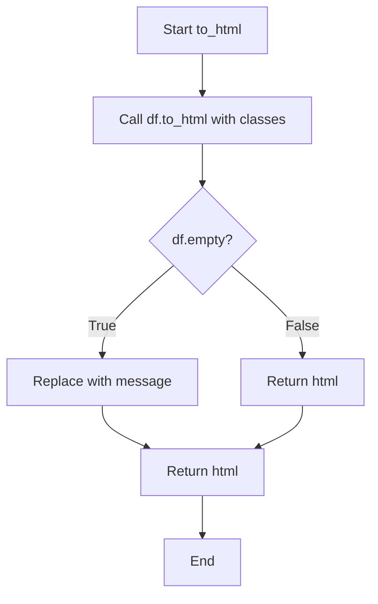

# `duplicate.py`

## `src.ydata_profiling.report.presentation.flavours.html.duplicate.to_html` · *function*

## Summary:
Converts a DataFrame containing duplicate row information into an HTML table representation with appropriate styling and empty dataset handling.

## Description:
This function takes a pandas DataFrame that contains duplicate row information and transforms it into an HTML table with Bootstrap-compatible CSS classes. It specifically handles the edge case where the DataFrame is empty by inserting a descriptive message in the table body. This function is part of the HTML presentation layer for generating profiling reports that display duplicate row information.

## Args:
    df (pandas.DataFrame): A pandas DataFrame containing duplicate row information. The DataFrame may be empty.

## Returns:
    str: An HTML string representing the formatted table with Bootstrap classes and appropriate handling for empty DataFrames.

## Raises:
    None explicitly raised.

## Constraints:
    Preconditions:
        - The input must be a valid pandas DataFrame object
        - The DataFrame should contain the expected structure for duplicate row reporting
    
    Postconditions:
        - The returned string is valid HTML containing a properly formatted table
        - Empty DataFrames are handled with a descriptive message in the table body

## Side Effects:
    None.

## Control Flow:


## Examples:
```python
import pandas as pd

# Example with duplicate data
df_with_duplicates = pd.DataFrame({
    'A': [1, 2, 3],
    'B': [4, 5, 6]
})
html_output = to_html(df_with_duplicates)
# Returns HTML table with Bootstrap classes

# Example with empty DataFrame
empty_df = pd.DataFrame()
html_output = to_html(empty_df)
# Returns HTML table with message about no duplicates
```

## `src.ydata_profiling.report.presentation.flavours.html.duplicate.HTMLDuplicate` · *class*

## Summary:
HTMLDuplicate is a concrete implementation that renders duplicate data findings as an HTML template with styled table output.

## Description:
This class extends the abstract Duplicate base class to provide HTML-specific rendering capabilities for duplicate data detection results. It implements the render() method to transform duplicate data into a properly formatted HTML table embedded within a complete HTML template structure. The class serves as a specialized UI component for displaying duplicate records in HTML-based profiling reports.

The HTMLDuplicate class is typically instantiated by the profiling framework when generating HTML reports that include duplicate data visualization. It leverages existing utility functions and template systems to ensure consistent presentation of duplicate findings across different report generations.

## State:
- Inherits all state from Duplicate parent class including:
  - item_type: str, set to "duplicate"
  - content: dict, containing duplicate data under key "duplicate" and optional metadata
  - name: str, optional identifier
  - anchor_id: str, optional anchor identifier
  - classes: str, optional CSS classes

## Lifecycle:
- Creation: Instantiated with a name string and a pandas DataFrame containing duplicate records, inheriting from Duplicate base class
- Usage: Called during HTML report generation when duplicate data needs to be rendered to HTML format
- Destruction: Relies on Python garbage collection; no explicit cleanup required

## Method Map:
```mermaid
flowchart TD
    A[HTMLDuplicate.render] --> B[to_html(self.content["duplicate"])]
    B --> C[templates.template("duplicate.html").render()]
    C --> D[Return complete HTML string]
```

## Raises:
- None explicitly raised by this implementation
- Inherited NotImplementedError from parent class Duplicate if not properly subclassed

## Example:
```python
import pandas as pd
from ydata_profiling.report.presentation.flavours.html.duplicate import HTMLDuplicate

# Create duplicate data
duplicate_df = pd.DataFrame({'A': [1, 2, 2], 'B': [3, 4, 4]})

# Create HTMLDuplicate instance
duplicate_component = HTMLDuplicate(name="my_duplicates", duplicate=duplicate_df)

# Render to HTML (typically called internally by report generation)
html_output = duplicate_component.render()
# Returns complete HTML string with formatted duplicate data
```

### `src.ydata_profiling.report.presentation.flavours.html.duplicate.HTMLDuplicate.render` · *method*

## Summary:
Renders duplicate data findings as an HTML template with styled table output.

## Description:
This method generates an HTML representation of duplicate data findings by converting the duplicate DataFrame into a styled HTML table and embedding it within a predefined HTML template. It serves as the concrete implementation for rendering duplicate data in HTML presentations.

The method is called during the HTML report generation phase when duplicate data needs to be displayed to users. It leverages the `to_html` utility function to format the duplicate DataFrame and then uses Jinja2 templating to incorporate this formatted content into a complete HTML page structure.

## Args:
    None explicitly taken, but accesses self.content

## Returns:
    str: A complete HTML string containing the formatted duplicate data within a template structure

## Raises:
    None explicitly raised by this method

## State Changes:
    Attributes READ: self.content
    Attributes WRITTEN: None

## Constraints:
    Preconditions:
        - self.content must contain a key "duplicate" with a valid pandas DataFrame
        - The HTML template "duplicate.html" must exist in the templates directory
        - The jinja2 environment must be properly configured
    
    Postconditions:
        - Returns a valid HTML string with proper formatting
        - The duplicate data is embedded within the template structure

## Side Effects:
    None

