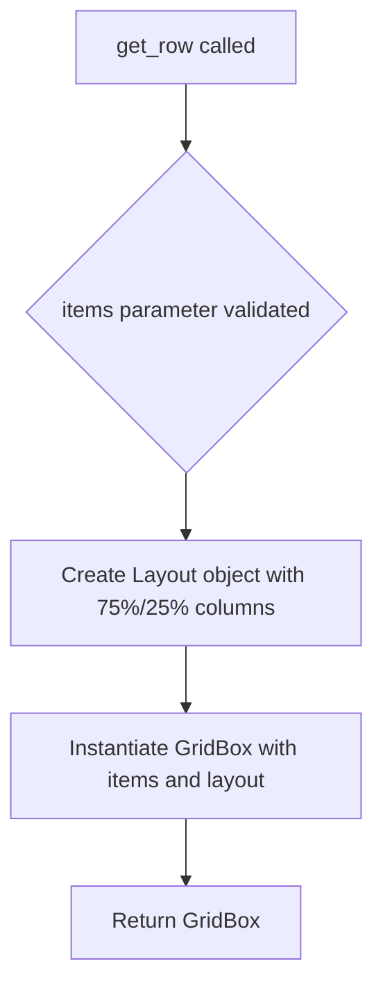

# `alerts.py`

## `src.ydata_profiling.report.presentation.flavours.widget.alerts.get_row` · *function*

## Summary:
Creates a grid layout widget with a 75%/25% column split for displaying alert information.

## Description:
This function constructs a GridBox widget with a predefined layout that splits the available horizontal space into two columns (75% and 25% width). It's designed to display alert information in a structured format where the primary content takes up 75% of the width and a secondary control or indicator takes up 25%.

The function is part of the widget-based presentation layer for report generation, specifically for displaying alerts in a structured grid layout. It encapsulates the layout configuration to ensure consistent presentation of alert rows throughout the application.

## Args:
    items (List[widgets.Widget]): A list of ipywidgets.Widget objects to be arranged in the grid. While the function accepts any number of widgets, it's intended for exactly two widgets to properly utilize the 75%/25% column split.

## Returns:
    widgets.GridBox: A GridBox widget instance configured with a 100% width and 75%/25% grid template columns layout, containing the provided widgets.

## Raises:
    None explicitly raised. However, the function will propagate any exceptions from widgets.GridBox constructor if invalid arguments are passed.

## Constraints:
    Preconditions:
    - The items parameter must be a list of ipywidgets.Widget objects
    - The list should ideally contain exactly two widgets to make full use of the 75%/25% layout
    
    Postconditions:
    - The returned GridBox will have a fixed width of 100%
    - The grid template columns will be set to "75% 25%"
    - All provided widgets will be contained within the GridBox

## Side Effects:
    None

## Control Flow:


## Examples:
```python
from ipywidgets import HTML, Button
from ydata_profiling.report.presentation.flavours.widget.alerts import get_row

# Create widgets for alert row
alert_text = HTML(value="<p>Warning: Missing values detected</p>")
action_button = Button(description="Details")

# Create alert row with 75%/25% layout
row = get_row([alert_text, action_button])

# The function works with any number of widgets, but 2 widgets
# are recommended for proper 75%/25% column layout
simple_row = get_row([HTML(value="<p>Simple alert</p>")])
```

## `src.ydata_profiling.report.presentation.flavours.widget.alerts.WidgetAlerts` · *class*

## Summary:
WidgetAlerts is a presentation layer component that renders data quality alerts using ipywidgets for display in interactive environments.

## Description:
WidgetAlerts is a specialized renderer that transforms alert data into a visual grid layout using ipywidgets. It extends the base Alerts class to provide a widget-based implementation for displaying data quality issues in interactive notebook environments. This component is responsible for creating a structured visual representation of alerts where each alert consists of descriptive HTML content paired with styled buttons.

The class is designed to work within the widget-based presentation layer of the ydata-profiling system, specifically for Jupyter notebook environments where interactive widgets are supported. It processes alert data from the parent Alerts class and converts it into a GridBox layout with a 75%/25% column split.

## State:
- Inherits all state from Alerts parent class including alerts collection and style configuration
- content: dict - Contains the alerts data under the "alerts" key, accessed via self.content["alerts"]
- styles: dict - Maps alert type names to CSS button styles ("warning", "danger", "info", or empty string)
- items: list - Temporary storage for widget objects during rendering process

## Lifecycle:
- Creation: Instantiated with alert data and style configuration through parent class constructor
- Usage: Called during report generation when widget-based alerts need to be displayed
- Destruction: Managed by Python's garbage collection; no explicit cleanup required

## Method Map:
```mermaid
graph TD
    A[WidgetAlerts.render] --> B[Iterate over self.content["alerts"]]
    B --> C{alert_type != "rejected"}
    C -->|True| D[Create HTML widget from template]
    D --> E[Create styled Button widget]
    E --> F[Append both widgets to items list]
    F --> G[Call get_row(items)]
    G --> H[Return widgets.GridBox]
    C -->|False| I[Skip rejected alerts]
```

## Raises:
- No explicit exceptions raised by WidgetAlerts.__init__
- May raise exceptions from underlying ipywidgets operations during widget creation or GridBox construction
- May raise exceptions from template rendering if alert templates are malformed

## Example:
```python
# Create alerts data
from ydata_profiling.model.alerts import Alert, AlertType
from ydata_profiling.report.presentation.core import Alerts

# Create sample alerts
alerts_data = [
    Alert(alert_type=AlertType.MISSING, column_name="age"),
    Alert(alert_type=AlertType.HIGH_CARDINALITY, column_name="id")
]

# Create WidgetAlerts instance (typically done internally by framework)
widget_alerts = WidgetAlerts(alerts_data)

# Render to get ipywidgets GridBox
grid_widget = widget_alerts.render()

# The resulting widget can be displayed in Jupyter notebooks
display(grid_widget)
```

### `src.ydata_profiling.report.presentation.flavours.widget.alerts.WidgetAlerts.render` · *method*

## Summary:
Renders alert information as a grid of HTML content and styled buttons in a widget-based interface.

## Description:
Transforms alert data into a visual representation using ipywidgets GridBox layout. This method processes each alert in the content's alerts collection, creating pairs of HTML content widgets and styled buttons for display. The rendering follows a 75%/25% column layout pattern established by the get_row helper function.

The method filters out "rejected" alerts and maps alert types to specific CSS styles for visual distinction. It leverages HTML templates for content rendering and creates styled buttons that provide quick identification of alert types.

## Args:
    None explicitly taken as parameters (uses self)

## Returns:
    widgets.GridBox: A grid layout containing pairs of HTML content widgets and styled buttons for each alert

## Raises:
    KeyError: If self.content["alerts"] is missing or not iterable
    AttributeError: If alert.alert_type or alert.alert_type.name is missing
    Exception: Propagated from templates.template().render() if template rendering fails

## State Changes:
    Attributes READ: self.content["alerts"]
    Attributes WRITTEN: None

## Constraints:
    Preconditions:
    - self.content must contain a key "alerts" with iterable alert objects
    - Each alert must have an alert_type attribute with a name property
    - Alert types must be defined in the styles dictionary or be "rejected"
    
    Postconditions:
    - Returns a valid widgets.GridBox instance
    - All non-rejected alerts are processed into widget pairs
    - Buttons are created with appropriate styling based on alert type

## Side Effects:
    - Creates HTML widgets by rendering templates
    - Creates Button widgets with specific styling
    - Calls external get_row function to create grid layout
    - May raise exceptions from template rendering or widget creation

