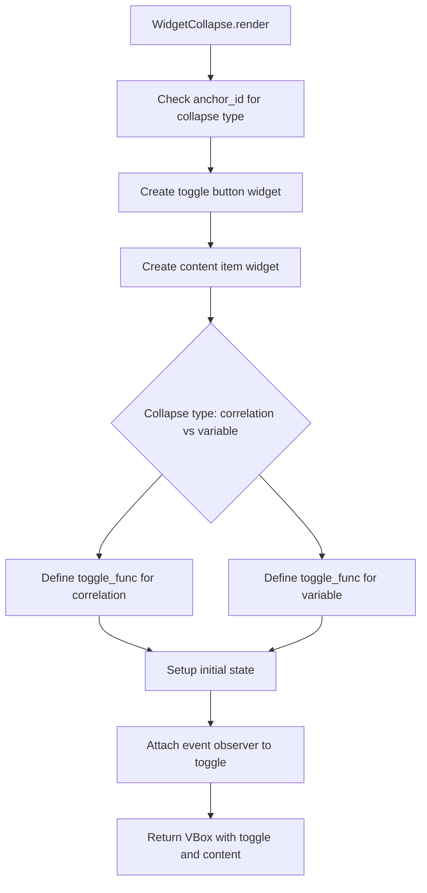

# `collapse.py`

## `src.ydata_profiling.report.presentation.flavours.widget.collapse.WidgetCollapse` · *class*

## Summary:
WidgetCollapse is a concrete implementation of the Collapse class that renders collapsible UI elements using ipywidgets for interactive report sections.

## Description:
WidgetCollapse provides a concrete implementation of the abstract Collapse class specifically designed for rendering collapsible sections in Jupyter notebook environments using ipywidgets. This component creates interactive toggle buttons that control the visibility of associated content sections, enabling users to expand or collapse report elements dynamically.

The class distinguishes between two types of collapsible content: correlation and variable sections, applying different styling behaviors to the content items based on their type. It leverages the ipywidgets library to create interactive UI components with event-driven behavior.

## State:
- Inherits all state from Collapse parent class including:
  - button: ToggleButton instance that controls the collapse/expand state
  - item: Renderable instance containing the content to be shown/hidden
  - item_type: String identifier set to "collapse" by constructor
  - content: Dictionary containing the button and item
  - name: Optional string identifier
  - anchor_id: Optional string for HTML anchors
  - classes: Optional CSS classes

## Lifecycle:
- Creation: Instantiate with a ToggleButton and Renderable item; optional name, anchor_id, and classes parameters
- Usage: Call render() method to generate ipywidgets VBox container with toggle functionality
- Destruction: No explicit cleanup required; relies on Python garbage collection

## Method Map:


## Raises:
- No explicit exceptions raised by __init__
- May raise exceptions from underlying ipywidgets operations during render() execution

## Example:
```python
from ipywidgets import widgets
from ydata_profiling.report.presentation.core import ToggleButton
from ydata_profiling.report.presentation.flavours.widget.collapse import WidgetCollapse

# Create a toggle button
toggle = ToggleButton(text="Show Details")

# Create content to be toggled (could be any Renderable item)
content = Text("This is hidden content")

# Create collapse component
collapse = WidgetCollapse(toggle, content)

# Render the collapsible widget
widget_container = collapse.render()
```

### `src.ydata_profiling.report.presentation.flavours.widget.collapse.WidgetCollapse.render` · *method*

## Summary:
Renders a collapsible widget interface with toggle functionality for correlation or variable content sections.

## Description:
This method generates a visual collapsible interface using ipywidgets, where a toggle button controls the visibility of associated content. The rendering logic differs based on whether the collapse is for correlation or variable content, applying different styling behaviors to the content items. The method sets up event observation for the toggle button to dynamically update content visibility.

The method determines the collapse type by checking the anchor_id of the button content, then creates appropriate toggle functions that modify layout properties of child widgets when the toggle state changes. This allows for different visual behaviors between correlation and variable content sections.

## Args:
    None

## Returns:
    widgets.VBox: A vertical box container containing the toggle button and collapsible content item

## Raises:
    None explicitly raised

## State Changes:
    Attributes READ: self.content
    Attributes WRITTEN: None

## Constraints:
    Preconditions: 
    - self.content must contain both "button" and "item" keys
    - self.content["button"] must have an anchor_id attribute
    - self.content["button"].render() and self.content["item"].render() must return valid widget objects
    Postconditions:
    - The returned VBox contains exactly two children: the toggle button and content item
    - The toggle button observes value changes for dynamic behavior
    - The initial state of the content is hidden (display="none")

## Side Effects:
    - Creates ipywidgets objects (VBox, Box, widgets)
    - Sets up event observers on the toggle button
    - Modifies layout properties of child widgets during runtime

