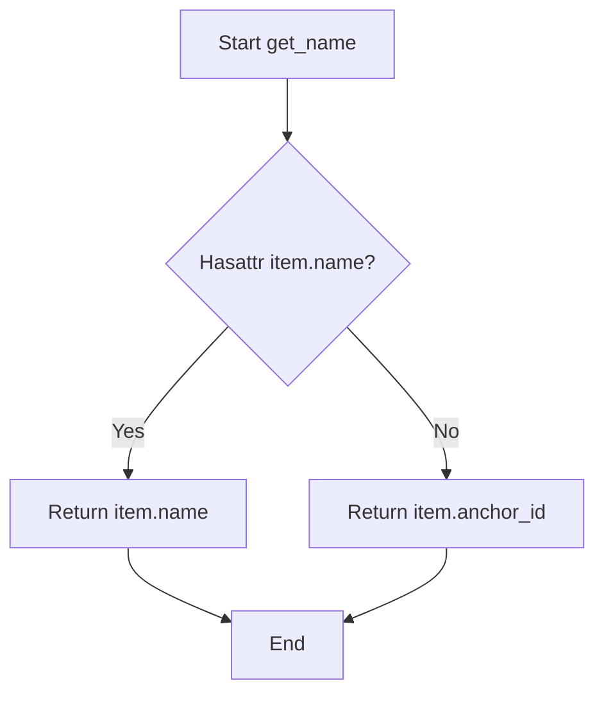

# `container.py`

## `src.ydata_profiling.report.presentation.flavours.widget.container.get_name` · *function*

## Summary:
Extracts a display-friendly identifier from a renderable item, preferring a named attribute over an anchor ID.

## Description:
This utility function retrieves a unique identifier string from renderable objects used in widget-based report presentations. It provides a consistent way to obtain human-readable names for report elements, falling back from a `name` attribute to an `anchor_id` when the former is unavailable. This abstraction simplifies presentation logic by ensuring all renderable items have a reliable identifier for display purposes.

## Args:
    item (Renderable): A renderable object that may have either a `name` or `anchor_id` attribute.

## Returns:
    str: The value of the `name` attribute if it exists, otherwise the value of the `anchor_id` attribute.

## Raises:
    None explicitly raised.

## Constraints:
    Preconditions:
        - The input `item` must be an instance of `Renderable` or a subclass thereof.
        - The `item` must have either a `name` attribute or an `anchor_id` attribute (or both).
    Postconditions:
        - The returned value is always a string.
        - The returned value is guaranteed to be non-empty if the input object has either attribute.

## Side Effects:
    None.

## Control Flow:


## Examples:
    # Example 1: Object with name attribute
    class TestItem(Renderable):
        def __init__(self):
            self.name = "test_item"
            self.anchor_id = "anchor_123"
    
    item = TestItem()
    result = get_name(item)  # Returns "test_item"
    
    # Example 2: Object without name attribute
    class TestItem(Renderable):
        def __init__(self):
            self.anchor_id = "anchor_456"
    
    item = TestItem()
    result = get_name(item)  # Returns "anchor_456"

## `src.ydata_profiling.report.presentation.flavours.widget.container.get_tabs` · *function*

## Summary:
Creates an interactive tab widget from a list of renderable items, mapping each item to a tab with a descriptive title.

## Description:
Transforms a collection of renderable report components into a Jupyter widget tab interface. This function orchestrates the rendering of individual items and assigns appropriate titles to each tab, enabling organized navigation through different sections of a data profiling report in a Jupyter environment.

## Args:
    items (List[Renderable]): A list of renderable objects that support the `.render()` method and have either a `name` or `anchor_id` attribute.

## Returns:
    widgets.Tab: A configured ipywidgets.Tab instance containing rendered children and properly labeled tabs.

## Raises:
    None explicitly raised.

## Constraints:
    Preconditions:
        - The input `items` list must contain only objects that inherit from `Renderable` or implement the required interface.
        - Each item in the list must have a `name` or `anchor_id` attribute for title generation.
    Postconditions:
        - The returned widget has exactly as many tabs as there are items in the input list.
        - All children of the tab widget are the rendered representations of the input items.
        - Each tab title corresponds to the result of calling `get_name()` on the respective item.

## Side Effects:
    None.

## Control Flow:
```mermaid
flowchart TD
    A[Start get_tabs] --> B[Initialize empty lists for children and titles]
    B --> C[Iterate through items]
    C --> D{For each item}
    D --> E[Call item.render() and append to children]
    D --> F[Call get_name(item) and append to titles]
    E --> G
    F --> G
    G --> H[Create widgets.Tab()]
    H --> I[Set tab.children = children]
    I --> J[Set tab titles using enumerate and set_title]
    J --> K[Return tab]
```

## Examples:
    # Basic usage with renderable items
    from ydata_profiling.report.presentation.core.renderable import Renderable
    
    class SampleItem(Renderable):
        def __init__(self, name, anchor_id):
            self.name = name
            self.anchor_id = anchor_id
            
        def render(self):
            return widgets.HTML(f"<p>{self.name}</p>")
    
    items = [
        SampleItem("Overview", "overview"),
        SampleItem("Variables", "variables")
    ]
    
    tab_widget = get_tabs(items)
    # Returns a widgets.Tab with two tabs titled "Overview" and "Variables"
```

## `src.ydata_profiling.report.presentation.flavours.widget.container.get_list` · *function*

## Summary:
Creates a vertical box widget containing rendered renderable items.

## Description:
Transforms a list of renderable objects into a vertically stacked widget container. This function serves as a presentation layer utility that converts abstract renderable items into concrete IPython widgets for display in Jupyter environments.

## Args:
    items (List[Renderable]): A list of renderable objects that support the render() method.

## Returns:
    widgets.VBox: A vertical box widget containing the rendered items as child elements.

## Raises:
    None explicitly raised, though underlying render() calls may raise exceptions.

## Constraints:
    Preconditions:
        - All items in the list must implement the Renderable interface with a valid render() method
        - Items must be compatible with IPython widget rendering
    
    Postconditions:
        - Returns a widgets.VBox instance
        - Each item in the input list is rendered and added as a child to the VBox

## Side Effects:
    None

## Control Flow:
```mermaid
flowchart TD
    A[get_list called with items] --> B[For each item in items, call item.render()]
    B --> C[Create VBox with rendered items list]
    C --> D[Return VBox]
```

## Examples:
```python
# Basic usage
from ydata_profiling.report.presentation.core.renderable import Renderable
from ydata_profiling.report.presentation.flavours.widget.container import get_list
from ipywidgets import widgets

class SampleRenderable(Renderable):
    def render(self):
        return widgets.HTML("Sample content")

items = [SampleRenderable(), SampleRenderable()]
widget_container = get_list(items)
```

## `src.ydata_profiling.report.presentation.flavours.widget.container.get_named_list` · *function*

## Summary:
Creates a vertically stacked widget container with labeled renderable items, displaying each item's name followed by its rendered content.

## Description:
This function generates a vertical box layout containing multiple labeled renderable items. Each item is displayed with its associated name (extracted via the get_name helper function) in bold text, followed by the rendered content of the item itself. This creates a structured presentation format suitable for widget-based report displays where items need clear labeling and organized stacking.

The function is designed to be used internally by widget presentation components to create consistent layouts for groups of renderable items. It encapsulates the common pattern of creating labeled sections in widget interfaces, separating the concerns of naming/display logic from the actual rendering of individual items.

## Args:
    items (List[Renderable]): A list of renderable objects that will be displayed in the container. Each item must be an instance of Renderable or a subclass thereof.

## Returns:
    widgets.VBox: A vertically arranged widget container where each child is a VBox containing a label (bold name) and the rendered content of a renderable item.

## Raises:
    None explicitly raised.

## Constraints:
    Preconditions:
        - The items parameter must be a list-like sequence of Renderable objects.
        - Each item in the list must be a valid Renderable instance that implements the render() method.
    Postconditions:
        - The returned widgets.VBox will contain exactly one child VBox for each item in the input list.
        - Each child VBox will contain exactly two elements: a bold HTML label and the rendered content of the corresponding item.

## Side Effects:
    None.

## Control Flow:
```mermaid
flowchart TD
    A[Start get_named_list] --> B[Iterate items]
    B --> C{Has next item?}
    C -- Yes --> D[Get item name with get_name()]
    D --> E[Render item with item.render()]
    E --> F[Create VBox with name and rendered item]
    F --> G[Add VBox to result list]
    G --> C
    C -- No --> H[Create widgets.VBox with list of VBoxes]
    H --> I[Return widgets.VBox]
```

## Examples:
    # Basic usage with multiple renderable items
    items = [text_item, chart_item, table_item]
    container = get_named_list(items)
    # Returns a VBox with three labeled sections:
    # - Section 1: "<strong>text_item_name</strong>" + rendered text
    # - Section 2: "<strong>chart_item_name</strong>" + rendered chart  
    # - Section 3: "<strong>table_item_name</strong>" + rendered table

## `src.ydata_profiling.report.presentation.flavours.widget.container.get_row` · *function*

## Summary:
Creates a grid-based widget layout containing rendered renderable items with predefined column distributions.

## Description:
This function generates a GridBox widget with appropriate column sizing based on the number of items provided. It's designed to create responsive layouts for displaying report elements in Jupyter notebooks using ipywidgets. The function extracts the layout logic into a separate component to maintain clean separation between presentation rendering and layout management.

## Args:
    items (List[Renderable]): A list of renderable objects that can be converted to widget representations. Must contain between 1 and 4 items inclusive.

## Returns:
    widgets.GridBox: A GridBox widget instance containing the rendered items arranged according to predefined column templates.

## Raises:
    ValueError: When the number of items is not between 1 and 4, indicating an unsupported layout configuration.

## Constraints:
    Preconditions:
        - Items list must contain Renderable objects that support the render() method
        - Items list length must be between 1 and 4 (inclusive)
    Postconditions:
        - Returns a valid widgets.GridBox instance
        - All items in the input list are rendered and included in the returned GridBox

## Side Effects:
    None

## Control Flow:
```mermaid
flowchart TD
    A[get_row called with items] --> B{len(items) == 1?}
    B -- Yes --> C[Set 100% width, 100% column]
    B -- No --> D{len(items) == 2?}
    D -- Yes --> E[Set 100% width, 50% 50% columns]
    D -- No --> F{len(items) == 3?}
    F -- Yes --> G[Set 100% width, 25% 25% 50% columns]
    F -- No --> H{len(items) == 4?}
    H -- Yes --> I[Set 100% width, 25% 25% 25% 25% columns]
    H -- No --> J[Raise ValueError]
    C --> K[Return GridBox]
    E --> K
    G --> K
    I --> K
    J --> K
```

## Examples:
```python
# Basic usage with single item
items = [some_renderable]
grid_box = get_row(items)

# Usage with multiple items
items = [renderable1, renderable2, renderable3, renderable4]
grid_box = get_row(items)
```

## `src.ydata_profiling.report.presentation.flavours.widget.container.get_batch_grid` · *function*

## Summary:
Creates a grid layout container for rendering multiple renderable items with optional titles or subtitles.

## Description:
This function generates a GridBox widget containing multiple renderable items arranged in a grid layout. It supports optional title or subtitle display for each item and dynamically calculates column widths based on the batch size. The function is designed to organize and display multiple visualization components in a structured grid format.

## Args:
    items (List[Renderable]): A list of renderable objects to be displayed in the grid
    batch_size (int): Number of columns in the resulting grid layout
    titles (bool): Flag indicating whether to display titles (h4) for each item
    subtitles (bool): Flag indicating whether to display subtitles (h5) for each item

## Returns:
    widgets.GridBox: A GridBox widget containing the formatted renderable items arranged in a grid

## Raises:
    None explicitly raised

## Constraints:
    Preconditions:
        - items must be a list of Renderable objects
        - batch_size must be a positive integer
        - When both titles and subtitles are True, subtitles take precedence due to if-elif ordering
    
    Postconditions:
        - Returns a valid widgets.GridBox instance
        - All items are rendered and contained within the grid box
        - Grid layout respects the specified batch_size for column arrangement

## Side Effects:
    None

## Control Flow:
```mermaid
flowchart TD
    A[Start get_batch_grid] --> B{subtitles True?}
    B -- Yes --> C[Create VBox with h5 subtitle]
    B -- No --> D{titles True?}
    D -- Yes --> E[Create VBox with h4 title]
    D -- No --> F[Use item.render() directly]
    C --> G[Add to output list]
    E --> G
    F --> G
    G --> H[Create GridBox with layout]
    H --> I[Return GridBox]
```

## Examples:
```python
# Basic usage with no titles or subtitles
items = [renderable1, renderable2, renderable3]
grid = get_batch_grid(items, batch_size=2, titles=False, subtitles=False)

# Usage with titles
items = [renderable1, renderable2]
grid = get_batch_grid(items, batch_size=2, titles=True, subtitles=False)

# Usage with subtitles (titles=True, subtitles=True will show subtitles)
items = [renderable1, renderable2]
grid = get_batch_grid(items, batch_size=2, titles=False, subtitles=True)
```

## `src.ydata_profiling.report.presentation.flavours.widget.container.get_accordion` · *function*

## Summary:
Creates an interactive accordion widget from a list of renderable items, displaying each item's rendered content with associated titles.

## Description:
Constructs a Jupyter widgets Accordion component containing rendered content from a collection of renderable objects. This function serves as a presentation layer utility that transforms abstract renderable items into a user-friendly collapsible interface. The accordion displays each item's rendered content alongside a descriptive title obtained via the get_name helper function.

## Args:
    items (List[Renderable]): A list of renderable objects that support the render() method and have either a name or anchor_id attribute.

## Returns:
    widgets.Accordion: An ipywidgets.Accordion instance containing all rendered items with appropriate titles.

## Raises:
    None explicitly raised.

## Constraints:
    Preconditions:
        - The input list must contain only objects that inherit from Renderable or implement the required render() method.
        - Each item in the list must have either a name or anchor_id attribute accessible via the get_name helper function.
    Postconditions:
        - The returned Accordion widget contains exactly as many panels as there are items in the input list.
        - All panel titles are properly set according to the get_name function's logic.

## Side Effects:
    None.

## Control Flow:
```mermaid
flowchart TD
    A[Start get_accordion] --> B[Initialize empty lists]
    B --> C[Iterate through items]
    C --> D{Has item?}
    D -- Yes --> E[Append item.render() to children]
    E --> F[Append get_name(item) to titles]
    F --> G[Continue loop]
    D -- No --> H[Create widgets.Accordion]
    H --> I[Set titles for each child]
    I --> J[Return accordion]
```

## Examples:
    # Basic usage with renderable items
    items = [item1, item2, item3]  # Where each item implements render() and has name/anchor_id
    accordion = get_accordion(items)
    # Returns a widgets.Accordion with 3 panels, each showing rendered content

## `src.ydata_profiling.report.presentation.flavours.widget.container.WidgetContainer` · *class*

## Summary:
WidgetContainer is a concrete implementation of Container that renders structured content as interactive ipywidgets.Widget instances.

## Description:
WidgetContainer serves as a specialized presentation layer that transforms containerized report data into interactive Jupyter widgets. It extends the abstract Container base class to provide concrete rendering behavior specifically tailored for Jupyter notebook environments. The class maps different sequence types (like "list", "tabs", "accordion") to appropriate widget constructors, enabling rich, interactive visualizations of data profiling reports.

This class is typically instantiated by factory methods or presentation layer components that build hierarchical report structures. It plays a crucial role in the widget-based presentation pipeline, where Container instances are converted to their widget equivalents for display in Jupyter notebooks.

## State:
- sequence_type: str - Defines the semantic type of the container's sequence (e.g., "list", "grid", "section"). Required parameter during initialization.
- content: dict - Dictionary containing all configuration parameters and metadata, inherited from Renderable parent class. Contains keys like "items", "batch_size", "titles", "subtitles".
- items: Sequence[Renderable] - A sequence of Renderable objects that make up the container's content. Must be non-empty for meaningful containers.
- nested: bool - Flag indicating whether the container contains nested structures. Defaults to False.
- name: Optional[str] - Human-readable identifier for the container. Stored in content dictionary under "name" key.
- anchor_id: Optional[str] - Unique identifier for HTML anchors. Stored in content dictionary under "anchor_id" key.
- classes: Optional[str] - CSS classes for styling. Stored in content dictionary under "classes" key.

## Lifecycle:
- Creation: Instantiate with a sequence of Renderable items, required sequence_type parameter, and optional metadata. The constructor accepts additional keyword arguments that get merged into the content dictionary.
- Usage: Called during the presentation pipeline when converting structured report containers into interactive Jupyter widgets. The render() method is invoked to generate the appropriate widget representation.
- Destruction: No explicit cleanup required; relies on Python's garbage collection for resource management.

## Method Map:
```mermaid
flowchart TD
    A[WidgetContainer.render] --> B{sequence_type}
    B --> C["list" --> get_list()]
    B --> D["named_list" --> get_named_list()]
    B --> E["tabs/sections/select" --> get_tabs()]
    B --> F["accordion" --> get_accordion()]
    B --> G["grid" --> get_row()]
    B --> H["batch_grid" --> get_batch_grid()]
    B --> I[ValueError]
    C --> J[Return widgets.Widget]
    D --> J
    E --> J
    F --> J
    G --> J
    H --> J
    I --> J
```

## Raises:
- ValueError: When the sequence_type is not recognized or supported, with detailed error message including the unrecognized type

## Example:
```python
from ydata_profiling.report.presentation.flavours.widget.container import WidgetContainer
from ydata_profiling.report.presentation.core.renderable import Renderable
from ipywidgets import widgets

# Create sample renderable items
class SampleRenderable(Renderable):
    def render(self):
        return widgets.HTML("<p>Sample content</p>")

# Create a WidgetContainer with list sequence type
items = [SampleRenderable(), SampleRenderable()]
container = WidgetContainer(items, sequence_type="list", name="sample_list")

# Render to widget
widget = container.render()
# Returns a widgets.VBox containing the rendered items
```

### `src.ydata_profiling.report.presentation.flavours.widget.container.WidgetContainer.render` · *method*

## Summary:
Converts a container's content into a specific ipywidgets.Widget based on the container's sequence type.

## Description:
This method serves as the primary rendering entry point for WidgetContainer instances, mapping different sequence types to appropriate widget constructors. It determines the correct widget type based on the container's sequence_type attribute and delegates to specialized functions like get_list, get_tabs, etc. The method acts as a factory for widget creation, ensuring consistent presentation of containerized content in Jupyter environments.

This method overrides the abstract Container.render() interface and provides concrete implementation for widget-based rendering. It's called during the presentation pipeline when converting structured report containers into interactive Jupyter widgets.

## Args:
    None explicitly defined (uses self)

## Returns:
    widgets.Widget: A rendered ipywidgets.Widget instance matching the container's sequence type specification

## Raises:
    ValueError: When the sequence_type is not recognized or supported, with detailed error message including the unrecognized type

## State Changes:
    Attributes READ: self.sequence_type, self.content
    Attributes WRITTEN: None

## Constraints:
    Preconditions:
        - self.sequence_type must be one of the supported types: "list", "named_list", "tabs", "sections", "select", "accordion", "grid", "batch_grid"
        - self.content must contain the required keys for the selected sequence type
        - For "batch_grid", self.content must include "items", "batch_size", and optionally "titles"/"subtitles"
    
    Postconditions:
        - Returns a valid widgets.Widget instance
        - The returned widget accurately represents the container's content structure

## Side Effects:
    None

