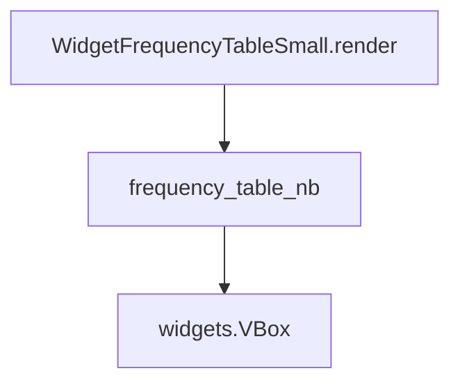

# `frequency_table_small.py`

## `src.ydata_profiling.report.presentation.flavours.widget.frequency_table_small.WidgetFrequencyTableSmall` · *class*

## Summary:
WidgetFrequencyTableSmall is a concrete implementation of FrequencyTableSmall that renders frequency distribution data as interactive Jupyter widgets.

## Description:
This class provides a widget-based presentation layer for frequency tables, specifically designed for use in Jupyter notebook environments. It inherits from FrequencyTableSmall and implements the render() method to transform structured frequency data into visual representations using ipywidgets. The class serves as a bridge between data profiling results and interactive visualization in Jupyter interfaces.

## State:
- Inherits all state from FrequencyTableSmall parent class including:
  - item_type: str, set to "frequency_table_small"
  - content: dict, containing rows and redact flags
  - name: Optional[str], optional identifier
  - anchor_id: Optional[str], optional HTML anchor identifier
  - classes: Optional[str], optional CSS classes for styling
- The content dictionary must contain a "rows" key with a nested list structure where the first element is a list of dictionaries with keys: 'count', 'n', 'label', and 'extra_class'

## Lifecycle:
- Creation: Instantiate with rows (List[Any]) and redact (bool) parameters, optionally providing name, anchor_id, and classes via keyword arguments
- Usage: Call render() method to generate a widgets.VBox containing interactive progress bars and labels
- Destruction: No explicit cleanup required; relies on Python's garbage collection

## Method Map:


## Raises:
- KeyError: If any dictionary in content["rows"][0] lacks required keys ('count', 'n', 'label', or 'extra_class')
- TypeError: If content["rows"] is not a list of lists or if elements are not dictionaries, or if the structure doesn't match expected format
- ValueError: If widget creation fails due to invalid parameters (e.g., negative values for count/n)

## Example:
```python
# Create a frequency table with sample data
rows = [[{
    "count": 10,
    "n": 100,
    "label": "Category A",
    "extra_class": "missing"
}]]
table = WidgetFrequencyTableSmall(rows=rows, redact=False)

# Render the widget for display in Jupyter
widget = table.render()
```

### `src.ydata_profiling.report.presentation.flavours.widget.frequency_table_small.WidgetFrequencyTableSmall.render` · *method*

## Summary:
Renders a small frequency table as a Jupyter widget VBox container with progress bars and labels.

## Description:
Converts frequency table data into a visual representation using ipywidgets. This method serves as the rendering interface for the WidgetFrequencyTableSmall presentation class, transforming structured frequency data into interactive widgets suitable for Jupyter notebooks.

## Args:
    None

## Returns:
    widgets.VBox: A vertical container widget containing horizontal containers with progress bars and count labels representing the frequency distribution.

## Raises:
    KeyError: If any dictionary in content["rows"][0] lacks required keys ('count', 'n', 'label', or 'extra_class').
    TypeError: If content["rows"] is not a list of lists or if elements are not dictionaries.
    ValueError: If widget creation fails due to invalid parameters (e.g., negative values for count/n).

## State Changes:
    Attributes READ: self.content
    Attributes WRITTEN: None

## Constraints:
    Preconditions:
    - self.content must be a dictionary containing a "rows" key
    - self.content["rows"] must be a list containing at least one element
    - self.content["rows"][0] must be a list of dictionaries
    - Each dictionary must contain the keys 'count', 'n', 'label', and 'extra_class'
    - All values for 'count' and 'n' must be numeric and non-negative
    - All values for 'label' must be convertible to string
    
    Postconditions:
    - Returns a widgets.VBox instance
    - Each item in the returned VBox is a widgets.HBox containing a FloatProgress and Label widget

## Side Effects:
    None

## `src.ydata_profiling.report.presentation.flavours.widget.frequency_table_small.frequency_table_nb` · *function*

## Summary:
Creates a widget-based frequency table display with progress bars and labels for data visualization.

## Description:
Generates a vertical box container of horizontal boxes, each containing a progress bar and count label, representing frequency distribution data. This function is part of the widget presentation flavour for ydata-profiling reports, specifically designed for small frequency tables in Jupyter environments.

## Args:
    rows (List[List[dict]]): A nested list structure where the first element contains a list of dictionaries describing frequency data points. Each dictionary must have keys: 'count', 'n', 'label', and 'extra_class'.

## Returns:
    widgets.VBox: A vertical container widget containing horizontal containers, each with a progress bar and count label for visualizing frequency data.

## Raises:
    KeyError: If any dictionary in rows[0] lacks required keys ('count', 'n', 'label', or 'extra_class').
    TypeError: If rows is not a list of lists or if elements are not dictionaries.
    ValueError: If widget creation fails due to invalid parameters (e.g., negative values for count/n).

## Constraints:
    Preconditions:
    - rows must be a list containing at least one element
    - rows[0] must be a list of dictionaries
    - Each dictionary must contain the keys 'count', 'n', 'label', and 'extra_class'
    - All values for 'count' and 'n' must be numeric and non-negative
    - All values for 'label' must be convertible to string
    
    Postconditions:
    - Returns a widgets.VBox instance
    - Each item in the returned VBox is a widgets.HBox containing a FloatProgress and Label widget

## Side Effects:
    None

## Control Flow:
```mermaid
flowchart TD
    A[Start frequency_table_nb] --> B{rows is valid?}
    B -- No --> C[Throw TypeError]
    B -- Yes --> D{rows[0] exists?}
    D -- No --> E[Throw TypeError]
    D -- Yes --> F[Initialize items list]
    F --> G[Iterate over fq_rows]
    G --> H{row["extra_class"] == "missing"?}
    H -- Yes --> I[Create FloatProgress with bar_style="danger"]
    H -- No --> J{row["extra_class"] == "other"?}
    J -- Yes --> K[Create FloatProgress with bar_style="info"]
    J -- No --> L[Create FloatProgress with bar_style=""]
    I --> M[Add HBox to items]
    K --> M
    L --> M
    M --> N[Next row]
    G --> O[Return widgets.VBox(items)]
```

## Examples:
```python
# Basic usage with sample data
sample_rows = [[{
    "count": 10,
    "n": 100,
    "label": "Category A",
    "extra_class": "missing"
}]]
widget = frequency_table_nb(sample_rows)
```

