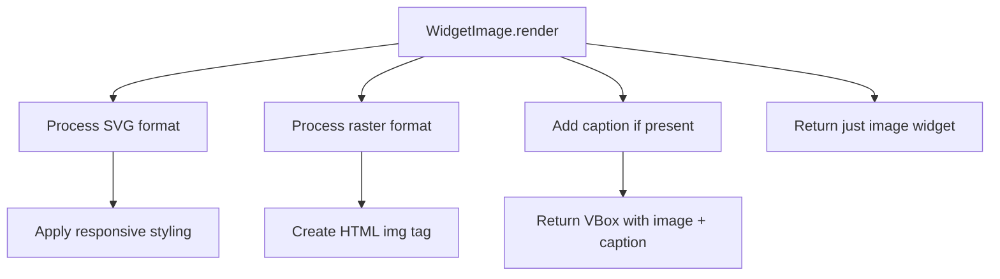

# `image.py`

## `src.ydata_profiling.report.presentation.flavours.widget.image.WidgetImage` · *class*

## Summary:
WidgetImage is a presentation layer component that renders image content as interactive ipywidgets HTML widgets for Jupyter notebook environments.

## Description:
WidgetImage implements the widget-based presentation flavour for image components in the ydata-profiling reporting system. It extends the core Image class to provide specific rendering logic tailored for Jupyter notebook environments using ipywidgets. This component transforms stored image data into responsive HTML widgets that maintain proper sizing and accessibility features while supporting optional captions.

The class handles two distinct image formats differently: SVG images receive responsive styling adjustments (max-width: 100% and height attribute removal) to ensure proper display in notebooks, while raster images are converted to standard HTML img tags with alt text for accessibility. When a caption is provided, it creates a vertical box layout containing both the image and caption elements.

WidgetImage inherits from Image class which provides the basic image data storage and validation, while implementing the render method to produce ipywidgets-compatible HTML output.

## State:
- Inherits all state from parent Image class including:
  - image: str, path or identifier of the image resource, cannot be None
  - image_format: ImageType, enumeration specifying the image format (either "svg" or "png")
  - alt: str, alternative text describing the image for accessibility purposes
  - caption: Optional[str], optional descriptive text for the image
  - item_type: str, set to "image" by the constructor, identifies the component type
  - content: dict, stores all image metadata including image, image_format, alt, and caption

## Lifecycle:
- Creation: Instantiated with the same parameters as the parent Image class (image path, format, alt text, optional caption)
- Usage: Called by the reporting system's rendering pipeline when generating widget-based reports in Jupyter notebooks
- Destruction: Managed by Python's garbage collection; no explicit cleanup required

## Method Map:


## Raises:
- KeyError: If required keys ('image', 'image_format') are missing from self.content
- TypeError: If self.content is not a dictionary or contains incompatible types
- AttributeError: If self.content['image_format'] is not of type ImageType

## Example:
```python
from ydata_profiling.report.presentation.flavours.widget.image import WidgetImage
from ydata_profiling.config import ImageType

# Create a widget image component
widget_image = WidgetImage(
    image="path/to/chart.svg",
    image_format=ImageType.svg,
    alt="Distribution chart of age variable",
    caption="Figure 1: Age distribution in dataset"
)

# Render to ipywidgets HTML widget for Jupyter display
widget = widget_image.render()
```

### `src.ydata_profiling.report.presentation.flavours.widget.image.WidgetImage.render` · *method*

## Summary:
Converts stored image content into a responsive ipywidgets HTML widget with optional caption support.

## Description:
This method renders image content as an ipywidgets HTML widget, implementing the widget-based presentation flavour for image components. It handles SVG and raster image formats distinctly: SVG images receive responsive styling adjustments (max-width: 100% and height attribute removal) while raster images are converted to HTML img tags with alt text. When a caption is provided, it creates a vertical box layout containing both the image and caption. This separation enables clean decoupling of image data storage from presentation logic in the widget-based reporting system.

## Args:
    None

## Returns:
    widgets.Widget: An ipywidgets HTML widget containing the formatted image. If a caption exists, returns a VBox containing the image widget and caption widget; otherwise returns just the image widget.

## Raises:
    KeyError: If required keys ('image', 'image_format') are missing from self.content
    TypeError: If self.content is not a dictionary or contains incompatible types
    AttributeError: If self.content['image_format'] is not of type ImageType

## State Changes:
    Attributes READ: self.content
    Attributes WRITTEN: None

## Constraints:
    Preconditions: 
    - self.content must be a dictionary containing 'image' and 'image_format' keys
    - For SVG images, 'image_format' must equal ImageType.svg
    - For raster images, 'image' must be a valid URL/path and 'alt' must be present in content
    Postconditions:
    - Returns a valid ipywidgets Widget instance
    - The returned widget displays properly formatted HTML content with appropriate styling

## Side Effects:
    None

