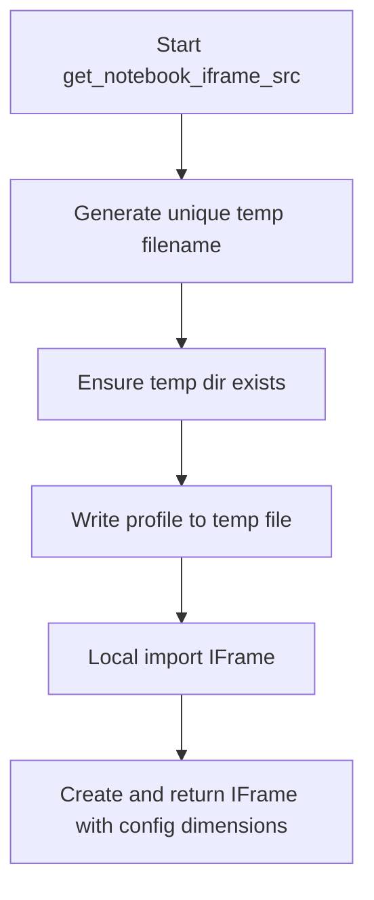

# `notebook.py`

## `src.ydata_profiling.report.presentation.flavours.widget.notebook.get_notebook_iframe_srcdoc` · *function*

## Summary:
Generates an HTML iframe element displaying a profile report within Jupyter notebook environments using the srcdoc attribute.

## Description:
Creates an HTML iframe containing the profile report HTML output, configured with dimensions from the settings. This function is specifically designed for rendering profile reports inline within Jupyter notebooks using the srcdoc attribute to embed the HTML content directly in the iframe.

## Args:
    config (Settings): Configuration object containing notebook-specific settings including iframe dimensions
    profile (ProfileReport): The profile report instance to render as HTML

## Returns:
    HTML: An IPython HTML object containing the iframe element that can be displayed in Jupyter notebooks

## Raises:
    None explicitly raised

## Constraints:
    Preconditions:
        - config must contain a valid notebook.iframe configuration with width and height attributes
        - profile must be a valid ProfileReport instance with a to_html() method
    Postconditions:
        - Returns a properly formatted HTML iframe element with escaped content
        - The iframe is configured with frameborder="0" and allowfullscreen attributes
        - Uses srcdoc attribute to embed HTML content directly in the iframe

## Side Effects:
    None

## Control Flow:
```mermaid
flowchart TD
    A[Start get_notebook_iframe_srcdoc] --> B[Extract width from config]
    B --> C[Extract height from config]
    C --> D[Generate HTML from profile.to_html()]
    D --> E[Escape HTML content using html.escape()]
    E --> F[Construct iframe HTML string with srcdoc attribute]
    F --> G[Import HTML locally from IPython.core.display]
    G --> H[Wrap in HTML object]
    H --> I[Return HTML object]
```

## Examples:
```python
# Basic usage in a Jupyter notebook cell
from ydata_profiling import ProfileReport
from ydata_profiling.config import Settings

config = Settings()
profile = ProfileReport(df)
html_output = get_notebook_iframe_srcdoc(config, profile)
display(html_output)
```

## `src.ydata_profiling.report.presentation.flavours.widget.notebook.get_notebook_iframe_src` · *function*

## Summary:
Creates an IFrame object for displaying profile reports in Jupyter notebooks by generating a temporary HTML file.

## Description:
This function serializes a ProfileReport to a temporary HTML file and returns an IFrame object configured with notebook-specific dimensions. It facilitates embedding profile report visualizations directly within Jupyter notebook environments.

The function encapsulates the workflow of:
1. Generating a unique temporary file path using UUID
2. Ensuring the temporary directory exists
3. Writing the profile report to HTML format
4. Creating an IFrame with configured dimensions from settings

This modular approach separates the concerns of temporary file management, HTML serialization, and IFrame presentation, promoting cleaner code organization and testability.

## Args:
    config (Settings): Configuration object containing notebook settings including iframe dimensions (width and height)
    profile (ProfileReport): The profile report instance to serialize to HTML and display

## Returns:
    IFrame: An IFrame object referencing the temporary HTML file with configured display dimensions

## Raises:
    Exception: May propagate exceptions from:
    - profile.to_file() when writing to the temporary file
    - Path operations when creating directories or files
    - IFrame construction if parameters are invalid

## Constraints:
    Preconditions:
    - config must contain valid notebook.iframe.width and notebook.iframe.height attributes
    - profile must be a valid ProfileReport instance with proper initialization
    - System must have write permissions to the "./ipynb_tmp" directory
    
    Postconditions:
    - A temporary HTML file is created at the specified location
    - The returned IFrame object references the correct file path
    - The IFrame is configured with the specified width and height from config

## Side Effects:
    - Creates a temporary directory "./ipynb_tmp" if it doesn't exist
    - Writes a temporary HTML file to the filesystem
    - Imports IFrame from IPython.lib.display within the function scope (local import)

## Control Flow:


## Examples:
```python
# Basic usage in a Jupyter notebook
from ydata_profiling import ProfileReport
from ydata_profiling.config import Settings

config = Settings()
profile = ProfileReport(df)
iframe = get_notebook_iframe_src(config, profile)
iframe  # Displays the profile in an iframe
```

## `src.ydata_profiling.report.presentation.flavours.widget.notebook.get_notebook_iframe` · *function*

## Summary:
Creates an iframe element for displaying profile reports in Jupyter notebooks by selecting between src or srcdoc attributes based on configuration.

## Description:
This function serves as a factory for creating iframe display objects in Jupyter notebook environments. It delegates to either `get_notebook_iframe_src` or `get_notebook_iframe_srcdoc` based on the configured iframe attribute, enabling flexible embedding of profile reports directly within notebook cells.

The function enforces a clear separation of concerns by routing configuration-driven decisions to specialized handlers while maintaining a unified interface for notebook iframe creation. This design allows for easy extension and testing of different iframe rendering strategies.

## Args:
    config (Settings): Configuration object containing notebook settings including iframe attribute selection
    profile (ProfileReport): The profile report instance to display in the iframe

## Returns:
    Union[IFrame, HTML]: An IFrame object when using src attribute, or HTML object when using srcdoc attribute

## Raises:
    ValueError: When the iframe attribute is set to an unsupported value (must be "src" or "srcdoc")

## Constraints:
    Preconditions:
        - config must contain a valid notebook.iframe.attribute setting
        - profile must be a valid ProfileReport instance
    Postconditions:
        - Returns a properly configured display object for Jupyter notebooks
        - The returned object is suitable for direct display in notebook cells

## Side Effects:
    None

## Control Flow:
```mermaid
flowchart TD
    A[Start get_notebook_iframe] --> B[Get iframe attribute from config]
    B --> C{Attribute equals "src"?}
    C -->|Yes| D[Call get_notebook_iframe_src]
    C -->|No| E{Attribute equals "srcdoc"?}
    E -->|Yes| F[Call get_notebook_iframe_srcdoc]
    E -->|No| G[Raise ValueError]
    D --> H[Return IFrame result]
    F --> H
    G --> H
```

## Examples:
```python
# Basic usage in a Jupyter notebook
from ydata_profiling import ProfileReport
from ydata_profiling.config import Settings

config = Settings()
profile = ProfileReport(df)

# Will create an iframe using the configured attribute
iframe_display = get_notebook_iframe(config, profile)
iframe_display  # Displays the profile in an iframe
```

