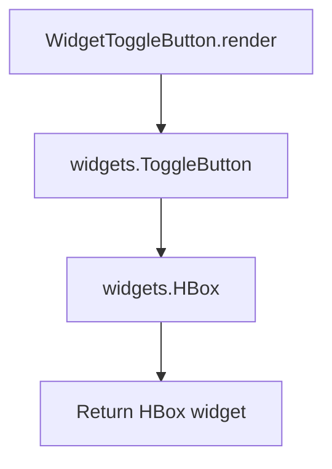

# `toggle_button.py`

## `src.ydata_profiling.report.presentation.flavours.widget.toggle_button.WidgetToggleButton` · *class*

## Summary:
WidgetToggleButton is a concrete implementation of ToggleButton that renders toggle button components using the ipywidgets library for interactive Jupyter notebook environments.

## Description:
WidgetToggleButton serves as a specialized renderer for toggle button components within the ydata-profiling report system, specifically designed for Jupyter notebook environments using ipywidgets. It extends the abstract ToggleButton class to provide concrete rendering logic that generates interactive toggle buttons using the ipywidgets library.

This class is intended to be used in Jupyter notebook contexts where interactive UI elements are desired. It creates a visually styled toggle button that can be used to show/hide sections of profiling reports or control interactive features within the notebook environment.

## State:
- Inherits all attributes from ToggleButton parent class:
  - item_type: str - Set to "toggle_button" by constructor
  - content: dict - Contains the text label for the toggle button under the key "text"
  - text: str - The display text for the toggle button, stored in content dictionary under "text" key
  - name: Optional[str] - Human-readable identifier for the item, stored in content dictionary
  - anchor_id: Optional[str] - Unique identifier for HTML anchors, stored in content dictionary  
  - classes: Optional[str] - CSS classes to apply to the rendered item, stored in content dictionary

## Lifecycle:
- Creation: Instantiate with required text parameter and optional metadata (name, anchor_id, classes) following ToggleButton constructor requirements
- Usage: Call render() method to generate ipywidgets.HBox containing a styled ToggleButton widget
- Destruction: No explicit cleanup required; relies on Python's garbage collection

## Method Map:


## Raises:
- No explicit exceptions raised by __init__ (inherits from ToggleButton)
- render() method does not raise exceptions from the implementation perspective

## Example:
```python
# Create a toggle button instance
button = WidgetToggleButton(
    text="Show Details",
    name="details-toggle",
    anchor_id="toggle-anchor"
)

# Render the widget for Jupyter notebook display
widget = button.render()

# The returned widget can be displayed in a Jupyter cell
display(widget)
```

### `src.ydata_profiling.report.presentation.flavours.widget.toggle_button.WidgetToggleButton.render` · *method*

## Summary:
Creates and configures a styled toggle button widget container for display in Jupyter environments.

## Description:
This method constructs a toggle button with specific styling properties and wraps it in a horizontal box layout. It's designed to render interactive toggle buttons within the widget-based presentation framework. The method encapsulates the creation and configuration of UI elements to ensure consistent appearance and behavior across different report components.

The render method is part of the WidgetToggleButton class, which extends the abstract ToggleButton base class. It implements the concrete rendering logic for Jupyter widget environments, specifically creating a ToggleButton with appropriate layout properties.

## Args:
    None

## Returns:
    widgets.HBox: A horizontal box container holding a styled toggle button widget.

## Raises:
    None

## State Changes:
    Attributes READ: self.content["text"]
    Attributes WRITTEN: None

## Constraints:
    Preconditions: The self.content dictionary must contain a "text" key with a string value.
    Postconditions: The returned HBox widget will have specific layout properties applied including flex alignment, display, and flow settings.

## Side Effects:
    None

