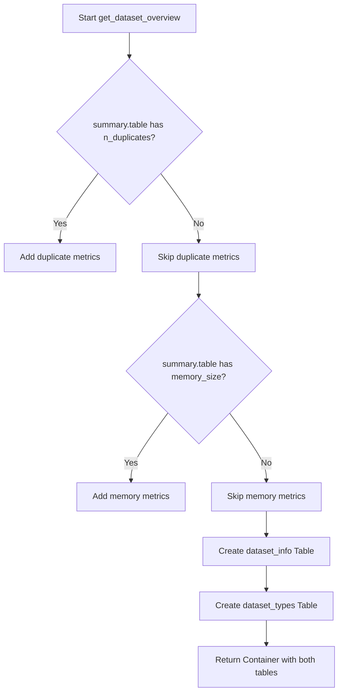
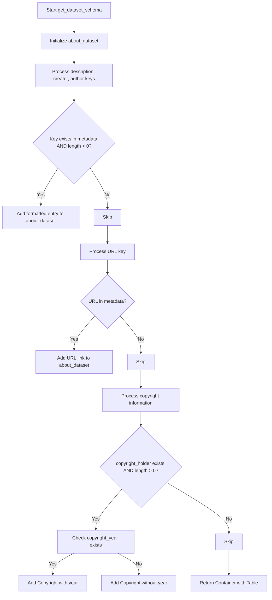
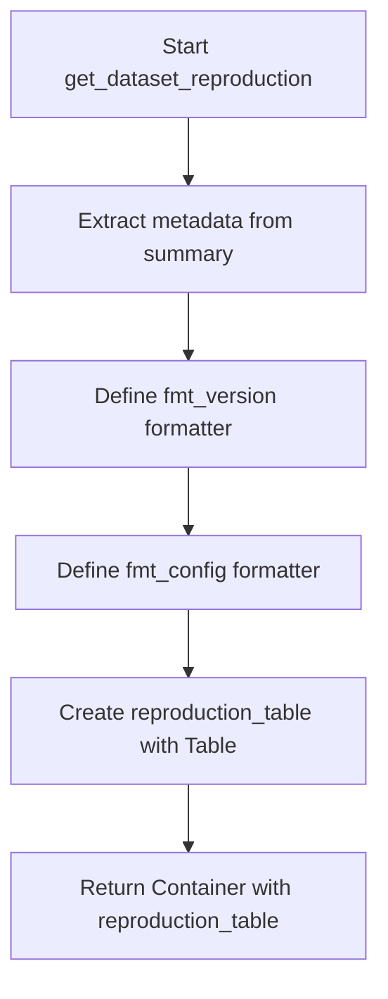
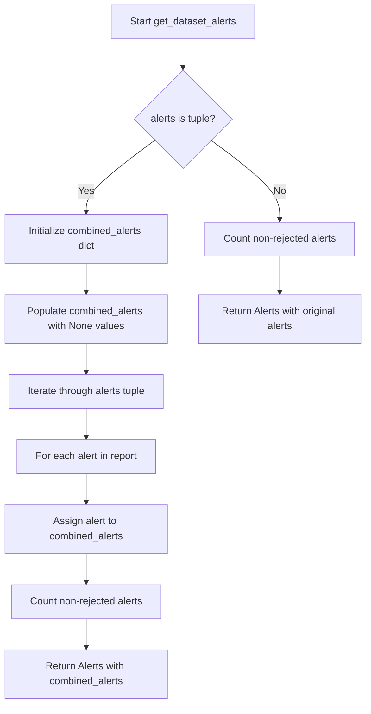
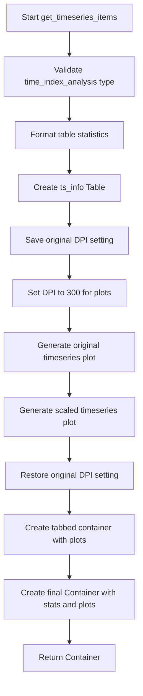
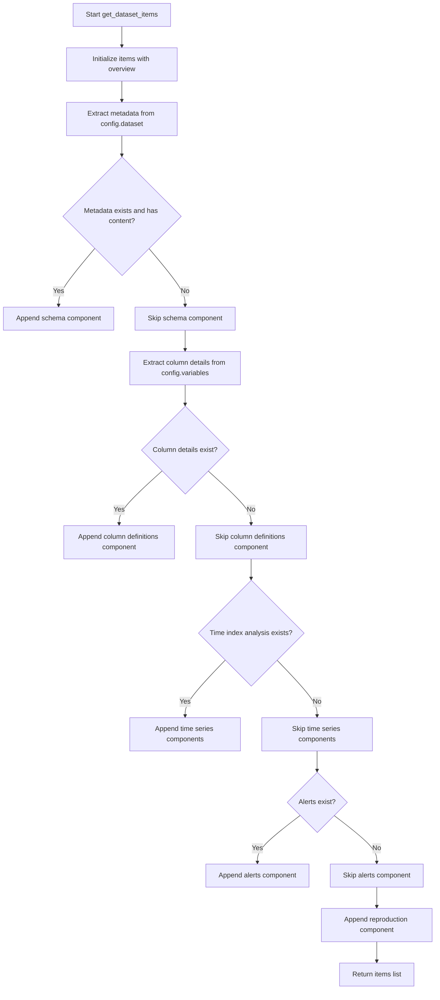

# `overview.py`

## `src.ydata_profiling.report.structure.overview.get_dataset_overview` · *function*

## Summary:
Generates a structured overview of dataset statistics and variable types for reporting purposes.

## Description:
Creates a formatted presentation containing key dataset metrics and variable type distributions. This function extracts core dataset information from the summary object and formats it into two tables: one for general statistics and another for variable type counts. The result is returned as a container of these tables for display in reports.

This logic is extracted into its own function to separate data processing from presentation concerns, allowing for cleaner report generation workflows and easier testing of dataset overview formatting independently from other report components.

## Args:
    config (Settings): Configuration settings that control HTML styling and report formatting options
    summary (BaseDescription): Dataset summary object containing statistical information and metadata

## Returns:
    Renderable: A Container object containing two Table objects - one for dataset statistics and one for variable types

## Raises:
    None explicitly raised

## Constraints:
    Preconditions:
    - config must be a valid Settings object with html and report attributes
    - summary must be a BaseDescription object with a table attribute containing required keys
    - summary.table must contain at least "n_var", "n", "n_cells_missing", and "p_cells_missing" keys
    
    Postconditions:
    - Returns a Container with exactly two Table objects
    - The first table contains exactly 4 fixed metrics plus optional duplicate/memory metrics
    - The second table contains variable type counts from summary.table["types"]

## Side Effects:
    None

## Control Flow:


## Examples:
```python
# Basic usage with minimal summary
config = Settings()
summary = BaseDescription()
summary.table = {
    "n_var": 10,
    "n": 1000,
    "n_cells_missing": 50,
    "p_cells_missing": 0.05,
    "types": {"int": 3, "float": 4, "str": 3}
}
result = get_dataset_overview(config, summary)
# Returns Container with dataset_info and dataset_types tables

# Usage with additional metrics
summary.table.update({
    "n_duplicates": 10,
    "p_duplicates": 0.01,
    "memory_size": 1024000,
    "record_size": 1024
})
result = get_dataset_overview(config, summary)
# Returns Container with extended dataset_info including duplicates and memory metrics
```

## `src.ydata_profiling.report.structure.overview.get_dataset_schema` · *function*

## Summary:
Constructs a dataset schema container with metadata information from the provided metadata dictionary.

## Description:
This function processes metadata to extract and format key dataset information such as description, creator, author, URL, and copyright details. It creates a structured presentation container that displays this metadata in a table format for reporting purposes. The function is designed to be reusable across different report generation contexts where dataset metadata needs to be displayed.

The logic is extracted into its own function to separate the concerns of metadata processing from the report generation flow, making the code more modular and testable. This allows the report generation process to focus on presentation while keeping metadata formatting logic centralized.

## Args:
    config (Settings): Configuration object containing HTML styling settings for the presentation layer.
    metadata (dict): Dictionary containing various metadata fields about the dataset.

## Returns:
    Container: A Container object containing a Table with formatted metadata information.

## Raises:
    None explicitly raised.

## Constraints:
    Preconditions:
    - The config parameter must be a valid Settings object with html.style attribute.
    - The metadata parameter must be a dictionary-like object.
    
    Postconditions:
    - The returned Container will always contain a Table with metadata information.
    - The function handles empty or missing metadata gracefully without errors.

## Side Effects:
    None.

## Control Flow:


## Examples:
    Example usage with minimal metadata:
    ```python
    config = Settings()
    metadata = {"description": "Sample dataset", "creator": "John Doe"}
    result = get_dataset_schema(config, metadata)
    # Returns a Container with a Table containing description and creator
    ```

    Example usage with full metadata:
    ```python
    config = Settings()
    metadata = {
        "description": "Sales data for 2023",
        "creator": "Data Team",
        "author": "Jane Smith",
        "url": "https://example.com/dataset",
        "copyright_holder": "Acme Corp",
        "copyright_year": "2023"
    }
    result = get_dataset_schema(config, metadata)
    # Returns a Container with a Table containing all metadata fields
    ```

## `src.ydata_profiling.report.structure.overview.get_dataset_reproduction` · *function*

## Summary:
Generates a reproducibility section for dataset analysis reports that displays key metadata about the analysis run including timing information, software version, and configuration download link.

## Description:
This function creates a structured table containing essential information for reproducing the dataset analysis. It extracts metadata from the analysis summary and formats it appropriately for display in HTML reports. The function is designed to be reusable across different report sections and provides a standardized way to present analysis provenance information.

The logic is extracted into its own function to separate the concerns of data extraction and formatting from the report generation process, making the code more modular and testable.

## Args:
    config (Settings): Configuration object containing HTML styling settings and other report preferences
    summary (BaseDescription): Analysis summary object containing package metadata and analysis timing information

## Returns:
    Renderable: A Container object containing a Table with reproduction metadata that can be rendered in HTML reports

## Raises:
    KeyError: When summary package dictionary is missing required keys ("ydata_profiling_version" or "ydata_profiling_config")
    AttributeError: When summary analysis object is missing required attributes (date_start, date_end, duration)

## Constraints:
    Preconditions:
    - summary must contain package dictionary with "ydata_profiling_version" and "ydata_profiling_config" keys
    - summary must contain analysis object with date_start, date_end, and duration attributes
    - config must be a valid Settings object with html.style attribute

    Postconditions:
    - Returns a properly formatted Container with a Table child element
    - All timing values are formatted using appropriate formatters
    - Version and config values are properly hyperlinked

## Side Effects:
    None - This function is pure and doesn't perform any I/O operations or mutate external state

## Control Flow:


## Examples:
```python
# Typical usage in report generation
config = Settings()
summary = BaseDescription()
reproduction_section = get_dataset_reproduction(config, summary)
# Returns a Renderable container suitable for HTML report inclusion
```

## `src.ydata_profiling.report.structure.overview.get_dataset_column_definitions` · *function*

## Summary:
Transforms column definition dictionaries into a formatted table container for report generation.

## Description:
This function converts a dictionary of column definitions into a standardized table presentation for inclusion in profiling reports. It processes each key-value pair in the definitions dictionary, applies formatting to the values using the standard formatter, and creates a structured Table component wrapped in a Container for proper report organization.

The function isolates the presentation logic for column definitions, enabling clean separation between data processing and visualization layers. This modular approach allows for consistent display of variable metadata across different sections of the profiling report.

## Args:
    config (Settings): Configuration object containing HTML styling preferences and report settings.
    definitions (dict): Dictionary mapping column names to their descriptive values.

## Returns:
    Container: A Container component containing a Table of column definitions with appropriate styling and identifiers.

## Raises:
    None explicitly raised by this function.

## Constraints:
    Preconditions:
        - The `config` parameter must be a valid Settings instance with properly initialized HTML styling.
        - The `definitions` parameter must be a dictionary-like object with string keys representing column names.
    Postconditions:
        - The returned Container will always contain exactly one Table component.
        - All values in the definitions dictionary will be processed through the `fmt` formatter function.

## Side Effects:
    None.

## Control Flow:
```mermaid
flowchart TD
    A[Start get_dataset_column_definitions] --> B{Validate inputs}
    B --> C[Initialize variable_descriptions list]
    C --> D[Iterate over definitions.items()]
    D --> E[Format each value with fmt()]
    E --> F[Create Table with formatted data]
    F --> G[Wrap Table in Container]
    G --> H[Return Container]
```

## Examples:
```python
# Basic usage
config = Settings()
definitions = {
    "age": "Age of participant",
    "income": "Annual income in USD"
}
result = get_dataset_column_definitions(config, definitions)
# Returns a Container with a Table containing the two columns and their descriptions

# Usage with empty definitions
empty_result = get_dataset_column_definitions(config, {})
# Returns a Container with an empty Table
```

## `src.ydata_profiling.report.structure.overview.get_dataset_alerts` · *function*

## Summary:
Generates a presentation-ready Alerts component from dataset-level alerts, supporting both single and multi-report alert collections.

## Description:
Processes alert objects and wraps them in an Alerts presentation component for report generation. When alerts originate from multiple reports (passed as a tuple), it aggregates them by alert type and column name for comparative analysis. This function separates concerns by handling alert formatting and presentation logic independently from data processing. The function excludes rejected alerts when calculating the displayed alert count.

## Args:
    config (Settings): Configuration object containing HTML styling settings for the Alerts component.
    alerts (list): Collection of alert objects. Can be either a list of alerts or a tuple of lists of alerts (one per report).

## Returns:
    Alerts: A presentation-ready Alerts component containing the processed alerts and metadata.

## Raises:
    None explicitly raised.

## Constraints:
    Preconditions:
    - The `config` parameter must be a valid Settings object with HTML styling configuration.
    - The `alerts` parameter must be either a list or tuple of alert objects.
    - Alert objects must have `alert_type` and `column_name` attributes.

    Postconditions:
    - The returned Alerts component will have properly formatted name indicating alert count.
    - The Alerts component will be styled according to the provided config.

## Side Effects:
    None.

## Control Flow:


## Examples:
    # Single report alerts
    alerts = [alert1, alert2]
    result = get_dataset_alerts(config, alerts)
    
    # Multi-report alerts
    alerts_tuple = ([alert1, alert2], [alert3, alert4])
    result = get_dataset_alerts(config, alerts_tuple)
```

## `src.ydata_profiling.report.structure.overview.get_timeseries_items` · *function*

## Summary:
Generates a structured presentation container displaying time series statistics and visualization plots for profiling reports.

## Description:
Creates a comprehensive view of time series data characteristics including metadata statistics and visual plots. This function extracts time series analysis from a summary object and formats it into a structured report layout with both tabular statistics and interactive plots. The function is designed to be called during report generation when time series data is detected in the dataset.

The logic is extracted into its own function to separate the concerns of data analysis result formatting from the main report generation pipeline. This enables cleaner code organization and makes it easier to test the time series presentation logic independently.

## Args:
    config (Settings): Configuration object containing report settings including HTML styling and plotting parameters
    summary (BaseDescription): Analysis summary object containing time series metadata in time_index_analysis attribute

## Returns:
    Container: A hierarchical presentation container with two main sections: 
        - Table of time series statistics 
        - Tabbed container with original and scaled time series plots

## Raises:
    AssertionError: When summary.time_index_analysis is not an instance of TimeIndexAnalysis

## Constraints:
    Preconditions:
        - config must be a valid Settings object with plot and html attributes
        - summary must be a BaseDescription instance with time_index_analysis attribute
        - summary.time_index_analysis must be an instance of TimeIndexAnalysis
        - summary.variables must contain valid time series data for plotting
    
    Postconditions:
        - Returns a properly structured Container with time series information
        - Plot DPI setting is restored to original value after generation
        - All formatting functions are applied consistently

## Side Effects:
    - Modifies config.plot.dpi temporarily during plot generation
    - Creates matplotlib figures for time series visualization
    - Generates HTML anchor IDs for report navigation

## Control Flow:


## Examples:
```python
# Typical usage in report generation
config = Settings()
summary = BaseDescription()
# ... populate summary with time series data ...
timeseries_container = get_timeseries_items(config, summary)
# Result is a Container ready for report inclusion
```

## `src.ydata_profiling.report.structure.overview.get_dataset_items` · *function*

## Summary:
Generates a structured list of report components for dataset overview, including metadata, schema, column definitions, time series data, alerts, and reproduction information.

## Description:
Constructs a comprehensive list of presentation components that form the dataset overview section of profiling reports. This function orchestrates the creation of various report elements by calling specialized functions for each component type, ensuring consistent ordering and conditional inclusion based on available data. The function serves as the main entry point for building the dataset overview portion of reports, aggregating components like dataset statistics, schema information, column definitions, time series analysis, alerts, and reproduction metadata.

The logic is extracted into its own function to separate the orchestration of report components from the individual component creation logic, enabling cleaner code organization and easier maintenance of report structure. This modular approach allows each component to be developed and tested independently while maintaining a consistent report generation workflow.

## Args:
    config (Settings): Configuration object containing report settings and styling preferences
    summary (BaseDescription): Analysis summary object containing dataset statistics and metadata
    alerts (list): Collection of alert objects to be included in the report, if any

## Returns:
    list[Renderable]: A list of presentation components that constitute the dataset overview section, including:
        - Dataset overview statistics table
        - Schema metadata table (conditionally included)
        - Column definitions table (conditionally included)
        - Time series analysis components (conditionally included)
        - Alerts presentation component (conditionally included)
        - Reproduction metadata table

## Raises:
    None explicitly raised by this function

## Constraints:
    Preconditions:
    - config must be a valid Settings object with properly initialized attributes
    - summary must be a BaseDescription object with required analysis data
    - alerts must be a list-like object (can be empty)
    
    Postconditions:
    - Returns a list of Renderable components that can be directly incorporated into report structures
    - The first item in the returned list is always the dataset overview component
    - Conditional components are only included when their respective data conditions are met

## Side Effects:
    None - This function is pure and doesn't perform any I/O operations or mutate external state

## Control Flow:


## Examples:
```python
# Basic usage with minimal data
config = Settings()
summary = BaseDescription(...)
alerts = []
items = get_dataset_items(config, summary, alerts)
# Returns list with overview, reproduction components only

# Full usage with all optional components
config = Settings()
summary = BaseDescription(...)
alerts = [alert1, alert2]
items = get_dataset_items(config, summary, alerts)
# Returns list with overview, schema, column definitions, time series, alerts, reproduction components
```

