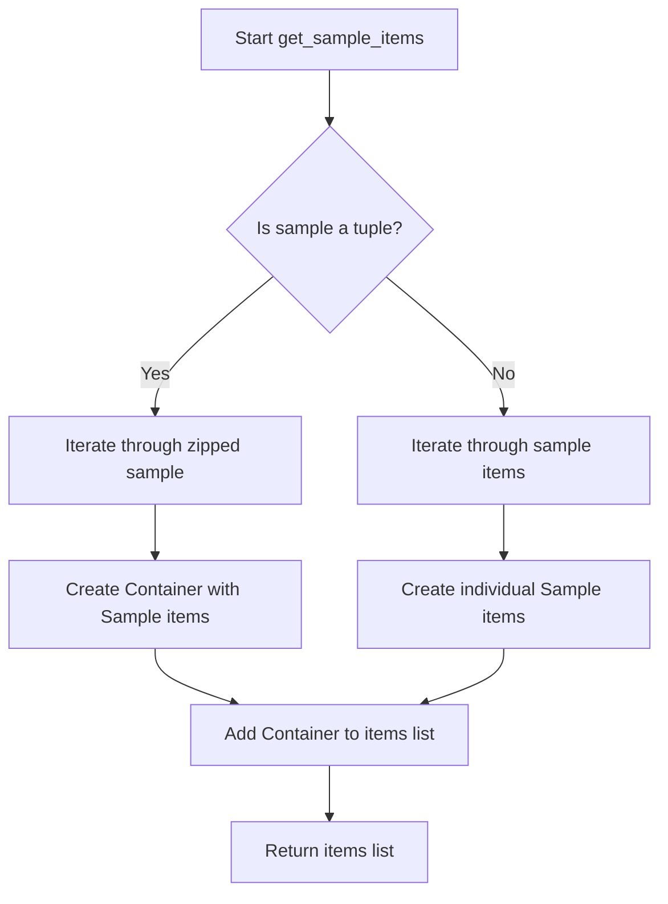
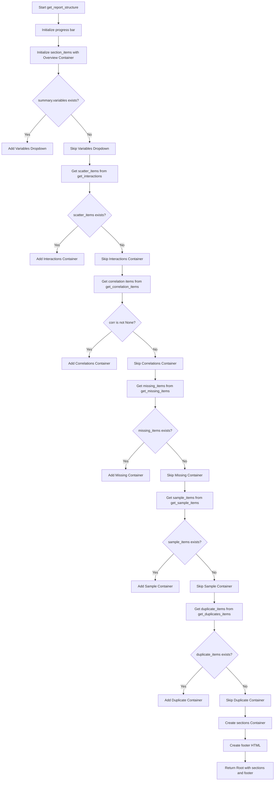

# `report.py`

## `src.ydata_profiling.report.structure.report.get_missing_items` · *function*

## Summary:
Generates presentation components for missing data visualizations from a profiling summary.

## Description:
Creates a list of presentation widgets for displaying missing data patterns and statistics. This function processes missing data information stored in the summary object's missing attribute and converts it into appropriate renderable components (ImageWidget or Container objects) based on the data structure. The function handles both single missing data visualizations and batch grids of multiple related visualizations.

This logic is extracted into its own function to separate the presentation layer from the data processing layer, allowing for cleaner code organization and easier testing of the reporting structure. It enables the report generation pipeline to consistently handle missing data visualization components regardless of their complexity.

## Args:
    config (Settings): Configuration object containing report settings including plot format preferences and HTML styling options. Must have properly initialized plot.image_format and html.style._labels attributes.
    summary (BaseDescription): Analysis summary object containing missing data information in the missing attribute. The missing attribute must be a dictionary-like object where each value contains "matrix", "name", and "caption" fields.

## Returns:
    list: A list of Renderable objects representing missing data visualizations, including:
        - ImageWidget objects for single missing data visualizations
        - Container objects with sequence_type="batch_grid" for multiple related visualizations

## Raises:
    None explicitly raised by this function

## Constraints:
    Preconditions:
    - config must be a valid Settings object with properly initialized attributes
    - summary must be a BaseDescription object with a missing attribute containing valid data
    - summary.missing must be a dictionary-like object with key-value pairs where values contain "matrix", "name", and "caption" fields
    - When item["name"] is not a string, it must be a sequence with matching length to item["matrix"] and item["caption"]
    - config.html.style._labels must be properly initialized for batch grid processing
    
    Postconditions:
    - Returns a list of Renderable components suitable for inclusion in report structures
    - Each returned component is properly initialized with required metadata including anchor_id and name
    - All ImageWidget objects are constructed with proper image_format, alt, name, anchor_id, and caption parameters

## Side Effects:
    None - This function is pure and doesn't perform any I/O operations or mutate external state

## Control Flow:
```mermaid
flowchart TD
    A[Start get_missing_items] --> B[Iterate over summary.missing.items()]
    B --> C{item["name"] is str?}
    C -->|Yes| D[Create ImageWidget with item["matrix"], image_format, alt, name, anchor_id, caption]
    C -->|No| E[Create Container with ImageWidgets]
    D --> F[Add ImageWidget to items]
    E --> G[Loop through item["name"] items]
    G --> H[Create ImageWidget for each item with matrix[i], image_format, alt[name[i]], name[html.style._labels[i]], anchor_id, caption[i]]
    H --> I[Add ImageWidgets to Container]
    I --> J[Add Container to items]
    J --> K[Return items list]
```

## Examples:
```python
# Basic usage in report generation
from ydata_profiling.config import Settings
from ydata_profiling.model import BaseDescription
from ydata_profiling.report.structure.report import get_missing_items

# Assuming config and summary are properly initialized
config = Settings()
summary = BaseDescription(...)  # With missing data information

# Generate missing data presentation components
missing_items = get_missing_items(config, summary)
# Returns list of Renderable objects for missing data visualization

# These items can be added to a report structure
report.add(missing_items)
```

## `src.ydata_profiling.report.structure.report.render_variables_section` · *function*

## Summary:
Generates a list of Variable renderable components for inclusion in profiling reports, organizing variable-specific content with conditional formatting based on alerts and configuration settings.

## Description:
This function processes variable-level profiling summaries and transforms them into presentation-ready Variable components. It handles the mapping of data types to appropriate rendering functions, manages alert-based filtering of variables, and constructs collapsible sections for detailed variable information. The function serves as a bridge between raw profiling data and the presentation layer, ensuring that variable information is properly formatted and selectively displayed according to user configuration.

The function is typically called during report generation when converting processed variable summaries into UI components. It's extracted into its own function to encapsulate the complex logic of variable rendering, alert processing, and conditional UI construction, making the report generation pipeline more modular and maintainable.

## Args:
    config (Settings): Configuration object containing report settings such as variable descriptions, alert handling preferences, and rendering options
    dataframe_summary (BaseDescription): Container holding all profiling results including variable summaries, alerts, and metadata

## Returns:
    list[Variable]: A list of Variable renderable components ready for inclusion in profiling reports, each representing a processed variable with appropriate top/bottom content and conditional ignore flags

## Raises:
    ValueError: When a variable has incompatible data types that cannot be resolved to a single type (e.g., conflicting Numeric/Categorical combinations)

## Constraints:
    Preconditions:
    - config must be a valid Settings instance with properly initialized configuration objects
    - dataframe_summary must be a valid BaseDescription instance with populated variables and alerts attributes
    - The variables attribute in dataframe_summary must be iterable with string keys representing column names
    
    Postconditions:
    - All returned Variable components will have proper anchor IDs and names set
    - Variables with REJECTED alerts will be marked with ignore=True when reject_variables is enabled
    - Collapsible sections are only created when bottom content exists and is not None

## Side Effects:
    None

## Control Flow:
```mermaid
flowchart TD
    A[Start render_variables_section] --> B[Initialize empty templs list]
    B --> C[Extract config values]
    C --> D[Get render_map from get_render_map()]
    D --> E[Iterate over dataframe_summary.variables.items()]
    E --> F{Alerts is tuple?}
    F -->|Yes| G[Process alerts as tuple]
    F -->|No| H[Process alerts as list]
    G --> I[Build alert collections]
    H --> I
    I --> J[Build template_variables dict]
    J --> K{summary['type'] is list?}
    K -->|Yes| L[Resolve type conflicts]
    K -->|No| M[Use type directly]
    L --> N[Update template_variables with render_map]
    M --> N
    N --> O{reject_variables enabled?}
    O -->|Yes| P[Check for REJECTED alerts]
    O -->|No| Q[Set ignore=False]
    P --> R[Set ignore flag]
    Q --> R
    R --> S{Has bottom content?}
    S -->|Yes| T[Create Collapse with ToggleButton]
    S -->|No| U[Set bottom=None]
    T --> U
    U --> V[Create Variable component]
    V --> W[Append to templs]
    W --> X[Loop to next variable]
    X --> Y[Return templs list]
```

## Examples:
```python
# Basic usage in report generation pipeline
from ydata_profiling.config import Settings
from ydata_profiling.model import BaseDescription

# Assuming config and dataframe_summary are properly initialized
variables_section = render_variables_section(config, dataframe_summary)

# The result can be directly incorporated into a report structure
report_components = [
    *get_dataset_items(config, dataframe_summary),
    *variables_section,
    *get_correlation_items(config, dataframe_summary)
]
```

## `src.ydata_profiling.report.structure.report.get_duplicates_items` · *function*

## Summary:
Creates a list of Duplicate renderable objects for displaying duplicate data in a report.

## Description:
This function processes duplicate data and converts it into renderable components for inclusion in a profiling report. It handles both single duplicate DataFrames and lists of duplicate DataFrames, creating appropriate Duplicate objects with proper labels and anchor IDs. The function is designed to be part of the report generation pipeline, specifically for presenting duplicate data findings.

## Args:
    config (Settings): Configuration settings containing HTML styling information including label definitions
    duplicates (pd.DataFrame or List[pd.DataFrame]): Either a single DataFrame containing duplicate records or a list of DataFrames with duplicates. Can be None or empty.

## Returns:
    List[Renderable]: A list of Duplicate renderable objects that can be displayed in a profiling report, or an empty list if no duplicates exist

## Raises:
    None explicitly raised

## Constraints:
    Preconditions:
        - config parameter must be a valid Settings object
        - duplicates parameter can be None, empty DataFrame, or a valid DataFrame/list of DataFrames
    Postconditions:
        - Returns a list of Renderable objects (never None)
        - Returns empty list when duplicates is None or empty

## Side Effects:
    None

## Control Flow:
```mermaid
flowchart TD
    A[Start get_duplicates_items] --> B{duplicates is not None AND len > 0}
    B -- False --> C[Return empty list]
    B -- True --> D{isinstance(duplicates, list)}
    D -- True --> E[Check for None items in list]
    E -- Any None --> F[Return empty list]
    E -- No None --> G[Iterate through list]
    G --> H[Create Duplicate objects with config.html.style._labels[idx]]
    D -- False --> I[Create single Duplicate object with "Most frequently occurring" name]
    H --> J[Return items list]
    I --> J
```

## Examples:
```python
# Example 1: Single duplicate DataFrame
config = Settings()
duplicates_df = pd.DataFrame({'a': [1, 1], 'b': [2, 2]})
result = get_duplicates_items(config, duplicates_df)
# Returns list with one Duplicate renderable

# Example 2: List of duplicate DataFrames
config = Settings()
duplicates_list = [pd.DataFrame({'a': [1, 1]}), pd.DataFrame({'b': [2, 2]})]
result = get_duplicates_items(config, duplicates_list)
# Returns list with two Duplicate renderables

# Example 3: Empty duplicates
config = Settings()
result = get_duplicates_items(config, None)
# Returns empty list
```

## `src.ydata_profiling.report.structure.report.get_definition_items` · *function*

## Summary:
Creates a UI component to display column definitions in a data profiling report.

## Description:
Generates a Duplicate renderable component to present column definitions when available. This function encapsulates the logic for conditionally creating and returning a UI element that displays duplicate data findings, specifically column definitions in this context.

## Args:
    definitions (pd.DataFrame): A pandas DataFrame containing column definitions to display, or None if no definitions exist.

## Returns:
    Sequence[Renderable]: A sequence containing a Duplicate renderable component if definitions are provided and non-empty, otherwise an empty sequence.

## Raises:
    None explicitly raised.

## Constraints:
    Preconditions:
        - The definitions parameter should be either a pandas DataFrame or None
        - When a DataFrame is provided, it should be properly formatted with column information
    
    Postconditions:
        - Returns a sequence of Renderable objects (empty or containing one Duplicate component)
        - The returned Duplicate component has name="Columns" and anchor_id="definitions"

## Side Effects:
    None.

## Control Flow:
```mermaid
flowchart TD
    A[get_definition_items] --> B{definitions is not None AND len(definitions) > 0}
    B -- True --> C[Create Duplicate component]
    C --> D[Append to items list]
    D --> E[Return items]
    B -- False --> F[Return empty items]
    F --> E
```

## Examples:
```python
import pandas as pd
from ydata_profiling.report.structure.report import get_definition_items

# Example with definitions
definitions_df = pd.DataFrame({'column_name': ['A', 'B'], 'type': ['int', 'str']})
items = get_definition_items(definitions_df)
# Returns a sequence with one Duplicate component

# Example without definitions
items = get_definition_items(None)
# Returns an empty sequence

# Example with empty definitions
empty_df = pd.DataFrame()
items = get_definition_items(empty_df)
# Returns an empty sequence
```

## `src.ydata_profiling.report.structure.report.get_sample_items` · *function*

## Summary:
Creates a list of renderable sample items for display in a profiling report, handling both single samples and batches of samples.

## Description:
This function processes sample data from a profiling configuration and converts it into renderable components that can be displayed in a report. It handles two distinct data formats: when samples are provided as a tuple (indicating batch processing) and when they are provided as a simple list. The function extracts sample data and metadata to create either Container objects (for batched samples) or individual Sample objects (for single samples).

## Args:
    config (Settings): Configuration object containing HTML styling settings, particularly the style labels used for naming samples.
    sample (dict): Either a tuple of sample objects (for batch processing) or a list of sample objects (for single samples). When a tuple, each element should be a sequence of equal length representing different aspects of the same batch.

## Returns:
    List[Renderable]: A list of renderable components that represent the samples in a format suitable for report presentation. Each item is either a Sample or Container object.

## Raises:
    None explicitly raised.

## Constraints:
    Preconditions:
    - The config parameter must be a valid Settings object with html.style._labels attribute
    - When sample is a tuple, all elements must be sequences of equal length
    - When sample is a list, all elements must be objects with data, name, id, and caption attributes
    - Each object in the sample must have a data attribute that can be accessed
    - Each object in the sample must have a name attribute for labeling
    - Each object in the sample must have an id attribute for anchor identification
    - Each object in the sample must have a caption attribute for description
    
    Postconditions:
    - Returns a list of Renderable objects
    - The returned list contains either Sample objects or Container objects containing Sample objects
    - All Sample objects created have proper data, name, anchor_id, and caption attributes
    - All Container objects created have proper sequence_type, batch_size, anchor_id, and name attributes

## Side Effects:
    None.

## Control Flow:


## Examples:
    # Example with single sample
    sample = [SampleObject(data=[1,2,3], name="Sample1", id="id1", caption="First sample")]
    result = get_sample_items(config, sample)
    
    # Example with batched samples  
    sample = (batch1_samples, batch2_samples)
    result = get_sample_items(config, sample)
```

## `src.ydata_profiling.report.structure.report.get_interactions` · *function*

## Summary:
Creates a hierarchical presentation structure for interaction plots between variable pairs in a dataset.

## Description:
Transforms a nested dictionary of interaction plots into a structured list of presentation components suitable for report generation. This function processes interaction data organized by x-variable columns and their associated y-variable plots, creating appropriate UI containers with either tabbed or dropdown navigation based on the number of interactions.

The logic is extracted into its own function to separate the presentation layer transformation from the data processing layer, allowing for clean separation of concerns in the report generation pipeline. This enables the interaction data to be processed independently of how it's ultimately presented in the report.

## Args:
    config (Settings): Configuration object containing report settings including plot formatting options and HTML styling preferences
    interactions (dict): Nested dictionary mapping x-column names to dictionaries of y-column names and their corresponding plot data (either single plot objects or lists of plots)

## Returns:
    list[Renderable]: A list of Container components representing the structured interaction plots, where each top-level container corresponds to an x-variable and contains its associated y-variable plots organized in tabs or select dropdowns

## Raises:
    None explicitly raised by this function

## Constraints:
    Preconditions:
    - config must be a valid Settings object with properly initialized attributes
    - interactions must be a dictionary with string keys and dictionary values
    - Each inner dictionary must have string keys and either plot objects or lists of plot objects as values
    
    Postconditions:
    - Returns a list of Renderable components that can be directly incorporated into report structures
    - Each top-level Container represents a unique x-variable interaction group
    - Individual plot representations are wrapped in appropriate Container structures based on plot complexity

## Side Effects:
    None - This function is pure and doesn't perform any I/O operations or mutate external state

## Control Flow:
```mermaid
flowchart TD
    A[Start get_interactions] --> B[Initialize titems list]
    B --> C[Iterate over interactions items (x_col, y_cols)]
    C --> D[Initialize items list for current x_col]
    D --> E[Iterate over y_cols items (y_col, splot)]
    E --> F{Is splot a list?}
    F -->|No| G[Create ImageWidget for splot with config.plot.image_format]
    G --> H[Add ImageWidget to items]
    F -->|Yes| I[Create Container with batch_grid sequence_type]
    I --> J[Process splot list with ImageWidget or HTML components]
    J --> K[Add Container to items]
    K --> L[Create Container for x_col with tabs/select sequence_type]
    L --> M[Add x_col Container to titems]
    M --> N[Return titems list]
```

## Examples:
```python
# Basic usage with simple interactions
config = Settings()
interactions = {
    "column_a": {
        "column_b": "plot_object_1",
        "column_c": "plot_object_2"
    }
}
result = get_interactions(config, interactions)
# Returns list with one Container containing two ImageWidgets in tabs
# Each ImageWidget wraps a plot object with proper formatting and alt text

# Usage with complex interactions (lists of plots)
config = Settings()
interactions = {
    "column_a": {
        "column_b": ["plot1", "plot2", ""]
    }
}
result = get_interactions(config, interactions)
# Returns list with one Container containing a batch_grid Container with:
# - Two ImageWidgets for non-empty plots
# - One HTML component with placeholder message for empty plot
# The outer Container uses select navigation due to multiple y-columns
```

## `src.ydata_profiling.report.structure.report.get_report_structure` · *function*

## Summary:
Generates the complete hierarchical structure of a profiling report by assembling various data sections into a structured presentation tree.

## Description:
Constructs the complete report structure by orchestrating multiple data sections including dataset overview, variable analysis, interactions, correlations, missing values, samples, and duplicates. This function serves as the central coordination point for report generation, determining which sections to include based on available data and organizing them into a hierarchical presentation structure. It manages the progress bar display during report generation and ensures all sections are properly formatted with appropriate UI containers and navigation elements.

The logic is extracted into its own function to separate the report structure assembly from individual section generation logic, enabling cleaner code organization and easier maintenance of the report generation pipeline. This modular approach allows each report section to be developed and tested independently while maintaining a consistent report generation workflow.

## Args:
    config (Settings): Configuration object containing report settings including progress bar toggles, HTML styling preferences, and full-width display options
    summary (BaseDescription): Analysis summary object containing all profiling results including dataset metadata, variable information, correlations, missing data, samples, and duplicates

## Returns:
    Root: A Root renderable component representing the complete report structure with all assembled sections, footer, and styling configuration

## Raises:
    None explicitly raised by this function

## Constraints:
    Preconditions:
    - config must be a valid Settings object with properly initialized attributes
    - summary must be a BaseDescription object with all required analysis data populated
    - summary.variables must be iterable with valid variable objects
    - summary.scatter must be a dictionary-like object with valid interaction data
    - summary.sample must be a dictionary-like object with valid sample data
    - summary.duplicates must be a valid DataFrame, list of DataFrames, or None
    - All referenced functions (get_dataset_items, get_interactions, get_correlation_items, etc.) must be properly imported and callable
    
    Postconditions:
    - Returns a properly initialized Root component with complete report structure
    - All conditional sections are included only when their respective data conditions are met
    - Progress bar is updated exactly once during execution
    - Footer contains proper attribution link to YData

## Side Effects:
    - Creates a progress bar display during execution (controlled by config.progress_bar)
    - Constructs multiple Container, Dropdown, and other renderable objects
    - Builds a complete hierarchical presentation structure for report rendering

## Control Flow:


## Examples:
```python
# Basic usage in report generation pipeline
from ydata_profiling.config import Settings
from ydata_profiling.model import BaseDescription
from ydata_profiling.report.structure.report import get_report_structure

# Assuming config and summary are properly initialized
config = Settings()
summary = BaseDescription(...)  # With all profiling data

# Generate complete report structure
report_structure = get_report_structure(config, summary)

# The result can be rendered to HTML or other formats
# report_structure.render()  # Would require concrete implementation
```

