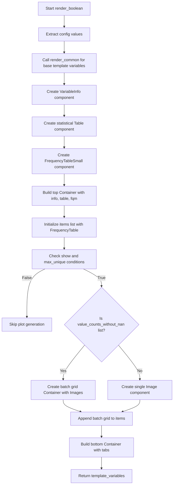

# `render_boolean.py`

## `src.ydata_profiling.report.structure.variables.render_boolean.render_boolean` · *function*

## Summary:
Generates HTML template variables for rendering boolean variable reports with metadata, statistics, frequency tables, and optional visualizations.

## Description:
This function creates a structured dictionary of template variables used to render HTML reports for boolean variables. It builds upon common rendering logic, adds boolean-specific metadata, and constructs UI components including variable information, statistical tables, frequency distributions, and optional categorical plots. The function handles both single and multiple frequency distributions and conditionally renders visualizations based on configuration settings.

## Args:
    config (Settings): Configuration object containing report settings including variable-specific options, plot configurations, and HTML styling preferences.
    summary (dict): Dictionary containing variable summary statistics including metadata (varid, varname, description, alerts), counts (n_distinct, n_missing, n), percentages (p_distinct, p_missing), memory usage, and frequency data (value_counts_without_nan, value_counts_index_sorted).

## Returns:
    dict: Template variables dictionary containing:
        - 'top': Container with VariableInfo, Table of statistics, and FrequencyTableSmall
        - 'bottom': Container with tabs containing FrequencyTable and optionally categorical plots
        - 'freq_table_rows': Formatted frequency table rows from render_common
        - 'firstn_expanded': Extreme observations table for first N values
        - 'lastn_expanded': Extreme observations table for last N values

## Raises:
    None explicitly raised, but may propagate exceptions from:
        - render_common() function
        - freq_table() utility
        - cat_frequency_plot() visualization generator
        - internal pandas operations in frequency table processing

## Constraints:
    Preconditions:
        - summary dictionary must contain all required keys: varid, varname, description, alerts, n_distinct, p_distinct, n_missing, p_missing, memory_size, n, value_counts_without_nan, value_counts_index_sorted
        - config must be a valid Settings object with properly initialized nested configurations
        - config.vars.bool.n_obs must be defined
        - config.plot.image_format must be defined
        - config.plot.cat_freq.show and config.plot.cat_freq.max_unique must be defined
    Postconditions:
        - Returns a complete template_variables dictionary ready for HTML rendering
        - All UI components are properly constructed with correct anchor IDs and styling

## Side Effects:
    None

## Control Flow:

## Examples:
    # Basic usage with minimal configuration
    config = Settings()
    summary = {
        "varid": "bool_var_1",
        "varname": "is_active",
        "description": "User activity status",
        "alerts": [],
        "n_distinct": 2,
        "p_distinct": 100.0,
        "n_missing": 0,
        "p_missing": 0.0,
        "memory_size": 1024,
        "n": 1000,
        "value_counts_without_nan": pd.Series([750, 250], index=[True, False]),
        "value_counts_index_sorted": pd.Series([250, 750], index=[False, True])
    }
    template_vars = render_boolean(config, summary)
    # Returns dictionary with 'top' and 'bottom' containers for HTML rendering

