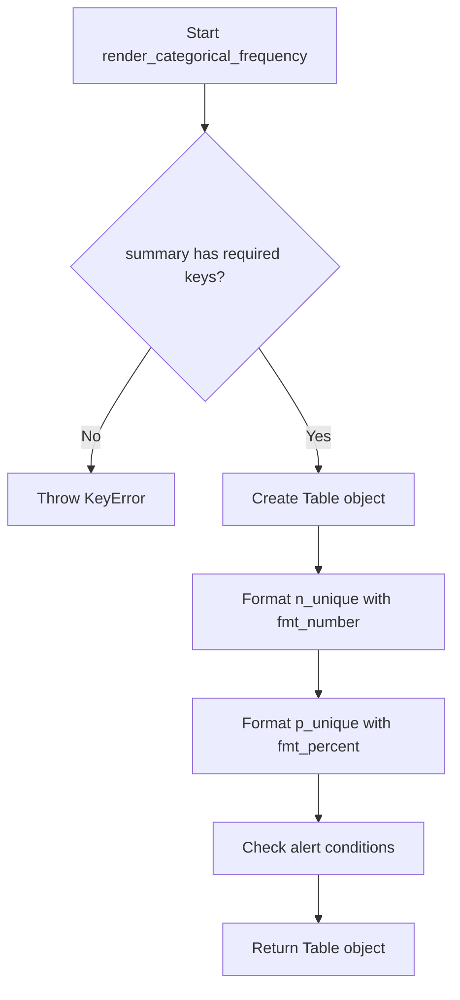
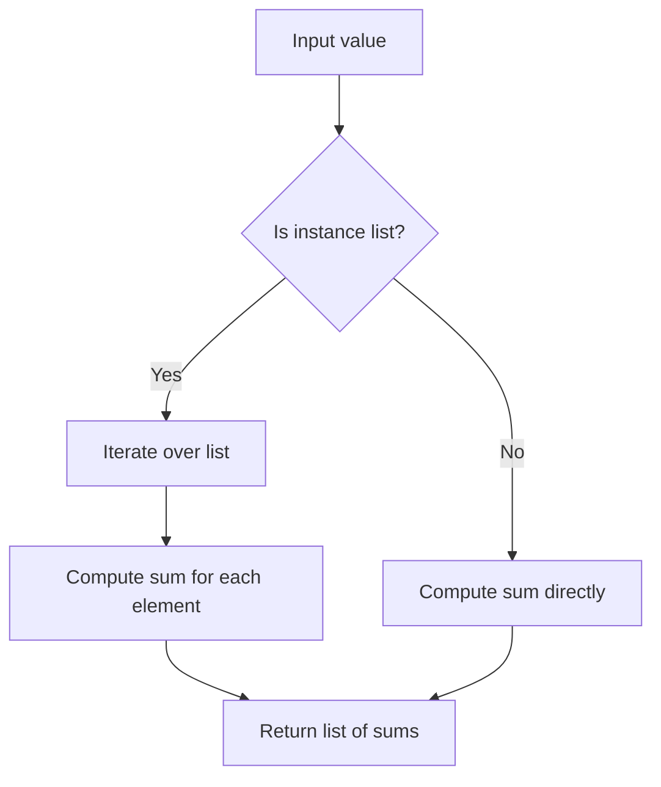
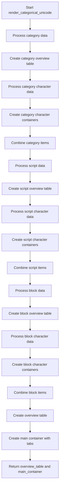

```mermaid
flowchart TD
    A[Start render_categorical] --> B[Extract config and summary values]
    B --> C[Call render_common for shared components]
    C --> D[Create VariableInfo component]
    D --> E[Create summary table]
    E --> F[Create FrequencyTableSmall]
    F --> G[Assemble top container]
    G --> H[Create frequency table]
    H --> I[Call render_categorical_frequency]
    I --> J[Initialize overview_items list]
    J --> K{length and max_length in summary?}
    K -- Yes --> L[Call render_categorical_length]
    L --> M[Add length_table to overview_items]
    M --> N{characters and category_alias_counts in summary?}
    N -- Yes --> O[Call render_categorical_unicode]
    O --> P[Add overview_table_char to overview_items]
    P --> Q[Add unique_stats to overview_items]
    Q --> R{not redact?}
    R -- Yes --> S[Create sample table]
    S --> T[Add sample to overview_items]
    T --> U[Initialize string_items]
    U --> V{length and max_length in summary?}
    V -- Yes --> W[Add length_histo to string_items]
    W --> X[Check plot conditions]
    X --> Y{show and max_unique > 0?}
    Y -- Yes --> Z{value_counts is list?}
    Z -- Yes --> AA[Create batch_grid container with images]
    Z -- No --> AB{single label and n_distinct <= max_unique?}
    AB -- Yes --> AC[Create single Image component]
    AA --> AD[Add to string_items]
    AC --> AD
    AD --> AE[Create bottom_items list]
    AE --> AF[Create Overview container]
    AF --> AG[Create Categories container]
    AG --> AH{words and word_counts in summary?}
    AH -- Yes --> AI[Create word frequency table]
    AI --> AJ[Add word container to bottom_items]
    AJ --> AK{characters and category_alias_counts in summary?}
    AK -- Yes --> AL[Add character container to bottom_items]
    AL --> AM[Create final bottom container with tabs]
    AM --> AN[Return template_variables]
```

# `render_categorical.py`

## `src.ydata_profiling.report.structure.variables.render_categorical.render_categorical_frequency` · *function*

## Summary:
Creates a frequency table displaying unique value statistics for categorical variables in report output.

## Description:
Generates a formatted table showing the count and percentage of unique values for a categorical variable. This function extracts unique value statistics from the variable summary and formats them into a standardized table structure for reporting purposes.

This logic is extracted into its own function to separate the presentation layer (table formatting) from the data processing layer (summary extraction), enabling reuse across different categorical variable rendering contexts while maintaining consistent statistical display formatting.

## Args:
    config (Settings): Configuration settings for report generation, including HTML styling options
    summary (dict): Dictionary containing variable statistics including 'n_unique' and 'p_unique' keys
    varid (str): Unique identifier for the variable, used to generate anchor IDs for HTML linking

## Returns:
    Renderable: A Table object containing two rows showing unique count and percentage statistics with appropriate formatting and alert indicators

## Raises:
    KeyError: If summary dictionary is missing required keys 'n_unique' or 'p_unique'
    KeyError: If summary dictionary is missing 'alert_fields' key

## Constraints:
    Preconditions:
    - summary dictionary must contain 'n_unique', 'p_unique', and 'alert_fields' keys
    - config must be a valid Settings object with html.style attribute
    - varid must be a non-empty string

    Postconditions:
    - Returned Table object is properly formatted with HTML anchor ID
    - Table contains exactly two rows with correct statistical values
    - Alert indicators are set based on presence of field names in alert_fields

## Side Effects:
    None

## Control Flow:


## Examples:
```python
# Basic usage
config = Settings()
summary = {
    "n_unique": 42,
    "p_unique": 0.85,
    "alert_fields": ["n_unique"]
}
varid = "category_var_1"
result = render_categorical_frequency(config, summary, varid)
# Returns Table with "Unique" (42) and "Unique (%)" (85%) rows

# Edge case with no alerts
summary_no_alert = {
    "n_unique": 100,
    "p_unique": 0.25,
    "alert_fields": []
}
result2 = render_categorical_frequency(config, summary_no_alert, varid)
# Returns Table with "Unique" (100) and "Unique (%)" (25%) rows, no alerts
```

## `src.ydata_profiling.report.structure.variables.render_categorical.render_categorical_length` · *function*

## Summary:
Generates a pair of presentation components showing categorical variable length statistics and histogram for profiling reports.

## Description:
Creates a table displaying length statistics (maximum, median, mean, minimum) and a histogram visualizing the distribution of lengths for categorical variable values. This function is part of the categorical variable rendering pipeline and extracts length-related information from the profiling summary to create standardized report components.

## Args:
    config (Settings): Configuration object containing report settings including styling and plot parameters
    summary (dict): Dictionary containing categorical variable statistics including length metrics and histogram data
    varid (str): Unique identifier for the variable, used to generate stable anchor IDs for report elements

## Returns:
    Tuple[Renderable, Renderable]: A tuple containing two renderable components:
        - Table: Statistics table with max, median, mean, and min length values
        - Image: Histogram visualization of length distribution

## Raises:
    None explicitly raised by this function

## Constraints:
    Preconditions:
        - summary dictionary must contain keys: "max_length", "median_length", "mean_length", "min_length", "histogram_length"
        - config must be a valid Settings object with properly initialized html and plot configurations
        - varid must be a non-empty string for anchor ID generation
    
    Postconditions:
        - Both returned components are valid Renderable instances
        - Table contains exactly 4 rows with length statistics
        - Image component contains valid histogram data

## Side Effects:
    None

## Control Flow:
```mermaid
flowchart TD
    A[Start render_categorical_length] --> B[Create length_table]
    B --> C{histogram_length is list?}
    C -- Yes --> D[Extract x[0] and x[1] from histogram_length]
    C -- No --> E[Unpack histogram_length as *args]
    D --> F[Call histogram with extracted data]
    E --> F
    F --> G[Create length_histo Image]
    G --> H[Return (length_table, length_histo)]
```

## `src.ydata_profiling.report.structure.variables.render_categorical._get_n` · *function*

## Summary:
Computes the sum of values from either a list of pandas objects or a single pandas object.

## Description:
This utility function extracts the total count/sum from categorical data representations. It handles two distinct input types: a list of pandas objects (where each element needs to be summed individually) or a single pandas object that can be summed directly. The function is designed to work with categorical variable analysis where counts or frequencies need to be aggregated.

## Args:
    value (Union[list, pd.DataFrame]): Input data which can either be:
        - A list of pandas Series/DataFrames where each element's sum will be computed
        - A single pandas Series/DataFrame whose sum will be computed directly

## Returns:
    Union[int, List[int]]: The computed sum(s) as:
        - An integer when input is a single pandas object
        - A list of integers when input is a list of pandas objects

## Raises:
    AttributeError: If the input value does not have a `.sum()` method (though this would be a programming error in normal usage)

## Constraints:
    - Preconditions: Input must be either a list of pandas objects or a single pandas object with a `.sum()` method
    - Postconditions: The returned value represents the total count/sum of the input data

## Side Effects:
    None

## Control Flow:


## Examples:
    # Example 1: Single DataFrame input
    df = pd.DataFrame({'col': [1, 2, 3]})
    result = _get_n(df)  # Returns 6
    
    # Example 2: List of DataFrames input  
    df1 = pd.DataFrame({'col': [1, 2]})
    df2 = pd.DataFrame({'col': [3, 4]})
    result = _get_n([df1, df2])  # Returns [3, 7]
```

## `src.ydata_profiling.report.structure.variables.render_categorical.render_categorical_unicode` · *function*

## Summary:
Renders comprehensive Unicode character analysis for categorical variables, displaying frequency distributions across categories, scripts, blocks, and individual characters.

## Description:
This function generates detailed Unicode analysis reports for categorical text data by constructing frequency tables and visualizations for character categories, scripts, blocks, and individual characters. It processes summary statistics from Unicode analysis to create structured presentation components that organize data hierarchically for reporting purposes.

The function is designed to be called during the report generation phase of data profiling, specifically for categorical variables that contain Unicode text. It creates a multi-tabbed presentation structure showing character-level breakdowns while maintaining consistent naming conventions and anchor IDs for navigation.

## Args:
    config (Settings): Configuration object containing report settings including frequency table limits and styling preferences
    summary (dict): Dictionary containing pre-computed Unicode analysis statistics including category, script, block, and character frequency data
    varid (str): Unique identifier for the variable being analyzed, used to generate consistent anchor IDs for navigation

## Returns:
    Tuple[Renderable, Renderable]: A tuple containing:
        - overview_table (Table): A summary table with key Unicode statistics (total characters, distinct categories/scripts/blocks)
        - Container: A tabbed container holding categorized Unicode analysis sections (Characters, Categories, Scripts, Blocks)

## Raises:
    None explicitly raised, though underlying functions may raise exceptions from pandas operations or data processing

## Constraints:
    - Preconditions: 
        * config must be a valid Settings object with n_freq_table_max attribute
        * summary must contain all required Unicode analysis keys: category_alias_counts, category_alias_char_counts, script_counts, script_char_counts, block_alias_counts, block_alias_char_counts, character_counts, n_characters, n_characters_distinct, n_category, n_scripts, n_block_alias
        * varid must be a non-empty string for anchor ID generation
    - Postconditions:
        * Returns a properly structured tuple of presentation components
        * All generated anchor IDs are unique and follow the expected naming convention

## Side Effects:
    None

## Control Flow:


## Examples:
    # Basic usage in report generation
    config = Settings()
    summary = {
        "category_alias_counts": pd.Series([100, 50, 25], index=["Letter", "Number", "Punctuation"]),
        "category_alias_char_counts": {"Letter": pd.Series([10, 5], index=["A", "B"]), "Number": pd.Series([8, 3], index=["1", "2"])},
        "script_counts": pd.Series([120, 80], index=["Latin", "Greek"]),
        "script_char_counts": {"Latin": pd.Series([15, 10], index=["a", "b"]), "Greek": pd.Series([12, 8], index=["α", "β"])},
        "block_alias_counts": pd.Series([200, 150], index=["Basic_Latin", "Latin_1_Supplement"]),
        "block_alias_char_counts": {"Basic_Latin": pd.Series([25, 20], index=["a", "b"]), "Latin_1_Supplement": pd.Series([18, 15], index=["à", "á"])},
        "character_counts": pd.Series([30, 25, 20], index=["a", "b", "c"]),
        "n_characters": 1000,
        "n_characters_distinct": 26,
        "n_category": 5,
        "n_scripts": 3,
        "n_block_alias": 2
    }
    varid = "var_123"
    
    overview_table, unicode_container = render_categorical_unicode(config, summary, varid)
```

## `src.ydata_profiling.report.structure.variables.render_categorical.render_categorical` · *function*

## Summary:
Generates a comprehensive categorical variable report structure including metadata, frequency distributions, and statistical summaries for profiling reports.

## Description:
Creates a complete presentation-ready structure for categorical variables in data profiling reports. This function orchestrates the assembly of various report components including variable metadata, frequency tables, statistical summaries, and optional visualizations. It integrates with the broader reporting pipeline by leveraging common rendering utilities and specialized categorical analysis functions.

The function is designed to be called during the report generation phase of data profiling, specifically for categorical variables. It organizes data into a structured template_variables dictionary that can be consumed by downstream rendering components to generate the final HTML report.

## Args:
    config (Settings): Configuration object containing report settings including styling, plot parameters, and categorical variable analysis options
    summary (dict): Dictionary containing pre-computed categorical variable statistics and metadata including:
        - varid (str): Unique identifier for the variable
        - varname (str): Human-readable name of the variable
        - type (str or list): Data type classification of the variable
        - alerts (list): List of data quality alerts associated with this variable
        - description (str): Detailed description of the variable
        - n_distinct (int): Count of distinct values
        - p_distinct (float): Percentage of distinct values
        - n_missing (int): Count of missing values
        - p_missing (float): Percentage of missing values
        - memory_size (int): Memory footprint in bytes
        - value_counts_without_nan (pd.Series or list): Frequency counts of values
        - count (int): Total count of observations
        - first_rows (list or pd.Series): Sample rows of data
        - n_unique (int): Count of unique values
        - p_unique (float): Percentage of unique values
        - alert_fields (list): Fields that triggered alerts
        - max_length (int): Maximum length of values
        - median_length (float): Median length of values
        - mean_length (float): Mean length of values
        - min_length (int): Minimum length of values
        - histogram_length (list or tuple): Length distribution histogram data
        - word_counts (pd.Series): Word frequency counts
        - category_alias_counts (pd.Series): Category alias frequency counts
        - category_alias_char_counts (dict): Character frequency counts by category alias
        - script_counts (pd.Series): Script frequency counts
        - script_char_counts (dict): Character frequency counts by script
        - block_alias_counts (pd.Series): Block alias frequency counts
        - block_alias_char_counts (dict): Character frequency counts by block alias
        - character_counts (pd.Series): Individual character frequency counts
        - n_characters (int): Total character count
        - n_characters_distinct (int): Distinct character count
        - n_category (int): Category count
        - n_scripts (int): Script count
        - n_block_alias (int): Block alias count

## Returns:
    dict: Template variables dictionary containing structured report components organized into 'top' and 'bottom' sections:
        - top: Container with VariableInfo, Table, and FrequencyTableSmall components
        - bottom: Container with Overview and Categories tabs, potentially including Words and Characters sections

## Raises:
    KeyError: If summary dictionary is missing required keys for any of the report components
    AttributeError: If config object lacks required attributes or methods
    TypeError: If input parameters are not of expected types

## Constraints:
    Preconditions:
        - config must be a valid Settings object with properly initialized attributes
        - summary must contain all required keys for variable metadata and statistics
        - All referenced configuration options must be properly initialized
    Postconditions:
        - Returns a dictionary with properly structured report components
        - All generated anchor IDs follow consistent naming conventions
        - Components are properly linked through anchor IDs for navigation

## Side Effects:
    None

## Control Flow:


## Examples:
```python
# Basic usage in report generation
config = Settings()
summary = {
    "varid": "category_var_1",
    "varname": "Product Category",
    "type": "Categorical",
    "alerts": [],
    "description": "Categories of products sold",
    "n_distinct": 15,
    "p_distinct": 0.75,
    "n_missing": 2,
    "p_missing": 0.01,
    "memory_size": 1024,
    "value_counts_without_nan": pd.Series([50, 30, 15, 5], index=['Electronics', 'Clothing', 'Books', 'Home']),
    "count": 200,
    "first_rows": [['Electronics'], ['Clothing'], ['Books']],
    "n_unique": 15,
    "p_unique": 0.75,
    "alert_fields": [],
    "max_length": 20,
    "median_length": 12.5,
    "mean_length": 13.2,
    "min_length": 5,
    "histogram_length": ([5, 10, 15, 20], [10, 25, 40, 25]),
    "word_counts": pd.Series([100, 50, 25], index=['product', 'sale', 'discount']),
    "category_alias_counts": pd.Series([100, 50], index=['Letter', 'Number']),
    "category_alias_char_counts": {'Letter': pd.Series([50, 30], index=['A', 'B'])},
    "script_counts": pd.Series([120, 80], index=['Latin', 'Greek']),
    "script_char_counts": {'Latin': pd.Series([15, 10], index=['a', 'b'])},
    "block_alias_counts": pd.Series([200, 150], index=['Basic_Latin', 'Latin_1_Supplement']),
    "block_alias_char_counts": {'Basic_Latin': pd.Series([25, 20], index=['a', 'b'])},
    "character_counts": pd.Series([30, 25], index=['a', 'b']),
    "n_characters": 1000,
    "n_characters_distinct": 26,
    "n_category": 5,
    "n_scripts": 3,
    "n_block_alias": 2
}

template_vars = render_categorical(config, summary)
# Returns structured template variables ready for report rendering
```

