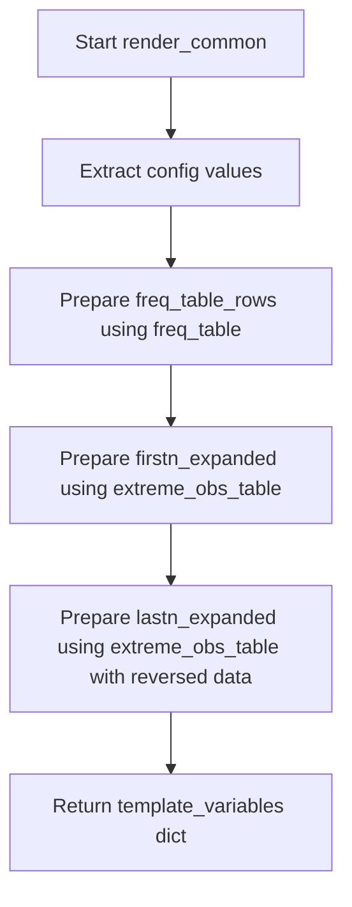

# `render_common.py`

## `src.ydata_profiling.report.structure.variables.render_common.render_common` · *function*

## Summary:
Generates common template variables for variable report sections, including frequency tables and extreme observations.

## Description:
This function prepares standardized data structures for rendering variable-level reports by processing frequency distributions and extreme observations according to configuration settings. It extracts and formats key statistical information from variable summaries to support UI presentation in profiling reports.

The function is designed to be reusable across different variable types in the reporting system, ensuring consistent data formatting and presentation patterns. It encapsulates the logic for generating frequency tables and extreme observation displays, separating this concern from the higher-level report generation logic.

## Args:
    config (Settings): Configuration object containing report settings such as maximum frequency table entries (n_freq_table_max) and extreme observation limits (n_extreme_obs).
    summary (dict): Dictionary containing variable summary statistics including value_counts_without_nan, value_counts_index_sorted, and n (total observations).

## Returns:
    dict: Template variables dictionary containing:
        - freq_table_rows: Formatted frequency table data for display (list of dictionaries)
        - firstn_expanded: Extreme observations from the beginning of sorted data (list of lists of dictionaries)
        - lastn_expanded: Extreme observations from the end of sorted data (list of lists of dictionaries)

## Raises:
    None explicitly raised by this function, but may propagate exceptions from underlying utility functions (freq_table, extreme_obs_table).

## Constraints:
    Preconditions:
        - config must be a valid Settings instance with n_extreme_obs and n_freq_table_max attributes
        - summary must contain keys: "value_counts_without_nan", "value_counts_index_sorted", and "n"
        - All referenced keys in summary must be present and contain appropriate data types
    Postconditions:
        - Returns a dictionary with exactly the three specified keys
        - All returned values are properly formatted for template rendering

## Side Effects:
    None

## Control Flow:


## Examples:
```python
# Typical usage in report generation
config = Settings()
summary = {
    "value_counts_without_nan": pd.Series([10, 5, 3], index=['A', 'B', 'C']),
    "value_counts_index_sorted": pd.Series([10, 5, 3], index=['A', 'B', 'C']),
    "n": 18
}
template_vars = render_common(config, summary)
# Returns dict with freq_table_rows, firstn_expanded, and lastn_expanded
```

