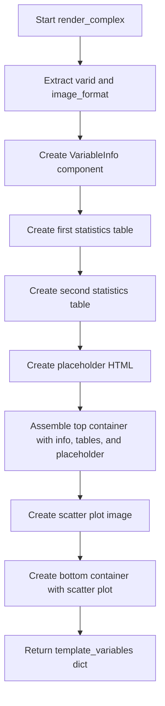

# `render_complex.py`

## `src.ydata_profiling.report.structure.variables.render_complex.render_complex` · *function*

## Summary:
Generates HTML report components for complex number variables, including metadata tables and scatter plot visualizations.

## Description:
This function renders the presentation layer components for complex number variables in profiling reports. It creates structured metadata tables showing distribution statistics and descriptive measures, along with a scatter plot visualization of the complex data in the complex plane. The function orchestrates the creation of VariableInfo metadata, statistical tables, and interactive visualizations for complex number data types.

## Args:
    config (Settings): Configuration object containing report settings including styling and plot preferences
    summary (dict): Dictionary containing variable summary statistics and metadata for complex number variables

## Returns:
    dict: Template variables containing 'top' and 'bottom' sections for report rendering:
          - 'top': Container with VariableInfo, distinct/missing statistics table, and descriptive statistics table
          - 'bottom': Container with scatter plot visualization

## Raises:
    None explicitly raised by this function

## Constraints:
    Preconditions:
        - config must contain valid HTML and plot configuration settings
        - summary must contain required keys: varid, varname, alerts, description, n_distinct, p_distinct, n_missing, p_missing, memory_size, mean, min, max, n_zeros, p_zeros, scatter_data
    Postconditions:
        - Returns a dictionary with properly formatted template variables for report generation
        - All data is formatted using appropriate formatters for consistent presentation

## Side Effects:
    - Creates matplotlib plots internally through scatter_complex function
    - May modify global matplotlib state through plt calls
    - Uses seaborn for color palette generation in plots
    - Calls plot_360_n0sc0pe for final HTML conversion

## Control Flow:

