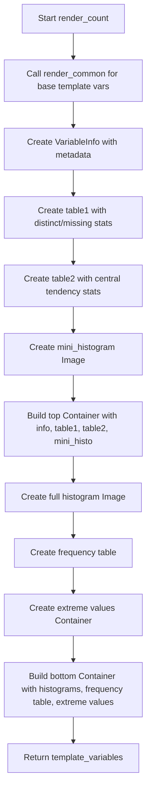

# `render_count.py`

## `src.ydata_profiling.report.structure.variables.render_count.render_count` · *function*

## Summary:
Generates HTML template variables for count-type variable reports, including metadata, statistics tables, histograms, and frequency distributions.

## Description:
This function creates a complete set of template variables for rendering count-type variable reports in profiling dashboards. It builds upon common report components by adding specific statistical information and visualizations for real number variables. The function orchestrates the creation of metadata containers, statistical tables, mini histograms, full histograms, and frequency distribution displays.

The function is designed to be called as part of the variable report generation pipeline, where it receives configuration settings and variable summary statistics, then constructs a comprehensive template variables dictionary ready for HTML rendering. It leverages existing utility functions and presentation components to ensure consistent formatting and visual presentation.

## Args:
    config (Settings): Configuration object containing report settings such as:
        - plot.image_format: Image format for plots (e.g., "png", "svg")
        - html.style: HTML styling configuration
        - report.precision: Numerical precision for formatting
        - n_extreme_obs: Number of extreme observations to display
    summary (dict): Dictionary containing variable summary statistics including:
        - varid: Variable identifier
        - varname: Variable name
        - alerts: List of data quality alerts
        - description: Variable description
        - n_distinct: Count of distinct values
        - p_distinct: Percentage of distinct values
        - n_missing: Count of missing values
        - p_missing: Percentage of missing values
        - mean: Mean value
        - min: Minimum value
        - max: Maximum value
        - n_zeros: Count of zero values
        - p_zeros: Percentage of zero values
        - memory_size: Memory usage in bytes
        - histogram: Histogram data tuple (series, bins)
        - value_counts_without_nan: Value counts without NaN values
        - value_counts_index_sorted: Sorted value counts index
        - n: Total number of observations

## Returns:
    dict: Template variables dictionary containing:
        - info: VariableInfo object with metadata
        - table1: Table with distinct and missing value statistics
        - table2: Table with central tendency and distribution statistics
        - mini_histo: Image component for mini histogram
        - top: Container with metadata and statistics tables
        - bottom: Container with histograms and frequency distributions
        - freq_table_rows: Formatted frequency table data
        - firstn_expanded: Extreme observations from beginning of data
        - lastn_expanded: Extreme observations from end of data

## Raises:
    None explicitly raised by this function. However, underlying calls to:
    - render_common() may raise exceptions if summary data is incomplete
    - Image() constructor may raise ValueError if image path is None
    - Table() constructor may raise exceptions if rows data is malformed
    - Container() constructor may raise exceptions if items are invalid

## Constraints:
    Preconditions:
        - config must be a valid Settings instance with required attributes
        - summary must contain all required keys with appropriate data types
        - All referenced keys in summary must be present and contain valid data
        - histogram data in summary must be a valid tuple of (series, bins)
    Postconditions:
        - Returns a dictionary with all expected template variables
        - All returned objects are properly initialized presentation components
        - Template variables are structured for HTML report generation

## Side Effects:
    None

## Control Flow:


## Examples:
```python
# Typical usage in report generation pipeline
config = Settings()
summary = {
    "varid": "var1",
    "varname": "Age",
    "alerts": [],
    "description": "Age of participants",
    "n_distinct": 45,
    "p_distinct": 0.45,
    "n_missing": 2,
    "p_missing": 0.02,
    "mean": 32.5,
    "min": 18,
    "max": 85,
    "n_zeros": 0,
    "p_zeros": 0.0,
    "memory_size": 1024,
    "histogram": (np.array([1, 2, 3]), np.array([0, 10, 20])),
    "value_counts_without_nan": pd.Series([10, 5, 3], index=['A', 'B', 'C']),
    "value_counts_index_sorted": pd.Series([10, 5, 3], index=['A', 'B', 'C']),
    "n": 100
}

template_vars = render_count(config, summary)
# Returns complete template variables for HTML report generation
```

