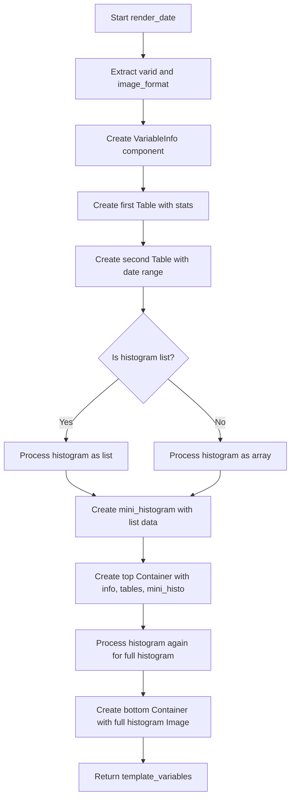

# `render_date.py`

## `src.ydata_profiling.report.structure.variables.render_date.render_date` · *function*

## Summary:
Generates HTML-ready presentation components for date variable profiling reports, including metadata tables, mini histograms, and full histograms.

## Description:
The `render_date` function is responsible for creating the visual and structural components of a date variable's profiling report section. It takes configuration settings and summary statistics for a date variable, then constructs a dictionary of presentation components that will be rendered in the final HTML report. This function specifically handles the formatting and organization of date-specific information such as date ranges, missing values, and distribution visualizations.

The function extracts key metadata from the summary dictionary and organizes it into structured presentation components including:
1. Variable information panel with name, type, and alerts
2. Statistical summary table with distinct counts, missing values, and memory usage
3. Date range table showing minimum and maximum dates
4. Mini histogram visualization for quick overview
5. Full histogram visualization with detailed bin information

This logic is extracted into its own function to separate the concerns of data processing and presentation layer construction, making the report generation modular and maintainable.

## Args:
    config (Settings): Configuration object containing report settings including HTML styling and plot parameters
    summary (Dict[str, Any]): Dictionary containing summary statistics for the date variable, including:
        - varid (str): Variable identifier
        - varname (str): Variable name
        - alerts (List): List of data quality alerts
        - description (str): Variable description
        - n_distinct (int): Number of distinct values
        - p_distinct (float): Percentage of distinct values
        - n_missing (int): Number of missing values
        - p_missing (float): Percentage of missing values
        - memory_size (int): Memory usage in bytes
        - min (str): Minimum date value
        - max (str): Maximum date value
        - histogram (Union[list, numpy.ndarray]): Histogram data structure (can be list or array)

## Returns:
    Dict[str, Any]: Template variables dictionary containing two keys:
        - "top": Container with variable info, summary table, range table, and mini histogram
        - "bottom": Container with full histogram image

## Raises:
    None explicitly raised by this function

## Constraints:
    Preconditions:
        - The summary dictionary must contain all required keys listed in Args
        - The config object must have valid plot.image_format and html.style attributes
        - The histogram data in summary must be either a list or array structure
    Postconditions:
        - Returns a properly structured template_variables dictionary
        - All presentation components are correctly initialized with appropriate data
        - Histogram data is processed consistently regardless of input format

## Side Effects:
    - Creates matplotlib figures and plots for histogram generation
    - May write image files to disk if config.html.inline is False
    - Calls matplotlib.pyplot functions which may affect global state
    - Uses base64 encoding for inline image generation when config.html.inline is True

## Control Flow:

## Examples:
    >>> config = Settings()
    >>> summary = {
    ...     "varid": "date_var_1",
    ...     "varname": "Order Date",
    ...     "alerts": [],
    ...     "description": "Order date field",
    ...     "n_distinct": 100,
    ...     "p_distinct": 0.5,
    ...     "n_missing": 5,
    ...     "p_missing": 0.025,
    ...     "memory_size": 1024,
    ...     "min": "2020-01-01",
    ...     "max": "2023-12-31",
    ...     "histogram": [[1, 2, 3], [10, 20, 30]]
    ... }
    >>> result = render_date(config, summary)
    >>> print(list(result.keys()))
    ['top', 'bottom']

