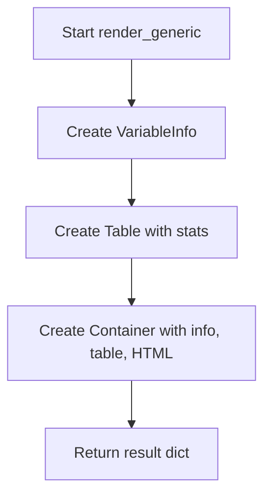

# `render_generic.py`

## `src.ydata_profiling.report.structure.variables.render_generic.render_generic` · *function*

## Summary:
Creates a standardized generic variable report section with metadata, statistics table, and placeholder HTML for unsupported variable types.

## Description:
The `render_generic` function generates a structured report section for variables that don't have specialized rendering logic. It creates a variable information block containing metadata and alerts, followed by a statistics table showing missing value counts and memory usage, and concludes with a placeholder HTML element. This function serves as a fallback renderer for variables that fall outside of supported data types or categories.

The function is typically called during report generation when no specific variable type handler exists for a given variable. It provides a consistent presentation format for all variables regardless of their underlying data characteristics.

## Args:
    config (Settings): Configuration object containing HTML styling settings and report preferences
    summary (dict): Dictionary containing variable metadata including:
        - varid (str): Unique identifier for the variable
        - alerts (List[Alert]): List of data quality alerts associated with the variable
        - varname (str): Human-readable name of the variable
        - description (str): Detailed description of the variable
        - n_missing (int): Count of missing values
        - p_missing (float): Percentage of missing values (0-1)
        - memory_size (int): Memory footprint in bytes
        - alert_fields (List[str]): Fields that triggered alerts

## Returns:
    dict: A dictionary containing two keys:
        - "top": Container object with VariableInfo, Table, and HTML elements arranged in a grid layout
        - "bottom": None (placeholder for future extensions)

## Raises:
    None explicitly raised by this function

## Constraints:
    Preconditions:
        - config must be a valid Settings object with html.style attribute
        - summary must contain all required keys: varid, alerts, varname, description, n_missing, p_missing, memory_size, alert_fields
        - All values in summary must be of expected types (str, int, float, list)
    Postconditions:
        - Returns a properly structured dictionary with top and bottom keys
        - The top value is always a Container with three elements in grid sequence
        - The bottom value is always None

## Side Effects:
    None

## Control Flow:

## Examples:
    >>> from ydata_profiling.config import Settings
    >>> config = Settings()
    >>> summary = {
    ...     "varid": "var1",
    ...     "alerts": [],
    ...     "varname": "Test Variable",
    ...     "description": "A test variable for demonstration",
    ...     "n_missing": 5,
    ...     "p_missing": 0.05,
    ...     "memory_size": 1024,
    ...     "alert_fields": []
    ... }
    >>> result = render_generic(config, summary)
    >>> print(type(result["top"]))
    <class 'ydata_profiling.report.presentation.core.container.Container'>
    >>> print(result["bottom"])
    None

