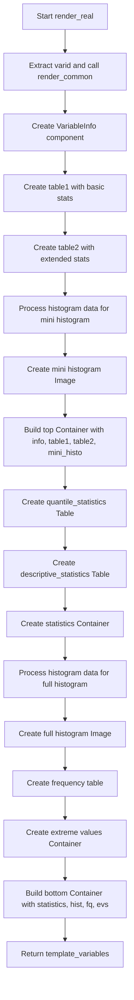

# `render_real.py`

## `src.ydata_profiling.report.structure.variables.render_real.render_real` · *function*

## Summary:
Generates a comprehensive HTML report section for real number (floating-point) variables, including statistical summaries, histograms, and frequency distributions.

## Description:
This function creates a complete report section for real number variables by combining various statistical summaries, visualizations, and data distributions into a structured template. It leverages the common rendering infrastructure from `render_common` to prepare frequency tables and extreme observations, then constructs specialized tables for quantile and descriptive statistics, histograms, and frequency distributions.

The function is designed to be called during the report generation pipeline for real number variables, providing a standardized presentation format that includes both numerical summaries and visual representations. It handles the complexity of different histogram data formats (list vs tuple) and ensures consistent formatting of all statistical values.

## Args:
    config (Settings): Configuration object containing report settings such as precision, image format, and extreme observation limits
    summary (dict): Dictionary containing comprehensive variable statistics including:
        - Statistical measures: mean, min, max, std, variance, skewness, kurtosis, etc.
        - Count information: n_distinct, n_missing, n_infinite, n_zeros, n_negative
        - Histogram data: histogram (can be list or tuple of arrays)
        - Additional metadata: varid, varname, alerts, description, alert_fields, etc.

## Returns:
    dict: Template variables dictionary containing:
        - 'top': Container with variable info, basic stats table, extended stats table, and mini histogram
        - 'bottom': Container with statistics, full histogram, frequency table, and extreme values tabs

## Raises:
    None explicitly raised by this function, but may propagate exceptions from:
        - Underlying utility functions (fmt, fmt_numeric, etc.)
        - Plotting functions (histogram, mini_histogram)
        - Template rendering components (Table, Container, Image, FrequencyTable)

## Constraints:
    Preconditions:
        - config must be a valid Settings instance with required attributes
        - summary must contain all expected keys with appropriate data types
        - histogram data in summary must be either a list of arrays or a tuple of arrays
        - All referenced keys in summary must be present and contain appropriate data types
    Postconditions:
        - Returns a dictionary with exactly two keys: 'top' and 'bottom'
        - All returned values are properly formatted for template rendering
        - The returned structure follows the expected report template format

## Side Effects:
    None

## Control Flow:


## Examples:
```python
# Typical usage in report generation pipeline
config = Settings()
summary = {
    "varid": "var1",
    "varname": "age",
    "alerts": [],
    "description": "Age of individuals",
    "alert_fields": [],
    "n_distinct": 100,
    "p_distinct": 0.8,
    "n_missing": 5,
    "p_missing": 0.05,
    "n_infinite": 0,
    "p_infinite": 0.0,
    "mean": 35.2,
    "min": 18.0,
    "max": 85.0,
    "n_zeros": 2,
    "p_zeros": 0.02,
    "n_negative": 1,
    "p_negative": 0.01,
    "memory_size": 1024,
    "histogram": [[0, 1, 2, 3], [10, 20, 15, 5]],
    "5%": 20.5,
    "25%": 25.0,
    "50%": 35.2,
    "75%": 45.0,
    "95%": 65.0,
    "range": 67.0,
    "iqr": 20.0,
    "std": 12.5,
    "cv": 0.36,
    "kurtosis": -0.5,
    "mad": 10.0,
    "skewness": 0.2,
    "sum": 3520.0,
    "variance": 156.25,
    "monotonic": 1
}

template_vars = render_real(config, summary)
# Returns dict with 'top' and 'bottom' containers ready for report rendering
```

