# `render_text.py`

## `src.ydata_profiling.report.structure.variables.render_text.render_text` · *function*

## Summary:
Generates a comprehensive text variable report structure including metadata, frequency distributions, and statistical summaries for profiling reports.

## Description:
Creates a complete presentation-ready structure for text variables in data profiling reports. This function orchestrates the assembly of various report components including variable metadata, summary statistics, frequency tables, and optional visualizations. It integrates with the broader reporting pipeline by leveraging common rendering utilities and specialized text analysis functions.

The function is designed to be called during the report generation phase of data profiling, specifically for text variables. It organizes data into a structured template_variables dictionary that can be consumed by downstream rendering components to generate the final HTML report.

When the `redact` configuration option is enabled, this function delegates to `render_categorical` to handle the rendering, ensuring consistent behavior for sensitive data.

## Args:
    config (Settings): Configuration object containing report settings including styling, plot parameters, and text variable analysis options
    summary (dict): Dictionary containing pre-computed text variable statistics and metadata including:
        - varid (str): Unique identifier for the variable
        - varname (str): Human-readable name of the variable
        - type (str): Data type classification of the variable
        - alerts (list): List of data quality alerts associated with this variable
        - description (str): Detailed description of the variable
        - n_distinct (int): Count of distinct values
        - p_distinct (int): Percentage of distinct values
        - n_missing (int): Count of missing values
        - p_missing (int): Percentage of missing values
        - memory_size (int): Memory footprint in bytes
        - first_rows (list or pd.Series): Sample rows of data
        - alert_fields (list): Fields that triggered alerts
        - max_length (int): Maximum length of values
        - median_length (float): Median length of values
        - mean_length (float): Mean length of values
        - min_length (int): Minimum length of values
        - histogram_length (list or tuple): Length distribution histogram data
        - word_counts (pd.Series): Word frequency counts
        - category_alias_counts (pd.Series): Category alias frequency counts
        - category_alias_char_counts (dict): Character frequency counts by category alias
        - script_counts (pd.Series): Script frequency counts
        - script_char_counts (dict): Character frequency counts by script
        - block_alias_counts (pd.Series): Block alias frequency counts
        - block_alias_char_counts (dict): Character frequency counts by block alias
        - character_counts (pd.Series): Individual character frequency counts
        - n_characters (int): Total character count
        - n_characters_distinct (int): Distinct character count
        - n_category (int): Category count
        - n_scripts (int): Script count
        - n_block_alias (int): Block alias count

## Returns:
    dict: Template variables dictionary containing structured report components organized into 'top' and 'bottom' sections:
        - top: Container with VariableInfo, Table, and optionally a mini wordcloud
        - bottom: Container with Overview and Tabs sections including Words and Characters if applicable

## Raises:
    None explicitly raised by this function

## Constraints:
    Preconditions:
        - config must be a valid Settings object with properly initialized attributes
        - summary must contain all required keys for variable metadata and statistics
        - All referenced configuration options must be properly initialized
    Postconditions:
        - Returns a dictionary with properly structured report components
        - All generated anchor IDs follow consistent naming conventions
        - Components are properly linked through anchor IDs for navigation

## Side Effects:
    None

## Control Flow:

```mermaid
flowchart TD
    A[Start render_text] --> B{config.vars.text.redact?}
    B -- Yes --> C[Call render_categorical]
    C --> D[Return render]
    B -- No --> E[Extract config and summary values]
    E --> F[Call render_common for shared components]
    F --> G[Create VariableInfo component]
    G --> H[Create summary table]
    H --> I[Create top container]
    I --> J{words and word_counts in summary?}
    J -- Yes --> K[Create mini wordcloud]
    K --> L[Add mini wordcloud to top container]
    L --> M[Initialize bottom_items and overview_items]
    M --> N{length and max_length in summary?}
    N -- Yes --> O[Call render_categorical_length]
    O --> P[Add length_table to overview_items]
    P --> Q{characters and category_alias_counts in summary?}
    Q -- Yes --> R[Call render_categorical_unicode]
    R --> S[Add overview_table_char to overview_items]
    S --> T[Call render_categorical_frequency]
    T --> U[Add unique_stats to overview_items]
    U --> V{not redact and first_rows in summary?}
    V -- Yes --> W[Create sample table]
    W --> X[Add sample to overview_items]
    X --> Y[Create overview container]
    Y --> Z[Add overview to bottom_items]
    Z --> AA{words and word_counts in summary?}
    AA -- Yes --> AB[Create word frequency table]
    AB --> AC[Create word container]
    AC --> AD[Add word container to bottom_items]
    AD --> AE{characters and category_alias_counts in summary?}
    AE -- Yes --> AF[Add character container to bottom_items]
    AF --> AG[Create final bottom container with tabs]
    AG --> AH[Return template_variables]
```


## Examples:
```python
# Basic usage in report generation
config = Settings()
summary = {
    "varid": "text_var_1",
    "varname": "Product Description",
    "type": "Text",
    "alerts": [],
    "description": "Descriptions of products sold",
    "n_distinct": 150,
    "p_distinct": 0.75,
    "n_missing": 2,
    "p_missing": 0.01,
    "memory_size": 10240,
    "first_rows": [['Excellent product'], ['Great quality'], ['Fast shipping']],
    "alert_fields": [],
    "max_length": 200,
    "median_length": 120.5,
    "mean_length": 130.2,
    "min_length": 50,
    "histogram_length": ([50, 100, 150, 200], [10, 25, 40, 25]),
    "word_counts": pd.Series([100, 50, 25], index=['product', 'sale', 'discount']),
    "category_alias_counts": pd.Series([100, 50], index=['Letter', 'Number']),
    "category_alias_char_counts": {'Letter': pd.Series([50, 30], index=['A', 'B'])},
    "script_counts": pd.Series([120, 80], index=['Latin', 'Greek']),
    "script_char_counts": {'Latin': pd.Series([15, 10], index=['a', 'b'])},
    "block_alias_counts": pd.Series([200, 150], index=['Basic_Latin', 'Latin_1_Supplement']),
    "block_alias_char_counts": {'Basic_Latin': pd.Series([25, 20], index=['a', 'b'])},
    "character_counts": pd.Series([30, 25], index=['a', 'b']),
    "n_characters": 1000,
    "n_characters_distinct": 26,
    "n_category": 5,
    "n_scripts": 3,
    "n_block_alias": 2
}

template_vars = render_text(config, summary)
# Returns structured template variables ready for report rendering
```

