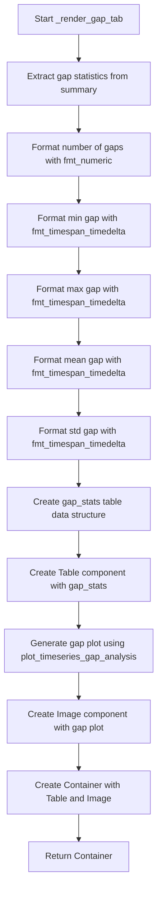

# `render_timeseries.py`

## `src.ydata_profiling.report.structure.variables.render_timeseries._render_gap_tab` · *function*

## Summary:
Renders a tab containing gap analysis statistics and visualization for time series data.

## Description:
This function generates a UI component that displays statistical information about gaps in time series data along with a visual representation of those gaps. It extracts gap statistics from the summary dictionary and formats them into a table, then creates a plot showing the actual gaps in the time series data. This function is part of the time series variable rendering pipeline and provides a dedicated tab for gap analysis within the profiling report.

The function is extracted into its own component to separate the concerns of gap analysis presentation from other time series visualization logic, making the rendering process modular and maintainable.

## Args:
    config (Settings): Configuration object containing report and plotting settings
    summary (dict): Dictionary containing time series analysis results including gap statistics

## Returns:
    Container: A container object holding both the gap statistics table and the gap visualization plot

## Raises:
    None explicitly raised by this function

## Constraints:
    Preconditions:
        - The summary dictionary must contain a "gap_stats" key with nested "gaps", "min", "max", "mean", "std", and "series" keys
        - The config object must have valid report and plot configurations
        - All required keys in summary["gap_stats"] must be present and properly formatted
    
    Postconditions:
        - Returns a properly formatted Container with two elements: a Table and an Image
        - The Table contains formatted gap statistics
        - The Image contains a properly rendered gap analysis plot

## Side Effects:
    None directly observable. The function relies on external plotting functions that may produce files or modify matplotlib state. The plot_360_n0sc0pe utility handles the final image serialization and storage based on configuration settings.

## Control Flow:


## Examples:
    >>> config = Settings()
    >>> summary = {
    ...     "gap_stats": {
    ...         "gaps": [pd.Series([1, 2]), pd.Series([3, 4])],
    ...         "min": pd.Timedelta("1 day"),
    ...         "max": pd.Timedelta("5 days"),
    ...         "mean": pd.Timedelta("3 days"),
    ...         "std": pd.Timedelta("1.5 days"),
    ...         "series": pd.Series([1, 2, 3, 4, 5])
    ...     },
    ...     "varid": "test_var"
    ... }
    >>> result = _render_gap_tab(config, summary)
    >>> isinstance(result, Container)
    True

## `src.ydata_profiling.report.structure.variables.render_timeseries.render_timeseries` · *function*

## Summary:
Generates a comprehensive HTML report section for numeric time series variables, including statistical summaries, visualizations, and gap analysis.

## Description:
This function constructs a complete report section for time series variables by combining various statistical tables, plots, and analysis components. It leverages the common rendering infrastructure from `render_common` to handle frequency tables and extreme observations, while adding time series-specific visualizations like histograms, autocorrelation plots, and gap analysis.

The function is designed to be a standalone component in the report generation pipeline, responsible for creating the complete UI structure for time series variables. It separates concerns by delegating common rendering tasks to `render_common` and specialized time series plotting to dedicated visualization functions.

## Args:
    config (Settings): Configuration object containing report settings such as image format, precision, and extreme observation limits
    summary (dict): Dictionary containing comprehensive time series statistics including variable metadata, descriptive statistics, histogram data, and gap analysis results

## Returns:
    dict: Template variables dictionary containing two main sections ('top' and 'bottom') that define the complete HTML structure for time series variable reports:
        - 'top': Contains basic variable information, summary statistics, and a mini time series plot
        - 'bottom': Contains detailed statistics, histogram, time series plots, gap analysis, frequency tables, and extreme values

## Raises:
    None explicitly raised by this function

## Constraints:
    Preconditions:
        - config must be a valid Settings instance with required attributes for HTML styling, plotting, and report formatting
        - summary must contain all required keys for time series analysis including: varid, varname, alerts, description, n_distinct, p_distinct, n_missing, p_missing, n_infinite, p_infinite, mean, min, max, n_zeros, p_zeros, memory_size, histogram, series, and all statistical measures
        - The histogram data in summary must either be a list of tuples or a tuple of arrays
        - All referenced keys in summary must be present and contain appropriate data types
    
    Postconditions:
        - Returns a dictionary with exactly two keys: 'top' and 'bottom'
        - Both 'top' and 'bottom' values are properly formatted Container objects
        - All contained components are correctly initialized with appropriate data and styling

## Side Effects:
    None directly observable. The function relies on external plotting functions that may produce files or modify matplotlib state. The plotting utilities handle image serialization and storage based on configuration settings.

## Control Flow:
```mermaid
flowchart TD
    A[Start render_timeseries] --> B[Extract basic variables from summary]
    B --> C[Call render_common for shared template variables]
    C --> D[Create VariableInfo component]
    D --> E[Create first summary table (distinct, missing, infinite)]
    E --> F[Create second summary table (mean, min, max, zeros, memory)]
    F --> G[Create mini time series plot]
    G --> H[Assemble top Container with info, tables, and plot]
    H --> I[Create quantile statistics table]
    I --> J[Create descriptive statistics table]
    J --> K[Create statistics Container with both tables]
    K --> L[Process histogram data (handle list vs tuple format)]
    L --> M[Create histogram Image component]
    M --> N[Create frequency table for common values]
    N --> O[Create extreme values Container with first/last N observations]
    O --> P[Create ACF/PACF plot]
    P --> Q[Create time series plot]
    Q --> R[Call _render_gap_tab for gap analysis]
    R --> S[Assemble bottom Container with all components]
    S --> T[Return template_variables dict]
```

## Examples:
```python
# Typical usage in report generation pipeline
config = Settings()
summary = {
    "varid": "ts_var_1",
    "varname": "temperature",
    "alerts": [],
    "description": "Temperature readings over time",
    "n_distinct": 100,
    "p_distinct": 0.8,
    "n_missing": 5,
    "p_missing": 0.05,
    "n_infinite": 0,
    "p_infinite": 0.0,
    "mean": 23.5,
    "min": 15.2,
    "max": 32.1,
    "n_zeros": 0,
    "p_zeros": 0.0,
    "memory_size": 1024,
    "histogram": ([1, 2, 3], [10, 20, 30]),
    "series": pd.Series([1, 2, 3, 4, 5]),
    # ... additional statistical fields
}

template_vars = render_timeseries(config, summary)
# Returns a dictionary with 'top' and 'bottom' containers for HTML rendering
```

