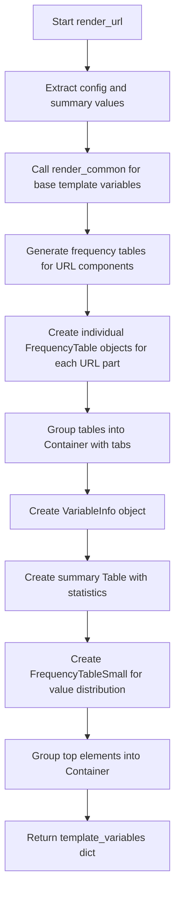

# `render_url.py`

## `src.ydata_profiling.report.structure.variables.render_url.render_url` · *function*

## Summary:
Generates template variables for rendering URL-specific report sections, including frequency tables for URL components and summary statistics.

## Description:
This function processes URL variable summaries to create structured template variables for report generation. It builds upon the common rendering logic by adding URL-specific frequency tables for scheme, netloc, path, query, and fragment components, along with comprehensive summary statistics and frequency distributions.

The function orchestrates the creation of multiple frequency tables (full URL, scheme, netloc, path, query, fragment) and organizes them into tabbed UI containers, while also generating summary statistics and value frequency distributions for display in profiling reports. It leverages formatters to ensure proper display of numerical values and percentages.

## Args:
    config (Settings): Configuration object containing report settings including frequency table limits (n_freq_table_max), category observation limits (vars.cat.n_obs), redaction settings (vars.cat.redact), and HTML styling options (html.style).

    summary (dict): Dictionary containing URL variable summary statistics including:
        - varid, varname, alerts, description: Variable metadata
        - n_distinct, p_distinct, n_missing, p_missing, memory_size: Statistical measures
        - value_counts_without_nan: Value frequency distribution
        - n: Total number of observations
        - scheme_counts, netloc_counts, path_counts, query_counts, fragment_counts: Frequency counts for URL components

## Returns:
    dict: Template variables dictionary containing:
        - All keys from render_common function output
        - freqtable_scheme, freqtable_netloc, freqtable_path, freqtable_query, freqtable_fragment: Formatted frequency tables for URL components
        - bottom: Container with tabbed frequency tables for URL components
        - top: Container with variable info, summary table, and frequency distribution

## Raises:
    None explicitly raised by this function, but may propagate exceptions from underlying utility functions (render_common, freq_table, fmt, fmt_percent, fmt_bytesize, etc.).

## Constraints:
    Preconditions:
        - config must be a valid Settings instance with appropriate attributes (n_freq_table_max, vars.cat.n_obs, vars.cat.redact, html.style)
        - summary must contain all required keys: varid, varname, alerts, description, n_distinct, p_distinct, n_missing, p_missing, memory_size, value_counts_without_nan, n, and URL component counts
        - All referenced keys in summary must be present and contain appropriate data types
    Postconditions:
        - Returns a dictionary with all expected template variables for URL report rendering
        - All frequency tables are properly formatted and truncated according to configuration limits
        - All numerical values are properly formatted using the appropriate formatters

## Side Effects:
    None

## Control Flow:


## Examples:
```python
# Typical usage in URL report generation
config = Settings()
summary = {
    "varid": "url_001",
    "varname": "website_url",
    "alerts": [],
    "description": "User website URLs",
    "n_distinct": 150,
    "p_distinct": 0.75,
    "n_missing": 5,
    "p_missing": 0.025,
    "memory_size": 2048,
    "value_counts_without_nan": pd.Series([10, 5, 3], index=['A', 'B', 'C']),
    "n": 200,
    "scheme_counts": pd.Series([120, 30, 50], index=['http', 'https', 'ftp']),
    "netloc_counts": pd.Series([150, 20, 30], index=['example.com', 'test.org', 'demo.net']),
    "path_counts": pd.Series([100, 50, 30], index=['/', '/page', '/api']),
    "query_counts": pd.Series([80, 60, 40], index=['?id=', '?q=', '&filter=']),
    "fragment_counts": pd.Series([20, 30, 10], index=['#section', '#top', '#bottom'])
}
template_vars = render_url(config, summary)
# Returns dict with all URL-specific template variables for report rendering
```

