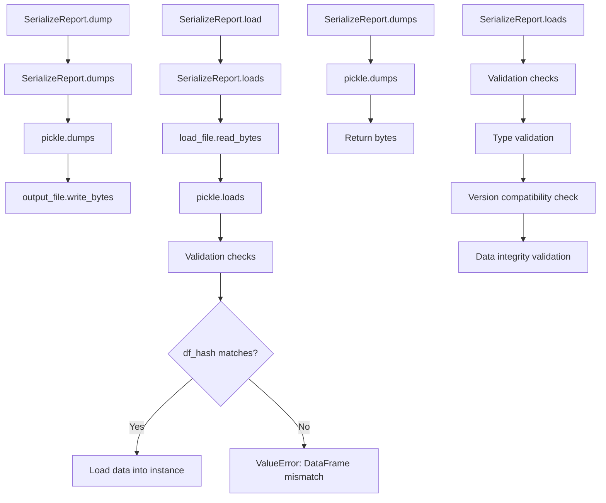

# `serialize_report.py`

## `src.ydata_profiling.serialize_report.SerializeReport` · *class*

## Summary:
SerializeReport is a utility class that provides serialization and deserialization capabilities for ProfileReport objects, enabling persistent storage and loading of profiling results.

## Description:
The SerializeReport class facilitates the persistence of ProfileReport data by providing methods to serialize the report's key components (DataFrame hash, configuration, description set, and report structure) into binary format and deserialize them back. This class is particularly useful for caching profiling results, transferring reports between systems, or storing analysis outcomes for later retrieval. It maintains compatibility checks between versions and handles data integrity validation during loading operations.

This class is typically accessed through the ProfileReport.serialize property and provides a mechanism to save and restore profiling sessions. It ensures that the serialized data maintains consistency with the original DataFrame and configuration settings, preventing accidental loading of incompatible data.

## State:
- df: Optional[Union[pandas.DataFrame, pyspark.sql.DataFrame]] - The input dataset being profiled, or None for lazy initialization
- config: Settings - Configuration object controlling profiling behavior, visualization options, and analysis parameters
- _df_hash: Optional[str] - Cached SHA256 hash of the DataFrame for change detection, defaults to None
- _report: Optional[Root] - Cached report structure for HTML/JSON/widget generation, defaults to None
- _description_set: Optional[BaseDescription] - Cached comprehensive statistical description of the dataset, defaults to None

## Lifecycle:
- Creation: Instantiate with a ProfileReport or similar object that has the required attributes. The class is typically accessed through ProfileReport.serialize property.
- Usage: Call dump() to serialize to file or dumps() to serialize to bytes, and load() to deserialize from file or loads() to deserialize from bytes
- Destruction: Standard Python garbage collection handles cleanup

## Method Map:


## Raises:
- ValueError: Raised when loading data fails due to corruption, version incompatibility, or DataFrame mismatch
- TypeError: May be raised during pickle operations if data types are incompatible

## Example:
```python
import pandas as pd
from ydata_profiling import ProfileReport

# Create a profile report
df = pd.DataFrame({"A": [1, 2, 3], "B": [4, 5, 6]})
profile = ProfileReport(df)

# Serialize to file
profile.serialize.dump("my_report.pp")

# Load from file
loaded_profile = ProfileReport()
loaded_profile.serialize.load("my_report.pp")

# Serialize to bytes
serialized_data = profile.serialize.dumps()

# Deserialize from bytes
new_profile = ProfileReport()
new_profile.serialize.loads(serialized_data)
```

### `src.ydata_profiling.serialize_report.SerializeReport.df_hash` · *method*

## Summary:
Returns the cached SHA256 hash of the DataFrame for change detection, or None if no DataFrame is available.

## Description:
This property provides access to a cached cryptographic hash of the underlying DataFrame. The hash is computed using SHA256 algorithm and prefixed with a constant to ensure uniqueness. It serves as a mechanism for detecting changes in the DataFrame content, enabling efficient comparison and validation operations. The hash is computed only once upon first access and then cached in the `_df_hash` attribute for subsequent accesses.

The property is designed to be used in conjunction with the serialization system to validate that loaded data matches the current DataFrame. When no DataFrame is associated with the object (i.e., `self.df` is None), this property returns None.

## Args:
    None

## Returns:
    Optional[str]: A hexadecimal SHA256 hash string prefixed with a constant, or None if the DataFrame is None.

## Raises:
    None

## State Changes:
    Attributes READ: self._df_hash, self.df
    Attributes WRITTEN: self._df_hash (only on first access)

## Constraints:
    Preconditions: The object must be initialized with a DataFrame or None
    Postconditions: Once computed, the hash is stored in self._df_hash and returned on subsequent calls

## Side Effects:
    None

### `src.ydata_profiling.serialize_report.SerializeReport.dumps` · *method*

## Summary:
Serializes the profile report data into a pickled byte string for storage or transmission within the SerializeReport class.

## Description:
This method serializes key components of the profile report including the dataframe hash, configuration, description set, and report structure into a compact binary format using Python's pickle module. It is designed to enable efficient storage and transfer of complete profiling results. This method is typically called during the serialization phase of a profile report workflow.

## Args:
    None

## Returns:
    bytes: A pickled byte string containing the serialized profile report data in the order: [df_hash, config, _description_set, _report]

## Raises:
    None explicitly raised

## State Changes:
    - Attributes READ: self.df_hash, self.config, self._description_set, self._report

## Constraints:
    - Preconditions: All attributes (df_hash, config, _description_set, _report) must be properly initialized and compatible with pickle serialization
    - Postconditions: The returned bytes can be deserialized back into the original data structure using pickle.loads()

## Side Effects:
    - Uses pickle module for serialization
    - No external service calls or I/O operations beyond the pickle process itself
    - May raise PickleError if any of the serialized objects are not pickle-compatible

### `src.ydata_profiling.serialize_report.SerializeReport.loads` · *method*

## Summary:
Loads serialized profiling data into the current ProfileReport instance, replacing or warning about existing report components.

## Description:
This method deserializes a byte stream containing profiling data and integrates it into the current ProfileReport instance. It validates the integrity of the serialized data and ensures compatibility with the current DataFrame and package version. The method is designed to be called during the deserialization phase of a ProfileReport object, allowing users to restore previously generated profiling reports. It is typically invoked by the load() method when restoring a saved profile report.

## Args:
    data (bytes): Serialized byte data containing the profiling report components in the order: (df_hash, config, description_set, report).

## Returns:
    Union[ProfileReport, SerializeReport]: Returns self (the current ProfileReport instance) after loading the serialized data.

## Raises:
    ValueError: Raised when the serialized data cannot be unpickled, contains invalid data types, or when the DataFrame hash doesn't match the current instance.

## State Changes:
    Attributes READ: self.df_hash, self._description_set, self._report, self.config, self._df_hash, self.df
    Attributes WRITTEN: self._description_set, self._report, self.config, self._df_hash

## Constraints:
    Preconditions: The data parameter must be valid pickled bytes containing the expected tuple structure. The current instance must have a compatible DataFrame hash or self.df must be None.
    Postconditions: The instance's _description_set, _report, config, and _df_hash attributes will be updated if the data is successfully loaded and validated.

## Side Effects:
    I/O: Reads from the provided bytes data parameter.
    External service calls: None.
    Mutations: Modifies self._description_set, self._report, self.config, and self._df_hash attributes. May emit warnings via the warnings module when existing components are not overwritten.

### `src.ydata_profiling.serialize_report.SerializeReport.dump` · *method*

## Summary:
Serializes and saves the current report data to a file with .pp extension.

## Description:
Writes the serialized representation of the report data (including DataFrame hash, configuration, description set, and report) to the specified output file. This method is part of the serialization workflow that allows saving profile reports for later loading. It converts the output_file parameter to a Path object if needed, ensures the file has a .pp extension, and writes the pickled data using the dumps() method.

## Args:
    output_file (Union[Path, str]): The path to the output file where the serialized data will be written. If a string is provided, it will be converted to a Path object.

## Returns:
    None: This method does not return any value.

## Raises:
    None explicitly raised, but may propagate exceptions from underlying I/O operations or pickle operations.

## State Changes:
    Attributes READ: 
    - self.df_hash
    - self.config
    - self._description_set
    - self._report
    
    Attributes WRITTEN: 
    - None

## Constraints:
    Preconditions:
    - The object must have valid data in self.df_hash, self.config, self._description_set, and self._report attributes.
    - The output_file path must be writable.
    
    Postconditions:
    - The specified file will contain the pickled serialized data of the report.
    - The file extension will be changed to ".pp".

## Side Effects:
    - Performs file I/O operation by writing bytes to disk.
    - May create or overwrite the specified output file.

### `src.ydata_profiling.serialize_report.SerializeReport.load` · *method*

## Summary:
Loads serialized profiling report data from a file into the current object instance.

## Description:
This method reads binary serialized data from a file and deserializes it into the current SerializeReport instance. It serves as a file-based loading mechanism for persisted profiling reports, enabling users to restore previously saved analysis states. The method validates that the loaded data is compatible with the current instance's DataFrame and configuration before applying the deserialized data.

## Args:
    load_file (Union[Path, str]): Path to the serialized file to load from, either as a pathlib.Path object or string.

## Returns:
    Union["ProfileReport", "SerializeReport"]: Returns self (the current instance) after successfully loading the serialized data.

## Raises:
    ValueError: Raised when:
        - The file cannot be read or parsed due to corruption or invalid format
        - The loaded data is incompatible with the current instance (DataFrame mismatch)
        - The loaded data fails validation checks for type consistency
    Exception: Propagated from pickle.loads() when deserialization fails.

## State Changes:
    Attributes READ: self.df_hash, self._description_set, self._report, self.config, self.df
    Attributes WRITTEN: self._description_set, self._report, self.config, self._df_hash

## Constraints:
    Preconditions:
        - The load_file must exist and be readable
        - The file must contain valid pickled data in the expected format
        - The current instance must be compatible with the loaded data (DataFrame hash check)
    Postconditions:
        - The instance's internal state is updated with data from the serialized file
        - All relevant attributes (_description_set, _report, config, _df_hash) are populated or updated
        - Warnings are issued if existing attributes would be overwritten

## Side Effects:
    - Reads from the filesystem at the specified load_file path
    - May issue warnings via the warnings module if existing data would be overwritten
    - May issue warnings if version mismatch is detected between loaded data and current installation

