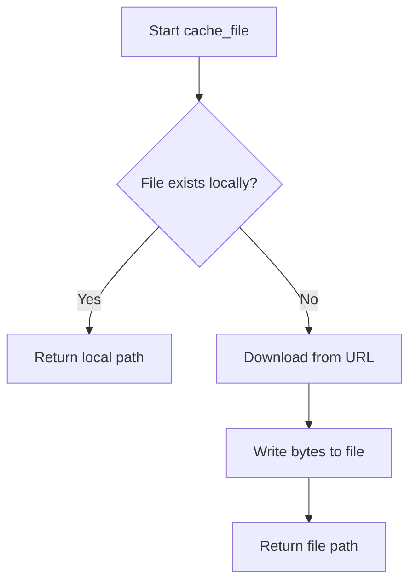
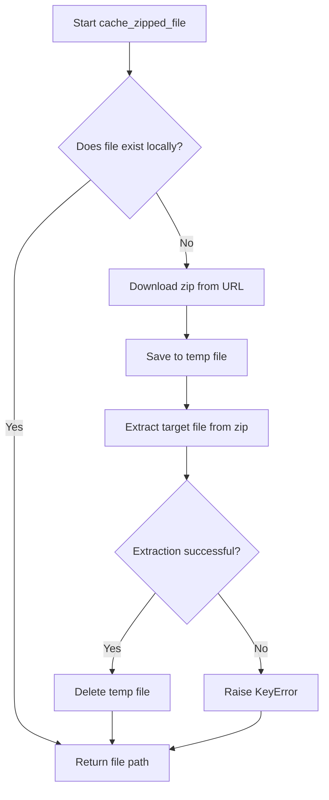

# `cache.py`

## `src.ydata_profiling.utils.cache.cache_file` · *function*

## Summary:
Retrieves a local cached copy of a remote file by downloading it if necessary.

## Description:
Downloads a file from a given URL and stores it locally in the project's data directory. If the file already exists locally, it skips the download and returns the path to the existing file. This function centralizes file caching logic to avoid redundant downloads and manage local storage efficiently.

## Args:
    file_name (str): Name of the file to cache locally
    url (str): URL from which to download the file if it doesn't exist locally

## Returns:
    Path: Absolute path to the cached file (either existing or newly downloaded)

## Raises:
    URLError: When the URL cannot be accessed or the download fails
    OSError: When file system operations fail (permissions, disk space, etc.)

## Constraints:
    Preconditions:
        - Valid string arguments for file_name and url
        - Network connectivity if file needs to be downloaded
    Postconditions:
        - File exists at the returned path
        - File is either downloaded from URL or already exists locally

## Side Effects:
    - Creates directory structure if it doesn't exist
    - Downloads file from URL if not cached locally
    - Writes file to local filesystem

## Control Flow:


## Examples:
```python
# Cache a dataset file
dataset_path = cache_file("iris.csv", "https://example.com/datasets/iris.csv")
# Returns Path object pointing to local cached file
```

## `src.ydata_profiling.utils.cache.cache_zipped_file` · *function*

## Summary:
Downloads and caches a zipped file from a URL, extracting a specific file from the archive to a local data directory.

## Description:
This function manages the downloading and caching of compressed files from remote URLs. It ensures that a requested file is available locally by downloading the containing zip archive if necessary, extracting the specific file, and storing it in the project's data directory. The function is designed to avoid redundant downloads by checking for existing local files.

## Args:
    file_name (str): The name of the file to extract from the zip archive and cache locally.
    url (str): The URL from which to download the zip archive containing the target file.

## Returns:
    Path: A Path object pointing to the cached file location on the local filesystem.

## Raises:
    URLError: When the HTTP request to fetch the zip archive fails due to network issues or invalid URL.
    KeyError: When the specified file_name is not found within the downloaded zip archive.
    BadZipFile: When the downloaded file is not a valid zip archive.

## Constraints:
    Preconditions:
        - The `file_name` parameter must be a valid filename string.
        - The `url` parameter must be a valid HTTP(S) URL pointing to a downloadable zip archive.
    Postconditions:
        - The returned Path will point to an existing file on the filesystem.
        - The file will be located in the project's data directory.

## Side Effects:
    - Creates a data directory in the project root if it doesn't exist.
    - Downloads data from a remote URL via HTTP(S).
    - Writes temporary and final files to the local filesystem.
    - May delete temporary files after extraction.

## Control Flow:


## Examples:
```python
# Download and cache a CSV file from a remote zip archive
csv_file_path = cache_zipped_file("dataset.csv", "https://example.com/data.zip")
# Returns Path object pointing to the cached CSV file
```

