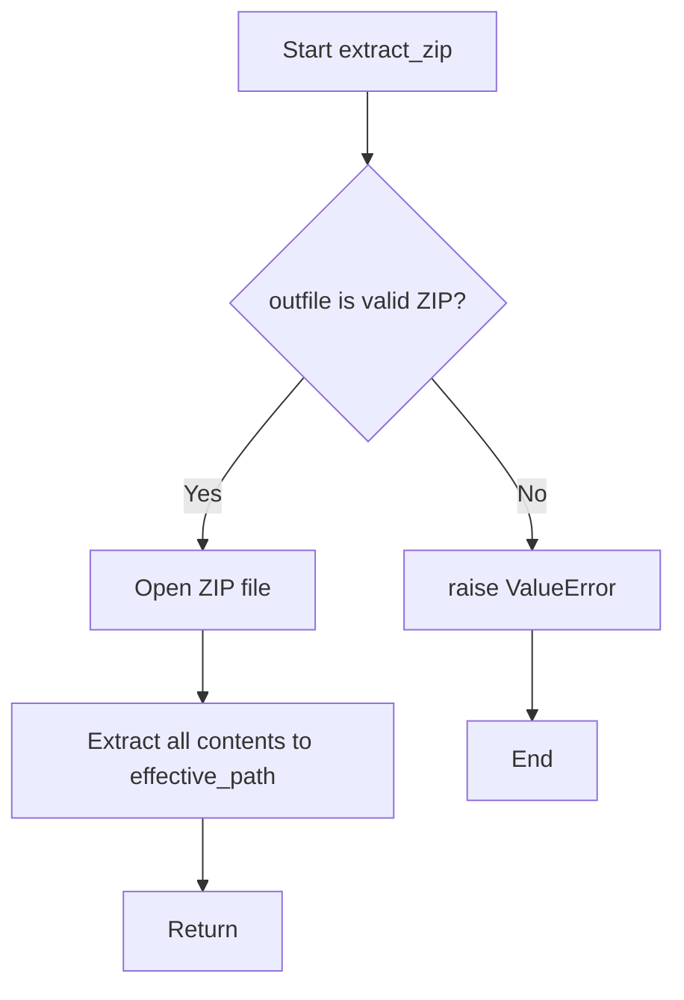

# `common.py`

## `src.ydata_profiling.utils.common.update` · *function*

## Summary:
Recursively updates a dictionary with key-value pairs from another mapping, preserving nested dictionary structures.

## Description:
This function performs a deep update operation on dictionaries, merging values from a source mapping into a target dictionary. When a value in the source mapping is itself a mapping type, the function recursively applies the update operation to the corresponding nested dictionary in the target. This allows for partial updates of complex nested structures while maintaining existing nested data.

The function is designed to handle nested dictionaries gracefully by recursively processing nested mappings, making it suitable for configuration updates, partial data structure modifications, and merging hierarchical data structures.

## Args:
    d (dict): The target dictionary to be updated with values from the source mapping.
    u (Mapping): The source mapping containing key-value pairs to update the target dictionary with.

## Returns:
    dict: The updated target dictionary, which is the same object as the input `d` parameter.

## Raises:
    None: This function does not explicitly raise any exceptions.

## Constraints:
    Preconditions:
        - The first argument `d` must be a dictionary.
        - The second argument `u` must be a mapping type (e.g., dict, collections.OrderedDict).
        
    Postconditions:
        - All key-value pairs from `u` are present in `d`.
        - Nested dictionaries in `d` are recursively updated with values from corresponding nested mappings in `u`.
        - The returned dictionary is identical to the input `d` (same object reference).

## Side Effects:
    None: This function has no side effects beyond modifying the input dictionary `d`.

## Control Flow:
```mermaid
flowchart TD
    A[Start update(d, u)] --> B{u.items() empty?}
    B -- Yes --> C[Return d]
    B -- No --> D[Iterate u.items()]
    D --> E{v isinstance collections.abc.Mapping?}
    E -- Yes --> F[update(d.get(k, {}), v)]
    E -- No --> G[d[k] = v]
    F --> H[d[k] = result]
    H --> I[Continue iteration]
    G --> I
    I --> J{More items?}
    J -- Yes --> D
    J -- No --> C
```

## Examples:
```python
# Basic usage
target = {'a': 1, 'b': 2}
source = {'b': 3, 'c': 4}
result = update(target, source)
# Result: {'a': 1, 'b': 3, 'c': 4}

# Nested dictionary update
target = {'a': {'x': 1, 'y': 2}, 'b': 2}
source = {'a': {'y': 3, 'z': 4}, 'c': 5}
result = update(target, source)
# Result: {'a': {'x': 1, 'y': 3, 'z': 4}, 'b': 2, 'c': 5}
```

## `src.ydata_profiling.utils.common._copy` · *function*

## Summary:
Copies a file from the current path to a specified target location.

## Description:
This method copies a file from the current file path to a designated target path. It is intended to be used as a method on Path-like objects that support the `is_file()` method. The method ensures that the source is indeed a file before performing the copy operation.

## Args:
    target (str or Path): The destination path where the file will be copied. Must be a valid path string or Path object.

## Returns:
    None: This method does not return any value.

## Raises:
    AssertionError: If the current object (self) does not represent a file (i.e., `self.is_file()` returns False).
    OSError: If the file copy operation fails due to permission issues, disk space problems, or invalid paths.

## Constraints:
    Preconditions:
        - The current object (self) must be a Path-like object with an `is_file()` method.
        - The `is_file()` method must return True for the current object.
        - The target path must be writable and accessible.
        - The source file must exist and be readable.
    Postconditions:
        - A copy of the file at the current path exists at the target path.
        - The original file remains unchanged.

## Side Effects:
    - File I/O operations: Reads from the current file path and writes to the target file path.
    - May raise OSError if file permissions or disk space issues occur during the copy process.

## Control Flow:
```mermaid
flowchart TD
    A[Start _copy method] --> B{self.is_file() ?}
    B -- No --> C[AssertionError]
    B -- Yes --> D[shutil.copy(str(self), target)]
    D --> E{shutil.copy success?}
    E -- No --> F[OSError]
    E -- Yes --> G[End _copy]
```

## Examples:
    # Assuming 'file_path' is a Path object pointing to an existing file
    file_path._copy("backup.txt")
    # Copies the file to 'backup.txt'
    
    # With absolute paths
    file_path._copy("/home/user/documents/backup.txt")
    # Copies the file to the specified absolute path

## `src.ydata_profiling.utils.common.extract_zip` · *function*

## Summary:
Extracts all files from a ZIP archive to a specified directory.

## Description:
This function handles the extraction of ZIP archive contents to a target directory. It is designed to be a thin wrapper around Python's standard `zipfile` module, providing consistent error handling for malformed ZIP files.

## Args:
    outfile (str): Path to the ZIP file to be extracted.
    effective_path (str): Directory path where the ZIP contents will be extracted.

## Returns:
    None: This function does not return any value.

## Raises:
    ValueError: Raised when the provided file is not a valid ZIP archive.

## Constraints:
    Preconditions:
        - The `outfile` parameter must point to a valid file path that exists on disk.
        - The `effective_path` parameter must be a valid directory path that exists on disk.
    Postconditions:
        - All files contained within the ZIP archive are extracted to the specified directory.
        - No files outside of the specified directory are modified or created.

## Side Effects:
    - File I/O operations: Reads from the ZIP file and writes to the filesystem at `effective_path`.
    - May create new files and directories in the target location if they don't already exist.

## Control Flow:


## Examples:
    # Extract a ZIP file to a directory
    extract_zip('data.zip', '/tmp/extracted')
    
    # This will raise ValueError if 'corrupt.zip' is not a valid ZIP file
    try:
        extract_zip('corrupt.zip', '/tmp/extracted')
    except ValueError as e:
        print(f"Error extracting ZIP: {e}")
```

## `src.ydata_profiling.utils.common.test_jpeg1` · *function*

## Summary:
Determines if a file buffer contains JPEG image data by checking for the presence of the JFIF signature in the first 23 bytes.

## Description:
This function performs a basic format detection for JPEG images by examining the initial bytes of a file buffer. It specifically looks for the "JFIF" marker that is commonly found in JPEG files. This extraction into a dedicated function allows for clean separation of file format detection logic from the main image processing pipeline, enabling reuse across different parts of the profiling system where JPEG detection is needed. The function follows the convention used by Python's `imghdr` module for format testing.

## Args:
    h (bytes): A byte string representing the beginning of a file buffer, typically the first 23 bytes of a file. This is the actual data being tested.
    f (Any): Unused parameter that maintains compatibility with the `imghdr` module interface convention. Not used in the implementation.

## Returns:
    str or None: Returns "jpeg" if the JFIF signature is detected in the first 23 bytes of the buffer; otherwise returns None.

## Raises:
    None: This function does not explicitly raise any exceptions.

## Constraints:
    Preconditions:
        - The input parameter `h` must be a bytes object.
        - The length of `h` should be at least 23 bytes for the substring operation to work properly, though the function handles shorter inputs gracefully.
    Postconditions:
        - The function will always return either "jpeg" or None, never any other value.

## Side Effects:
    None: This function has no side effects as it only performs a check on input data and returns a result.

## Control Flow:
```mermaid
flowchart TD
    A[Start test_jpeg1] --> B{b"JFIF" in h[:23]?}
    B -- Yes --> C[Return "jpeg"]
    B -- No --> D[Return None]
    C --> E[End]
    D --> E
```

## Examples:
    # Example 1: Valid JPEG header
    header = b'\xff\xd8\xff\xe0\x00\x10JFIF\x00\x01\x01\x00\x00\x01\x00\x01\x00\x00'
    result = test_jpeg1(header, None)
    # Result: "jpeg"

    # Example 2: Non-JPEG header
    header = b'\x89PNG\r\n\x1a\n'
    result = test_jpeg1(header, None)
    # Result: None
```

## `src.ydata_profiling.utils.common.test_jpeg2` · *function*

## Summary:
Tests if a byte sequence represents a JPEG image file by checking header bytes.

## Description:
This function performs a binary signature check to identify JPEG image files. It examines the first 32 bytes of a file's header to verify if they match the standard JPEG marker pattern. This function is part of the image detection utilities used internally by the profiling library to identify image file types during data analysis.

## Args:
    h (bytes): A byte sequence representing the file header, typically the first few bytes of a file.
    f (file-like object or None): A file handle or None, likely unused in this implementation.

## Returns:
    str: Returns "jpeg" if the header matches the JPEG signature pattern, otherwise returns None implicitly.

## Raises:
    None explicitly raised.

## Constraints:
    Preconditions:
    - The input `h` must be a bytes object with at least 32 bytes available for inspection.
    - The byte at index 5 of `h` must be equal to 67 (ASCII 'C').
    - The first 32 bytes of `h` must exactly match the JPEG_MARK constant.

    Postconditions:
    - The function returns either "jpeg" or None, with no side effects.

## Side Effects:
    None.

## Control Flow:
```mermaid
flowchart TD
    A[Start test_jpeg2] --> B{len(h) >= 32?}
    B -- No --> C[Return None]
    B -- Yes --> D{h[5] == 67?}
    D -- No --> C
    D -- Yes --> E{h[:32] == JPEG_MARK?}
    E -- No --> C
    E -- Yes --> F[Return "jpeg"]
```

## `src.ydata_profiling.utils.common.test_jpeg3` · *function*

## Summary:
Determines if a given byte sequence represents a JPEG image file by checking for specific header markers.

## Description:
This function performs a binary signature check on the first few bytes of a file to identify JPEG image files. It examines the file's header bytes to detect either the presence of JFIF or Exif metadata markers, or the standard JPEG start-of-image marker. This logic is extracted into its own function to provide a reusable, focused utility for MIME type detection specifically for JPEG files, separating the file format identification logic from higher-level processing functions. The function is likely part of a larger file type detection system, potentially used by the imghdr module or similar utilities.

## Args:
    h (bytes): A byte sequence representing the beginning of a file, typically the first 10 bytes. This parameter contains the file header data for inspection.
    f (Any): A file handle or similar object, though this parameter appears to be unused in the function implementation and may be a remnant from a larger interface.

## Returns:
    str: Returns "jpeg" if the byte sequence matches JPEG file signature patterns; otherwise, implicitly returns None when no match is found.

## Raises:
    None explicitly raised.

## Constraints:
    Preconditions:
        - The input byte sequence `h` should contain at least 10 bytes for proper validation of the JFIF/Exif check (h[6:10]).
        - The function assumes `h` is a bytes object.
    Postconditions:
        - The function only returns "jpeg" for valid JPEG signatures, otherwise returns None.
        - The function does not modify any input parameters.

## Side Effects:
    None.

## Control Flow:
```mermaid
flowchart TD
    A[Start test_jpeg3] --> B{h[6:10] in (b"JFIF", b"Exif")?}
    B -- Yes --> C[Return "jpeg"]
    B -- No --> D{h[:2] == b"\\xff\\xd8"?}
    D -- Yes --> C
    D -- No --> E[Return None]
```

## Examples:
    >>> test_jpeg3(b"\x00\x00\x00\x00\x00\x00JFIF\x00", None)
    'jpeg'
    >>> test_jpeg3(b"\xff\xd8\xff\xe0\x00\x10JFIF\x00", None)
    'jpeg'
    >>> test_jpeg3(b"\x00\x00\x00\x00\x00\x00\x00\x00\x00\x00", None)
    None
```

## `src.ydata_profiling.utils.common.convert_timestamp_to_datetime` · *function*

## Summary:
Converts a Unix timestamp into a Python datetime object, handling both positive timestamps (after 1970) and negative timestamps (before 1970).

## Description:
This function transforms a Unix timestamp (seconds since January 1, 1970) into a Python datetime object. When the timestamp is non-negative, it uses the standard `datetime.fromtimestamp()` method. For negative timestamps, it calculates the date by adding the negative seconds to the Unix epoch start time (January 1, 1970).

## Args:
    timestamp (int): A Unix timestamp represented as an integer. Positive values indicate dates after January 1, 1970; negative values indicate dates before January 1, 1970.

## Returns:
    datetime: A Python datetime object representing the converted timestamp. For non-negative timestamps, this is equivalent to `datetime.fromtimestamp(timestamp)`. For negative timestamps, it's calculated as `datetime(1970, 1, 1) + timedelta(seconds=timestamp)`.

## Raises:
    None explicitly raised. However, negative timestamps that are too large in magnitude may result in invalid datetime objects or raise ValueError from underlying datetime operations.

## Constraints:
    Precondition: The input `timestamp` must be an integer.
    Postcondition: The returned value is always a valid Python datetime object.

## Side Effects:
    None.

## Control Flow:
    ```mermaid
    flowchart TD
        A[Start convert_timestamp_to_datetime] --> B{timestamp >= 0?}
        B -- Yes --> C[datetime.fromtimestamp(timestamp)]
        B -- No --> D[datetime(1970, 1, 1) + timedelta(seconds=timestamp)]
        C --> E[Return datetime]
        D --> E
    ```

## Examples:
    Example 1: Converting a positive timestamp
        Input: 1609459200 (representing January 1, 2021)
        Output: datetime.datetime(2021, 1, 1, 0, 0)

    Example 2: Converting a negative timestamp
        Input: -86400 (representing December 31, 1969)
        Output: datetime.datetime(1969, 12, 31, 0, 0)

    Example 3: Converting zero timestamp
        Input: 0
        Output: datetime.datetime(1970, 1, 1, 0, 0)
```

