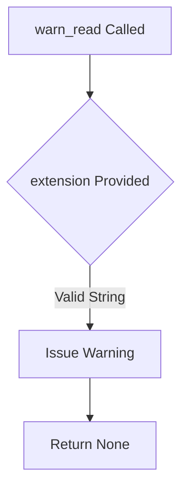
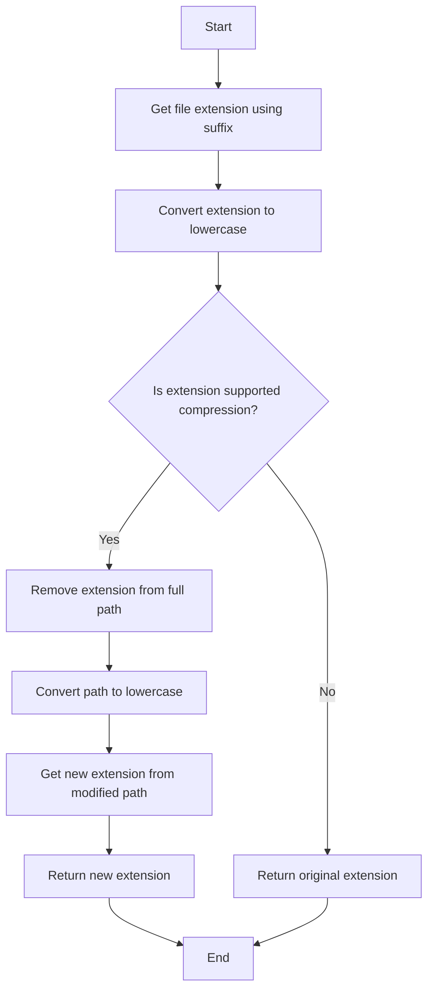
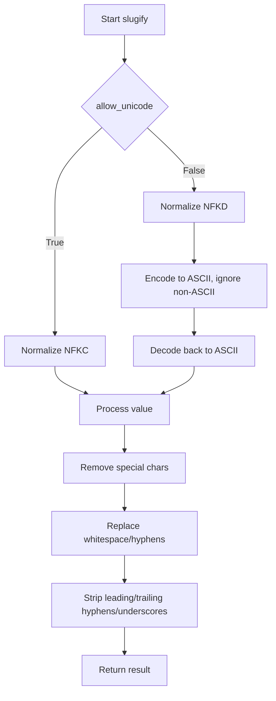

# `dataframe.py`

## `src.ydata_profiling.utils.dataframe.warn_read` · *function*

## Summary:
Issues a deprecation warning when reading files with unsupported extensions.

## Description:
This function generates a user-facing warning indicating that the specified file extension is not officially supported for reading operations. It serves as a deprecation notice to guide users toward supported file formats while maintaining backward compatibility. The function is typically invoked during file loading operations when an unsupported file extension is detected.

## Args:
    extension (str): The file extension (including the dot, e.g., ".csv") that triggered the warning.

## Returns:
    None: This function does not return any value.

## Raises:
    None: This function does not raise any exceptions.

## Constraints:
    Preconditions:
        - The `extension` argument must be a string representing a file extension (e.g., ".xlsx", ".json").
        - The function assumes that the caller has already determined that the extension is not supported.

    Postconditions:
        - A warning message is issued via Python's standard `warnings` module.
        - No other state changes occur within the function.

## Side Effects:
    - Issues a warning message to the standard warning stream (typically stderr).
    - No file I/O, network calls, or external state modifications occur.

## Control Flow:


## Examples:
```python
# Example usage in a file reading context
warn_read(".dat")
# Output: UserWarning: Reading .dat files is deprecated and may not work properly.
```

## `src.ydata_profiling.utils.dataframe.is_supported_compression` · *function*

## Summary:
Determines whether a given file extension corresponds to a supported compression format.

## Description:
This function checks if a provided file extension is one of the supported compression formats (bz2, gz, xz, zip). It is used to validate file extensions before attempting to process compressed files in data processing pipelines.

## Args:
    file_extension (str): The file extension to check, including the leading dot (e.g., ".gz", ".zip"). Case-insensitive.

## Returns:
    bool: True if the file extension is one of the supported compression formats (.bz2, .gz, .xz, .zip); False otherwise.

## Raises:
    None

## Constraints:
    Preconditions:
        - The input file_extension must be a string
        - The file_extension should include the leading dot (e.g., ".gz" rather than "gz")
    
    Postconditions:
        - The function performs case-insensitive comparison by converting the input to lowercase
        - The result is always a boolean value

## Side Effects:
    None

## Control Flow:
```mermaid
flowchart TD
    A[Start] --> B{file_extension.lower() in [".bz2", ".gz", ".xz", ".zip"]?}
    B -->|True| C[Return True]
    B -->|False| D[Return False]
    C --> E[End]
    D --> E
```

## Examples:
    >>> is_supported_compression(".gz")
    True
    >>> is_supported_compression(".ZIP")
    True
    >>> is_supported_compression(".txt")
    False
    >>> is_supported_compression(".bz2")
    True
```

## `src.ydata_profiling.utils.dataframe.remove_suffix` · *function*

## Summary:
Removes a specified suffix from the end of a string if it exists.

## Description:
This function takes a string and removes a specified suffix from the end of the string if the string ends with that suffix. It is designed to safely handle cases where the suffix may not be present, avoiding errors that could occur with direct string manipulation.

## Args:
    text (str): The input string from which to remove the suffix.
    suffix (str): The suffix to remove from the end of the text string.

## Returns:
    str: The input string with the suffix removed if it was present at the end, otherwise returns the original string unchanged.

## Raises:
    None

## Constraints:
    Preconditions:
        - Both `text` and `suffix` must be strings.
        - The function handles empty strings gracefully.
    Postconditions:
        - If the suffix is present at the end of the text, it is removed.
        - If the suffix is not present or is empty, the original text is returned unchanged.

## Side Effects:
    None

## Control Flow:


## Examples:
    >>> remove_suffix("hello_world", "_world")
    'hello'
    >>> remove_suffix("hello_world", "_test")
    'hello_world'
    >>> remove_suffix("hello", "")
    'hello'
```

## `src.ydata_profiling.utils.dataframe.uncompressed_extension` · *function*

## Summary:
Returns the uncompressed file extension by removing compression suffixes from filenames.

## Description:
Extracts the true file extension from a filename by stripping supported compression suffixes (like .gz, .bz2, .xz, .zip) when present. This function is used to determine the actual file type after decompression, enabling proper handling of compressed data files in profiling workflows.

## Args:
    file_name (Path): The file path object containing the filename to process.

## Returns:
    str: The final file extension after removing compression suffixes if applicable, or the original extension if no supported compression is detected.

## Raises:
    None

## Constraints:
    Preconditions:
        - The input file_name must be a valid pathlib.Path object
        - The file_name should contain a valid file extension (including the leading dot)
    
    Postconditions:
        - The returned extension is always in lowercase
        - If the file has a supported compression extension, the function recursively removes it to get the base extension
        - If the file doesn't have a supported compression extension, the original extension is returned unchanged

## Side Effects:
    None

## Control Flow:


## Examples:
    >>> from pathlib import Path
    >>> uncompressed_extension(Path("data.csv.gz"))
    '.csv'
    >>> uncompressed_extension(Path("archive.tar.xz"))
    '.tar'
    >>> uncompressed_extension(Path("document.txt"))
    '.txt'
```

## `src.ydata_profiling.utils.dataframe.read_pandas` · *function*

## Summary:
Reads a data file into a pandas DataFrame, automatically detecting the file format based on its extension.

## Description:
This function provides a unified interface for reading various data file formats into pandas DataFrames. It determines the appropriate pandas reading function based on the file extension and handles common compression formats by stripping compression suffixes before detection. The function supports standard formats like CSV, JSON, Excel, Parquet, and many others, falling back to CSV reading for unknown extensions while issuing warnings.

## Args:
    file_name (Path): The absolute or relative path to the data file to be read.

## Returns:
    pd.DataFrame: A pandas DataFrame containing the data from the specified file.

## Raises:
    ValueError: Raised when attempting to read a .tar file, as tar compression is not supported directly by pandas.

## Constraints:
    Preconditions:
        - The file_name parameter must be a valid pathlib.Path object
        - The file must exist and be readable
        - The file must have a recognized extension or be a valid CSV file
    
    Postconditions:
        - The returned DataFrame contains the data from the file
        - If the file extension is not explicitly supported, a warning is issued via the warn_read function
        - The function handles compression suffixes by delegating to uncompressed_extension

## Side Effects:
    - Reads data from the filesystem
    - May issue warnings to the standard warning stream
    - No external state mutations or network calls

## Control Flow:
```mermaid
flowchart TD
    A[Start read_pandas] --> B[Get file extension]
    B --> C{Extension Match?}
    C -->|json| D[Use pd.read_json]
    C -->|jsonl| E[Use pd.read_json(lines=True)]
    C -->|dta| F[Use pd.read_stata]
    C -->|tsv| G[Use pd.read_csv(sep="\t")]
    C -->|xls/xlsx| H[Use pd.read_excel]
    C -->|hdf/h5| I[Use pd.read_hdf]
    C -->|sas7bdat/xpt| J[Use pd.read_sas]
    C -->|parquet| K[Use pd.read_parquet]
    C -->|pkl/pickle| L[Use pd.read_pickle]
    C -->|tar| M[Raise ValueError]
    C -->|Other| N[Warn and use pd.read_csv]
    D --> O[Return DataFrame]
    E --> O
    F --> O
    G --> O
    H --> O
    I --> O
    J --> O
    K --> O
    L --> O
    M --> P[End]
    N --> O
```

## Examples:
    >>> from pathlib import Path
    >>> df = read_pandas(Path("data.csv"))
    >>> df = read_pandas(Path("data.json"))
    >>> df = read_pandas(Path("data.xlsx"))

## `src.ydata_profiling.utils.dataframe.rename_index` · *function*

## Summary:
Renames the 'index' column and index name in a DataFrame to 'df_index' to avoid conflicts with reserved keywords.

## Description:
This function ensures that DataFrames don't have columns or index names that conflict with the reserved word 'index', which could cause issues in downstream processing. It renames any column named 'index' to 'df_index' and similarly handles index names. The function modifies the DataFrame in-place.

## Args:
    df (pd.DataFrame): Input DataFrame that may contain a column or index named 'index'

## Returns:
    pd.DataFrame: The same DataFrame object with renamed column and/or index name from 'index' to 'df_index' (modified in-place)

## Raises:
    None explicitly raised

## Constraints:
    Preconditions:
        - Input must be a pandas DataFrame
        - Column names and index names must be strings or None
    Postconditions:
        - Any column named 'index' will be renamed to 'df_index'
        - Any index name that is 'index' will be renamed to 'df_index'
        - Original DataFrame is modified in-place via inplace=True operation

## Side Effects:
    - Modifies the input DataFrame in-place through the inplace parameter
    - No external I/O operations or state mutations

## Control Flow:
```mermaid
flowchart TD
    A[Start rename_index] --> B{Column named "index"?}
    B -- Yes --> C[Rename column "index" to "df_index"]
    B -- No --> D[Skip column renaming]
    C --> E{Index name contains "index"?}
    D --> E
    E -- Yes --> F[Rename index name "index" to "df_index"]
    E -- No --> G[Return modified DataFrame]
    F --> G
```

## Examples:
```python
import pandas as pd

# Example 1: DataFrame with index column
df1 = pd.DataFrame({'index': [1, 2, 3], 'value': [4, 5, 6]})
result1 = rename_index(df1)
# result1.columns = ['df_index', 'value']
# Note: df1 is also modified in-place

# Example 2: DataFrame with index name
df2 = pd.DataFrame({'value': [4, 5, 6]})
df2.index.name = 'index'
result2 = rename_index(df2)
# result2.index.name = 'df_index'
# Note: df2 is also modified in-place

# Example 3: DataFrame with both
df3 = pd.DataFrame({'index': [1, 2, 3], 'value': [4, 5, 6]})
df3.index.name = 'index'
result3 = rename_index(df3)
# result3.columns = ['df_index', 'value']
# result3.index.name = 'df_index'
# Note: df3 is also modified in-place
```

## `src.ydata_profiling.utils.dataframe.expand_mixed` · *function*

## Summary:
Expands columns containing mixed-type nested data structures (lists, dicts, tuples) into separate columns while recursively processing nested structures.

## Description:
This function processes DataFrame columns that contain elements of specified types (by default list, dict, tuple) and expands them into separate columns. It recursively handles nested structures by applying itself to the expanded columns. The function is designed to flatten complex nested data while preserving the original structure for non-nested elements.

## Args:
    df (pd.DataFrame): Input DataFrame to process
    types (Any, optional): List of types to consider for expansion. Defaults to [list, dict, tuple].

## Returns:
    pd.DataFrame: DataFrame with nested columns expanded into separate columns

## Raises:
    None explicitly raised

## Constraints:
    Preconditions:
    - Input df must be a valid pandas DataFrame
    - Column values must be hashable for the dropna() operation
    - Types parameter must be iterable containing valid Python types
    
    Postconditions:
    - All columns containing elements of specified types are expanded
    - Non-nested elements of specified types remain unchanged
    - Recursive processing continues until no more expansions are possible

## Side Effects:
    None

## Control Flow:
```mermaid
flowchart TD
    A[Start expand_mixed] --> B{types is None?}
    B -- Yes --> C[Set types = [list, dict, tuple]]
    B -- No --> C
    C --> D[For each column_name in df.columns]
    D --> E[Create non_nested_enumeration]
    E --> F{non_nested_enumeration.all()?}
    F -- No --> G[Next column]
    F -- Yes --> H[Expand column values to DataFrame]
    H --> I[Add prefix to expanded columns]
    I --> J[Recursively call expand_mixed]
    J --> K[Drop original column]
    K --> L[Concatenate expanded with original df]
    L --> M[Return modified df]
```

## Examples:
    # Basic usage with default types
    df = pd.DataFrame({'A': [[1, 2], [3, 4]], 'B': [{'x': 1}, {'y': 2}]})
    result = expand_mixed(df)
    # Result will have columns A_0, A_1, B_x, B_y
    
    # With custom types
    df = pd.DataFrame({'C': [[1, 2], [3, 4]]})
    result = expand_mixed(df, types=[list])
    # Result will have columns C_0, C_1

## Detailed Logic:
The key filtering mechanism uses a lambda function that determines if a value should be expanded:
1. `type(x) in types` - checks if the value's type is one of the specified types
2. `not any(type(y) in types for y in x)` - ensures the value doesn't contain nested elements of the same types
3. Only columns where ALL non-null values satisfy this condition are expanded

## `src.ydata_profiling.utils.dataframe.hash_dataframe` · *function*

## Summary:
Generates a SHA256 hash of a pandas DataFrame's content for unique identification.

## Description:
Creates a deterministic hash value representing the entire content of a DataFrame, useful for caching, comparison, and identifying data changes. This function extracts hash values from each row using pandas' built-in hashing mechanism, concatenates them, and computes a final SHA256 digest prefixed with a constant prefix string.

## Args:
    df (pd.DataFrame): Input pandas DataFrame to be hashed

## Returns:
    str: A hexadecimal string representing the hash, with a prefix (HASH_PREFIX) followed by 64 hexadecimal characters

## Raises:
    None explicitly raised, but may propagate exceptions from underlying operations such as:
    - TypeError: if DataFrame contains unhashable data types
    - ValueError: if DataFrame is malformed

## Constraints:
    Preconditions:
        - Input must be a valid pandas DataFrame
        - All data within the DataFrame must be hashable by pandas' hashing mechanism
    
    Postconditions:
        - Output is always a string with format "{HASH_PREFIX}{64-character hex digest}"
        - Same input DataFrame will always produce identical output

## Side Effects:
    None

## Control Flow:
```mermaid
flowchart TD
    A[Start hash_dataframe] --> B[Get hash_pandas_object(df)]
    B --> C[Extract .values and convert to str]
    C --> D[Join with newline separator]
    D --> E[Encode as UTF-8]
    E --> F[Compute SHA256 digest]
    F --> G[Format with HASH_PREFIX]
    G --> H[Return result]
```

## Examples:
```python
import pandas as pd
df = pd.DataFrame({'A': [1, 2], 'B': [3, 4]})
hash_result = hash_dataframe(df)
# Returns string like "hash_abc123...def456" where "hash_" is the prefix
```

## `src.ydata_profiling.utils.dataframe.slugify` · *function*

## Summary:
Converts a string into a URL-friendly slug by normalizing Unicode characters, removing special characters, and replacing whitespace with hyphens.

## Description:
This function transforms arbitrary text into a standardized format suitable for use in URLs, filenames, or identifiers. It handles Unicode normalization and character filtering to ensure consistent output regardless of input encoding or special characters.

The function is extracted into its own utility to provide a reusable, standardized approach to slug generation across the codebase, avoiding duplication of normalization and sanitization logic.

## Args:
    value (str): The input string to convert into a slug. Must be convertible to string.
    allow_unicode (bool): If True, preserves Unicode characters using NFKC normalization. If False, removes non-ASCII characters using NFKD normalization. Defaults to False.

## Returns:
    str: A URL-safe slug containing only lowercase letters, digits, hyphens, and underscores. Multiple consecutive whitespace or hyphens are collapsed into single hyphens, and leading/trailing hyphens/underscores are stripped.

## Raises:
    None explicitly raised.

## Constraints:
    Preconditions:
        - Input value must be convertible to string via str() function
        - No external dependencies beyond standard library imports
    
    Postconditions:
        - Output string contains only alphanumeric characters, hyphens, and underscores
        - No leading or trailing hyphens or underscores
        - All whitespace replaced with single hyphens
        - Case normalized to lowercase

## Side Effects:
    None.

## Control Flow:


## Examples:
    >>> slugify("Hello World!")
    'hello-world'
    
    >>> slugify("Café & Restaurant", allow_unicode=True)
    'café-&-restaurant'
    
    >>> slugify("Multiple   spaces   and--hyphens")
    'multiple-spaces-and-hyphens'
    
    >>> slugify("___Leading_and_trailing___")
    'leading-and-trailing'

## `src.ydata_profiling.utils.dataframe.sort_column_names` · *function*

## Summary:
Sorts dictionary items by column names in ascending or descending order while preserving the original mapping.

## Description:
This function takes a dictionary of column names and their associated data, and sorts the items based on the column names. It provides flexibility to sort in either ascending or descending order, or leave the dictionary unchanged when no sorting is requested. The sorting is case-insensitive and uses Unicode case folding for proper international character handling.

## Args:
    dct (dict): A dictionary mapping column names (keys) to their data (values).
    sort (Optional[str]): Sorting direction. Can be "ascending", "descending", or None. If None, the dictionary is returned unchanged.

## Returns:
    dict: A new dictionary with sorted keys based on the specified sorting direction. If sort is None, returns the original dictionary unchanged.

## Raises:
    ValueError: Raised when the sort parameter is not None, "ascending", or "descending". The error message specifically states that sort should be "ascending", "descending" or None.

## Constraints:
    - Preconditions: The input dictionary should contain string keys representing column names.
    - Postconditions: The returned dictionary maintains the same key-value pairs as the input, but with keys ordered according to the sort parameter.

## Side Effects:
    - None

## Control Flow:
```mermaid
flowchart TD
    A[sort_column_names] --> B{sort is None?}
    B -- Yes --> C[Return dct]
    B -- No --> D[sort = sort.lower()]
    D --> E{sort starts with "asc"?}
    E -- Yes --> F[Sort dct ascending by key casefold]
    E -- No --> G{sort starts with "desc"?}
    G -- Yes --> H[Sort dct descending by key casefold]
    G -- No --> I[raise ValueError]
    F --> J[Return sorted dct]
    H --> J
    I --> J
```

## Examples:
    # Sort dictionary in ascending order
    data = {"z": [1], "a": [2], "m": [3]}
    result = sort_column_names(data, "ascending")
    # Result: {"a": [2], "m": [3], "z": [1]}
    
    # Sort dictionary in descending order
    data = {"z": [1], "a": [2], "m": [3]}
    result = sort_column_names(data, "descending")
    # Result: {"z": [1], "m": [3], "a": [2]}
    
    # No sorting applied
    data = {"z": [1], "a": [2], "m": [3]}
    result = sort_column_names(data, None)
    # Result: {"z": [1], "a": [2], "m": [3]}

