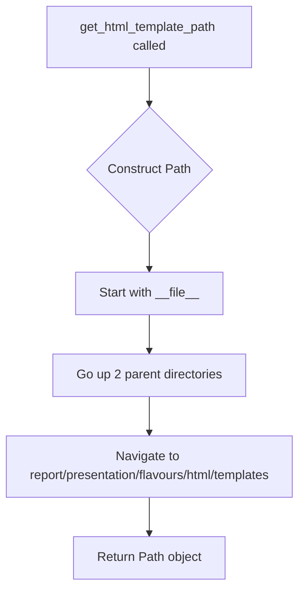

# `paths.py`

## `src.ydata_profiling.utils.paths.get_project_root` · *function*

## Summary:
Returns the absolute path to the project root directory by traversing up the directory structure from the current file location.

## Description:
This function determines the project root by navigating up four levels from the current file's location using the `__file__` variable. It is designed to provide a consistent way to reference the project's base directory regardless of where the code is executed from within the project structure. The function is typically used to locate configuration files, data directories, or other project-wide resources.

This logic is extracted into its own function rather than being inlined because:
- It provides a centralized location for determining the project root
- It ensures consistency across the codebase when referencing project-relative paths
- It makes the code more maintainable and readable
- It abstracts away the specific directory traversal logic

## Args:
    None

## Returns:
    Path: An absolute Path object pointing to the project root directory.

## Raises:
    None

## Constraints:
    Preconditions:
    - The file containing this function must be located within a project structure that has at least four directory levels above it.
    - The function assumes a standard project layout where the module is nested within multiple subdirectories.
    - The `__file__` variable must be properly set (which is standard in normal Python execution contexts).

    Postconditions:
    - The returned Path object will always represent an existing directory.
    - The path will be absolute (not relative).

## Side Effects:
    None

## Control Flow:
```mermaid
flowchart TD
    A[get_project_root() called] --> B{__file__ resolved}
    B --> C[Path(__file__) created]
    C --> D[.parent.parent.parent.parent applied]
    D --> E[Path object returned]
```

## Examples:
```python
# Typical usage in a project
project_root = get_project_root()
config_file = project_root / "config" / "settings.yaml"
data_dir = project_root / "data" / "raw"

# Usage in a module within src/ydata_profiling/utils/paths.py
# This would return the root of the ydata_profiling project
root = get_project_root()  # Returns Path('/path/to/project/root')
```

## `src.ydata_profiling.utils.paths.get_config` · *function*

## Summary:
Constructs and returns a Path object for a configuration file located in the parent directory of the current module.

## Description:
This utility function resolves a configuration file path relative to the parent directory of the current module file. It provides a consistent mechanism for accessing configuration files within the package structure, ensuring that file paths are correctly resolved regardless of the current working directory or execution context.

The function is typically called by components that need to load default configuration files, such as profile settings or template configurations. By centralizing path resolution logic, it maintains consistency and reduces the risk of path-related errors throughout the codebase.

## Args:
    file_name (str): The name of the configuration file to resolve. This should be a relative path from the parent directory of the current module file.

## Returns:
    Path: A pathlib.Path object representing the absolute path to the requested configuration file.

## Raises:
    None explicitly raised by this function.

## Constraints:
    Preconditions:
    - The file_name parameter must be a valid string.
    - The configuration file must exist in the parent directory of the current module.
    
    Postconditions:
    - The returned Path object will reference a valid file path.
    - The path resolution is independent of the current working directory.
    - The function navigates two directory levels up from the current module file location.

## Side Effects:
    None.

## Control Flow:
```mermaid
flowchart TD
    A[get_config called with file_name] --> B[Get absolute path of current module (__file__)]
    B --> C[Navigate to parent directory (.parent)]
    C --> D[Navigate to parent's parent directory (.parent)]  
    D --> E[Join with file_name using / operator]
    E --> F[Return resulting Path object]
```

## Examples:
    # Get path to default profile configuration
    config_path = get_config("default_profile.yml")
    # Returns Path object pointing to the file in the parent directory
    
    # Get path to schema configuration
    schema_path = get_config("schema.json")
    # Returns Path object pointing to the file in the parent directory

## `src.ydata_profiling.utils.paths.get_data_path` · *function*

## Summary:
Returns the absolute path to the project's data directory by combining the project root with the "data" subdirectory.

## Description:
This function provides a standardized way to access the project's data directory by building upon the `get_project_root()` function. It constructs the path to the "data" directory relative to the project root, ensuring consistent access to data resources regardless of the current working directory or execution context.

The logic is extracted into its own function rather than being inlined because:
- It centralizes the construction of data directory paths
- It maintains consistency with the project's directory structure conventions
- It abstracts away the path joining operation, making the intent clearer
- It allows for easy modification of the data directory name if needed

## Args:
    None

## Returns:
    Path: An absolute Path object pointing to the project's data directory.

## Raises:
    None

## Constraints:
    Preconditions:
    - The `get_project_root()` function must successfully return a valid Path object
    - The project root directory must exist and be accessible
    - The function assumes the existence of a "data" subdirectory within the project root

    Postconditions:
    - The returned Path object will represent a valid path (though not necessarily an existing directory)
    - The path will be absolute (not relative)

## Side Effects:
    None

## Control Flow:
```mermaid
flowchart TD
    A[get_data_path() called] --> B[get_project_root() invoked]
    B --> C[Path("/data") joined with project root]
    C --> D[Data directory Path returned]
```

## Examples:
```python
# Typical usage to access data directory
data_path = get_data_path()
# Returns Path('/path/to/project/root/data')

# Usage in a module that needs to access data files
data_directory = get_data_path()
raw_data_file = data_directory / "raw" / "dataset.csv"
processed_data_file = data_directory / "processed" / "output.json"
```

## `src.ydata_profiling.utils.paths.get_html_template_path` · *function*

## Summary:
Returns the absolute path to the HTML template directory used for report generation.

## Description:
This function provides a centralized location for accessing the HTML template files required for generating profiling reports. It constructs the path by navigating from the current file's directory up two levels and then into the report presentation templates structure.

The function is extracted into its own utility to avoid hardcoding path strings throughout the codebase and to ensure consistent access to template resources regardless of where the code is executed from.

## Args:
    None

## Returns:
    Path: An absolute Path object pointing to the HTML templates directory.

## Raises:
    None

## Constraints:
    Preconditions:
    - The function assumes the codebase maintains the standard directory structure with templates under report/presentation/flavours/html/templates.
    - The __file__ variable must be available and correctly resolve to the current module's location.

    Postconditions:
    - The returned Path object will always point to a valid directory structure (though the directory itself may not exist on disk).
    - The path construction is deterministic and will always yield the same result given the same codebase structure.

## Side Effects:
    None

## Control Flow:


## Examples:
```python
from pathlib import Path
from ydata_profiling.utils.paths import get_html_template_path

# Typical usage in report generation
template_dir = get_html_template_path()
print(template_dir)  # Outputs something like: /path/to/project/report/presentation/flavours/html/templates
```

