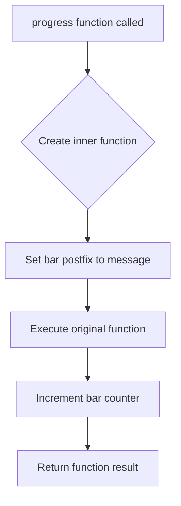

# `progress_bar.py`

## `src.ydata_profiling.utils.progress_bar.progress` · *function*

## Summary:
Decorator function that wraps a callable with progress bar updates and message display.

## Description:
This function creates a decorator that enhances a callable by automatically updating a tqdm progress bar with a custom message before execution and incrementing the bar after completion. It's designed to integrate seamlessly with tqdm progress bars in data processing pipelines. The decorator preserves the original function's metadata using functools.wraps.

## Args:
    fn (Callable): The function to be wrapped with progress bar functionality
    bar (tqdm): A tqdm progress bar instance that will be updated
    message (str): Message string to display in the progress bar's postfix

## Returns:
    Callable: A decorated version of the input function that updates the progress bar when called

## Raises:
    None explicitly raised - depends on the underlying function's behavior

## Constraints:
    Preconditions:
    - The `bar` parameter must be a valid tqdm progress bar instance
    - The `fn` parameter must be callable
    - The `message` parameter must be a string

    Postconditions:
    - The returned function maintains the same signature as the original
    - The progress bar's postfix is updated with the provided message before function execution
    - The progress bar is incremented by one unit after function execution

## Side Effects:
    - Modifies the state of the provided tqdm progress bar instance by setting its postfix string and incrementing its counter
    - No external I/O operations or global state mutations beyond the progress bar

## Control Flow:


## Examples:
```python
from tqdm import tqdm
from src.ydata_profiling.utils.progress_bar import progress

# Example usage in a data processing loop
def process_item(item):
    # Simulate work
    return item * 2

# Create progress bar
bar = tqdm(range(100))

# Wrap function with progress tracking
progress_func = progress(process_item, bar, "Processing items")

# Use the wrapped function
for i in range(100):
    result = progress_func(i)
```

