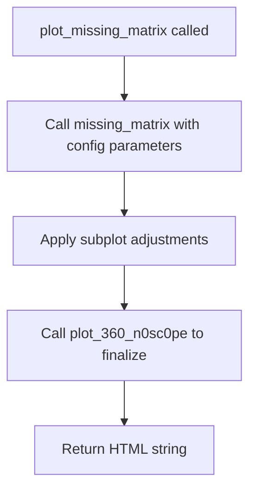
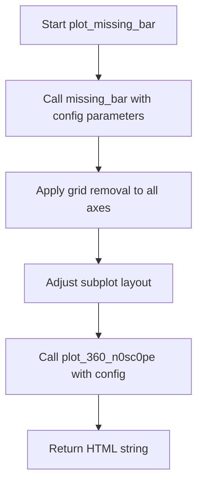

# `missing.py`

## `src.ydata_profiling.visualisation.missing.get_font_size` · *function*

## Summary:
Calculates an appropriate font size for displaying column labels in visualizations based on the number of columns and maximum label length.

## Description:
This function determines the optimal font size for plotting missing data visualizations by considering both the number of columns being displayed and the length of the longest column label. It ensures that labels remain readable regardless of the dataset size or label complexity.

The function is extracted into its own component to separate the logic for font sizing calculation from the visualization rendering code, making the visualization functions cleaner and more focused on their primary purpose of creating plots.

## Args:
    columns (List[str]): A list of column names/labels that will be displayed in the visualization

## Returns:
    float: The calculated font size value that should be used for text rendering in matplotlib visualizations. The returned value is always positive and ranges from 8.0 to 13.0, adjusted based on label length.

## Raises:
    None explicitly raised, but passing an empty list would result in a runtime error due to max() on empty sequence

## Constraints:
    Preconditions:
        - Input must be a non-empty list of strings
        - Each string in the list should have a valid length (non-negative integer)
    
    Postconditions:
        - Returned value is always positive (greater than 0)
        - Font size decreases as the number of columns increases
        - Font size decreases as the maximum label length increases

## Side Effects:
    None

## Control Flow:
```mermaid
flowchart TD
    A[Start get_font_size] --> B{len(columns) < 20?}
    B -- Yes --> C[font_size = 13.0]
    B -- No --> D{20 <= len(columns) < 40?}
    D -- Yes --> E[font_size = 12.0]
    D -- No --> F{40 <= len(columns) < 60?}
    F -- Yes --> G[font_size = 10.0]
    F -- No --> H[font_size = 8.0]
    C --> I[Calculate adjusted font_size]
    E --> I
    G --> I
    H --> I
    I --> J[max_label_length = max(len(label) for label in columns)]
    J --> K[font_size *= min(1.0, 20.0 / max_label_length)]
    K --> L[Return font_size]
```

## Examples:
    >>> get_font_size(['col1', 'col2', 'col3'])
    13.0
    
    >>> get_font_size(['a' * 50] * 25)
    12.0  # Reduced due to long labels (min(1.0, 20.0/50) = 0.4, so 12.0 * 0.4 = 4.8)
    
    >>> get_font_size(['col1', 'col2'] * 30)
    8.0  # Minimum font size for large number of columns
    
    >>> get_font_size(['short'] * 5)
    13.0  # Default size for small number of short columns

## `src.ydata_profiling.visualisation.missing.plot_missing_matrix` · *function*

## Summary:
Creates a matrix visualization of missing data patterns in a dataset using matplotlib.

## Description:
Generates a heatmap-style visualization showing the distribution of missing values across columns and rows. This function serves as a specialized wrapper around the core missing matrix plotting functionality, applying configuration-specific styling and layout adjustments.

The function is extracted into its own component to encapsulate the specific logic for rendering missing data matrices with proper configuration handling, font sizing, and layout adjustments. This separation allows the core plotting logic to remain focused while providing a convenient interface for report generation workflows.

## Args:
    config (Settings): Configuration object containing report settings and formatting options
    notnull (Any): Boolean array indicating which values are not null in the dataset
    columns (List[str]): List of column names to display on the x-axis
    nrows (int): Number of rows in the dataset

## Returns:
    str: HTML string containing the rendered missing data matrix visualization

## Raises:
    None explicitly raised by this function, though underlying matplotlib operations may raise exceptions

## Constraints:
    Preconditions:
        - config must be a valid Settings object
        - notnull must be a boolean array compatible with the dataset dimensions
        - columns must be a non-empty list of strings
        - nrows must be a positive integer
    
    Postconditions:
        - Returns a valid HTML string representing the visualization
        - Plotting context is properly managed through matplotlib context manager

## Side Effects:
    - Creates matplotlib figure and axes objects internally
    - Modifies subplot layout parameters via plt.subplots_adjust
    - May write files to disk if html.inline is False (depending on config)
    - Uses matplotlib context management for proper resource cleanup

## Control Flow:


## Examples:
    >>> config = Settings()
    >>> notnull = df.notnull().values
    >>> columns = ['col1', 'col2', 'col3']
    >>> nrows = len(df)
    >>> result = plot_missing_matrix(config, notnull, columns, nrows)
    >>> print(result[:50])  # Shows beginning of HTML string
```

## `src.ydata_profiling.visualisation.missing.plot_missing_bar` · *function*

## Summary:
Creates a bar chart visualization showing the proportion of non-null values for each column in a dataset, customized with configuration settings.

## Description:
This function generates a matplotlib-based bar chart that displays the percentage of non-null values for each column in a dataset. It leverages the underlying `missing_bar` plotting function to create the visualization, applying configuration-specific styling and layout adjustments. The function is part of the missing data visualization pipeline and integrates with the broader profiling system's HTML output generation.

The logic is extracted into its own function to encapsulate the complete visualization workflow including configuration application, post-processing adjustments, and final rendering to HTML format. This separation allows for consistent styling and layout control while keeping the core plotting logic reusable.

## Args:
    config (Settings): Configuration object containing HTML and plotting settings such as primary colors, image format, DPI, and inline display preferences
    notnull_counts (list): A list of integers representing the count of non-null values for each column in the dataset
    nrows (int): Total number of rows in the dataset, used to calculate percentages
    columns (List[str]): A list of column names/labels that will be displayed on the x-axis of the visualization

## Returns:
    str: An HTML string representation of the generated missing values bar chart, formatted according to the configuration settings

## Raises:
    ValueError: When the image format specified in config.plot.image_format is not supported ('png' or 'svg')

## Constraints:
    Preconditions:
        - config must be a valid Settings object with properly initialized HTML and plot configurations
        - notnull_counts must be a list of integers representing valid non-null counts
        - nrows must be a positive integer representing total dataset rows
        - columns must be a non-empty list of strings representing column names
        
    Postconditions:
        - The returned string contains valid HTML with embedded image data or file reference
        - All matplotlib axes have grid disabled
        - Subplot adjustments are applied to ensure proper spacing

## Side Effects:
    - Modifies global matplotlib state through plt.subplots_adjust and plt.gcf().get_axes()
    - May create temporary files or write to disk if config.html.inline is False
    - Closes matplotlib figures after saving to prevent memory leaks

## Control Flow:


## Examples:
    >>> config = Settings()
    >>> notnull_counts = [950, 980, 900, 850]
    >>> nrows = 1000
    >>> columns = ['col1', 'col2', 'col3', 'col4']
    >>> html_output = plot_missing_bar(config, notnull_counts, nrows, columns)
    >>> print(html_output[:50])  # Shows beginning of HTML string
    '<html><body>>> plot_missing_heatmap(config, corr_mat, mask, ['col1', 'col2', 'col3'])
    "data:image/svg+xml;base64,..."

    >>> plot_missing_heatmap(config, corr_mat, mask, [f'col_{i}' for i in range(50)])
    "data:image/png;base64,..."

