# `plot.py`

## `src.ydata_profiling.visualisation.plot.format_fn` · *function*

## Summary:
Formats a Unix timestamp tick value into a human-readable datetime string for matplotlib axis labels.

## Description:
This function serves as a matplotlib formatter callback that converts Unix timestamp values (integers) into formatted datetime strings. It is specifically designed to work with matplotlib's FuncFormatter for displaying time-series data on axes. The function leverages the `convert_timestamp_to_datetime` utility to handle the timestamp conversion and applies a fixed strftime format for consistent display.

Known callers within the codebase:
- Used internally by matplotlib when creating plots with time-series data
- Called indirectly through matplotlib's FuncFormatter mechanism in various plotting functions

This logic is extracted into its own function to separate formatting concerns from the core plotting logic, enabling reuse across different visualization components while maintaining clean separation of concerns.

## Args:
    tick_val (int): A Unix timestamp value representing seconds since January 1, 1970
    tick_pos (Any): Position of the tick (ignored in this implementation)

## Returns:
    str: A formatted datetime string in the format "%Y-%m-%d %H:%M:%S"

## Raises:
    None explicitly raised, but may propagate exceptions from underlying datetime operations in `convert_timestamp_to_datetime`

## Constraints:
    Precondition: tick_val must be a valid integer timestamp
    Postcondition: Always returns a properly formatted datetime string

## Side Effects:
    None

## Control Flow:
    ```mermaid
    flowchart TD
        A[format_fn called with tick_val] --> B[Call convert_timestamp_to_datetime(tick_val)]
        B --> C[Apply strftime("%Y-%m-%d %H:%M:%S")]
        C --> D[Return formatted string]
    ```

## Examples:
    Example 1: Formatting a recent timestamp
        Input: tick_val = 1609459200 (January 1, 2021)
        Output: "2021-01-01 00:00:00"

    Example 2: Formatting a timestamp from the past
        Input: tick_val = 86400 (January 2, 1970)
        Output: "1970-01-02 00:00:00"

## `src.ydata_profiling.visualisation.plot._plot_word_cloud` · *function*

## Summary:
Generates a word cloud visualization from text frequency data in pandas Series.

## Description:
Creates a matplotlib figure containing one or more word clouds based on text frequency data. This function extracts word frequencies from pandas Series objects and generates visual word clouds using the wordcloud library. It handles both single Series and lists of Series inputs, displaying them side-by-side in a single figure.

## Args:
    series (Union[pd.Series, List[pd.Series]]): Single pandas Series or list of pandas Series containing text frequencies as key-value pairs
    figsize (tuple): Figure size as (width, height) in inches. Defaults to (6, 4)

## Returns:
    plt.Figure: Matplotlib figure object containing the word cloud(s)

## Raises:
    None explicitly raised

## Constraints:
    Preconditions:
    - Input series must be pandas Series or list of pandas Series
    - Series data must be convertible to dictionary format via .to_dict() method
    - WordCloud library must be available in the environment
    
    Postconditions:
    - Returns a valid matplotlib Figure object
    - Figure contains properly formatted word cloud(s)
    - All axes in the figure have axis off (no tick marks or labels)

## Side Effects:
    - Creates a matplotlib figure using plt.figure()
    - Adds subplots to the matplotlib figure
    - Displays word cloud images using ax.imshow()

## Control Flow:
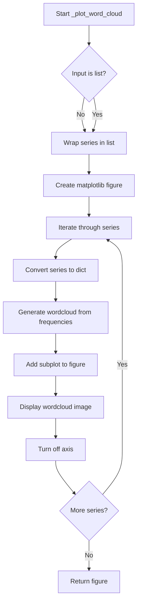

## Examples:
    # Single series input
    import pandas as pd
    series = pd.Series({'word1': 10, 'word2': 5, 'word3': 15})
    fig = _plot_word_cloud(series)
    
    # Multiple series input
    series1 = pd.Series({'word1': 10, 'word2': 5})
    series2 = pd.Series({'word3': 15, 'word4': 8})
    fig = _plot_word_cloud([series1, series2])
```

## `src.ydata_profiling.visualisation.plot._plot_histogram` · *function*

## Summary:
Creates a matplotlib figure with a histogram visualization for numerical data series, supporting both single and multi-colored bin representations.

## Description:
This function generates a histogram plot using matplotlib for a given numerical data series. It handles two distinct cases: when bins are provided as a list (for multi-colored histograms with multiple series) and when bins are provided as a scalar (for single-color histograms). The function integrates with the ydata-profiling configuration system to apply appropriate styling, handle date formatting, and respect user-defined display preferences such as axis label visibility and x-axis label suppression.

Known callers within the codebase:
- Called by histogram plotting functions in the visualization module when generating frequency distribution plots
- Triggered during report generation when displaying numerical variable distributions
- Part of the data visualization pipeline for statistical analysis

This logic is extracted into its own function to encapsulate the complexity of matplotlib figure creation and histogram rendering, separating visualization concerns from data processing logic and enabling consistent styling across different histogram types.

## Args:
    config (Settings): Configuration object containing styling and display preferences for the histogram
    series (np.ndarray): Array of histogram values (frequencies) to be plotted
    bins (Union[int, np.ndarray]): Either a scalar integer specifying number of bins or an array of bin edges
    figsize (tuple, optional): Figure size as (width, height) in inches. Defaults to (6, 4)
    date (bool, optional): Flag indicating whether the data represents dates requiring special formatting. Defaults to False
    hide_yaxis (bool, optional): Flag to hide the y-axis labels and ticks. Defaults to False

## Returns:
    plt.Figure: A matplotlib Figure object containing the histogram plot

## Raises:
    None explicitly raised, but may propagate exceptions from matplotlib operations

## Constraints:
    Precondition: 
    - config must be a valid Settings object with properly initialized html.style attributes
    - series must be a numpy array of numeric values
    - bins must be either an integer or a numpy array of bin edges
    - If date=True, the format_fn function must be available for date formatting
    
    Postcondition:
    - Returns a matplotlib Figure object with properly configured axes
    - The figure contains a bar chart representation of the histogram data
    - Y-axis label is appropriately set based on hide_yaxis flag
    - X-axis labels are handled according to config.plot.histogram.x_axis_labels setting

## Side Effects:
    - Creates and modifies matplotlib figures and axes
    - May modify matplotlib rcParams through the manage_matplotlib_context context manager
    - Sets axis formatters and tick labels
    - Applies color styling from the configuration

## Control Flow:
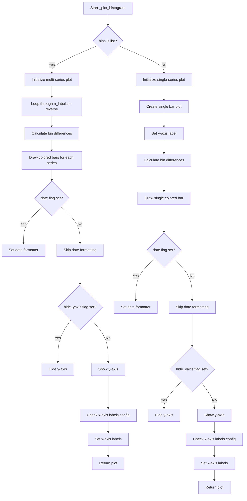

## Examples:
Example 1: Creating a basic histogram with default settings
```python
import numpy as np
from ydata_profiling.config import Settings

config = Settings()
series = np.array([10, 20, 30, 40, 50])
bins = 10
fig = _plot_histogram(config, series, bins)
```

Example 2: Creating a multi-colored histogram for grouped data
```python
import numpy as np
from ydata_profiling.config import Settings

config = Settings()
series = np.array([[10, 20, 30], [15, 25, 35]])
bins = [np.array([0, 5, 10, 15]), np.array([0, 5, 10, 15])]
fig = _plot_histogram(config, series, bins, date=True)
```

## `src.ydata_profiling.visualisation.plot.plot_word_cloud` · *function*

## Summary:
Generates a word cloud visualization from text frequency data and returns its HTML representation.

## Description:
Creates a word cloud visualization from pandas Series containing word frequencies and returns an HTML string representation. This function orchestrates the complete workflow for generating word cloud visualizations, including preparing the data, creating the matplotlib figure through `_plot_word_cloud`, and converting the result to HTML format via `plot_360_n0sc0pe`. It handles both single Series and lists of Series inputs, displaying them side-by-side in a single figure.

## Args:
    config (Settings): Configuration object containing HTML and plotting settings, particularly image format and inline rendering preferences
    word_counts (pd.Series): Pandas Series containing word frequencies as key-value pairs where keys are words and values are their frequencies

## Returns:
    str: HTML string representation of the word cloud visualization, either embedded as base64 data or as a file reference depending on config.html.inline setting

## Raises:
    ValueError: If the image format specified in config.plot.image_format is not supported ("png" or "svg"), or if config.html.assets_path is None when html.inline is False

## Constraints:
    Preconditions:
    - config must be a valid Settings object with proper HTML and plotting configuration
    - word_counts must be a pandas Series with text frequencies
    - Required libraries (matplotlib, wordcloud, etc.) must be available
    
    Postconditions:
    - Returns a valid HTML string representing the word cloud
    - The underlying matplotlib figure is properly closed after processing
    - The returned HTML string follows the configured format (inline or file-based)

## Side Effects:
    - Creates and manipulates matplotlib figures internally through `_plot_word_cloud`
    - May write image files to disk if html.inline is False and assets_path is configured
    - Modifies global matplotlib state through context management
    - May generate base64-encoded image data when html.inline is True

## Control Flow:
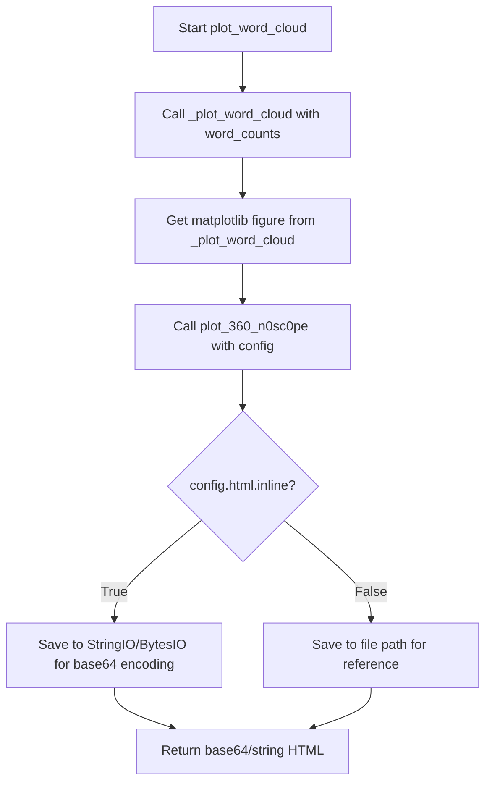

## Examples:
    # Basic usage with default settings
    import pandas as pd
    from ydata_profiling.config import Settings
    
    config = Settings()
    word_counts = pd.Series({'word1': 10, 'word2': 5, 'word3': 15})
    html_result = plot_word_cloud(config, word_counts)
    
    # With inline HTML rendering enabled
    config = Settings(html=True, plot={'image_format': 'svg'})
    html_result = plot_word_cloud(config, word_counts)
    
    # With file-based rendering
    config = Settings(html=False, html={'assets_path': '/tmp/assets'})
    html_result = plot_word_cloud(config, word_counts)
```

## `src.ydata_profiling.visualisation.plot.histogram` · *function*

## Summary:
Generates a histogram visualization for a numerical data series and returns it as a formatted string representation.

## Description:
Creates a matplotlib histogram plot for the given numerical data series with configurable binning and date formatting options. This function serves as a wrapper around the internal `_plot_histogram` function, applying additional formatting and layout adjustments before converting the plot to a string representation suitable for HTML embedding.

Known callers within the codebase:
- Called by histogram plotting functions in the visualization module when generating frequency distribution plots
- Triggered during report generation when displaying numerical variable distributions
- Part of the data visualization pipeline for statistical analysis

This logic is extracted into its own function to encapsulate the complete workflow of creating a histogram visualization, from initial plot generation to final string conversion, while maintaining consistent styling and layout behaviors across different histogram types.

## Args:
    config (Settings): Configuration object containing styling and display preferences for the histogram
    series (np.ndarray): Array of numerical values to be plotted in the histogram
    bins (Union[int, np.ndarray]): Either a scalar integer specifying number of bins or an array of bin edges
    date (bool, optional): Flag indicating whether the data represents dates requiring special formatting. Defaults to False

## Returns:
    str: String representation of the histogram plot, either as inline base64-encoded PNG/SVG data or as a file path reference depending on configuration settings

## Raises:
    ValueError: When the image format specified in config.plot.image_format is not supported (only "png" or "svg" are accepted)

## Constraints:
    Precondition:
    - config must be a valid Settings object with properly initialized html.style attributes
    - series must be a numpy array of numeric values
    - bins must be either an integer or a numpy array of bin edges
    - If date=True, the format_fn function must be available for date formatting
    
    Postcondition:
    - Returns a properly formatted string representation of the histogram
    - The returned string follows the configuration's HTML embedding requirements
    - Plot has appropriate axis rotation and layout adjustments applied

## Side Effects:
    - Creates and modifies matplotlib figures and axes
    - May modify matplotlib rcParams through the manage_matplotlib_context context manager
    - Sets axis formatters and tick labels
    - Applies color styling from the configuration
    - May create temporary files or encode images to base64 strings depending on config.html.inline setting

## Control Flow:
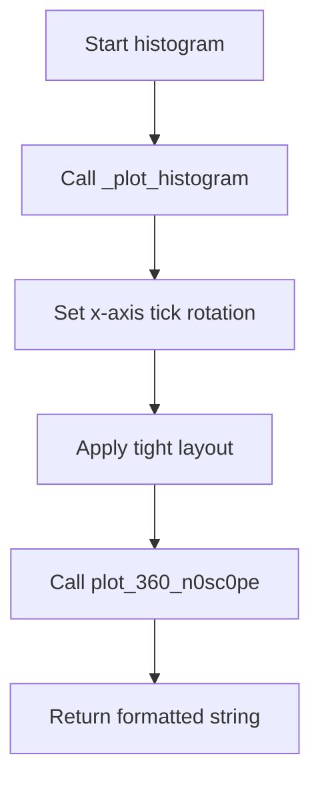

## Examples:
Example 1: Creating a basic histogram with default settings
```python
import numpy as np
from ydata_profiling.config import Settings

config = Settings()
series = np.array([10, 20, 30, 40, 50])
bins = 10
histogram_str = histogram(config, series, bins)
```

Example 2: Creating a date histogram with rotated labels
```python
import numpy as np
from ydata_profiling.config import Settings

config = Settings()
series = np.array([10, 20, 30, 40, 50])
bins = 10
histogram_str = histogram(config, series, bins, date=True)
```

## `src.ydata_profiling.visualisation.plot.mini_histogram` · *function*

## Summary:
Generates a compact histogram visualization for data series with customized styling and formatting.

## Description:
Creates a miniature histogram plot optimized for embedding in reports or dashboards. This function builds upon the standard histogram plotting capabilities by applying specific styling choices for small-size displays, including reduced font sizes, adjusted tick rotations, and tight layout optimization. It serves as a specialized visualization component for presenting frequency distributions in constrained visual spaces.

Known callers within the codebase:
- Called by visualization functions when generating compact histogram representations for report summaries
- Triggered during automated report generation when displaying numerical variable distributions in a space-efficient format
- Part of the data visualization pipeline for creating thumbnail-style histogram views

This logic is extracted into its own function to encapsulate the specific styling requirements for miniaturized histograms, ensuring consistent appearance and performance characteristics while maintaining the underlying histogram generation logic in a separate, reusable component.

## Args:
    config (Settings): Configuration object containing styling and display preferences for the histogram
    series (np.ndarray): Array of histogram values (frequencies) to be plotted
    bins (Union[int, np.ndarray]): Either a scalar integer specifying number of bins or an array of bin edges
    date (bool, optional): Flag indicating whether the data represents dates requiring special formatting. Defaults to False

## Returns:
    str: A string representation of the histogram image, either embedded inline as base64 data or as a file path reference depending on configuration settings

## Raises:
    ValueError: When the image format specified in config.plot.image_format is not supported (only "png" or "svg" are accepted)

## Constraints:
    Precondition:
    - config must be a valid Settings object with properly initialized html.style attributes
    - series must be a numpy array of numeric values
    - bins must be either an integer or a numpy array of bin edges
    - If date=True, the format_fn function must be available for date formatting
    
    Postcondition:
    - Returns a properly formatted string representation of the histogram image
    - The returned image maintains appropriate aspect ratio and visual clarity for small displays
    - All matplotlib resources are properly closed after generation

## Side Effects:
    - Creates and modifies matplotlib figures and axes
    - May modify matplotlib rcParams through the manage_matplotlib_context context manager
    - Sets axis formatters and tick labels
    - Applies color styling from the configuration
    - Generates temporary files or base64 encoded strings based on config.html.inline setting
    - Closes matplotlib figures to prevent resource leaks

## Control Flow:
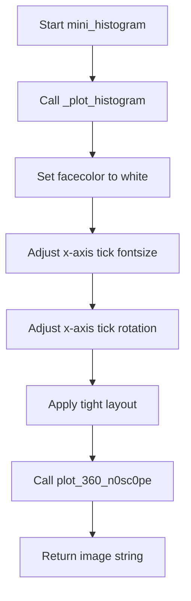

## Examples:
Example 1: Creating a compact histogram for numerical data
```python
import numpy as np
from ydata_profiling.config import Settings

config = Settings()
series = np.array([10, 20, 30, 40, 50])
bins = 10
histogram_string = mini_histogram(config, series, bins)
```

Example 2: Creating a compact date histogram
```python
import numpy as np
from ydata_profiling.config import Settings

config = Settings()
series = np.array([10, 20, 30, 40, 50])
bins = 10
histogram_string = mini_histogram(config, series, bins, date=True)
```

## `src.ydata_profiling.visualisation.plot.get_cmap_half` · *function*

## Summary:
Creates a new colormap using only the upper half of colors from the input colormap.

## Description:
This function extracts the upper half of colors from a given matplotlib colormap and constructs a new linear segmented colormap from those colors. It's commonly used in visualization contexts where only the brighter or more saturated portion of a color scale is desired.

## Args:
    cmap (Union[Colormap, LinearSegmentedColormap, ListedColormap]): The input colormap from which to extract colors. Must support indexing with numpy arrays and have an N attribute representing the number of discrete colors.

## Returns:
    LinearSegmentedColormap: A new colormap containing only the upper half of colors from the input colormap, named "cmap_half".

## Raises:
    AttributeError: If the input cmap does not have an N attribute.
    TypeError: If the input cmap is not a valid matplotlib colormap type.

## Constraints:
    Preconditions:
        - The input cmap must be a valid matplotlib colormap object
        - The cmap.N attribute must be a positive integer
    Postconditions:
        - The returned colormap will have exactly half the number of colors as the input colormap (rounded down)
        - The returned colormap will be a LinearSegmentedColormap instance

## Side Effects:
    None.

## Control Flow:
```mermaid
flowchart TD
    A[Input cmap] --> B{Valid colormap?}
    B -- Yes --> C[Calculate linspace(0.5, 1, cmap.N // 2)]
    C --> D[Extract colors from cmap using linspace]
    D --> E[Create LinearSegmentedColormap from extracted colors]
    E --> F[Return new colormap]
    B -- No --> G[AttributeError or TypeError]
```

## Examples:
```python
# Basic usage with a matplotlib colormap
from matplotlib import cm
cmap = cm.viridis
half_cmap = get_cmap_half(cmap)

# Usage in a plotting context
import matplotlib.pyplot as plt
fig, ax = plt.subplots()
# Apply the half colormap to a plot
im = ax.imshow(data, cmap=get_cmap_half(cm.plasma))
```

## `src.ydata_profiling.visualisation.plot.get_correlation_font_size` · *function*

## Summary:
Determines the appropriate font size for correlation matrix labels based on the number of labels to ensure readability.

## Description:
This function calculates an optimal font size for displaying labels in correlation matrices. It's designed to automatically adjust label font sizes to prevent overcrowding and maintain visual clarity as the number of variables increases. The function is extracted from inline logic to provide a reusable utility for managing visualization scaling.

## Args:
    n_labels (int): The number of labels in the correlation matrix. Must be a non-negative integer.

## Returns:
    Optional[int]: The recommended font size (4, 5, 6, or 8) for the labels, or None if the number of labels is 40 or fewer. Font sizes decrease as the number of labels increases to maintain readability.

## Raises:
    None

## Constraints:
    Preconditions:
        - n_labels must be a non-negative integer
    Postconditions:
        - Returns None when n_labels <= 40
        - Returns an integer between 4 and 8 when n_labels > 40

## Side Effects:
    None

## Control Flow:
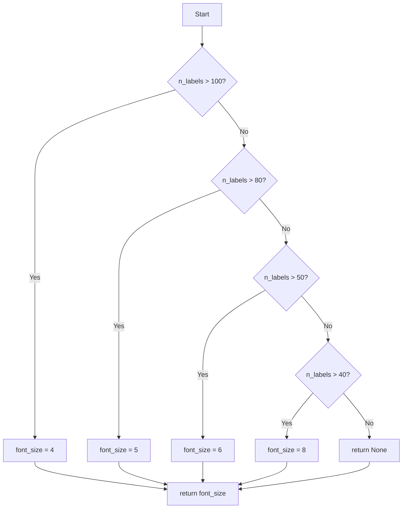

## Examples:
    >>> get_correlation_font_size(150)
    4
    >>> get_correlation_font_size(90)
    5
    >>> get_correlation_font_size(60)
    6
    >>> get_correlation_font_size(45)
    8
    >>> get_correlation_font_size(30)
    None
```

## `src.ydata_profiling.visualisation.plot.correlation_matrix` · *function*

## Summary:
Generates a correlation matrix heatmap visualization from a DataFrame of correlation coefficients.

## Description:
Creates a visual representation of correlation coefficients between variables in a dataset using a heatmap. This function renders the correlation matrix as a matplotlib figure with proper styling, color mapping, and labeling. The function is extracted to separate the visualization logic from data processing, enabling reuse across different correlation analysis contexts.

## Args:
    config (Settings): Configuration object containing visualization settings such as colormap preferences and output format options.
    data (pd.DataFrame): DataFrame containing correlation coefficients between variables, typically computed using methods like Pearson correlation. Should contain numeric values between -1 and 1.
    vmin (int, optional): Minimum value for the color scale. Defaults to -1, indicating a full range from -1 to 1. When set to 0, the colormap is adjusted to show only positive correlations.

## Returns:
    str: Path or base64 encoded string representing the saved visualization, depending on configuration settings (inline vs file-based output). The string contains either a file path or base64-encoded image data.

## Raises:
    ValueError: When the configured image format is not supported (only "png" or "svg" are accepted) in the underlying plot_360_n0sc0pe function.

## Constraints:
    Preconditions:
        - The data DataFrame must contain numeric correlation coefficients between -1 and 1
        - Config must contain valid plot configuration including correlation settings
        - The data DataFrame should have equal dimensions for rows and columns (square matrix)
    Postconditions:
        - A matplotlib figure is created and properly formatted with correlation matrix visualization
        - The returned string represents a valid image resource path or data
        - Matplotlib figures are closed to prevent memory leaks

## Side Effects:
    - Creates and modifies matplotlib figures and axes
    - May save files to disk or encode images to base64 based on configuration
    - Closes matplotlib figures after processing to prevent memory leaks

## Control Flow:
```mermaid
flowchart TD
    A[Start correlation_matrix] --> B[Initialize matplotlib figure with plt.subplots()]
    B --> C[Get colormap from config using plt.get_cmap()]
    C --> D{vmin == 0?}
    D -- Yes --> E[Apply get_cmap_half to colormap]
    D -- No --> F[Use original colormap]
    E --> F
    F --> G[Copy and configure colormap with bad color]
    G --> H[Render correlation data using plt.imshow()]
    H --> I{Data contains nulls?}
    I -- Yes --> J[Create legend for invalid coefficients using Patch]
    I -- No --> K[Skip legend creation]
    J --> K
    K --> L[Set x-axis tick positions and labels]
    L --> M[Set y-axis tick positions and labels]
    M --> N[Adjust subplot layout with plt.subplots_adjust()]
    N --> O[Return result from plot_360_n0sc0pe()]
```

## Examples:
```python
# Basic usage with default settings
config = Settings()
data = pd.DataFrame([[1.0, 0.5], [0.5, 1.0]])
result = correlation_matrix(config, data)

# Usage with custom vmin setting to show only positive correlations
result = correlation_matrix(config, data, vmin=0)
```

## `src.ydata_profiling.visualisation.plot.scatter_complex` · *function*

## Summary:
Creates a complex scatter plot visualization for complex number data series with adaptive binning based on data size.

## Description:
Generates a scatter plot visualization for pandas Series containing complex numbers, automatically switching between hexbin and scatter plot rendering methods based on the dataset size threshold. This function handles the visual representation of complex number data where real values are plotted on the x-axis and imaginary values on the y-axis.

The function is called within the profiling pipeline when visualizing complex number distributions, particularly when the data size exceeds a configured threshold. It serves as a specialized visualization utility that abstracts away the complexity of choosing appropriate plotting methods based on data characteristics.

## Args:
    config (Settings): Configuration object containing visualization settings including plot thresholds and styling preferences
    series (pd.Series): Pandas Series containing complex numbers to visualize

## Returns:
    str: Path or base64 encoded string representing the generated plot image, depending on HTML configuration settings. When config.html.inline is True, returns base64 encoded image data; when False, returns a file path string.

## Raises:
    None explicitly raised by this function

## Constraints:
    Preconditions:
        - The series parameter must contain complex numbers (real and imaginary components)
        - Config must contain valid plot configuration with scatter_threshold attribute
        - Config must contain valid HTML styling configuration with primary_colors
        - Config must contain valid plot configuration with image_format attribute

    Postconditions:
        - A matplotlib figure is created and configured with proper axis labels
        - The plot is rendered using either hexbin or scatter methods based on data size
        - The resulting plot is processed through the 360 n0sc0pe utility for final formatting
        - Matplotlib figures are properly closed after processing

## Side Effects:
    - Creates and modifies matplotlib figures and axes
    - Calls matplotlib.pyplot functions (plt.ylabel, plt.xlabel, plt.hexbin, plt.scatter)
    - Invokes plot_360_n0sc0pe for final image processing and formatting
    - May close matplotlib figures depending on configuration

## Control Flow:
```mermaid
flowchart TD
    A[Start scatter_complex] --> B{len(series) > scatter_threshold?}
    B -- Yes --> C[Create light palette from primary color]
    C --> D[Generate hexbin plot]
    B -- No --> E[Generate scatter plot]
    D --> F[Return plot_360_n0sc0pe result]
    E --> F
    F --> G[End]
```

## Examples:
```python
# Basic usage with default configuration
config = Settings()
series = pd.Series([1+2j, 3+4j, 5+6j])
result = scatter_complex(config, series)

# With large dataset triggering hexbin rendering
large_series = pd.Series([complex(i, i*2) for i in range(1500)])
result = scatter_complex(config, large_series)
```

## `src.ydata_profiling.visualisation.plot.scatter_series` · *function*

## Summary:
Creates a scatter plot or hexbin plot for visualizing series data points with configurable styling and threshold-based rendering.

## Description:
This function generates a two-dimensional visualization of data series, automatically choosing between scatter plots and hexbin plots based on the number of data points. It applies styling according to configuration settings and returns a formatted string representation of the plot for display or storage. The function uses matplotlib for plotting operations and integrates with the ydata-profiling visualization framework.

## Args:
    config (Settings): Configuration object containing styling and plotting parameters including primary colors and scatter threshold.
    series (pd.Series): A pandas Series containing paired coordinate data (x, y) to be plotted.
    x_label (str, optional): Label for the x-axis. Defaults to "Width".
    y_label (str, optional): Label for the y-axis. Defaults to "Height".

## Returns:
    str: A string representation of the generated plot, typically a base64-encoded image or file path depending on configuration settings.

## Raises:
    ValueError: If the image format specified in config is not supported ("png" or "svg").

## Constraints:
    Preconditions:
        - The series parameter must contain valid paired coordinate data.
        - Config must have valid html.style.primary_colors and plot.scatter_threshold attributes.
    Postconditions:
        - The matplotlib figure is closed after processing to prevent memory leaks.
        - The returned string represents a valid plot representation according to the configuration.

## Side Effects:
    - Sets axis labels using matplotlib's pyplot interface.
    - Creates either a scatter plot or hexbin plot using matplotlib's pyplot interface.
    - Closes the current matplotlib figure to prevent resource leaks.
    - May write files to disk if config.html.inline is False and config.html.assets_path is set.

## Control Flow:
```mermaid
flowchart TD
    A[Start scatter_series] --> B{len(series) > scatter_threshold?}
    B -- Yes --> C[Create hexbin plot with light palette]
    B -- No --> D[Create scatter plot]
    C --> E[Set color map]
    D --> E
    E --> F[Call plot_360_n0sc0pe]
    F --> G[Return result]
```

## Examples:
```python
# Basic usage with default labels
config = Settings()
series = pd.Series([(1, 2), (3, 4), (5, 6)])
result = scatter_series(config, series)

# Custom axis labels
result = scatter_series(config, series, x_label="X Coordinate", y_label="Y Coordinate")
```

## `src.ydata_profiling.visualisation.plot.scatter_pairwise` · *function*

## Summary:
Creates a pairwise scatter plot between two series, using hexbin visualization for large datasets and regular scatter for smaller ones.

## Description:
Generates a scatter plot comparing two data series, automatically choosing between hexagonal binning and standard scatter plots based on dataset size thresholds. This function handles missing data by filtering out NaN values and applies consistent styling using configuration parameters. The function integrates with the ydata-profiling visualization framework and uses matplotlib/seaborn for rendering.

## Args:
    config (Settings): Configuration object containing visualization settings including plot thresholds and styling preferences
    series1 (pd.Series): First data series to plot on x-axis
    series2 (pd.Series): Second data series to plot on y-axis
    x_label (str): Label for x-axis
    y_label (str): Label for y-axis

## Returns:
    str: Path or base64 encoded string representing the saved plot image, depending on configuration settings. When config.html.inline is True, returns base64 encoded image data; when False, returns file path string.

## Raises:
    ValueError: Raised by plot_360_n0sc0pe when invalid image format is specified (only "png" or "svg" supported)

## Constraints:
    Preconditions:
    - Both series must be pandas Series objects
    - Config must contain valid plot threshold and styling configuration
    - Series should contain numeric data for meaningful plotting
    
    Postconditions:
    - Plot is properly labeled with provided axis labels
    - Missing data is filtered out before plotting
    - Appropriate visualization method is selected based on data size
    - Global matplotlib state is properly managed

## Side Effects:
    - Modifies global matplotlib state (axis labels, current figure)
    - Creates matplotlib figure and axes
    - Saves plot to file or encodes to base64 string based on configuration
    - May create temporary files in assets directory when html.inline is False
    - Uses matplotlib's rcParams and seaborn styling context

## Control Flow:
```mermaid
flowchart TD
    A[Start scatter_pairwise] --> B[Set axis labels using plt.xlabel/ylabel]
    B --> C[Get primary color from config]
    C --> D[Filter out NaN values using notna()]
    D --> E{Series length > config.plot.scatter_threshold?}
    E -->|Yes| F[Create light palette colormap with sns.light_palette]
    F --> G[Generate hexbin plot using plt.hexbin]
    E -->|No| H[Generate scatter plot using plt.scatter]
    G --> I[Return plot result from plot_360_n0sc0pe]
    H --> I
    I --> J[Call plot_360_n0sc0pe to finalize and save plot]
    J --> K[Return final result string]
```

## Examples:
```python
# Basic usage with two numeric series
import pandas as pd
from ydata_profiling.config import Settings

config = Settings()
series1 = pd.Series([1, 2, 3, 4, 5])
series2 = pd.Series([2, 4, 6, 8, 10])
result = scatter_pairwise(config, series1, series2, "X Values", "Y Values")

# Example with larger dataset triggering hexbin visualization
large_series1 = pd.Series(range(1000))
large_series2 = pd.Series(range(1000, 2000))
result = scatter_pairwise(config, large_series1, large_series2, "X Values", "Y Values")
```

## `src.ydata_profiling.visualisation.plot._plot_stacked_barh` · *function*

## Summary:
Creates a horizontal stacked bar chart with percentage labels and optional legend for categorical data visualization.

## Description:
This function generates a horizontal stacked bar chart that displays categorical data with percentage labels on bars exceeding 8% of the total. It's designed for visualizing distributions of categorical variables in a compact horizontal format suitable for reports and dashboards.

The function is extracted from the main plotting logic to encapsulate the specific rendering behavior of stacked horizontal bars with intelligent labeling, separating this concern from other visualization components in the profiling system.

## Args:
    data (pd.Series): A pandas Series containing categorical values as index and their counts/frequencies as values.
    colors (List[str]): A list of color codes matching the length of the data series for bar coloring.
    hide_legend (bool, optional): Flag to control whether the legend should be displayed. Defaults to False.

## Returns:
    Tuple[plt.Axes, matplotlib.legend.Legend]: A tuple containing the matplotlib Axes object and the Legend object (or None if legend is hidden).

## Raises:
    None explicitly raised in the function body.

## Constraints:
    Preconditions:
    - The data parameter must be a pandas Series with categorical index and numeric values.
    - The colors list must have the same length as the data series.
    - The matplotlib backend must be properly configured for rendering plots.
    
    Postconditions:
    - A matplotlib figure with a single subplot is created.
    - The axes limits are set appropriately for the data range.
    - Bar labels are added only for bars representing more than 8% of the total.

## Side Effects:
    - Creates a matplotlib figure and axes instance.
    - May modify the global matplotlib state through plt.subplots().
    - Displays text labels on the plot surface via bar_label().

## Control Flow:
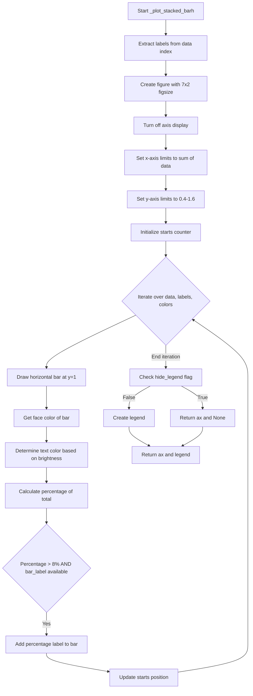

## Examples:
```python
import pandas as pd
import matplotlib.pyplot as plt

# Sample data
data = pd.Series([30, 25, 45], index=['Category A', 'Category B', 'Category C'])
colors = ['#FF6B6B', '#4ECDC4', '#45B7D1']

# Create stacked bar chart
ax, legend = _plot_stacked_barh(data, colors)

# Display the plot
plt.show()

# Create chart without legend
ax, legend = _plot_stacked_barh(data, colors, hide_legend=True)
```

## `src.ydata_profiling.visualisation.plot._plot_pie_chart` · *function*

## Summary:
Creates a pie chart visualization from categorical data with custom colors and optional legend.

## Description:
This function generates a pie chart using matplotlib's pie plotting functionality. It accepts categorical data as a pandas Series, custom color mappings, and provides options to hide the legend. The function is designed to be used internally for visualizing categorical distributions in profiling reports.

## Args:
    data (pd.Series): Categorical data to visualize, where index represents labels and values represent proportions/sizes.
    colors (List): List of color specifications to be used for pie wedge coloring.
    hide_legend (bool): Flag to control whether the legend should be displayed. Defaults to False.

## Returns:
    Tuple[plt.Axes, matplotlib.legend.Legend]: A tuple containing the matplotlib Axes object and the Legend object (or None if legend is hidden).

## Raises:
    None explicitly raised.

## Constraints:
    Preconditions:
    - The `data` parameter must be a pandas Series with numeric values representing proportions or counts.
    - The `colors` list must contain enough color specifications to match the number of categories in the data.
    - The `hide_legend` parameter must be a boolean value.

    Postconditions:
    - A matplotlib figure with a pie chart is created.
    - The returned Axes object contains the pie chart visualization.
    - The returned Legend object (if not hidden) contains the legend elements for the chart.

## Side Effects:
    - Creates a matplotlib figure with a fixed size of 4x4 inches.
    - Modifies the global matplotlib state by creating a new figure and axes.
    - May display a legend on the figure if not hidden.

## Control Flow:
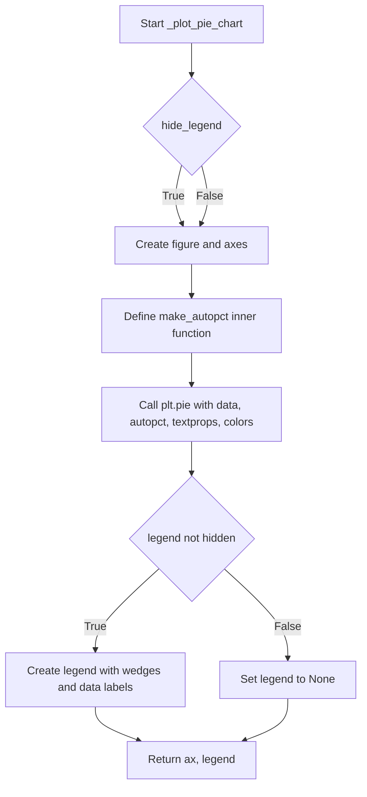

## Examples:
    # Basic usage with data and colors
    data = pd.Series([30, 25, 45], index=['A', 'B', 'C'])
    colors = ['#FF0000', '#00FF00', '#0000FF']
    ax, legend = _plot_pie_chart(data, colors)
    
    # Usage with hidden legend
    ax, legend = _plot_pie_chart(data, colors, hide_legend=True)

## `src.ydata_profiling.visualisation.plot.cat_frequency_plot` · *function*

## Summary:
Generates a categorical frequency plot (either bar or pie chart) for visualizing distribution of categorical data with configurable styling and legend options.

## Description:
This function creates visual representations of categorical data distributions using either bar charts or pie charts based on configuration settings. It handles color assignment for multiple categories, manages legend visibility, and integrates with the broader profiling system's visualization framework. The function is called by the profiling pipeline when generating categorical variable analysis reports.

The function is extracted from inline plotting logic to provide a clean separation between configuration-driven visualization decisions and the actual plotting implementation, allowing for easier maintenance and extension of visualization capabilities.

## Args:
    config (Settings): Configuration object containing plot settings including category frequency plot type, colors, and categorical variable redaction preferences.
    data (pd.Series): Pandas Series containing categorical values as index and their counts/frequencies as values.

## Returns:
    str: A string representation of the generated plot, either as base64-encoded image data or file path depending on HTML configuration settings.

## Raises:
    ValueError: Raised when an invalid plot type is specified in config.plot.cat_freq.type (only 'bar' or 'pie' are supported).

## Constraints:
    Preconditions:
    - The config parameter must be a valid Settings object with properly initialized plot configuration.
    - The data parameter must be a pandas Series with categorical index and numeric values.
    - The config.plot.cat_freq.type must be either 'bar' or 'pie'.
    
    Postconditions:
    - A matplotlib figure is created and rendered according to the specified plot type.
    - The returned string represents a valid image that can be embedded in reports.
    - Color assignment ensures sufficient colors for all categories in the data.

## Side Effects:
    - Creates matplotlib figures and axes for plot rendering.
    - May modify global matplotlib state through backend operations.
    - Calls external utility functions for final image processing and formatting.

## Control Flow:
```mermaid
flowchart TD
    A[Start cat_frequency_plot] --> B[Get colors from config or default]
    B --> C{Colors count < data length}
    C -->|Yes| D[Repeat colors to match data length]
    D --> E[Get plot type from config]
    E --> F{Plot type is "bar"}
    F -->|Yes| G[Call _plot_stacked_barh]
    F -->|No| H{Plot type is "pie"}
    H -->|Yes| I[Call _plot_pie_chart]
    H -->|No| J[Raise ValueError]
    G --> K[Return plot_360_n0sc0pe result]
    I --> K
    J --> K
```

## Examples:
```python
import pandas as pd
from ydata_profiling import ProfileReport
from ydata_profiling.config import Settings

# Basic usage with default configuration
data = pd.Series([30, 25, 45], index=['Category A', 'Category B', 'Category C'])
config = Settings()

# Generate bar chart
plot_str = cat_frequency_plot(config, data)

# Generate pie chart with custom configuration
config.plot.cat_freq.type = "pie"
plot_str = cat_frequency_plot(config, data)
```

## `src.ydata_profiling.visualisation.plot.create_comparison_color_list` · *function*

## Summary:
Creates a list of color hex codes for comparison visualizations by either using existing colors or generating a gradient colormap.

## Description:
This function generates a list of color hex codes suitable for visualizing comparisons in plots. It takes the primary colors configured for HTML styling and ensures there are enough colors for all labels, creating a gradient colormap when needed. The function is used to maintain consistent color schemes across different visualization components in the profiling report.

## Args:
    config (Settings): Configuration object containing HTML style settings including primary_colors and _labels

## Returns:
    List[str]: A list of color hex codes (strings) with length equal to the number of labels

## Raises:
    None explicitly raised

## Constraints:
    - Preconditions: config must have html.style.primary_colors and html.style._labels attributes
    - Postconditions: The returned list will have exactly len(config.html.style._labels) color hex codes

## Side Effects:
    - None

## Control Flow:
```mermaid
flowchart TD
    A[Start create_comparison_color_list] --> B{colors < labels?}
    B -- Yes --> C[Get init color from colors[0]]
    C --> D{len(colors) >= 2?}
    D -- Yes --> E[Set end color from colors[1]]
    D -- No --> F[Set end color to #000000]
    E --> G[Create LinearSegmentedColormap]
    F --> G
    G --> H[Generate color list using rgb2hex]
    H --> I[Return color list]
    B -- No --> J[Return original colors]
    J --> I
```

## Examples:
    - When config.html.style.primary_colors = ["#FF0000", "#00FF00"] and config.html.style._labels = ["A", "B", "C", "D"], returns a list of 4 gradient colors
    - When config.html.style.primary_colors = ["#FF0000"] and config.html.style._labels = ["A", "B"], returns a list of 2 gradient colors from red to black

## `src.ydata_profiling.visualisation.plot._format_ts_date_axis` · *function*

## Summary:
Formats the x-axis of a time series plot to display dates in a readable, concise manner when the series index is datetime-based.

## Description:
This function specifically handles the formatting of x-axis labels for time series data visualizations. It checks if the input series has a DatetimeIndex and, if so, applies appropriate date formatting using matplotlib's AutoDateLocator and ConciseDateFormatter to ensure the date labels are displayed clearly and concisely.

## Args:
    series (pandas.Series): A pandas Series object whose index is expected to be a DatetimeIndex for date formatting to be applied.
    axis (matplotlib.axis.Axis): The matplotlib axis object whose x-axis needs to be formatted.

## Returns:
    matplotlib.axis.Axis: The same axis object that was passed in, now modified with appropriate date formatting if applicable.

## Raises:
    None explicitly raised by this function.

## Constraints:
    Preconditions:
        - The series parameter must be a pandas Series object.
        - The axis parameter must be a valid matplotlib axis object.
    Postconditions:
        - If the series index is a DatetimeIndex, the axis x-axis will have date formatting applied.
        - If the series index is not a DatetimeIndex, the axis remains unchanged.

## Side Effects:
    None.

## Control Flow:
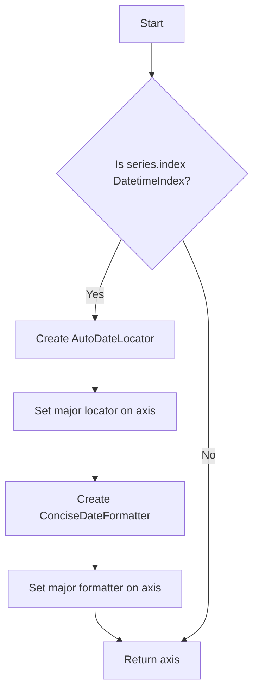

## Examples:
```python
import pandas as pd
import matplotlib.pyplot as plt
from src.ydata_profiling.visualisation.plot import _format_ts_date_axis

# Create a time series with DatetimeIndex
dates = pd.date_range('2023-01-01', periods=10, freq='D')
series = pd.Series(range(10), index=dates)

# Create a plot
fig, ax = plt.subplots()
ax.plot(series.index, series.values)

# Format the date axis
_formatted_axis = _format_ts_date_axis(series, ax)
```

## `src.ydata_profiling.visualisation.plot.plot_timeseries_gap_analysis` · *function*

## Summary:
Creates a time series visualization highlighting data gaps by overlaying filled regions on the plotted series.

## Description:
This function generates a matplotlib figure displaying time series data with highlighted gaps. It supports both single series and multiple series plotting, applying appropriate color schemes and date formatting. The gaps are visually represented as semi-transparent filled regions between the minimum and maximum values of the series over the gap period. The function ultimately returns a string representation of the plot based on configuration settings.

## Args:
    config (Settings): Configuration object containing HTML style settings for color generation and plot settings
    series (Union[pd.Series, List[pd.Series]]): Single pandas Series or list of pandas Series to plot
    gaps (Union[pd.Series, List[pd.Series]]): Single pandas Series or list of pandas Series representing gap periods to highlight
    figsize (tuple): Figure size as (width, height) in inches. Defaults to (6, 3)

## Returns:
    matplotlib.figure.Figure: The matplotlib figure object containing the time series plot with gap highlights

## Raises:
    None explicitly raised

## Constraints:
    - Preconditions: 
        - config must have html.style._labels attribute
        - series and gaps must be compatible types (both single or both lists)
        - If series is a list, gaps must also be a list of equal length
    - Postconditions: 
        - Returns a matplotlib figure with properly formatted axes
        - Gap regions are filled with semi-transparent colors matching the series colors

## Side Effects:
    - Creates and modifies matplotlib figure and axes objects
    - May close matplotlib figures depending on configuration
    - Uses global matplotlib state for figure creation and saving

## Control Flow:
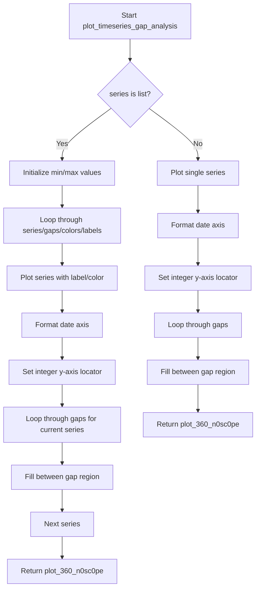

## Examples:
```python
import pandas as pd
from ydata_profiling.config import Settings
from src.ydata_profiling.visualisation.plot import plot_timeseries_gap_analysis

# Example with single series
config = Settings()
series = pd.Series([1, 2, 3, 4, 5], index=pd.date_range('2023-01-01', periods=5))
gaps = pd.Series([pd.Timestamp('2023-01-03'), pd.Timestamp('2023-01-04')])
fig = plot_timeseries_gap_analysis(config, series, gaps)

# Example with multiple series
series_list = [
    pd.Series([1, 2, 3, 4, 5], index=pd.date_range('2023-01-01', periods=5)),
    pd.Series([2, 3, 4, 5, 6], index=pd.date_range('2023-01-01', periods=5))
]
gaps_list = [
    pd.Series([pd.Timestamp('2023-01-03'), pd.Timestamp('2023-01-04')]),
    pd.Series([pd.Timestamp('2023-01-02'), pd.Timestamp('2023-01-03')])
]
fig = plot_timeseries_gap_analysis(config, series_list, gaps_list)
```

## `src.ydata_profiling.visualisation.plot.plot_overview_timeseries` · *function*

## Summary:
Creates a time series overview plot with customizable scaling and styling options, returning a string representation of the plot.

## Description:
Generates a matplotlib figure displaying time series data from multiple variables. The function handles both single and multiple time series data, applying appropriate styling including line styles, colors, and optional normalization. It integrates with the ydata-profiling configuration system to ensure consistent visualization styling. The function ultimately returns a string representation of the plot (either a file path or base64 encoded string) rather than the matplotlib figure object.

## Args:
    config (Settings): Configuration object containing plotting and HTML styling settings
    variables (Any): Dictionary containing variable data with keys as column names and values as dictionaries with 'type' and 'series' keys
    figsize (tuple): Figure size as (width, height) in inches. Defaults to (6, 4)
    scale (bool): Whether to normalize series data to [0,1] range. Defaults to False

## Returns:
    matplotlib.figure.Figure: The generated matplotlib figure object containing the time series plot

## Raises:
    None explicitly raised

## Constraints:
    - Preconditions: variables dictionary must contain valid time series data with 'type' and 'series' keys
    - Postconditions: Returns a matplotlib figure with properly formatted time series plot

## Side Effects:
    - Creates and modifies matplotlib figure and axes objects
    - May modify global matplotlib state through plt operations
    - Calls plot_360_n0sc0pe which may save files or return base64 encoded strings

## Control Flow:
```mermaid
flowchart TD
    A[Start plot_overview_timeseries] --> B[Create figure and axis]
    B --> C{variables[col]["type"] is list?}
    C -- Yes --> D[Create comparison colors]
    D --> E[Iterate variables]
    E --> F{all types are TimeSeries?}
    F -- Yes --> G[Iterate series in data]
    G --> H{scale enabled?}
    H -- Yes --> I[Normalize series]
    I --> J[Plot series with linestyle/color]
    H -- No --> J
    F -- No --> K[Skip to next variable]
    C -- No --> L[Iterate variables]
    L --> M{type is TimeSeries?}
    M -- Yes --> N{scale enabled?}
    N -- Yes --> O[Normalize series]
    O --> P[Plot series]
    N -- No --> P
    M -- No --> Q[Skip to next variable]
    R[Add legend and adjust subplot] --> S[Call plot_360_n0sc0pe]
    S --> T[Return matplotlib figure]
```

## Examples:
    - Basic usage with single time series: plot_overview_timeseries(config, {"ts_col": {"type": "TimeSeries", "series": pd.Series([1,2,3])}})
    - Multiple time series with scaling: plot_overview_timeseries(config, {"ts1": {"type": ["TimeSeries", "TimeSeries"], "series": [pd.Series([1,2,3]), pd.Series([4,5,6])]}}, scale=True)

## `src.ydata_profiling.visualisation.plot._plot_timeseries` · *function*

## Summary:
Creates a matplotlib figure for time series data visualization, supporting both single series and multiple series comparison plots.

## Description:
This function generates a matplotlib figure for plotting time series data. It handles two distinct cases: when the input is a single pandas Series (creating a simple line plot) and when the input is a list of pandas Series (creating a multi-series comparison plot with distinct colors and labels). The function automatically formats date axes when dealing with datetime-indexed data.

## Args:
    config (Settings): Configuration object containing HTML styling settings including primary colors and labels for multi-series plots
    series (Union[list, pd.Series]): Either a single pandas Series or a list of pandas Series to be plotted
    figsize (tuple, optional): Figure size as (width, height) in inches. Defaults to (6, 4)

## Returns:
    matplotlib.figure.Figure: A matplotlib figure object containing the time series plot

## Raises:
    None explicitly raised

## Constraints:
    Preconditions:
        - config must be a valid Settings object with html.style attributes
        - series must be either a pandas Series or a list of pandas Series
        - If series is a list, all elements must be pandas Series objects
    Postconditions:
        - A matplotlib figure is created with appropriate subplot configuration
        - Date formatting is applied to the x-axis when series index is DatetimeIndex
        - Colors and labels are properly assigned for multi-series plots

## Side Effects:
    - Creates a matplotlib figure and subplot
    - May modify matplotlib's global state through axis formatting operations
    - No external I/O operations performed

## Control Flow:
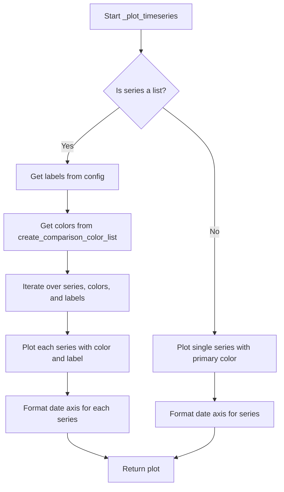

## Examples:
```python
import pandas as pd
from ydata_profiling.config import Settings

# Single series example
config = Settings()
series = pd.Series([1, 2, 3, 4], index=pd.date_range('2023-01-01', periods=4))
fig = _plot_timeseries(config, series)

# Multiple series example  
config = Settings()
series_list = [
    pd.Series([1, 2, 3, 4], index=pd.date_range('2023-01-01', periods=4)),
    pd.Series([4, 3, 2, 1], index=pd.date_range('2023-01-01', periods=4))
]
fig = _plot_timeseries(config, series_list)
```

## `src.ydata_profiling.visualisation.plot.mini_ts_plot` · *function*

## Summary:
Generates a compact time series plot with customized formatting for display in profiling reports.

## Description:
Creates a miniature time series visualization with rotated x-axis labels, small y-axis tick labels, and optimized layout. This function serves as a specialized wrapper around the general time series plotting functionality, applying specific formatting adjustments suitable for embedded report displays.

## Args:
    config (Settings): Configuration object containing HTML styling and plotting settings
    series (Union[list, pd.Series]): Time series data as a single pandas Series or list of Series to plot
    figsize (Tuple[float, float]): Figure dimensions in inches, defaults to (3, 2.25) for compact display

## Returns:
    str: Base64-encoded image string or file path depending on HTML inline configuration

## Raises:
    ValueError: When image_format is not 'png' or 'svg' in the plot_360_n0sc0pe utility function

## Constraints:
    Preconditions:
        - config must be a valid Settings object with proper HTML and plot configurations
        - series must be either a pandas Series or list of pandas Series objects
        - If series is a list, all elements must be pandas Series objects
    Postconditions:
        - A matplotlib figure is created with specified dimensions
        - X-axis tick labels are rotated 45 degrees
        - Y-axis tick labels are set to font size 3
        - X-axis tick label font sizes are adjusted based on index type (6 for DatetimeIndex, 8 otherwise)
        - Figure layout is optimized with tight spacing

## Side Effects:
    - Modifies matplotlib figure properties including tick parameters and label sizes
    - Calls matplotlib's rc() function to change global tick label settings
    - May create temporary files or return base64 encoded strings depending on HTML inline configuration
    - Closes matplotlib figures after processing

## Control Flow:
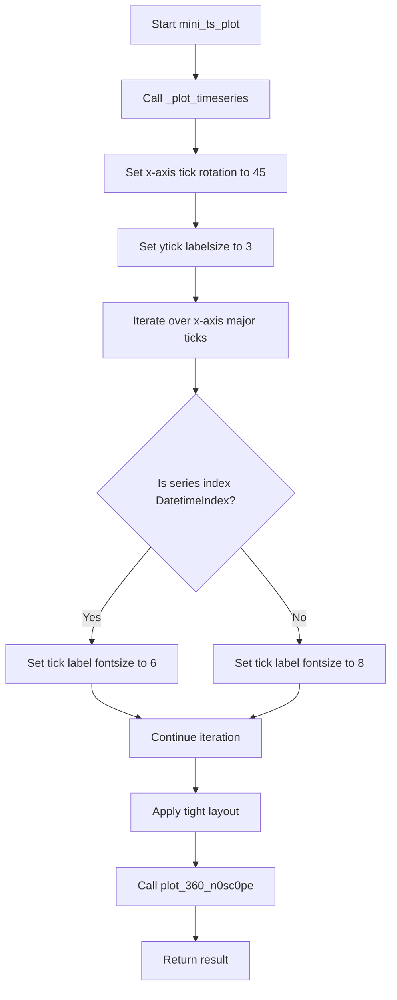

## Examples:
```python
import pandas as pd
from ydata_profiling.config import Settings

# Single series example
config = Settings()
series = pd.Series([1, 2, 3, 4], index=pd.date_range('2023-01-01', periods=4))
result = mini_ts_plot(config, series)

# Multiple series example  
config = Settings()
series_list = [
    pd.Series([1, 2, 3, 4], index=pd.date_range('2023-01-01', periods=4)),
    pd.Series([4, 3, 2, 1], index=pd.date_range('2023-01-01', periods=4))
]
result = mini_ts_plot(config, series_list, figsize=(4, 3))
```

## `src.ydata_profiling.visualisation.plot._get_ts_lag` · *function*

## Summary:
Determines the appropriate maximum lag size for time series autocorrelation plots based on data length and configuration.

## Description:
This utility function calculates the maximum lag value to use in autocorrelation and partial autocorrelation plots for time series analysis. It ensures that the lag parameter respects both the user-configured limit and the practical constraint imposed by the available data length.

## Args:
    config (Settings): Configuration object containing time series settings, specifically `vars.timeseries.pacf_acf_lag` which defines the maximum allowed lag
    series (pandas.Series): The time series data for which to calculate the appropriate lag size

## Returns:
    int: The calculated maximum lag size, which is the minimum of the configured lag and half the series length minus one

## Raises:
    None explicitly raised

## Constraints:
    Preconditions:
        - config must be a valid Settings object with vars.timeseries.pacf_acf_lag attribute
        - series must be a pandas Series object with at least 3 elements (to ensure max_lag_size >= 0)
    Postconditions:
        - Returns a non-negative integer representing the maximum lag size
        - The returned value will never exceed len(series) // 2 - 1

## Side Effects:
    None

## Control Flow:
```mermaid
flowchart TD
    A[Start _get_ts_lag] --> B[Get configured lag from config.vars.timeseries.pacf_acf_lag]
    B --> C[Calculate series length]
    C --> D[Calculate max_lag_size = len(series) // 2 - 1]
    D --> E[Return min(configured_lag, max_lag_size)]
```

## Examples:
    # Example usage with a configuration and series
    config = Settings()
    config.vars.timeseries.pacf_acf_lag = 20
    series = pd.Series([1, 2, 3, 4, 5, 6, 7, 8, 9, 10])
    lag = _get_ts_lag(config, series)
    # Returns min(20, 4) = 4
    
    # Example with small series
    small_series = pd.Series([1, 2, 3, 4])
    lag = _get_ts_lag(config, small_series)
    # Returns min(20, 1) = 1
```

## `src.ydata_profiling.visualisation.plot._plot_acf_pacf` · *function*

## Summary:
Generates and returns a combined autocorrelation (ACF) and partial autocorrelation (PACF) plot for time series data.

## Description:
Creates side-by-side plots of autocorrelation and partial autocorrelation functions for time series analysis. This function is used internally by the profiling system to visualize the temporal dependencies in time series data. It determines the appropriate lag size based on data length and configuration, generates both ACF and PACF plots with consistent styling, and returns the plot as a base64-encoded string or file path.

## Args:
    config (Settings): Configuration object containing styling and plotting parameters, particularly `html.style.primary_colors` for plot colors and `vars.timeseries.pacf_acf_lag` for maximum lag setting
    series (pandas.Series): Time series data to analyze for autocorrelations
    figsize (tuple, optional): Figure dimensions as (width, height) in inches. Defaults to (15, 5)

## Returns:
    str: Base64-encoded image string or file path depending on configuration settings (inline vs assets)

## Raises:
    None explicitly raised

## Constraints:
    Preconditions:
        - config must be a valid Settings object with proper html.style.primary_colors and vars.timeseries.pacf_acf_lag attributes
        - series must be a pandas Series object with sufficient data points for meaningful autocorrelation analysis
    Postconditions:
        - Returns a valid string representation of the plot (either base64 encoded or file path)
        - The returned plot displays both ACF and PACF side-by-side with consistent styling

## Side Effects:
    - Creates matplotlib figures and axes
    - Modifies plot collections to apply consistent coloring
    - May save plot to file if html.inline is False
    - Closes matplotlib figures after processing

## Control Flow:
```mermaid
flowchart TD
    A[Start _plot_acf_pacf] --> B[Extract primary color from config]
    B --> C[Calculate appropriate lag using _get_ts_lag]
    C --> D[Create subplots (2 columns)]
    D --> E[Plot ACF on left subplot]
    E --> F[Plot PACF on right subplot]
    F --> G[Apply color to polygon collections]
    G --> H[Return plot via plot_360_n0sc0pe]
```

## Examples:
    # Basic usage with default configuration
    config = Settings()
    series = pd.Series([1, 2, 3, 4, 5, 6, 7, 8, 9, 10])
    plot_result = _plot_acf_pacf(config, series)
    
    # Usage with custom figure size
    plot_result = _plot_acf_pacf(config, series, figsize=(20, 8))
```

## `src.ydata_profiling.visualisation.plot._plot_acf_pacf_comparison` · *function*

## Summary:
Generates a comparative plot of Autocorrelation Function (ACF) and Partial Autocorrelation Function (PACF) for time series data.

## Description:
Creates a grid of ACF and PACF plots for multiple time series, allowing for visual comparison of autocorrelation patterns. This function is used in time series analysis to identify potential ARIMA model orders by examining the decay patterns in autocorrelations.

## Args:
    config (Settings): Configuration object containing HTML styling and time series settings
    series (List[pandas.Series]): List of time series data to plot ACF/PACF for
    figsize (tuple, optional): Figure size as (width, height) in inches. Defaults to (15, 5)

## Returns:
    str: Path or base64 encoded string representing the generated plot image

## Raises:
    None explicitly raised

## Constraints:
    Preconditions:
        - config must contain valid HTML style settings with primary_colors and _labels
        - series must be a list of pandas Series objects
        - Each series should have sufficient data points for meaningful autocorrelation calculation
    Postconditions:
        - Returns a string representation of the plot (file path or base64 data)
        - All matplotlib figures are properly closed after plotting

## Side Effects:
    - Creates matplotlib subplots and modifies their properties
    - May generate files if config.html.inline is False
    - Modifies plot collection face colors to match the assigned color scheme

## Control Flow:
```mermaid
flowchart TD
    A[Start _plot_acf_pacf_comparison] --> B[Get colors from config]
    B --> C[Create subplot grid with nrows=n_labels, ncols=2]
    C --> D[Initialize is_first flag]
    D --> E{For each series, axis pair, and color}
    E --> F[Calculate lag using _get_ts_lag]
    F --> G[Plot ACF with plot_acf]
    G --> H[Plot PACF with plot_pacf]
    H --> I[Set is_first=False]
    I --> J[Loop through axes to set collection colors]
    J --> K[Return result from plot_360_n0sc0pe]
```

## Examples:
    # Basic usage with a single time series
    config = Settings()
    series = [pd.Series([1, 2, 3, 4, 5, 6, 7, 8, 9, 10])]
    plot_path = _plot_acf_pacf_comparison(config, series)
    
    # Usage with multiple time series
    series = [
        pd.Series([1, 2, 3, 4, 5]),
        pd.Series([2, 4, 6, 8, 10])
    ]
    plot_path = _plot_acf_pacf_comparison(config, series, figsize=(10, 3))

## `src.ydata_profiling.visualisation.plot.plot_acf_pacf` · *function*

## Summary:
Generates either a comparative or single ACF/PACF plot for time series data based on input type.

## Description:
This function serves as a dispatcher that routes time series data to either a comparative ACF/PACF plotting function or a single-series plotting function. When provided with a list of time series, it creates a grid comparison plot; when provided with a single series, it generates a side-by-side ACF and PACF visualization. This abstraction allows the profiling system to handle both individual time series analysis and multi-series comparison scenarios uniformly.

## Args:
    config (Settings): Configuration object containing HTML styling and time series settings
    series (Union[list, pandas.Series]): Either a single pandas Series or a list of pandas Series for ACF/PACF analysis
    figsize (tuple, optional): Figure size as (width, height) in inches. Defaults to (15, 5)

## Returns:
    str: Path or base64 encoded string representing the generated plot image

## Raises:
    None explicitly raised

## Constraints:
    Preconditions:
        - config must be a valid Settings object
        - series must be either a pandas Series or a list of pandas Series
        - When series is a list, all elements must be valid pandas Series objects
    Postconditions:
        - Returns a string representation of the plot (file path or base64 data)
        - The returned plot matches the input data type (single or comparative)

## Side Effects:
    - Delegates to either `_plot_acf_pacf_comparison` or `_plot_acf_pacf` which may create matplotlib figures and modify their properties
    - May generate files if config.html.inline is False
    - All matplotlib figures are properly closed after plotting

## Control Flow:
```mermaid
flowchart TD
    A[Start plot_acf_pacf] --> B{Is series a list?}
    B -->|Yes| C[_plot_acf_pacf_comparison]
    B -->|No| D[_plot_acf_pacf]
    C --> E[Return result]
    D --> E
```

## Examples:
    # Single series usage
    config = Settings()
    series = pd.Series([1, 2, 3, 4, 5, 6, 7, 8, 9, 10])
    plot_path = plot_acf_pacf(config, series)
    
    # Multiple series usage
    series = [
        pd.Series([1, 2, 3, 4, 5]),
        pd.Series([2, 4, 6, 8, 10])
    ]
    plot_path = plot_acf_pacf(config, series, figsize=(10, 3))

## `src.ydata_profiling.visualisation.plot._prepare_heatmap_data` · *function*

## Summary:
Transforms DataFrame data into a pivoted format suitable for heatmap visualization by grouping entities into bins based on a sorting column.

## Description:
This function prepares data for heatmap visualization by organizing entities into bins according to a specified sorting column. It handles datetime conversion when needed, creates bins using pandas cut function, groups the data, and pivots it into a format where entities become rows and bins become columns. The function supports limiting the number of entities displayed or selecting specific entities.

## Args:
    dataframe (pd.DataFrame): Input DataFrame containing the data to be processed
    entity_column (str): Name of the column representing entities to group by
    sortby (Optional[Union[str, list]], optional): Column(s) to sort by for binning. If None, uses index values. Defaults to None
    max_entities (int, optional): Maximum number of entities to include in output when selected_entities is None. Defaults to 5
    selected_entities (Optional[List[str]], optional): Specific entities to include in output. If provided, overrides max_entities. Defaults to None

## Returns:
    pd.DataFrame: Transformed DataFrame with entities as rows and bin numbers as columns, ready for heatmap plotting

## Raises:
    ValueError: When sortby column has object dtype that cannot be converted to datetime

## Constraints:
    Preconditions:
        - dataframe must be a valid pandas DataFrame
        - entity_column must exist in dataframe
        - sortby column(s) must exist in dataframe if provided
    Postconditions:
        - Output DataFrame has entities as row index and bin numbers as column index
        - All returned DataFrames are properly formatted for heatmap plotting

## Side Effects:
    None

## Control Flow:
```mermaid
flowchart TD
    A[Start _prepare_heatmap_data] --> B{sortby is None?}
    B -- Yes --> C[Create sortbykey="_index"]
    B -- No --> D[Convert sortby to list if string]
    C --> E[Copy entity_column data with reset index]
    D --> F[Copy specified columns]
    E --> G[Set column names]
    F --> G
    G --> H{sortbykey dtype == "O"?}
    H -- Yes --> I[Attempt datetime conversion]
    I --> J{Conversion succeeds?}
    J -- No --> K[Raise ValueError]
    J -- Yes --> L[Continue processing]
    H -- No --> L
    L --> M[Calculate nbins = min(50, unique_values)]
    M --> N[Create bins using pd.cut]
    N --> O[Group by entity_column and bins]
    O --> P[Count occurrences]
    P --> Q[Reset index and pivot]
    Q --> R{selected_entities provided?}
    R -- Yes --> S[Filter by selected_entities]
    R -- No --> T[Take first max_entities]
    S --> U[Return result]
    T --> U
```

## Examples:
    # Basic usage with default parameters
    result = _prepare_heatmap_data(df, "category")
    
    # Usage with sorting column
    result = _prepare_heatmap_data(df, "category", sortby="date")
    
    # Usage with entity selection
    result = _prepare_heatmap_data(df, "category", selected_entities=["A", "B"])
    
    # Usage with multiple sort columns
    result = _prepare_heatmap_data(df, "category", sortby=["date", "value"])

## `src.ydata_profiling.visualisation.plot._create_timeseries_heatmap` · *function*

## Summary:
Creates a heatmap visualization for time series data with customizable color scheme and layout.

## Description:
This function generates a matplotlib heatmap plot for time series data, where each cell's color intensity represents the magnitude of values in the DataFrame. It is designed specifically for visualizing temporal data patterns and trends.

The function is typically called during report generation when time series heatmaps are needed to display temporal correlations or patterns in the data. It's extracted as a separate function to encapsulate the specific plotting logic for time series heatmaps, allowing for consistent styling and reuse across different visualization contexts.

## Args:
    df (pd.DataFrame): A DataFrame containing time series data where rows represent time periods and columns represent variables or features.
    figsize (Tuple[int, int], optional): Figure size as (width, height) in inches. Defaults to (12, 5).
    color (str, optional): Hex color code for the colormap gradient. Defaults to "#337ab7" (blue).

## Returns:
    plt.Axes: The matplotlib Axes object containing the heatmap visualization.

## Raises:
    None explicitly raised.

## Constraints:
    Preconditions:
    - Input df must be a valid pandas DataFrame
    - DataFrame should contain numeric data for proper heatmap rendering
    - Color parameter must be a valid hex color string
    
    Postconditions:
    - Returns a matplotlib Axes object with properly configured heatmap
    - Y-axis tick labels correspond to DataFrame index values
    - X-axis is labeled as "Time"
    - Y-axis is inverted for better temporal visualization

## Side Effects:
    - Creates a new matplotlib figure and axes
    - Modifies the matplotlib state through plt.subplots() and subsequent axis configuration
    - May affect global matplotlib settings through the plotting process

## Control Flow:
```mermaid
flowchart TD
    A[Start _create_timeseries_heatmap] --> B[Create matplotlib figure and axes]
    B --> C[Generate colormap from color parameter]
    C --> D[Create pcolormesh with DataFrame data]
    D --> E[Set color limits based on max value]
    E --> F[Configure y-axis ticks and labels]
    F --> G[Remove x-axis ticks]
    G --> H[Set x-axis label to "Time"]
    H --> I[Invert y-axis]
    I --> J[Return axes object]
```

## Examples:
```python
import pandas as pd
import matplotlib.pyplot as plt

# Create sample time series data
dates = pd.date_range('2023-01-01', periods=10, freq='D')
data = pd.DataFrame({
    'feature1': [1, 2, 3, 4, 5, 6, 7, 8, 9, 10],
    'feature2': [10, 9, 8, 7, 6, 5, 4, 3, 2, 1]
}, index=dates)

# Create heatmap
ax = _create_timeseries_heatmap(data, figsize=(10, 4), color="#e74c3c")
plt.show()
```

## `src.ydata_profiling.visualisation.plot.timeseries_heatmap` · *function*

## Summary:
Creates a time series heatmap visualization for grouped entity data with customizable sorting and entity selection.

## Description:
Generates a matplotlib heatmap plot showing temporal patterns for time series data grouped by entities. The function prepares data by binning entities based on a sorting column, then creates a heatmap visualization with configurable figure size and color scheme. This function is typically called during automated profiling reports when time series analysis is required to visualize temporal correlations.

The logic is extracted into a separate function to encapsulate the complete workflow of data preparation and visualization creation, ensuring consistent styling and reusable plotting logic across different visualization contexts.

## Args:
    dataframe (pd.DataFrame): Input DataFrame containing time series data with datetime index and entity columns
    entity_column (str): Name of the column representing entities to group by for the heatmap
    sortby (Optional[Union[str, list]], optional): Column(s) to sort entities by for binning. If None, uses index values. Defaults to None
    max_entities (int, optional): Maximum number of entities to include when selected_entities is None. Defaults to 5
    selected_entities (Optional[List[str]], optional): Specific entities to include in the visualization. If provided, overrides max_entities. Defaults to None
    figsize (Tuple[int, int], optional): Figure size as (width, height) in inches. Defaults to (12, 5)
    color (str, optional): Hex color code for the heatmap colormap gradient. Defaults to "#337ab7"

## Returns:
    plt.Axes: The matplotlib Axes object containing the time series heatmap visualization

## Raises:
    ValueError: When sortby column has object dtype that cannot be converted to datetime

## Constraints:
    Preconditions:
    - Input dataframe must be a valid pandas DataFrame
    - entity_column must exist in the dataframe
    - sortby column(s) must exist in dataframe if provided
    - color parameter must be a valid hex color string
    
    Postconditions:
    - Returns a matplotlib Axes object with properly configured heatmap
    - Y-axis tick labels correspond to entity names
    - X-axis is labeled as "Time"
    - Y-axis is inverted for better temporal visualization
    - Aspect ratio is set to 1 for square-like cells

## Side Effects:
    - Creates a new matplotlib figure and axes through internal plotting functions
    - May modify matplotlib state through the plotting process
    - Uses internal helper functions that create matplotlib figures

## Control Flow:
```mermaid
flowchart TD
    A[Start timeseries_heatmap] --> B[Prepare heatmap data using _prepare_heatmap_data]
    B --> C[Create heatmap visualization using _create_timeseries_heatmap]
    C --> D[Set aspect ratio to 1]
    D --> E[Return axes object]
```

## Examples:
```python
import pandas as pd
import matplotlib.pyplot as plt

# Create sample time series data
dates = pd.date_range('2023-01-01', periods=100, freq='D')
df = pd.DataFrame({
    'entity': ['A'] * 50 + ['B'] * 50,
    'value': list(range(50)) + list(range(50, 100)),
    'date': dates
})

# Create basic time series heatmap
ax = timeseries_heatmap(df, entity_column='entity')

# Create heatmap with custom parameters
ax = timeseries_heatmap(
    df, 
    entity_column='entity',
    sortby='date',
    max_entities=3,
    figsize=(15, 6),
    color="#e74c3c"
)

plt.show()
```

## `src.ydata_profiling.visualisation.plot._set_visibility` · *function*

## Summary:
Hides all spines and controls tick mark visibility for a matplotlib axis.

## Description:
This utility function removes the visual borders (spines) of a matplotlib axis and configures tick mark visibility. It's designed to create clean, minimalist plot appearances by eliminating default axis borders and optionally removing tick marks. This function is typically used internally by visualization components to standardize plot styling.

## Args:
    axis (matplotlib.axis.Axis): The matplotlib axis object to modify.
    tick_mark (str, optional): Position for tick marks on both x and y axes. Valid values are 'none', 'top', 'bottom', 'left', 'right'. Defaults to "none".

## Returns:
    matplotlib.axis.Axis: The same axis object that was passed in, enabling method chaining.

## Raises:
    None explicitly raised.

## Constraints:
    Preconditions:
        - The axis parameter must be a valid matplotlib axis object.
        - The tick_mark parameter must be a valid string accepted by matplotlib's set_ticks_position method.
    
    Postconditions:
        - All four spines (top, right, bottom, left) of the axis are set to invisible.
        - Tick marks on both x and y axes are positioned according to the tick_mark parameter.

## Side Effects:
    None.

## Control Flow:
```mermaid
flowchart TD
    A[Start _set_visibility] --> B[For each spine in ["top","right","bottom","left"]]
    B --> C[Set spine.visible = False]
    C --> D[Set xaxis ticks position to tick_mark]
    D --> E[Set yaxis ticks position to tick_mark]
    E --> F[Return axis]
```

## Examples:
```python
import matplotlib.pyplot as plt
import matplotlib.axis

# Create a simple plot
fig, ax = plt.subplots()
ax.plot([1, 2, 3], [1, 4, 9])

# Remove all spines and ticks
ax = _set_visibility(ax, tick_mark="none")

# Alternative: remove spines but keep ticks
ax = _set_visibility(ax, tick_mark="both")

# The resulting plot will have no spines and no tick marks (in first case)
plt.show()
```

## `src.ydata_profiling.visualisation.plot.missing_bar` · *function*

## Summary:
Creates a bar chart visualization showing missing data patterns with dual axes displaying both percentages and raw counts.

## Description:
Generates a matplotlib bar chart that visualizes missing data patterns in a dataset. The function creates a dual-axis plot where one axis displays the percentage of non-null values and the other displays the actual count of non-null values. This allows users to quickly assess both the proportion and absolute numbers of missing data for each column.

The function automatically chooses between vertical and horizontal bar charts based on the number of data points (switches to horizontal when 51+ columns are present) and applies appropriate styling including custom colors, font sizes, and label rotations.

## Args:
    notnull_counts (pd.Series): A pandas Series containing the count of non-null values for each column in the dataset.
    nrows (int): Total number of rows in the original dataset, used to calculate percentages.
    figsize (Tuple[float, float], optional): Figure size as (width, height) in inches. Defaults to (25, 10).
    fontsize (float, optional): Font size for axis labels and tick labels. Defaults to 16.
    labels (bool, optional): Whether to display y-axis labels. Defaults to True.
    color (Tuple[float, ...], optional): RGB color tuple for the bars. Defaults to (0.41, 0.41, 0.41).
    label_rotation (int, optional): Rotation angle for x-axis labels (vertical) or y-axis labels (horizontal). Defaults to 45.

## Returns:
    matplotlib.axis.Axis: The primary matplotlib axis object representing the bar chart. This axis contains the percentage data visualization.

## Raises:
    None explicitly raised.

## Constraints:
    Preconditions:
        - notnull_counts must be a pandas Series with numeric values
        - nrows must be a positive integer
        - figsize must be a tuple of two positive floats
        - color must be a valid RGB tuple with values between 0 and 1
    
    Postconditions:
        - Returns a matplotlib axis object with properly formatted dual-axis visualization
        - The returned axis has spines hidden and tick marks configured via _set_visibility
        - Axis labels and tick labels are appropriately rotated and sized

## Side Effects:
    - Creates a matplotlib figure and axis objects
    - Modifies matplotlib axis properties including tick labels, spines, and visibility settings
    - May affect global matplotlib state through axis modifications

## Control Flow:
```mermaid
flowchart TD
    A[Start missing_bar] --> B[Calculate percentage = notnull_counts / nrows]
    B --> C{len(notnull_counts) <= 50?}
    C -->|Yes| D[Create vertical bar chart]
    C -->|No| E[Create horizontal bar chart]
    D --> F[Set x-axis tick labels with rotation]
    E --> G[Set y-axis tick labels with rotation]
    F --> H[Create twin x-axis for counts]
    G --> H
    H --> I[Set twin axis tick labels with counts]
    I --> J[Apply _set_visibility to both axes]
    J --> K[Return primary axis]
```

## Examples:
```python
import pandas as pd
import matplotlib.pyplot as plt
from ydata_profiling.visualisation.plot import missing_bar

# Sample data
data = pd.DataFrame({
    'A': [1, 2, None, 4],
    'B': [None, None, None, 4],
    'C': [1, 2, 3, 4]
})

# Calculate non-null counts
notnull_counts = data.count()

# Create missing data visualization
ax = missing_bar(notnull_counts, nrows=len(data), figsize=(15, 8))

# Display the plot
plt.show()
```

## `src.ydata_profiling.visualisation.plot.missing_matrix` · *function*

## Summary:
Creates a heatmap visualization showing the pattern of missing data across columns and rows.

## Description:
Generates a matrix plot where each cell represents whether a data value is present (colored) or missing (white) in a dataset. This visualization helps identify patterns in missing data across different features and observations.

## Args:
    notnull (Any): Boolean array or mask indicating which values are not null. Shape should match (height, width) of the grid.
    columns (List[str]): List of column names to display on the x-axis.
    height (int): Number of rows in the visualization grid.
    figsize (Tuple[float, float], optional): Figure size in inches. Defaults to (25, 10).
    color (Tuple[float, ...], optional): RGB color tuple for representing non-missing values. Defaults to (0.41, 0.41, 0.41).
    fontsize (float, optional): Font size for axis labels. Defaults to 16.
    labels (bool, optional): Whether to display column labels on x-axis. Defaults to True.
    label_rotation (int, optional): Rotation angle for x-axis labels in degrees. Defaults to 45.

## Returns:
    matplotlib.axis.Axis: The matplotlib axis object containing the rendered visualization.

## Raises:
    None explicitly raised.

## Constraints:
    Preconditions:
        - The `notnull` parameter must be a boolean array with shape matching (height, width).
        - The `columns` list must contain at least one element.
        - The `height` parameter must be a positive integer.
        - The `color` parameter must be a valid RGB tuple with values between 0 and 1.
    
    Postconditions:
        - Returns a matplotlib axis with a properly formatted missing data matrix visualization.
        - The returned axis has no visible spines and minimal tick marks.

## Side Effects:
    - Creates a matplotlib figure and axis using plt.subplots().
    - Modifies the matplotlib axis object to remove spines and control tick visibility.

## Control Flow:
```mermaid
flowchart TD
    A[Start missing_matrix] --> B[Calculate width from columns length]
    B --> C[Initialize missing_grid with zeros]
    C --> D[Set grid cells to color where notnull is True]
    D --> E[Set grid cells to white where notnull is False]
    E --> F[Create matplotlib figure and axis]
    F --> G[Display missing_grid as image]
    G --> H[Set axis properties (aspect, grid, tick positions)]
    H --> I[Configure x-axis labels and ticks]
    I --> J[Configure y-axis labels and ticks]
    J --> K[Add vertical separator lines]
    K --> L[Conditionally hide x-axis labels]
    L --> M[Apply _set_visibility to clean up axis appearance]
    M --> N[Return axis object]
```

## Examples:
```python
import numpy as np
import matplotlib.pyplot as plt
from src.ydata_profiling.visualisation.plot import missing_matrix

# Sample data
notnull = np.array([[True, False, True], [False, True, True], [True, True, False]])
columns = ['A', 'B', 'C']
height = 3

# Generate missing matrix visualization
ax = missing_matrix(notnull, columns, height, figsize=(15, 5))

# Display the plot
plt.show()
```

## `src.ydata_profiling.visualisation.plot.missing_heatmap` · *function*

## Summary:
Creates a heatmap visualization for missing data correlation matrices with customizable formatting and labeling options.

## Description:
Generates a seaborn-based heatmap to visualize correlations between missing data patterns in a dataset. This function is specifically designed for displaying missing data heatmaps and provides extensive customization options for appearance, labeling, and data formatting. The function handles special formatting of correlation values for better readability and creates a clean, publication-ready visualization.

Known callers within the codebase:
- Called from `src/ydata_profiling/visualisation/plot.py` in the `missing_plot` function when generating missing data visualizations
- Triggered during profiling reports when missing data analysis is enabled

This logic is extracted into its own function to separate concerns between data processing and visualization rendering, allowing for reuse in different contexts while maintaining consistent styling and formatting behavior.

## Args:
    corr_mat (Any): Correlation matrix containing missing data patterns, typically a pandas DataFrame or numpy array
    mask (Any): Boolean mask indicating which cells to hide in the heatmap visualization
    figsize (Tuple[float, float], optional): Figure size as (width, height) in inches. Defaults to (20, 12)
    fontsize (float, optional): Font size for axis labels and annotations. Defaults to 16
    labels (bool, optional): Whether to display correlation values as annotations. Defaults to True
    label_rotation (int, optional): Rotation angle for x-axis labels in degrees. Defaults to 45
    cmap (str, optional): Colormap name for the heatmap. Defaults to "RdBu"
    normalized_cmap (bool, optional): Whether to normalize color mapping to [-1, 1] range. Defaults to True
    cbar (bool, optional): Whether to display colorbar. Defaults to True
    ax (matplotlib.axis.Axis, optional): Existing matplotlib axis to draw on. If None, a new figure is created. Defaults to None

## Returns:
    matplotlib.axis.Axis: The matplotlib axis object containing the rendered heatmap

## Raises:
    None explicitly raised

## Constraints:
    Preconditions:
        - corr_mat should be a valid correlation matrix with numeric values
        - mask should be compatible shape with corr_mat for boolean masking
        - figsize should contain two positive float values
        - fontsize should be a positive number
        - label_rotation should be an integer representing degrees
        - ax should be a valid matplotlib axis object if provided
    
    Postconditions:
        - Returns a matplotlib axis with properly formatted heatmap
        - Axis labels are rotated and sized according to parameters
        - Special formatting is applied to correlation values for readability
        - Axis spines are hidden for clean appearance
        - If ax parameter is provided, it modifies that axis instead of creating a new figure

## Side Effects:
    - Creates a new matplotlib figure and axis when ax=None
    - Modifies axis properties including tick labels, spine visibility, and patch visibility
    - Updates text elements in the axis for value formatting
    - May modify existing axis if ax parameter is provided

## Control Flow:
```mermaid
flowchart TD
    A[Start missing_heatmap] --> B{ax provided?}
    B -->|No| C[Create new figure with figsize using plt.subplots]
    B -->|Yes| D[Use existing ax parameter]
    C --> E[Prepare normalization arguments]
    D --> E
    E --> F{labels enabled?}
    F -->|Yes| G[Call sns.heatmap with annotations]
    F -->|No| H[Call sns.heatmap without annotations]
    G --> I[Configure x-axis tick labels]
    H --> I
    I --> J[Configure y-axis tick labels]
    J --> K[Apply _set_visibility to hide spines]
    K --> L[Format text values for readability]
    L --> M[Return modified axis]
```

## Examples:
```python
import matplotlib.pyplot as plt
import seaborn as sns
import numpy as np
import pandas as pd

# Create sample missing data correlation matrix
data = pd.DataFrame({
    'A': [1, 0, 1, 0],
    'B': [0, 1, 1, 0],
    'C': [1, 1, 0, 0]
})
corr_mat = data.corr()
mask = np.triu(np.ones_like(corr_mat, dtype=bool))

# Create missing heatmap with new figure
fig, ax = plt.subplots(figsize=(10, 8))
ax = missing_heatmap(corr_mat, mask, fontsize=12, labels=True)
plt.show()

# Create heatmap without labels on existing axis
fig, ax = plt.subplots()
ax = missing_heatmap(corr_mat, mask, labels=False, cmap="viridis", ax=ax)
plt.show()

# Create heatmap with custom size and rotation
ax = missing_heatmap(corr_mat, mask, figsize=(15, 10), label_rotation=30)
plt.show()
```

