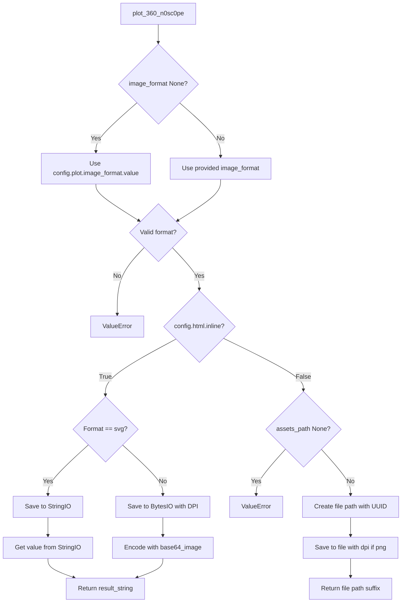

# `utils.py`

## `src.ydata_profiling.visualisation.utils.hex_to_rgb` · *function*

## Summary:
Converts a hexadecimal color string to normalized RGB float values.

## Description:
Transforms a hex color code (e.g., "#FF0000") into a tuple of normalized RGB values between 0.0 and 1.0. This utility function is used throughout the visualization module to standardize color representation for matplotlib plotting functions. The function handles both 3-digit shorthand (e.g., "#F00") and 6-digit full form (e.g., "#FF0000") hex colors.

## Args:
    hex (str): A hexadecimal color string starting with '#' followed by 3 or 6 hexadecimal characters (e.g., "#FF0000", "#F00")

## Returns:
    Tuple[float, ...]: A tuple containing normalized RGB values (each between 0.0 and 1.0) representing the color. For 3-digit hex codes, each character is duplicated (e.g., "#F00" becomes "#FF0000"); for 6-digit hex codes, the values are taken directly.

## Raises:
    ValueError: When the input string is not a valid hexadecimal color code (e.g., invalid characters, wrong length, or missing '#')

## Constraints:
    Precondition: Input string must start with '#' character
    Precondition: Hex string must contain only valid hexadecimal characters (0-9, A-F, a-f)
    Precondition: Hex string must be either 3 or 6 characters long after stripping '#'
    Postcondition: All returned values are floats in the range [0.0, 1.0]

## Side Effects:
    None

## Control Flow:
```mermaid
flowchart TD
    A[Input hex string] --> B{Starts with #?}
    B -- No --> C[Raise ValueError]
    B -- Yes --> D[Strip #]
    D --> E{Length 3 or 6?}
    E -- No --> F[Raise ValueError]
    E -- Yes --> G[Calculate RGB components]
    G --> H[Normalize to [0,1]]
    H --> I[Return tuple]
```

## Examples:
    >>> hex_to_rgb("#FF0000")
    (1.0, 0.0, 0.0)
    
    >>> hex_to_rgb("#F00")
    (1.0, 0.0, 0.0)
    
    >>> hex_to_rgb("#00FF00")
    (0.0, 1.0, 0.0)
    
    >>> hex_to_rgb("#0000FF")
    (0.0, 0.0, 1.0)
    
    >>> hex_to_rgb("#FFFF00")
    (1.0, 1.0, 0.0)
```

## `src.ydata_profiling.visualisation.utils.base64_image` · *function*

## Summary:
Encodes binary image data into a base64 URL-safe string format suitable for embedding in HTML or CSS.

## Description:
Converts raw binary image data and its MIME type into a data URL string that can be directly embedded in web documents. This function is used to prepare images for visualization in HTML reports or web-based dashboards.

## Args:
    image (bytes): Raw binary image data to encode.
    mime_type (str): The MIME type of the image (e.g., 'image/png', 'image/jpeg').

## Returns:
    str: A data URL string in the format 'data:mime_type;base64,encoded_data' where encoded_data is URL-safe base64-encoded image data.

## Raises:
    None explicitly raised.

## Constraints:
    Preconditions:
        - The `image` parameter must be valid binary data.
        - The `mime_type` parameter must be a valid MIME type string.
    Postconditions:
        - The returned string is always a valid data URL format.
        - The base64 encoding is URL-safe (uses URL-safe characters).

## Side Effects:
    None.

## Control Flow:
```mermaid
flowchart TD
    A[base64_image function] --> B[image bytes input]
    B --> C[base64.b64encode(image)]
    C --> D[quote(base64_data)]
    D --> E[Return data URL string]
```

## Examples:
```python
# Basic usage
image_bytes = b'\x89PNG\r\n\x1a\n...'
mime_type = 'image/png'
data_url = base64_image(image_bytes, mime_type)
# Result: 'data:image/png;base64,iVBORw0KGgoAAAANSUhEUgAAAAEAAAABCAYAAAAfFcSJAAAADUlEQVR42mP8/5+hHgAHggJ/PchI7wAAAABJRU5ErkJggg=='

# With JPEG image
jpeg_bytes = b'\xff\xd8\xff\xe0\x00\x10JFIF...'
jpeg_mime = 'image/jpeg'
data_url = base64_image(jpeg_bytes, jpeg_mime)
# Result: 'data:image/jpeg;base64,/9j/4AAQSkZJRgABAQEASABIAAD/2wBDAAYEBQYFBAYGBQYHBwYIChAKCgkJChQODwwQFxQYGBcUFhYaHSUfGhsjHBYWICwgIyYnKSopGR8tMC0oMCUoKSj/2wBDAQcHBwoIChMKChMoGhYaKCgoKCgoKCgoKCgoKCgoKCgoKCgoKCgoKCgoKCgoKCgoKCgoKCgoKCgoKCgoKCgoKCj/wAARCAABAAEDASIAAhEBAxEB/8QAFQABAQAAAAAAAAAAAAAAAAAAAAv/xAAUEAEAAAAAAAAAAAAAAAAAAAAA/8QAFQEBAQAAAAAAAAAAAAAAAAAAAAX/xAAUEQEAAAAAAAAAAAAAAAAAAAAA/9oADAMBAAIRAxEAPwCdABmX/9k='
```

## `src.ydata_profiling.visualisation.utils.plot_360_n0sc0pe` · *function*

## Summary:
Generates and formats plot images for inclusion in HTML reports, supporting both inline base64 encoding and file-based storage approaches.

## Description:
This function handles the creation and formatting of plot images according to the configuration settings. It supports two output modes: inline embedding (for HTML reports) and file-based storage (for external asset management). The function ensures proper image format handling, DPI settings for raster images, and appropriate data URL encoding for inline display. It is designed to be a utility function that abstracts away the complexity of different image generation and storage strategies.

## Args:
    config (Settings): Configuration object containing plot and HTML settings
    image_format (Optional[str]): Image format to generate ('png' or 'svg'). Defaults to None, which uses config.plot.image_format.value
    bbox_extra_artists (Optional[List[Artist]]): Additional artists to include in bounding box calculation for layout purposes
    bbox_inches (Optional[str]): Bounding box inches specification for plot saving

## Returns:
    str: Either a base64-encoded data URL for inline display or a file path reference for external storage

## Raises:
    ValueError: When image_format is not 'png' or 'svg', or when config.html.assets_path is None in non-inline mode

## Constraints:
    Preconditions:
        - config must be a valid Settings object with properly initialized nested configuration objects
        - image_format must be one of 'png' or 'svg' if explicitly provided
        - config.html.assets_path must not be None when config.html.inline is False
    Postconditions:
        - Returns a valid string representing either a data URL or file path
        - The matplotlib figure is closed after saving to prevent resource leaks

## Side Effects:
    - Creates temporary file buffers (BytesIO/StringIO) for image generation
    - May write files to disk when config.html.inline is False
    - Calls plt.savefig() which may perform I/O operations

## Control Flow:


## Examples:
```python
# Basic usage with default settings
result = plot_360_n0sc0pe(config)

# Specify image format explicitly
result = plot_360_n0sc0pe(config, image_format="png")

# With additional artist bounding box specifications
result = plot_360_n0sc0pe(config, bbox_extra_artists=[artist1, artist2])

# With explicit SVG format
result = plot_360_n0sc0pe(config, image_format="svg")
```

